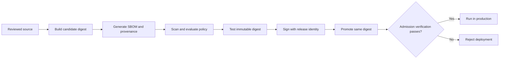
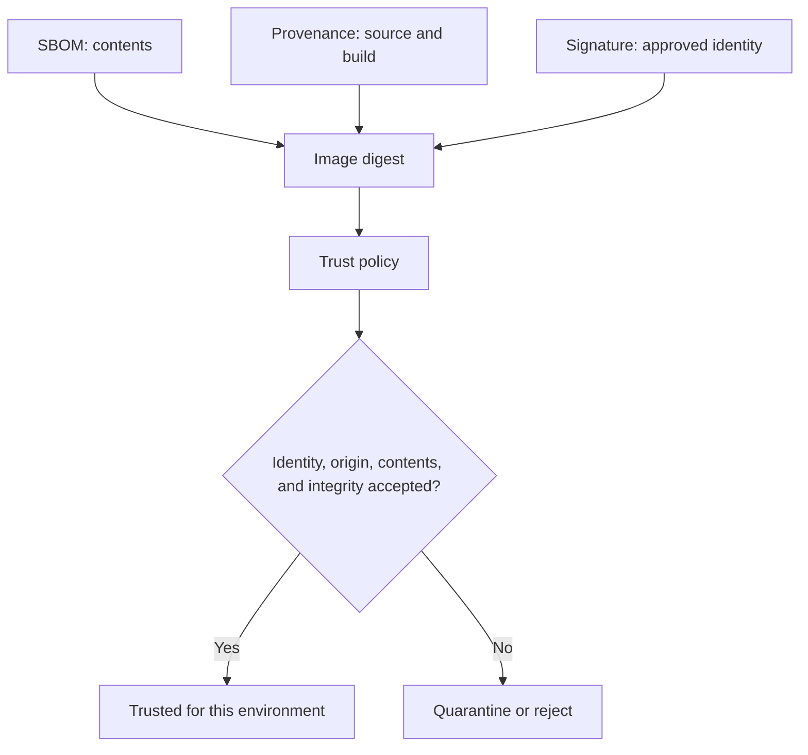
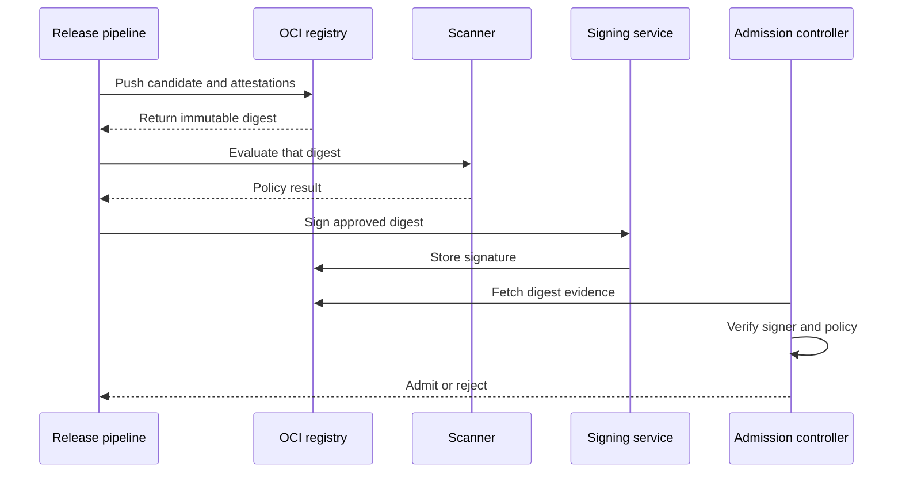

# Chapter 26 — Supply Chain and Trusted Content

> **Learning Objectives**
>
> By the end of this chapter, you will be able to:
>
> - Use Docker Scout to analyze images and compare vulnerability changes
> - Explain where Docker Hardened Images fit in a base-image strategy
> - Distinguish image signing from SBOM and provenance attestations
> - Verify image identity with Cosign or Notation
> - Design registry and deployment policy gates around immutable digests
> - Consume an SBOM during vulnerability response, licensing review, and audits

## 26.1 Trust Is a Chain of Evidence

A container image can run correctly and still be unfit for production. It may contain a critical vulnerable library, come from an unexpected build system, use an unapproved base image, or have been replaced after review.

Supply-chain security turns "we built this" into a series of testable claims:

1. **Identity** — which immutable digest is being evaluated?
2. **Origin** — which source, builder, and process produced it?
3. **Contents** — which operating-system and application packages are present?
4. **Integrity** — has the referenced content changed?
5. **Authorization** — did an approved person or workload sign it?
6. **Policy** — does the evidence satisfy this environment's rules?

No single product answers every question. Docker Scout analyzes content and policy posture. Docker Hardened Images provide a curated base-image option with signed evidence. Cosign and Notation verify signatures and identities. Registries and admission controls enforce decisions before untrusted content reaches production.



*Figure 26.1: Trust accumulates through build, evidence, scan, test, signature, promotion, and admission gates.*

> 💡 **Tip:** Tags are convenient names; digests are content identities. Evaluate, sign, promote, and deploy by digest whenever the decision must remain stable.


## 26.2 Docker Scout


### In plain terms

Docker Scout creates an inventory of an image and correlates its packages with vulnerability data. It helps answer which vulnerabilities exist, where they came from, whether a newer base image improves the result, and whether an image passes configured policies.

Scout is not merely a "critical count." A useful review considers exploitability, package location, available fixes, base-image lineage, exceptions, and whether the analyzed digest is the digest that will be deployed.

Scout analyzes images for CVEs and policy issues against your repos. It helps prioritize remediation, not magically patch running clusters. You might think a green Scout local scan equals prod safety—prod must run the same digest you scanned.

> ⚠️ **Common Pitfall:** Scanning `:latest` locally while prod runs an older digest.

### Under the hood

Analyze a local or registry image:

```bash
$ docker scout quickview registry.example.com/textbook/task-api:1.4.0
$ docker scout cves registry.example.com/textbook/task-api:1.4.0
```

Filter a detailed report to vulnerabilities with fixes:

```bash
$ docker scout cves \
    --only-fixed \
    registry.example.com/textbook/task-api:1.4.0
```

Compare a candidate with the current production image:

```bash
$ docker scout compare \
    --to registry.example.com/textbook/task-api:1.3.2 \
    registry.example.com/textbook/task-api:1.4.0
```

The comparison matters more than an isolated score. A release may fix one remotely exploitable issue while adding several low-impact findings, or it may inherit a better base image despite unchanged application code.

Where Docker Scout organization policies are configured, evaluate them from automation:

```bash
$ docker scout policy \
    --org textbook \
    registry.example.com/textbook/task-api@sha256:REPLACE_WITH_DIGEST
```

Replace the placeholder with a real digest resolved by the build. Policy capabilities and entitlements vary by Docker subscription and integration, so test the exact CLI and organization configuration used by your pipeline.

### In production

**Ownership:** App teams remediate findings; security owns severity gates in CI.

**Failure mode:** Critical CVE in prod digest. Detect with continuous registry scanning on deployed digests. Mitigate with digest promote and rebuild SLAs.

| Do | Don't |
|----|-------|
| Scan the digest you deploy | Gate only on tags |
| SLA for critical CVE rebuilds | Ignore base image drift |

**Before you leave this section**

- **Understand:** Scout informs risk; digests bind scan results to what runs.
- **Try:** Scan Task API image and note critical CVEs.
- **Watch in prod:** Prod digests not in the scanned set.


## 26.3 Docker Hardened Images


### In plain terms

Docker Hardened Images, or DHI, are security-focused images maintained by Docker. They emphasize minimal contents, reduced attack surface, frequent updates, and verifiable supply-chain metadata.

They can reduce the work involved in producing and documenting a trusted base. They do not make the application layered on top automatically secure, and access to particular images or features may require an appropriate Docker subscription.

Hardened/minimal base images reduce attack surface and CVE noise. Switching bases is a rebuild+test change, not a tag swap. You might think distroless means “no debugging forever”—plan ephemeral debug differently.

> ⚠️ **Common Pitfall:** Moving to distroless without fixing shell-based healthchecks and entrypoints.

### Under the hood

DHI repositories are distributed through Docker's hardened-image service and include variants suited to different build and runtime needs. A minimal runtime variant may omit a shell and package manager. That removes tools an attacker could abuse, but it also changes debugging and installation assumptions.

A multi-stage pattern keeps compilers in the build stage and copies only the runtime artifact:

```dockerfile
# syntax=docker/dockerfile:1
FROM golang:1.25 AS build
WORKDIR /src
COPY go.mod go.sum ./
RUN go mod download
COPY . .
RUN CGO_ENABLED=0 go build -trimpath -o /out/task-api ./cmd/api

# Replace this example reference with the approved DHI runtime
# reference from your organization's catalog.
FROM dhi.io/static:20250725
COPY --from=build /out/task-api /task-api
USER 65532:65532
ENTRYPOINT ["/task-api"]
```

The concrete repository, variant, and tag must come from the DHI catalog available to your organization. Pin the approved result by digest in a release Dockerfile or lock mechanism.

DHI publishes signed metadata that can include SBOM, provenance, vulnerability, VEX, and other attestations depending on the image variant. List and verify available evidence with Docker Scout:

```bash
$ docker scout attest list dhi.io/IMAGE:TAG
$ docker scout attest get \
    --predicate-type https://scout.docker.com/sbom \
    --verify \
    dhi.io/IMAGE:TAG
```


### In production

**Ownership:** Platform may publish approved bases; app teams rebase and test.

**Failure mode:** Broken entrypoint after rebase → rollout failure. Detect in staging soak. Mitigate with approved base catalog and compatibility checklist.

| Do | Don't |
|----|-------|
| Use approved hardened bases | Random minimal images without support |
| Test probes after rebase | Assume shell exists in distroless |

**Before you leave this section**

- **Understand:** Hardened bases shrink surface; rebases need test discipline.
- **Try:** Compare package count of a hardened vs fat base.
- **Watch in prod:** Healthcheck failures after distroless moves.


## 26.4 Signing and Verification


### In plain terms

A signature binds an identity or key to a digest. Verification asks whether the signature is cryptographically valid and whether the signer matches policy.

An SBOM says what is inside. Provenance says how a build happened. A signature says an approved identity endorsed particular bytes or a particular statement. These controls complement one another.



*Figure 26.2: SBOM, provenance, and signature answer different questions that policy combines into one decision.*

Cosign is part of Sigstore and supports key-based and keyless signing. Notation is a CNCF Notary Project tool implementing the Notary Project signature model. Both store signatures as OCI-related artifacts in supporting registries, but their trust-policy formats and ecosystems differ.

Sign digests (Notary/cosign/etc.); verify at admit/deploy time. Signing without verification is incomplete. You might think signature proves “safe code”—it proves identity of builder/publisher, not absence of bugs.

> ⚠️ **Common Pitfall:** Verifying signatures only in CI while the cluster admits unsigned digests.

### Under the hood

First resolve and retain the immutable digest after pushing:

```bash
$ docker buildx imagetools inspect \
    registry.example.com/textbook/task-api:1.4.0
```

With Cosign, a keyless signing flow can be:

```bash
$ cosign sign \
    registry.example.com/textbook/task-api@sha256:REPLACE_WITH_DIGEST
```

Keyless signing authenticates through an OpenID Connect identity and normally records certificate information through Sigstore infrastructure. Verification must constrain the expected identity and issuer:

```bash
$ cosign verify \
    --certificate-identity-regexp='^https://github.com/example/task-api/' \
    --certificate-oidc-issuer='https://token.actions.githubusercontent.com' \
    registry.example.com/textbook/task-api@sha256:REPLACE_WITH_DIGEST
```

For key-based operation, protect the private key in a hardware-backed or managed signing service where possible:

```bash
$ cosign verify \
    --key cosign.pub \
    registry.example.com/textbook/task-api@sha256:REPLACE_WITH_DIGEST
```

Notation uses a configured signing key and trust policy:

```bash
$ notation sign \
    registry.example.com/textbook/task-api@sha256:REPLACE_WITH_DIGEST

$ notation verify \
    registry.example.com/textbook/task-api@sha256:REPLACE_WITH_DIGEST
```

`notation verify` is meaningful only after the verifier has a trust store and `trustpolicy.json` defining accepted registry scopes, identities, and verification levels. Do not interpret command success under a permissive test policy as production trust.

### In production

**Ownership:** Security/platform own signing keys and admission verify; CI signs on build.

**Failure mode:** Unsigned or wrong identity admitted. Detect with admission denials and registry audits. Mitigate with enforce mode after warn soak.

| Do | Don't |
|----|-------|
| Sign and verify the same digest | Sign tags that move |
| Protect signing keys like prod secrets | Share CI signing keys widely |

**Before you leave this section**

- **Understand:** Signatures attest publisher identity on digests; verify at deploy.
- **Try:** Sign a lab image and verify before run.
- **Watch in prod:** Cluster admitting unsigned images.


## 26.5 Registry and Deployment Policy Gates


### In plain terms

A policy gate converts evidence into a decision: allow, warn, quarantine, or reject. The registry is a useful collection point, but a registry scan alone cannot guarantee that only approved content runs. Enforcement should also occur near deployment.

Promotion is safer than rebuilding. The same tested digest moves from a development repository or label to a production-approved location while evidence remains attached.

Gates block deploy unless scan/sign/attestation policy passes. This is change safety for artifacts. You might think registry ACLs alone are enough—clusters need admission policy too.

> ⚠️ **Common Pitfall:** Different rules in staging vs prod without a promotion path—teams learn to bypass staging.

### Under the hood

A release policy can require all of the following:

```text
Identity:
  Image is referenced by digest.
Origin:
  Provenance identifies the approved source repository and CI builder.
Signature:
  Digest is signed by the release workflow identity.
Contents:
  SBOM exists and can be parsed.
Vulnerabilities:
  No unexpired policy violation above the agreed threshold.
Base:
  Base image belongs to the approved catalog.
Platform:
  Required amd64 and arm64 manifests exist.
```

Docker Scout policy results can fail a CI stage before promotion. Registry webhooks or native scanning can quarantine content, while a Kubernetes admission controller can verify signatures and attestations before Pods are admitted.

A robust sequence is:

1. Build and push a candidate digest with SBOM and provenance.
2. Scan the candidate and evaluate organization policy.
3. Run functional and platform tests against that digest.
4. Sign the digest using the release identity.
5. Promote the same digest.
6. Verify again at admission or deployment.

Pass the digest between stages as a machine-readable artifact. Do not resolve the tag independently in every stage because a concurrent push can create a time-of-check/time-of-use race.



*Figure 26.3: Every release stage passes the same digest, preventing a mutable tag from changing between review and admission.*

### In production

**Ownership:** Platform owns gate enforcement; app teams fix failing evidence.

**Failure mode:** Bypass → unreviewed digest in prod. Detect with admission audit. Mitigate with break-glass that still logs and expires.

| Do | Don't |
|----|-------|
| Same digest promoted across envs | Rebuild per environment with different digests |
| Warn then enforce gates | Silent bypass aliases |

**Before you leave this section**

- **Understand:** Policy gates enforce evidence before deploy.
- **Try:** Trace one image from CI scan to cluster admission rule.
- **Watch in prod:** Env-specific rebuilds breaking provenance.

> 🏭 **Production floor:** **Digest promote** is the artifact SOP: CI builds once → scan/sign/attest → promote the *same digest* dev→stage→prod. Tickets must include digest, scanner result, signature ID. Never retag `latest` as the promote mechanism.


## 26.6 Consuming SBOMs


### In plain terms

Generating an SBOM is only inventory creation. Consuming it means using that inventory to answer operational questions: Are we affected by this vulnerability? Do we ship a prohibited license? Which image contains this package? What changed between releases?

An SBOM is a snapshot associated with a specific image digest. It becomes stale only when interpreted against changing external knowledge; the component list for immutable bytes does not change.

SBOMs answer “what’s inside?” for incident CVE response. Store and query them by digest. You might think generating SBOM at build is enough—on-call must know where to fetch it in five minutes.

> ⚠️ **Common Pitfall:** SBOMs in CI logs that expire in 14 days while images live for years.

### Under the hood

Common formats include SPDX and CycloneDX. Tools differ in package coverage and identifiers, so preserve format, generator, version, subject digest, and creation time.

Docker Scout can retrieve SBOM-related attestations where available:

```bash
$ docker scout attest list \
    registry.example.com/textbook/task-api@sha256:REPLACE_WITH_DIGEST

$ docker scout attest get \
    --predicate-type https://scout.docker.com/sbom \
    --predicate \
    --output task-api.sbom.json \
    registry.example.com/textbook/task-api@sha256:REPLACE_WITH_DIGEST
```

Predicate types vary by producer. List attestations first rather than assuming that every image uses Docker Scout's predicate URI.

During an incident, query the SBOM for package names, package URLs, versions, and file evidence. A name-only match can produce false positives because ecosystems reuse names. Package URL, namespace, version, architecture, and dependency path provide stronger identification.

VEX complements an SBOM by communicating whether a known vulnerability affects the product under stated conditions. VEX is an assertion requiring source and signature evaluation; it is not permission to erase the underlying CVE.

### In production

**Ownership:** Security owns SBOM retention; app teams ensure builds emit them.

**Failure mode:** Cannot answer “are we affected?” during a CVE storm. Detect with missing-SBOM reports per prod digest. Mitigate with registry-stored SBOMs and runbook links.

| Do | Don't |
|----|-------|
| Retain SBOM with digest lifetime | Only CI log attachments |
| Practice CVE lookup drill | Hand-maintained spreadsheets as SoT |

**Before you leave this section**

- **Understand:** SBOMs are incident evidence keyed by digest.
- **Try:** Fetch an SBOM for an image and find one dependency version.
- **Watch in prod:** Missing SBOMs during CVE response.


## 26.7 Common Pitfalls

> ⚠️ **Common Pitfall:** Blocking releases solely on the number of CVEs. Severity, reachability, fixes, compensating controls, and exception age all matter.

> ⚠️ **Common Pitfall:** Scanning a tag in CI and deploying the same tag later. Resolve one digest and carry it through scanning, signing, promotion, and deployment.

> ⚠️ **Common Pitfall:** Treating minimal or hardened images as invulnerable. Application dependencies and configuration can still introduce critical risk.

> ⚠️ **Common Pitfall:** Running `cosign verify` without constraining the certificate identity and issuer. Cryptographic validity is not the same as approval.

> ⚠️ **Common Pitfall:** Generating an SBOM that no inventory or incident process can search. Evidence without a consumer does not shorten response time.

> ⚠️ **Common Pitfall:** Copying signatures but not attestations during registry promotion. Verify all required OCI artifacts at the destination.


## 26.8 Hands-on Exercises

1. **Scout an image.** Run `docker scout quickview` and `docker scout cves` against an application image. Identify the base image, one fixable finding, and one finding inherited from an application dependency.
2. **Compare releases.** Compare two immutable image digests with `docker scout compare`. Write a release recommendation based on changes, not only total counts.
3. **Verify trusted content.** If you have DHI access, list and verify attestations for an approved DHI. Otherwise, use another signed test image and document its signer and predicate types.
4. **Sign a digest.** In a non-production registry, sign an image digest with Cosign or Notation. Verify it with a narrowly scoped identity or trust policy, then demonstrate that a different unsigned digest fails.
5. **Draft a gate.** Express five release requirements as pass/fail statements. Include signature identity, SBOM presence, provenance origin, vulnerability policy, and digest pinning.
6. **Run an SBOM query.** Export an SBOM and locate one package by package URL or ecosystem plus version. Trace it back to the image digest and owning application.


## 26.9 Check Your Understanding

**Q1.** Why should a Scout policy evaluate a digest instead of only a tag?

Show answer

A digest identifies immutable content. A tag can be moved after evaluation, causing deployment to use bytes that were never scanned or approved.

**Q2.** What security work remains after adopting a Docker Hardened Image?

Show answer

Teams must still secure application dependencies, configuration, secrets, runtime permissions, networking, updates, testing, and deployment policy. DHI improves the base and its evidence; it does not secure everything layered above it.

**Q3.** How do SBOM, provenance, and signature differ?

Show answer

An SBOM inventories contents, provenance describes build origin and process, and a signature binds an approved identity or key to a digest or statement. A mature policy commonly uses all three.

**Q4.** Why is a valid keyless Cosign signature insufficient without identity constraints?

Show answer

Many identities can create valid signatures. Verification must require the expected OIDC issuer and workload or repository identity so cryptographic validity becomes authorization.

**Q5.** Where should policy enforcement occur?

Show answer

Use layered gates: CI before promotion, registry monitoring or quarantine, and deployment-time admission. Each catches a different failure or race, and no single gate sees the entire lifecycle.

**Q6.** What makes an SBOM operationally useful during an incident?

Show answer

It must be linked to an immutable digest, searchable using reliable package identifiers, and connected to deployment inventory and ownership. That lets responders find affected running workloads rather than merely list registry files.

## 26.10 Key takeaways

- Supply-chain trust combines identity, contents, origin, integrity, authorization, and policy.
- Docker Scout supports vulnerability analysis, comparisons, and organization policy evaluation.
- Docker Hardened Images reduce base-image attack surface and provide verifiable evidence, but do not replace application security.
- Signing endorses a digest; SBOM and provenance describe it.
- Verification policy must constrain approved keys or workload identities.
- Carry one immutable digest through build, test, scan, sign, promotion, and deployment.
- SBOM value appears when inventory is searchable and connected to deployed workloads.


## 26.11 Official documentation map


| Topic                  | Official page                                                                                         |
| ---------------------- | ----------------------------------------------------------------------------------------------------- |
| Docker Scout           | [Docker Scout overview](https://docs.docker.com/scout/)                                               |
| Scout quickstart       | [Docker Scout quickstart](https://docs.docker.com/scout/quickstart/)                                  |
| Scout policies         | [Policy evaluation](https://docs.docker.com/scout/policy/)                                            |
| Docker Hardened Images | [Docker Hardened Images](https://docs.docker.com/dhi/)                                                |
| DHI signatures         | [Code signing](https://docs.docker.com/dhi/core-concepts/signatures/)                                 |
| DHI attestations       | [Attestations](https://docs.docker.com/dhi/core-concepts/attestations/)                               |
| DHI verification       | [Verify Docker Hardened Images](https://docs.docker.com/dhi/how-to/verify/)                           |
| Build attestations     | [Build attestations](https://docs.docker.com/build/metadata/attestations/)                            |
| Scout attestation CLI  | `[docker scout attestation get](https://docs.docker.com/reference/cli/docker/scout/attestation/get/)` |


**Previous:** [Chapter 25 — Docker Build Deep Dive](25-docker-build-deep-dive.md) | **Next:** [Chapter 27 — Docker Engine Operations](27-docker-engine-operations.md)