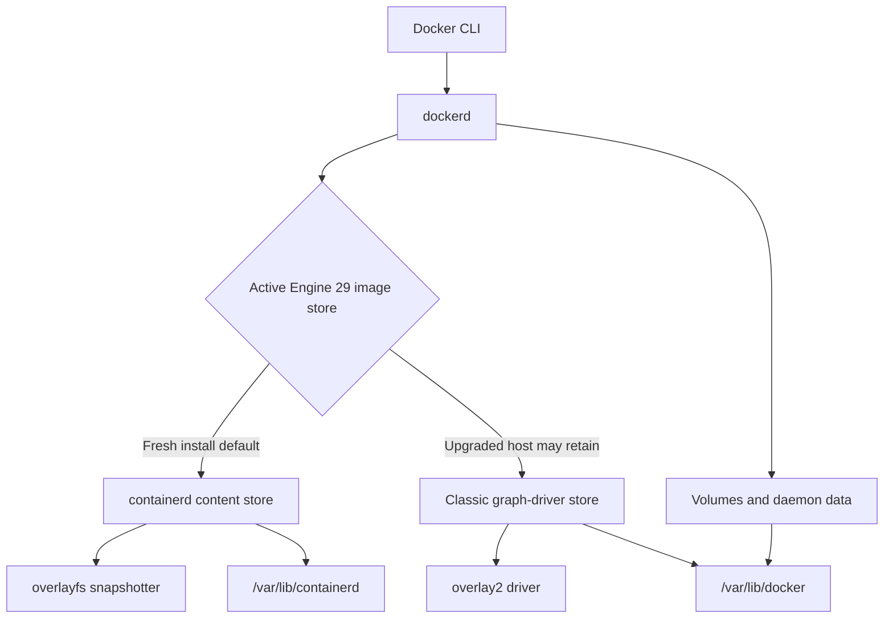
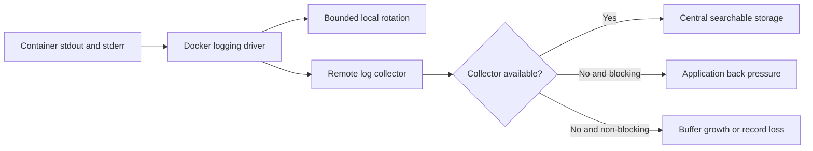
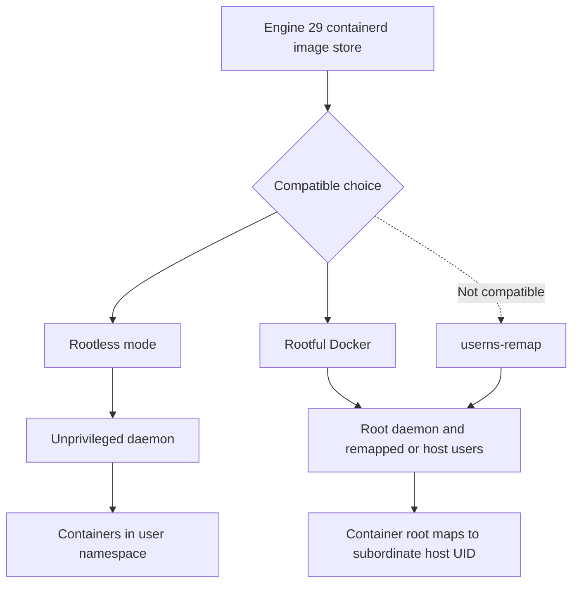

# Chapter 27 — Docker Engine Operations

> **Learning Objectives**
>
> By the end of this chapter, you will be able to:
>
> - Check whether a host stores images the new way or the classic way
> - Change image stores without thinking your images were deleted when they were only hidden
> - Pick where container data and container logs are kept, and keep both from filling the disk
> - Compare rootless mode with `userns-remap`, and know what each one cannot do
> - Point the Docker CLI at a remote engine without deploying to the wrong one
> - Explain how the Docker CLI, the Engine API, and the SDKs relate
> - Check a `daemon.json` change before it takes a host offline
> - Decide whether the experimental nftables firewall backend is worth trying yet

## 27.1 The Daemon Is Production Infrastructure

Typing `docker run` feels like running a program. It is not. Almost every Docker command is a request sent to a background service called the **daemon**, named `dockerd`, which does the actual work.

That daemon is a serious piece of infrastructure. It owns every image and container on the host. It starts the runtimes. It writes firewall rules. It collects your logs. And anyone who can talk to it can generally do anything on the machine.

So operating Docker means more than keeping the process alive. You need to know which storage backend is active, where the disk is filling up, whether logs are being rotated, who can reach the API, and what a configuration change will do to containers that are already running.

Docker Engine 29.x adds a wrinkle worth flagging now. A fresh installation of 29.0 or later uses the **containerd image store** by default. A host upgraded from an older version normally keeps its old storage driver until somebody deliberately moves it. Two machines can report the same Engine version and behave differently. Always check the host in front of you.

## 27.2 Containerd Image Store

### In plain terms

The **image store** is where the daemon keeps every layer it has pulled or built, plus the writable layer belonging to each running container. It is the single biggest consumer of disk on most Docker hosts.

Why does the store matter to you? Two reasons. Disk is finite, and images accumulate silently until something breaks. And there are now two different implementations, so the answer to "where did my disk go" depends on which one this host uses.

Fresh Engine 29.x installations use containerd's content store, which keeps image data under `/var/lib/containerd`. Older hosts use a classic graph driver, usually `overlay2`, under `/var/lib/docker`. Installing the new Engine package does not move you between them. That is deliberate, so upgrades do not disturb running systems, and it is exactly why you inspect rather than assume.

> 💡 **In one line:** Switching image stores hides your old images from `docker images`, but the bytes are still on the disk.

One caution before you go cleaning up. `docker system prune` on a shared build machine deletes cached layers other people's builds depend on. Nothing is lost permanently, but every build afterward starts cold, and on a busy team that is felt immediately.

> ⚠️ **Common Pitfall:** Filling the disk with images until kubelet/docker disk pressure kills workloads.

### Under the hood

Here is how to find out which store a host is running. Inspect the active backend:

```bash
$ docker info --format '{{json .DriverStatus}}'
[["driver-type","io.containerd.snapshotter.v1"]]
```

A `driver-type` value containing `io.containerd.snapshotter.v1` identifies the containerd image store. On a classic installation, `docker info` instead reports a storage driver such as `overlay2`.

For an upgraded Engine, the containerd image store can be enabled in `/etc/docker/daemon.json`:

```json
{
  "features": {
    "containerd-snapshotter": true
  }
}
```

The switch is not an in-place reinterpretation of the old graph-driver directory. Existing classic-store images and containers remain on disk but become hidden while the containerd image store is active. Switching back makes them visible again. Export or push required images before changing the backend, and recreate containers from declarative configuration.

Engine also provides a containerd migration feature for qualifying environments:

```json
{
  "features": {
    "containerd-migration": true
  }
}
```

Migration behavior and eligibility are version-sensitive. Read the Engine 29.x documentation and test with a representative host rather than enabling it across a fleet without a rollback plan.

With the containerd image store, image content and snapshots normally live under `/var/lib/containerd`, while volumes and other daemon data remain under `/var/lib/docker`. The daemon's `data-root` setting does not relocate containerd's root; that is configured separately in containerd.



*Figure 27.1: Engine 29 can expose either the containerd image store or the legacy overlay2 graph-driver layout while daemon data remains separate.*

### In production

**Ownership:** The platform team owns disk targets on nodes and build machines. Developers avoid leaving hundreds of locally tagged images behind.

**Failure mode:** The disk fills, and the node starts evicting workloads that had nothing to do with the images. Detect it with disk usage metrics rather than waiting for the eviction. Prevent it with cleanup that runs on a schedule and a written rule for how long images are kept.

| Do | Don't |
|----|-------|
| Monitor image filesystem usage | Uncontrolled prune on prod nodes mid-incident |
| Retention policy for builders | Leave dangling images forever |

**Before you leave this section**

- **Understand:** containerd image store needs disk governance.
- **Try:** Run `docker system df` and interpret image vs build cache.
- **Watch in prod:** DiskPressure from image sprawl.


## 27.3 Storage Backends and Writable Data

### In plain terms

An image is a stack of read-only layers. When a container starts, the engine adds one **writable layer** on top, and every file the container creates or modifies goes there. The storage backend is the machinery that stacks those layers and presents them as one filesystem.

Why care about the difference? Because that writable layer is disposable by design. It exists for the lifetime of one container and is thrown away with it. It is also slower for heavy writes than a plain disk, because every change has to be recorded as a difference against the layers underneath.

That makes a **volume** the right home for anything you need to keep. A volume is storage the engine manages separately from any container's layers, so it survives the container being removed, replaced, or upgraded.

Two habits follow. Put database files and uploads in named volumes, never in the writable layer. And remember that volumes have their own lifecycle: deleting a container leaves its named volume behind, while `docker system prune --volumes` will delete volumes nothing currently references.

> ⚠️ **Common Pitfall:** Binding critical data to a container’s writable layer on Docker 29.x hosts.

### Under the hood

Here is what each backend uses and how to see where the space went.

With the Engine 29.x containerd image store, snapshotters perform layer operations; `overlayfs` is the normal Linux snapshotter. Classic Engine stores use graph drivers, with `overlay2` being the established Linux choice on supported filesystems.

Inspect storage and disk use:

```bash
$ docker info
$ docker system df -v
$ docker buildx du
```

These commands describe different consumers. `docker system df` covers Engine objects, while BuildKit builders can hold separate cache that `docker buildx du` reveals.

Changing a classic storage driver can hide existing images and containers in much the same way as changing image stores. Never treat a configuration switch as a migration unless the documented procedure explicitly migrates data.

Volumes have a separate lifecycle:

```bash
$ docker volume ls
$ docker volume inspect task-db-data
```

Removing a container does not automatically remove a named volume. Conversely, `docker system prune --volumes` can remove unused volume data and deserves change-control discipline.

### In production

**Ownership:** The platform team chooses the storage driver for each operating system in the fleet. App teams keep their data in named volumes or in an external store.

**Failure mode:** A storage driver problem stops containers from starting at all. Detect it in the daemon's own logs and in the health of any volume plugin you use. Reduce the risk by staying on drivers your OS vendor tests, and by backing up volume data separately from anything Docker manages.

| Do | Don't |
|----|-------|
| Named volumes for state | Critical data in writable layer |
| Document storage driver per OS | Change drivers without migration plan |

**Before you leave this section**

- **Understand:** Engine storage backends affect performance and data safety.
- **Try:** Inspect `docker info` storage driver and list volumes.
- **Watch in prod:** Data loss from writable-layer assumptions.


## 27.4 Logging Drivers

### In plain terms

A **logging driver** decides where everything a container prints actually goes. It can be written to files on the host, handed to the system journal or syslog, or forwarded straight to a collector such as Fluentd or a cloud logging service.

Why is this an operations topic rather than a developer one? Because logs consume disk, and the disk belongs to the host, not to the container that filled it. One chatty application with debug logging left on can fill a machine overnight and take down every other container on it. Logging is a capacity decision.

The important setting is **rotation**: a limit on file size and how many old files to keep. The `local` driver rotates by default. The widely used `json-file` driver does not, unless you tell it to. That single default is behind a large share of "the disk is full" incidents.

Two more things to know before you choose. Changing the daemon's default only affects containers created afterward, so existing ones keep the old driver until recreated. And some remote drivers will block your application when the collector is unreachable, which turns a logging outage into an application outage.

> ⚠️ **Common Pitfall:** Unlimited json-file logs on production Docker hosts.

### Under the hood

Here is how to check and set it. Inspect the default driver:

```bash
$ docker info --format '{{.LoggingDriver}}'
json-file
```

The `local` driver is designed for efficient local storage and rotates by default. The `json-file` driver remains common and Kubernetes-compatible in many environments, but should be given explicit rotation limits:

```json
{
  "log-driver": "local",
  "log-opts": {
    "max-size": "20m",
    "max-file": "5"
  }
}
```

All values inside `log-opts` are strings. For per-container selection:

```bash
$ docker run -d \
    --name task-api \
    --log-driver local \
    --log-opt max-size=20m \
    --log-opt max-file=5 \
    task-api:1.4.0
```

Changing the daemon default affects newly created containers, not existing ones. Recreate containers to adopt the new configuration.

Some remote drivers can block an application when the destination is unavailable. Delivery mode, buffering, back pressure, and loss behavior vary by driver and options. `docker logs` is not available for every driver or configuration.



*Figure 27.2: Logging-driver delivery settings determine whether a collector outage causes back pressure, buffering, or loss.*

### In production

**Ownership:** The platform team sets the default logging driver and rotation limits for the fleet. App teams keep secrets and tokens out of log lines.

**Failure mode:** Container logs fill the disk and the whole host fails, not just the noisy container. Detect it with disk alerts that fire well before the disk is full. Prevent it by setting `max-size` and `max-file`, or by shipping logs off the host entirely.

| Do | Don't |
|----|-------|
| Always set rotation | Debug logs at full verbosity forever |
| Centralize when possible | Different drivers per container without docs |

**Before you leave this section**

- **Understand:** Logging drivers need rotation and a destination strategy.
- **Try:** Inspect daemon default log driver and rotation options.
- **Watch in prod:** Host disk full from container logs.


## 27.5 Rootless Mode and User Namespace Remapping

### In plain terms

These are two different ways to stop a container escape from turning into a full takeover of the host. **Rootless mode** runs the daemon and the containers as an ordinary user, with no root privileges at all. **`userns-remap`** keeps the normal root daemon but translates user IDs, so root inside a container is actually a harmless unprivileged user on the host.

Why bother? Because by default the daemon runs as root, and anyone who can reach its socket effectively has root on the machine. If a container breaks out, or an image turns out to be malicious, there is nothing left between it and the host. Both features insert a layer there.

They reduce risk in different places:

- **Rootless** reduces daemon and runtime privilege.
- **`userns-remap`** reduces the host privilege represented by users inside containers.

Think of rootless mode as hiring a caretaker who never holds the master key, and `userns-remap` as keeping the master key but giving every visitor a badge that only opens one room.

Be clear about the limits. Neither one makes an untrusted container safe to run, so keep your other controls in place. Both depend on kernel features and both break some workloads: rootless has restrictions around privileged ports, some networking, and certain storage drivers. And turning on `userns-remap` hides all your existing images and containers behind a new remapped view, so treat it as a storage migration rather than a config tweak.

> ⚠️ **Common Pitfall:** Enabling userns-remap on an existing daemon without migrating volumes/permissions.

### Under the hood

Here is how each one is turned on, and what it changes underneath.

Set up rootless mode for an unprivileged user with the packaged helper:

```bash
$ dockerd-rootless-setuptool.sh install
$ docker context use rootless
$ docker info
```

Rootless operation uses user namespaces and normally requires subordinate UID and GID ranges in `/etc/subuid` and `/etc/subgid`. Its configuration file is normally `~/.config/docker/daemon.json`, or under `XDG_CONFIG_HOME`.

Enable `userns-remap` on a rootful daemon with an allocated remapping user:

```json
{
  "userns-remap": "default"
}
```

The default creates or uses a `dockremap` identity with subordinate ranges. Explicit user and group values are also supported. Existing image and container data becomes hidden behind the remapped storage view after enablement, so plan it like a storage-affecting migration.

> ⚠️ **Warning:** In Engine 29.x, the containerd image store and `userns-remap` are incompatible. A fresh Engine 29.x installation using the containerd store cannot simply add `userns-remap`; choose a supported classic-store design or use rootless mode where its constraints fit.

Bind mounts need careful ownership. A UID inside the container maps to a different host UID under user namespaces. Blindly applying permissive modes such as `chmod 777` weakens isolation rather than solving the mapping.



*Figure 27.3: Rootless mode removes daemon root privilege, while userns-remap retains a rootful daemon and is incompatible with the Engine 29 containerd image store.*

### In production

**Ownership:** The platform team decides whether hosts run rootless or `userns-remap`, and writes down which features stop working as a result.

**Failure mode:** After remapping, containers cannot read their own volumes because the file ownership no longer matches. Catch this by rehearsing the migration in staging first. Fix it by resetting ownership on the volume data, and keep a table of which features are supported under each mode.

| Do | Don't |
|----|-------|
| Prefer rootless where supported | Flip userns on prod without rehearsal |
| Document feature gaps | Assume Kubernetes node behavior equals desktop rootless |

**Before you leave this section**

- **Understand:** Rootless/userns shrink host blast radius with trade-offs.
- **Try:** Read `docker info` for rootless/userns status on a lab engine.
- **Watch in prod:** Broken volume perms after remap.


## 27.6 Docker Contexts and Remote Access

### In plain terms

A **Docker context** is a saved connection profile: a name, the address of a daemon, and the certificates or SSH details needed to reach it. Switching contexts points the same `docker` commands at a different machine.

This matters because one CLI usually has to talk to several engines: your laptop, a shared build machine, maybe a remote host. Contexts let you name each one instead of remembering addresses and re-exporting `DOCKER_HOST` every time.

The convenience is also the danger. Nothing in the output of `docker run` tells you which machine it landed on. A context is much closer to a kubeconfig than to a shell alias: it is the thing standing between "restarting my test container" and "restarting production."

Two habits keep this safe. Pass the target explicitly with `docker -c <name>` in anything scripted, and never leave a production context as the default on a laptop.

> ⚠️ **Common Pitfall:** Leaving a prod context as default on a shared laptop.

### Under the hood

Here is how contexts are stored and switched.

List and inspect contexts:

```bash
$ docker context ls
NAME        DESCRIPTION                         DOCKER ENDPOINT
default *   Current DOCKER_HOST configuration   unix:///var/run/docker.sock

$ docker context inspect default
```

Create a context that uses SSH transport:

```bash
$ docker context create prod-engine \
    --docker host=ssh://docker-operator@engine.example.com

$ docker --context prod-engine info
```

Using `--context` on a command is explicit and suitable for scripts. `docker context use` changes the selected default:

```bash
$ docker context use prod-engine
$ docker ps
$ docker context use default
```

Environment variables and command flags can override the selected context. Diagnose surprising behavior by checking `docker context show`, `DOCKER_CONTEXT`, and `DOCKER_HOST`.

Do not expose the unauthenticated Engine API on a TCP socket. Anyone who can control a rootful daemon can generally mount host paths, start privileged containers, and gain root-equivalent control of the host.

### In production

**Ownership:** Every engineer owns checking which context they are on before they run something. The platform team may block direct access to production engines and require changes to go through CI instead.

**Failure mode:** A command meant for a laptop runs against production. Detect it by printing the context name in CI logs and showing it in your shell prompt. Prevent it by always passing `-c` explicitly and never making a production context the default.

> 🏭 **Production floor:** Prod engines are not a laptop context. Prefer CI/CD for production applies; if a human must touch an engine, require an explicit named context—never a silent default.

| Do | Don't |
|----|-------|
| Name contexts clearly; never default prod | Share docker.sock over the network casually |
| Prefer CI for prod applies | TLS-less remote API |

**Before you leave this section**

- **Understand:** Contexts select engines; wrong context is a blast-radius incident.
- **Try:** Create a named context and always pass it explicitly.
- **Watch in prod:** Accidental prod deploys from local Docker contexts.


## 27.7 Engine API and SDKs

### In plain terms

The **Engine API** is the HTTP interface the daemon exposes, and the `docker` command is simply one program that calls it. Your own code can call the same API directly, or use an official **SDK**, a language library that wraps those calls in normal functions.

Why does that matter to you? Two reasons, and they pull in opposite directions. It means you can automate anything the CLI can do: collect an inventory of running containers, build test harnesses, or write small platform tools. It also means anything that can reach the API has the same power the CLI has.

That is the part people underestimate. Mounting `/var/run/docker.sock` into a build or test container is a common trick, and on most setups it hands that container the equivalent of root on the host. It can start a new privileged container, mount the host filesystem, and read every secret on the machine. Convenience and total control are the same permission here.

> 💡 **In one line:** Giving something access to the Docker socket is the same as giving it root on that machine.

> ⚠️ **Common Pitfall:** Mounting `docker.sock` into build/test containers on shared hosts.

### Under the hood

Here is what talking to that API actually looks like.

On Linux, the local daemon normally listens on a Unix socket. A simple read-only request can be demonstrated with `curl`:

```bash
$ curl --unix-socket /var/run/docker.sock \
    http://localhost/_ping
OK

$ curl --unix-socket /var/run/docker.sock \
    http://localhost/version
```

API paths can include a version, such as `/v1.52/containers/json`. Clients negotiate or select versions to remain compatible with the daemon. Consult the Engine API version matrix rather than hard-coding the newest version.

The official Go and Python SDKs model API objects and handle transport details. A minimal Python example:

```python
import docker

client = docker.from_env()

for container in client.containers.list():
    print(container.id, container.name, container.status)
```

Handle timeouts, partial failures, pagination where applicable, and event-stream reconnection. Container identifiers should be treated as opaque values, and automation should use labels to establish ownership.

### In production

**Ownership:** The platform team forbids casual `docker.sock` mounts in production. CI runs builds with the smallest privileges that still work.

**Failure mode:** A mounted socket lets one container take over the whole host. Detect it with admission policies that reject the mount and with runtime scans that look for it. Avoid it by using rootless engines, nested builders, or a remote BuildKit that needs no socket at all.

| Do | Don't |
|----|-------|
| Avoid docker.sock mounts | Expose API without authn/z |
| Audit who can talk to the API | SDK scripts with hard-coded prod endpoints |

**Before you leave this section**

- **Understand:** Engine API is powerful; protect the socket like root.
- **Try:** List API versions via `docker version` and note client/server.
- **Watch in prod:** Containers with docker.sock in prod.


## 27.8 Managing `daemon.json`

### In plain terms

**`daemon.json`** is the configuration file for the Docker daemon itself. On a normal Linux host it lives at `/etc/docker/daemon.json`; rootless and Windows installations keep it elsewhere. It holds settings such as the default log driver, the address pools for networks, and which features are on.

Why treat one small JSON file so carefully? Because most of its settings only take effect when the daemon restarts, and a restart can interrupt container networking or change behavior even for containers with restart policies. A typo can stop the daemon from starting at all, which takes the whole host out of service. This is closer to a kernel setting than to an application config.

So handle it the way you would any change to a machine's foundations. Validate the file before restarting, roll it out through configuration management rather than editing hosts by hand, try it on a canary host first, and know how to roll back.

One more trap: a setting supplied both as a `dockerd` startup flag and in `daemon.json` is a conflict, and the daemon will refuse to start. Distribution packages often add flags in a service drop-in file you did not write, so check there before you blame your own edit.

> ⚠️ **Common Pitfall:** Editing daemon.json on every node by hand without config management.

### Under the hood

Here is a realistic file and the safe way to apply it.

A representative Linux configuration is:

```json
{
  "log-driver": "local",
  "log-opts": {
    "max-size": "20m",
    "max-file": "5"
  },
  "live-restore": true,
  "default-address-pools": [
    {
      "base": "10.240.0.0/16",
      "size": 24
    }
  ]
}
```

Validate syntax and supported keys before restart:

```bash
$ sudo dockerd --validate \
    --config-file=/etc/docker/daemon.json
configuration OK
```

Then use the host's service manager:

```bash
$ sudo systemctl restart docker
$ sudo systemctl --no-pager --full status docker
$ docker info
```

Do not configure the same option both as a daemon startup flag and in `daemon.json`; duplicate options can prevent startup. Package units and distribution drop-ins may supply flags that are easy to overlook.

`live-restore` can keep standalone containers running while the daemon is unavailable during some upgrades or restarts. It does not make every configuration change disruption-free and does not replace workload redundancy.

### In production

**Ownership:** The platform team owns `daemon.json` through configuration management. Every change gets a soak period on a few hosts and a documented way back.

**Failure mode:** A bad config stops the daemon from starting, and the host is out of service. Detect it by checking the fleet for hosts whose config has drifted from the intended one. Prevent it by validating the JSON before restart and rolling out to canary nodes first.

| Do | Don't |
|----|-------|
| Config-manage daemon.json | Snowflake edits per node |
| Canary restart + soak | Change log driver fleet-wide mid-incident |

**Before you leave this section**

- **Understand:** daemon.json is fleet config; change-manage it.
- **Try:** Validate a daemon.json change on one lab host and restart safely.
- **Watch in prod:** Fleet drift in engine flags.


## 27.9 Experimental nftables Firewall Backend

### In plain terms

Every time you publish a port, Docker writes firewall rules on the host to make it work. For years those rules were written using iptables. Engine **29.0** added an experimental **nftables** backend, which is the newer Linux firewall system that most distributions are moving to.

Why should you know about it? Because the firewall is how containers reach the network and how the outside world reaches them. If your team is already standardizing on nftables for host policy, having Docker write iptables rules alongside is awkward. This option lets both speak the same language.

But **experimental** means exactly that: the behavior and settings can still change between releases. Treat it as something to try on a spare host, not as an upgrade to schedule across the fleet.

The switch is also not a drop-in. Custom rules teams wrote in the iptables `DOCKER-USER` chain have no direct equivalent, so they can silently stop running after the change. That means a rule you rely on to block traffic may simply not fire, which is a failure that looks like nothing happening. Rebuild that policy natively before you trust the host.

> ⚠️ **Common Pitfall:** Migrating `DOCKER-USER` assumptions directly to nftables. Rebuild custom policy with nftables hooks and priorities.

### Under the hood

Here is how to turn it on and what changes underneath.

Enable it through daemon configuration:

```json
{
  "firewall-backend": "nftables"
}
```

The equivalent daemon flag is `--firewall-backend=nftables`. Do not specify both.

The nftables backend creates Docker-owned tables and chains. Operators should add custom rules in their own tables rather than editing Docker-managed rules. nftables hook priorities determine whether custom chains run before or after Docker's chains.

The iptables `DOCKER-USER` chain does not have a direct nftables equivalent. Rules placed there may no longer execute after migration unless an old iptables jump remains temporarily. Recreate policy as native nftables base chains with intentional hooks and priorities.

IP forwarding also differs operationally. Confirm IPv4 and IPv6 forwarding plus forwarding policy before switching. Engine 29.x documentation identifies limitations, including Swarm-mode considerations; check the exact patch release before any trial. What breaks if you cut remote admin access with a bad ruleset: you need out-of-band console—test rollback on a disposable host first.

### In production

**Ownership:** The platform team chooses the firewall backend on Docker hosts. The security team proves the new rules block and allow exactly what the old ones did. Treat a backend switch as a change that can affect every host on the network.

**Failure mode:** Published ports stop working, or worse, something is exposed that should not be. Detect it by testing a full matrix of expected connections and by scanning for open ports you did not intend. Contain it with canary hosts, saved copies of the rulesets, and a written rollback to iptables.

| Do | Don't |
|----|-------|
| Canary + full connectivity matrix | Fleet-wide flip on day one |
| Preserve console/out-of-band access | Assume DOCKER-USER still applies |
| Validate then restart via config management | Disable Docker firewall programming casually |

**Before you leave this section**

- **Understand:** nftables backend in Engine 29.x is experimental and needs policy rewrite.
- **Try:** On a disposable host, capture baseline, switch, retest, roll back.
- **Watch in prod:** Custom host firewall rules silently skipped after migration.

---

## 27.10 Common Pitfalls

> ⚠️ **Common Pitfall:** Assuming every Engine 29.x host uses the containerd image store. Fresh installations default to it; upgraded hosts can remain on `overlay2`.

> ⚠️ **Common Pitfall:** Switching stores or drivers and concluding that images were deleted. They may be hidden in the inactive backend while still consuming disk.

> ⚠️ **Common Pitfall:** Enabling `userns-remap` on a containerd-image-store host. Engine 29.x does not support that combination.

> ⚠️ **Common Pitfall:** Changing a default logging driver and expecting existing containers to adopt it. Recreate them.

> ⚠️ **Common Pitfall:** Mounting the Docker socket into a management container without recognizing that it grants daemon-level control.

> ⚠️ **Common Pitfall:** Editing `/etc/docker/daemon.json` and restarting without `dockerd --validate`. A typo or duplicate flag can take the daemon offline.

> ⚠️ **Common Pitfall:** Migrating `DOCKER-USER` assumptions directly to nftables. Rebuild custom policy with nftables hooks and priorities.

## 27.11 Hands-on Exercises

1. **Inventory an Engine.** Record Engine version, active image store or storage driver, logging driver, Docker root directory, containerd root usage, and available disk and inodes.
2. **Observe store boundaries.** On a disposable Engine 29.x VM, pull a test image and locate reported disk consumers. If migrating an upgraded lab host, export important images first and compare object visibility before and after the documented store switch.
3. **Rotate logs.** Configure the `local` logging driver with bounded size, recreate a noisy test container, and verify rotation without filling the filesystem.
4. **Compare isolation modes.** Document whether one lab workload can run rootless. Identify its port, bind-mount, cgroup, device, and networking requirements. Explain whether `userns-remap` is possible with the host's active store.
5. **Create a context.** Create an SSH-backed context to a lab Engine. Run read-only `info` and `ps` commands with explicit `--context`, then remove the context.
6. **Call the API.** Query `/_ping` and `/version` over the local socket. Write a short SDK program that lists only containers carrying a lab label.
7. **Validate daemon configuration.** Add a safe logging option on a disposable host, run `dockerd --validate`, restart through the service manager, and verify new and existing container behavior.
8. **Evaluate nftables.** On a disposable Engine 29.x host, capture baseline connectivity, switch to the experimental backend, repeat tests, inspect the ruleset, and practice rollback.

## 27.12 Check Your Understanding

**Q1.** Does upgrading an older host to Engine 29.x automatically switch it to the containerd image store?

<details>
<summary>Show answer</summary>

Generally no. The containerd image store is the default for fresh Engine 29.0 and later installations. Upgraded installations normally retain their classic storage driver until an operator performs a supported transition.

</details>

**Q2.** Why can disk usage remain high after changing image stores?

<details>
<summary>Show answer</summary>

Data from the inactive backend may remain on disk but be hidden from Docker commands. The containerd store also uses `/var/lib/containerd` for image content and snapshots while other Docker data remains under `/var/lib/docker`.

</details>

**Q3.** What is the operational difference between rootless mode and `userns-remap`?

<details>
<summary>Show answer</summary>

Rootless mode runs the daemon and containers without root privileges. `userns-remap` keeps a rootful daemon but maps container identities to unprivileged host IDs. Their feature constraints and threat reduction differ.

</details>

**Q4.** Why is access to the Docker socket considered root-equivalent on a rootful Engine?

<details>
<summary>Show answer</summary>

An API client can start privileged containers, mount host paths, alter networks, and control other containers. Those operations can normally be used to gain full host control.

</details>

**Q5.** What should happen before restarting after a `daemon.json` change?

<details>
<summary>Show answer</summary>

Validate the file with `dockerd --validate`, check for duplicate startup flags, plan workload impact and rollback, and canary the change where possible.

</details>

**Q6.** Why cannot existing `DOCKER-USER` rules simply be assumed to protect an nftables-backed Engine?

<details>
<summary>Show answer</summary>

`DOCKER-USER` belongs to the iptables rule path and has no direct nftables equivalent. Custom nftables tables and base chains must use appropriate hooks and priorities to apply policy around Docker's rules.

</details>

## 27.13 Key takeaways

- The Engine version does not tell you which image store a host uses. Check every host.
- Fresh 29.x installs use the containerd image store. Upgraded hosts usually keep the classic driver.
- After a store switch, old data is hidden, not deleted, and still uses disk.
- `userns-remap` does not work with the containerd image store on Engine 29.x.
- Always set log rotation, and test what happens when a remote log collector goes away.
- Rootless mode and `userns-remap` protect against different things, and both break some workloads.
- Contexts name the machine you are talking to. Remote access is still full control of that machine.
- The Engine API is the CLI's own interface. Guard its socket like a root password.
- Validate `daemon.json` and roll it out to a canary before the fleet.
- The nftables backend is experimental, and your old `DOCKER-USER` rules will not carry over.

## 27.14 Official documentation map

| Topic | Official page |
|-------|---------------|
| Containerd image store | [containerd image store with Docker Engine](https://docs.docker.com/engine/storage/containerd/) |
| Storage drivers | [Select a storage driver](https://docs.docker.com/engine/storage/drivers/select-storage-driver/) |
| Logging drivers | [Configure logging drivers](https://docs.docker.com/engine/logging/configure/) |
| Rootless mode | [Rootless mode](https://docs.docker.com/engine/security/rootless/) |
| User namespace remapping | [Isolate containers with a user namespace](https://docs.docker.com/engine/security/userns-remap/) |
| Docker contexts | [Docker contexts](https://docs.docker.com/engine/manage-resources/contexts/) |
| Engine API | [Docker Engine API](https://docs.docker.com/reference/api/engine/) |
| SDK examples | [Develop with Docker Engine SDKs](https://docs.docker.com/engine/api/sdk/examples/) |
| Daemon configuration | [Configure the Docker daemon](https://docs.docker.com/engine/daemon/) |
| Daemon CLI reference | [`dockerd`](https://docs.docker.com/reference/cli/dockerd/) |
| nftables backend | [Docker with nftables](https://docs.docker.com/engine/network/firewall-nftables/) |

**Previous:** [Chapter 26 — Supply Chain and Trusted Content](26-supply-chain-and-trusted-content.md) | **Next:** [Chapter 28 — Cluster Lifecycle with kubeadm](28-cluster-lifecycle-kubeadm.md)
