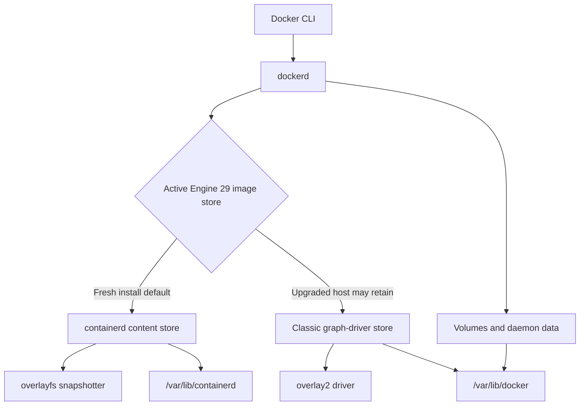
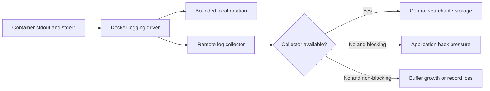
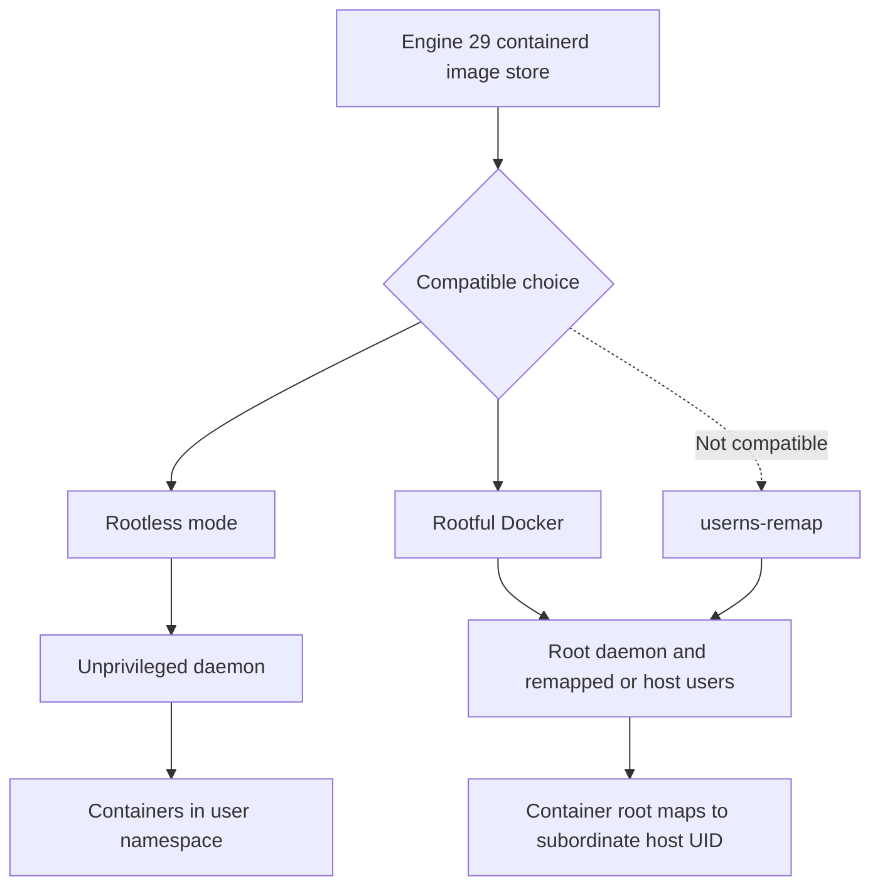

# Chapter 27 — Docker Engine Operations

> **Learning Objectives**
>
> By the end of this chapter, you will be able to:
>
> - Identify whether Engine uses the containerd image store or a classic storage driver
> - Plan an Engine 29.x image-store transition without mistaking hidden data for deleted data
> - Select and operate storage and logging backends
> - Compare rootless mode with `userns-remap` and recognize their constraints
> - Use Docker contexts to target local and remote Engines safely
> - Explain the Engine API and official SDK interaction model
> - validate and roll out `daemon.json` changes
> - Evaluate the experimental nftables firewall backend

## 27.1 The Daemon Is Production Infrastructure

The Docker CLI makes container operations feel local and immediate, but most commands are API requests to a long-running daemon. That daemon owns image and container state, starts runtimes, programs networks, collects logs, and exposes a security boundary.

Operating Docker Engine therefore means more than keeping `dockerd` running. You must understand which data backend is active, where bytes accumulate, how logs rotate, which identities can control the API, and how a configuration change affects existing workloads.

Docker Engine 29.x also marks an important storage transition: the containerd image store is the default for fresh Engine 29.0 and later installations. Systems upgraded from earlier versions generally retain their classic storage driver until an operator migrates them. Two hosts reporting the same Engine version can consequently have different storage behavior.

## 27.2 Containerd Image Store

### In plain terms

The image store keeps pulled and built image content plus writable container snapshots. Engine 29.x uses containerd's content store and snapshotters by default on fresh installations.

Older Engine installations commonly use a classic graph driver such as `overlay2`. Upgrading the Engine package does not automatically mean the host changed stores. This preserves compatibility, but it makes inspection essential.

Modern Docker Engine uses containerd’s image store; understand where images live and how GC works. You might think `docker system prune` is harmless on a shared builder—know blast radius for cached layers.

> ⚠️ **Common Pitfall:** Filling the disk with images until kubelet/docker disk pressure kills workloads.

### Under the hood

Inspect the active backend:

```bash
$ docker info --format '{{json .DriverStatus}}'
[["driver-type","io.containerd.snapshotter.v1"]]
```

A `driver-type` value containing `io.containerd.snapshotter.v1` identifies the containerd image store. On a classic installation, `docker info` instead reports a storage driver such as `overlay2`.

For an upgraded Engine, the containerd image store can be enabled in `/etc/docker/daemon.json`:

```json
{
  "features": {
    "containerd-snapshotter": true
  }
}
```

The switch is not an in-place reinterpretation of the old graph-driver directory. Existing classic-store images and containers remain on disk but become hidden while the containerd image store is active. Switching back makes them visible again. Export or push required images before changing the backend, and recreate containers from declarative configuration.

Engine also provides a containerd migration feature for qualifying environments:

```json
{
  "features": {
    "containerd-migration": true
  }
}
```

Migration behavior and eligibility are version-sensitive. Read the Engine 29.x documentation and test with a representative host rather than enabling it across a fleet without a rollback plan.

With the containerd image store, image content and snapshots normally live under `/var/lib/containerd`, while volumes and other daemon data remain under `/var/lib/docker`. The daemon's `data-root` setting does not relocate containerd's root; that is configured separately in containerd.



*Figure 27.1: Engine 29 can expose either the containerd image store or the legacy overlay2 graph-driver layout while daemon data remains separate.*

### In production

**Ownership:** Platform owns engine disk SLOs on nodes/builders; developers avoid unbounded local tag sprawl.

**Failure mode:** Disk full → node pressure. Detect with disk metrics and prune jobs. Mitigate with scheduled GC and image retention policy.

| Do | Don't |
|----|-------|
| Monitor image filesystem usage | Uncontrolled prune on prod nodes mid-incident |
| Retention policy for builders | Leave dangling images forever |

**Before you leave this section**

- **Understand:** containerd image store needs disk governance.
- **Try:** Run `docker system df` and interpret image vs build cache.
- **Watch in prod:** DiskPressure from image sprawl.


## 27.3 Storage Backends and Writable Data

### In plain terms

Container images are stacks of read-only layers plus a writable layer for each container. A storage backend decides how those layers are represented and combined.

The writable layer is designed for ephemeral container changes. Databases and durable application state belong in volumes or external storage, regardless of the active image store.

Graph drivers and volumes decide performance and durability for engine-local data. Prefer volumes for writable state. You might think container writable layers are fine for databases—layer IO and lifecycle say otherwise.

> ⚠️ **Common Pitfall:** Binding critical data to a container’s writable layer on Docker 29.x hosts.

### Under the hood

With the Engine 29.x containerd image store, snapshotters perform layer operations; `overlayfs` is the normal Linux snapshotter. Classic Engine stores use graph drivers, with `overlay2` being the established Linux choice on supported filesystems.

Inspect storage and disk use:

```bash
$ docker info
$ docker system df -v
$ docker buildx du
```

These commands describe different consumers. `docker system df` covers Engine objects, while BuildKit builders can hold separate cache that `docker buildx du` reveals.

Changing a classic storage driver can hide existing images and containers in much the same way as changing image stores. Never treat a configuration switch as a migration unless the documented procedure explicitly migrates data.

Volumes have a separate lifecycle:

```bash
$ docker volume ls
$ docker volume inspect task-db-data
```

Removing a container does not automatically remove a named volume. Conversely, `docker system prune --volumes` can remove unused volume data and deserves change-control discipline.

### In production

**Ownership:** Platform owns storage driver choice; app teams use named volumes or external stores.

**Failure mode:** Driver issues → container start failures. Detect with dockerd logs and volume plugin health. Mitigate with tested drivers and backups for volume data.

| Do | Don't |
|----|-------|
| Named volumes for state | Critical data in writable layer |
| Document storage driver per OS | Change drivers without migration plan |

**Before you leave this section**

- **Understand:** Engine storage backends affect performance and data safety.
- **Try:** Inspect `docker info` storage driver and list volumes.
- **Watch in prod:** Data loss from writable-layer assumptions.


## 27.4 Logging Drivers

### In plain terms

A logging driver decides where a container's standard output and standard error go. Docker can keep logs in local files or forward them to systems such as journald, syslog, Fluentd, GELF, or cloud logging services.

Logging is a capacity decision. An application that emits unlimited logs can fill the host and stop unrelated workloads.

Logging drivers ship container logs to json-file, journald, syslog, vendors. On Kubernetes nodes, prefer the cluster log pipeline; on pure Docker hosts, choose deliberately. You might think json-file without rotation is fine—disks fill.

> ⚠️ **Common Pitfall:** Unlimited json-file logs on production Docker hosts.

### Under the hood

Inspect the default driver:

```bash
$ docker info --format '{{.LoggingDriver}}'
json-file
```

The `local` driver is designed for efficient local storage and rotates by default. The `json-file` driver remains common and Kubernetes-compatible in many environments, but should be given explicit rotation limits:

```json
{
  "log-driver": "local",
  "log-opts": {
    "max-size": "20m",
    "max-file": "5"
  }
}
```

All values inside `log-opts` are strings. For per-container selection:

```bash
$ docker run -d \
    --name task-api \
    --log-driver local \
    --log-opt max-size=20m \
    --log-opt max-file=5 \
    task-api:1.4.0
```

Changing the daemon default affects newly created containers, not existing ones. Recreate containers to adopt the new configuration.

Some remote drivers can block an application when the destination is unavailable. Delivery mode, buffering, back pressure, and loss behavior vary by driver and options. `docker logs` is not available for every driver or configuration.



*Figure 27.2: Logging-driver delivery settings determine whether a collector outage causes back pressure, buffering, or loss.*

### In production

**Ownership:** Platform owns default logging driver and rotation; app teams avoid logging secrets.

**Failure mode:** Log disk fill → host failure. Detect with disk alerts. Mitigate with max-size/max-file or central drivers.

| Do | Don't |
|----|-------|
| Always set rotation | Debug logs at full verbosity forever |
| Centralize when possible | Different drivers per container without docs |

**Before you leave this section**

- **Understand:** Logging drivers need rotation and a destination strategy.
- **Try:** Inspect daemon default log driver and rotation options.
- **Watch in prod:** Host disk full from container logs.


## 27.5 Rootless Mode and User Namespace Remapping

### In plain terms

The ordinary Docker daemon runs as root, and access to its control socket is effectively root-level authority. Rootless mode runs both daemon and containers without root privileges. `userns-remap` keeps a rootful daemon but maps container user IDs, including container root, to unprivileged host IDs.

They reduce risk in different places:

- **Rootless** reduces daemon and runtime privilege.
- **`userns-remap`** reduces the host privilege represented by users inside containers.

Neither makes an untrusted container harmless, and both have host-kernel and feature constraints.

Rootless and userns-remap reduce blast radius of container breakout toward host root. Not every workload fits. You might think rootless equals “secure enough for multi-tenant prod”—still combine with other controls.

> ⚠️ **Common Pitfall:** Enabling userns-remap on an existing daemon without migrating volumes/permissions.

### Under the hood

Set up rootless mode for an unprivileged user with the packaged helper:

```bash
$ dockerd-rootless-setuptool.sh install
$ docker context use rootless
$ docker info
```

Rootless operation uses user namespaces and normally requires subordinate UID and GID ranges in `/etc/subuid` and `/etc/subgid`. Its configuration file is normally `~/.config/docker/daemon.json`, or under `XDG_CONFIG_HOME`.

Enable `userns-remap` on a rootful daemon with an allocated remapping user:

```json
{
  "userns-remap": "default"
}
```

The default creates or uses a `dockremap` identity with subordinate ranges. Explicit user and group values are also supported. Existing image and container data becomes hidden behind the remapped storage view after enablement, so plan it like a storage-affecting migration.

> ⚠️ **Warning:** In Engine 29.x, the containerd image store and `userns-remap` are incompatible. A fresh Engine 29.x installation using the containerd store cannot simply add `userns-remap`; choose a supported classic-store design or use rootless mode where its constraints fit.

Bind mounts need careful ownership. A UID inside the container maps to a different host UID under user namespaces. Blindly applying permissive modes such as `chmod 777` weakens isolation rather than solving the mapping.



*Figure 27.3: Rootless mode removes daemon root privilege, while userns-remap retains a rootful daemon and is incompatible with the Engine 29 containerd image store.*

### In production

**Ownership:** Platform decides rootless/userns for Docker hosts; document unsupported features.

**Failure mode:** Permission broken volumes after remap. Detect in staging migration. Mitigate with rebuild of volume permissions and feature matrix.

| Do | Don't |
|----|-------|
| Prefer rootless where supported | Flip userns on prod without rehearsal |
| Document feature gaps | Assume Kubernetes node behavior equals desktop rootless |

**Before you leave this section**

- **Understand:** Rootless/userns shrink host blast radius with trade-offs.
- **Try:** Read `docker info` for rootless/userns status on a lab engine.
- **Watch in prod:** Broken volume perms after remap.


## 27.6 Docker Contexts and Remote Access

### In plain terms

A Docker context is a named connection profile. It tells the CLI which daemon endpoint, TLS material, and orchestrator settings to use.

Contexts are safer and clearer than repeatedly exporting `DOCKER_HOST`, but they introduce a human-factor risk: a command can target production while the operator thinks it targets a laptop.

Contexts point the CLI at remote engines. Convenient and dangerous—wrong context deploys to prod. You might think context is “just a shortcut”—treat it like kubeconfig.

> ⚠️ **Common Pitfall:** Leaving a prod context as default on a shared laptop.

### Under the hood

List and inspect contexts:

```bash
$ docker context ls
NAME        DESCRIPTION                         DOCKER ENDPOINT
default *   Current DOCKER_HOST configuration   unix:///var/run/docker.sock

$ docker context inspect default
```

Create a context that uses SSH transport:

```bash
$ docker context create prod-engine \
    --docker host=ssh://docker-operator@engine.example.com

$ docker --context prod-engine info
```

Using `--context` on a command is explicit and suitable for scripts. `docker context use` changes the selected default:

```bash
$ docker context use prod-engine
$ docker ps
$ docker context use default
```

Environment variables and command flags can override the selected context. Diagnose surprising behavior by checking `docker context show`, `DOCKER_CONTEXT`, and `DOCKER_HOST`.

Do not expose the unauthenticated Engine API on a TCP socket. Anyone who can control a rootful daemon can generally mount host paths, start privileged containers, and gain root-equivalent control of the host.

### In production

**Ownership:** Humans own careful context switching; platform may forbid direct remote engine access in favor of CI.

**Failure mode:** Wrong-context deploy → prod incident. Detect with context name in CI logs and CLI prompts. Mitigate with explicit `-c` and no default prod context.

> 🏭 **Production floor:** Prod engines are not a laptop context. Prefer CI/CD for production applies; if a human must touch an engine, require an explicit named context—never a silent default.

| Do | Don't |
|----|-------|
| Name contexts clearly; never default prod | Share docker.sock over the network casually |
| Prefer CI for prod applies | TLS-less remote API |

**Before you leave this section**

- **Understand:** Contexts select engines; wrong context is a blast-radius incident.
- **Try:** Create a named context and always pass it explicitly.
- **Watch in prod:** Accidental prod deploys from local Docker contexts.


## 27.7 Engine API and SDKs

### In plain terms

The Docker CLI is one Engine API client. Applications can call the same versioned HTTP API directly or through an SDK.

This enables operators to build inventory collectors, controlled automation, test harnesses, and platform services. It also means API credentials carry powerful host permissions.

Everything CLI does goes through the Engine API. SDKs automate—also widen access if the socket is exposed. You might think mounting docker.sock into random containers is normal—it's root-equivalent on many setups.

> ⚠️ **Common Pitfall:** Mounting `docker.sock` into build/test containers on shared hosts.

### Under the hood

On Linux, the local daemon normally listens on a Unix socket. A simple read-only request can be demonstrated with `curl`:

```bash
$ curl --unix-socket /var/run/docker.sock \
    http://localhost/_ping
OK

$ curl --unix-socket /var/run/docker.sock \
    http://localhost/version
```

API paths can include a version, such as `/v1.52/containers/json`. Clients negotiate or select versions to remain compatible with the daemon. Consult the Engine API version matrix rather than hard-coding the newest version.

The official Go and Python SDKs model API objects and handle transport details. A minimal Python example:

```python
import docker

client = docker.from_env()

for container in client.containers.list():
    print(container.id, container.name, container.status)
```

Handle timeouts, partial failures, pagination where applicable, and event-stream reconnection. Container identifiers should be treated as opaque values, and automation should use labels to establish ownership.

### In production

**Ownership:** Platform forbids casual docker.sock mounts in prod; CI uses least-privilege builders.

**Failure mode:** Socket mount → host takeover. Detect with admission policies / runtime scans. Mitigate with rootless, nested builders, or remote BuildKit without sock.

| Do | Don't |
|----|-------|
| Avoid docker.sock mounts | Expose API without authn/z |
| Audit who can talk to the API | SDK scripts with hard-coded prod endpoints |

**Before you leave this section**

- **Understand:** Engine API is powerful; protect the socket like root.
- **Try:** List API versions via `docker version` and note client/server.
- **Watch in prod:** Containers with docker.sock in prod.


## 27.8 Managing `daemon.json`

### In plain terms

`daemon.json` is the preferred persistent configuration file for Docker Engine. On a regular Linux installation it is normally `/etc/docker/daemon.json`; rootless and Windows installations use different paths.

A daemon restart can interrupt container connectivity or change behavior, even when containers have restart policies. Treat configuration as a reviewed rollout.

daemon.json is the engine’s change-controlled config (log driver, cgroup, features). Treat edits like sysctl changes. You might think live tweaks without restart are always enough—many options need restart and soak.

> ⚠️ **Common Pitfall:** Editing daemon.json on every node by hand without config management.

### Under the hood

A representative Linux configuration is:

```json
{
  "log-driver": "local",
  "log-opts": {
    "max-size": "20m",
    "max-file": "5"
  },
  "live-restore": true,
  "default-address-pools": [
    {
      "base": "10.240.0.0/16",
      "size": 24
    }
  ]
}
```

Validate syntax and supported keys before restart:

```bash
$ sudo dockerd --validate \
    --config-file=/etc/docker/daemon.json
configuration OK
```

Then use the host's service manager:

```bash
$ sudo systemctl restart docker
$ sudo systemctl --no-pager --full status docker
$ docker info
```

Do not configure the same option both as a daemon startup flag and in `daemon.json`; duplicate options can prevent startup. Package units and distribution drop-ins may supply flags that are easy to overlook.

`live-restore` can keep standalone containers running while the daemon is unavailable during some upgrades or restarts. It does not make every configuration change disruption-free and does not replace workload redundancy.

### In production

**Ownership:** Platform owns daemon.json via config management; changes need soak and rollback.

**Failure mode:** Bad config → dockerd won’t start. Detect with fleet config drift checks. Mitigate with canary nodes and validated JSON.

| Do | Don't |
|----|-------|
| Config-manage daemon.json | Snowflake edits per node |
| Canary restart + soak | Change log driver fleet-wide mid-incident |

**Before you leave this section**

- **Understand:** daemon.json is fleet config; change-manage it.
- **Try:** Validate a daemon.json change on one lab host and restart safely.
- **Watch in prod:** Fleet drift in engine flags.


## 27.9 Experimental nftables Firewall Backend

### In plain terms

Docker normally programs host firewall rules to implement bridge networking, port publishing, and forwarding. Engine **29.0** introduced an experimental **nftables** backend as an alternative to iptables.

Experimental means the behavior and configuration may change. It is an evaluation target, not an automatic production upgrade. You might think flipping the backend is a drop-in swap—custom `DOCKER-USER` rules and host firewall managers often break until rewritten.

> ⚠️ **Common Pitfall:** Migrating `DOCKER-USER` assumptions directly to nftables. Rebuild custom policy with nftables hooks and priorities.

### Under the hood

Enable it through daemon configuration:

```json
{
  "firewall-backend": "nftables"
}
```

The equivalent daemon flag is `--firewall-backend=nftables`. Do not specify both.

The nftables backend creates Docker-owned tables and chains. Operators should add custom rules in their own tables rather than editing Docker-managed rules. nftables hook priorities determine whether custom chains run before or after Docker's chains.

The iptables `DOCKER-USER` chain does not have a direct nftables equivalent. Rules placed there may no longer execute after migration unless an old iptables jump remains temporarily. Recreate policy as native nftables base chains with intentional hooks and priorities.

IP forwarding also differs operationally. Confirm IPv4 and IPv6 forwarding plus forwarding policy before switching. Engine 29.x documentation identifies limitations, including Swarm-mode considerations; check the exact patch release before any trial. What breaks if you cut remote admin access with a bad ruleset: you need out-of-band console—test rollback on a disposable host first.

### In production

**Ownership:** Platform owns firewall-backend choice on Docker hosts; security owns host policy equivalence tests. Treat backend switches as network blast-radius changes.

**Failure mode:** Broken publish/NAT or accidental exposure after migration. Detect with connectivity matrices and unexpected open ports. Mitigate with canary hosts, exported rulesets, and documented rollback to iptables.

| Do | Don't |
|----|-------|
| Canary + full connectivity matrix | Fleet-wide flip on day one |
| Preserve console/out-of-band access | Assume DOCKER-USER still applies |
| Validate then restart via config management | Disable Docker firewall programming casually |

**Before you leave this section**

- **Understand:** nftables backend in Engine 29.x is experimental and needs policy rewrite.
- **Try:** On a disposable host, capture baseline, switch, retest, roll back.
- **Watch in prod:** Custom host firewall rules silently skipped after migration.

---

## 27.10 Common Pitfalls

> ⚠️ **Common Pitfall:** Assuming every Engine 29.x host uses the containerd image store. Fresh installations default to it; upgraded hosts can remain on `overlay2`.

> ⚠️ **Common Pitfall:** Switching stores or drivers and concluding that images were deleted. They may be hidden in the inactive backend while still consuming disk.

> ⚠️ **Common Pitfall:** Enabling `userns-remap` on a containerd-image-store host. Engine 29.x does not support that combination.

> ⚠️ **Common Pitfall:** Changing a default logging driver and expecting existing containers to adopt it. Recreate them.

> ⚠️ **Common Pitfall:** Mounting the Docker socket into a management container without recognizing that it grants daemon-level control.

> ⚠️ **Common Pitfall:** Editing `/etc/docker/daemon.json` and restarting without `dockerd --validate`. A typo or duplicate flag can take the daemon offline.

> ⚠️ **Common Pitfall:** Migrating `DOCKER-USER` assumptions directly to nftables. Rebuild custom policy with nftables hooks and priorities.

## 27.11 Hands-on Exercises

1. **Inventory an Engine.** Record Engine version, active image store or storage driver, logging driver, Docker root directory, containerd root usage, and available disk and inodes.
2. **Observe store boundaries.** On a disposable Engine 29.x VM, pull a test image and locate reported disk consumers. If migrating an upgraded lab host, export important images first and compare object visibility before and after the documented store switch.
3. **Rotate logs.** Configure the `local` logging driver with bounded size, recreate a noisy test container, and verify rotation without filling the filesystem.
4. **Compare isolation modes.** Document whether one lab workload can run rootless. Identify its port, bind-mount, cgroup, device, and networking requirements. Explain whether `userns-remap` is possible with the host's active store.
5. **Create a context.** Create an SSH-backed context to a lab Engine. Run read-only `info` and `ps` commands with explicit `--context`, then remove the context.
6. **Call the API.** Query `/_ping` and `/version` over the local socket. Write a short SDK program that lists only containers carrying a lab label.
7. **Validate daemon configuration.** Add a safe logging option on a disposable host, run `dockerd --validate`, restart through the service manager, and verify new and existing container behavior.
8. **Evaluate nftables.** On a disposable Engine 29.x host, capture baseline connectivity, switch to the experimental backend, repeat tests, inspect the ruleset, and practice rollback.

## 27.12 Check Your Understanding

**Q1.** Does upgrading an older host to Engine 29.x automatically switch it to the containerd image store?

<details>
<summary>Show answer</summary>

Generally no. The containerd image store is the default for fresh Engine 29.0 and later installations. Upgraded installations normally retain their classic storage driver until an operator performs a supported transition.

</details>

**Q2.** Why can disk usage remain high after changing image stores?

<details>
<summary>Show answer</summary>

Data from the inactive backend may remain on disk but be hidden from Docker commands. The containerd store also uses `/var/lib/containerd` for image content and snapshots while other Docker data remains under `/var/lib/docker`.

</details>

**Q3.** What is the operational difference between rootless mode and `userns-remap`?

<details>
<summary>Show answer</summary>

Rootless mode runs the daemon and containers without root privileges. `userns-remap` keeps a rootful daemon but maps container identities to unprivileged host IDs. Their feature constraints and threat reduction differ.

</details>

**Q4.** Why is access to the Docker socket considered root-equivalent on a rootful Engine?

<details>
<summary>Show answer</summary>

An API client can start privileged containers, mount host paths, alter networks, and control other containers. Those operations can normally be used to gain full host control.

</details>

**Q5.** What should happen before restarting after a `daemon.json` change?

<details>
<summary>Show answer</summary>

Validate the file with `dockerd --validate`, check for duplicate startup flags, plan workload impact and rollback, and canary the change where possible.

</details>

**Q6.** Why cannot existing `DOCKER-USER` rules simply be assumed to protect an nftables-backed Engine?

<details>
<summary>Show answer</summary>

`DOCKER-USER` belongs to the iptables rule path and has no direct nftables equivalent. Custom nftables tables and base chains must use appropriate hooks and priorities to apply policy around Docker's rules.

</details>

## 27.13 Key takeaways

- Engine version alone does not identify the active image store; inspect every host.
- Fresh Engine 29.x installations default to the containerd image store, while upgraded hosts can retain classic storage.
- Storage transitions can hide old data, and `userns-remap` is incompatible with the containerd image store.
- Bound local logs and test remote-driver back pressure.
- Rootless mode and user namespace remapping reduce different risks and require workload testing.
- Contexts make endpoints explicit, but remote daemon access remains highly privileged.
- The Engine API and SDKs enable automation; protect their credentials like host-administrator access.
- Validate and canary daemon configuration.
- The nftables backend in Engine 29.x is experimental and requires deliberate firewall-policy migration.

## 27.14 Official documentation map

| Topic | Official page |
|-------|---------------|
| Containerd image store | [containerd image store with Docker Engine](https://docs.docker.com/engine/storage/containerd/) |
| Storage drivers | [Select a storage driver](https://docs.docker.com/engine/storage/drivers/select-storage-driver/) |
| Logging drivers | [Configure logging drivers](https://docs.docker.com/engine/logging/configure/) |
| Rootless mode | [Rootless mode](https://docs.docker.com/engine/security/rootless/) |
| User namespace remapping | [Isolate containers with a user namespace](https://docs.docker.com/engine/security/userns-remap/) |
| Docker contexts | [Docker contexts](https://docs.docker.com/engine/manage-resources/contexts/) |
| Engine API | [Docker Engine API](https://docs.docker.com/reference/api/engine/) |
| SDK examples | [Develop with Docker Engine SDKs](https://docs.docker.com/engine/api/sdk/examples/) |
| Daemon configuration | [Configure the Docker daemon](https://docs.docker.com/engine/daemon/) |
| Daemon CLI reference | [`dockerd`](https://docs.docker.com/reference/cli/dockerd/) |
| nftables backend | [Docker with nftables](https://docs.docker.com/engine/network/firewall-nftables/) |

**Previous:** [Chapter 26 — Supply Chain and Trusted Content](26-supply-chain-and-trusted-content.md) | **Next:** [Chapter 28 — Cluster Lifecycle with kubeadm](28-cluster-lifecycle-kubeadm.md)
