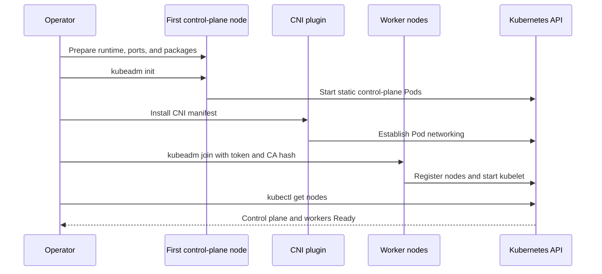
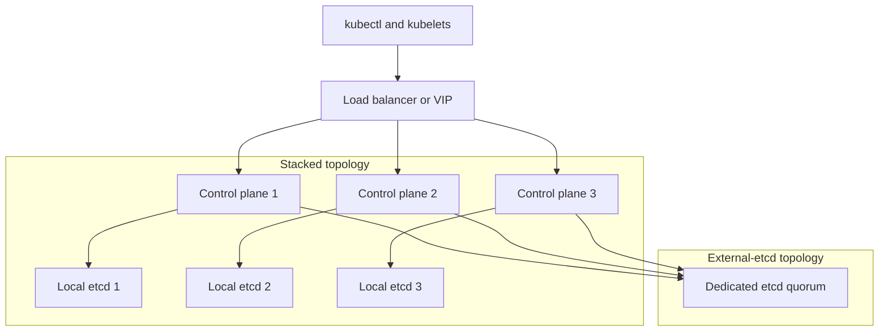
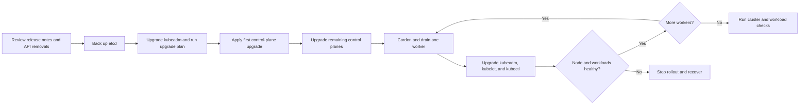

# Chapter 28 — Cluster Lifecycle with kubeadm

> **Learning Objectives**
>
> By the end of this chapter, you will be able to:
>
> - Build a Kubernetes 1.36 control plane with **kubeadm** and add worker machines to it
> - Draw a cluster that keeps working when one control-plane machine dies (stacked vs external etcd, load-balanced API)
> - Find the cluster's certificates, see when they expire, and renew them before they do
> - Move a cluster to a newer version safely, one step at a time (1.33–1.36)
> - Take a machine out of service for maintenance without dropping traffic
> - Back up the cluster's database, and practice putting it back

---

## 28.1 Opening story: the city that rebuilds itself

Imagine you are handed the keys to a small city. On day one you pour the foundations. That is the control plane. You connect power and water, which is the networking plugin and the kubelet on every machine.

Then you start issuing building permits. Those are the certificates that let parts of the cluster prove who they are.

The years pass and the work changes. You add neighborhoods, which is joining new worker machines. You renovate city hall without closing the streets, which is upgrading. And you keep the deed registry locked in a vault with copies elsewhere. That registry is etcd, the database holding every object in your cluster.

**kubeadm** is the official toolbox for all of that. You use it when you run Kubernetes yourself, on virtual machines, on bare metal, or in a lab on your laptop.

Managed services such as EKS, GKE, and AKS do most of this chapter for you. The ideas still matter. When an upgrade stalls or a certificate expires, you need to know what is actually happening. Even if your whole job is clicking "upgrade cluster" in a console, read this once so you know what that button does.

> 💡 **Tip:** Practice on disposable VMs or a nested lab before touching production. kubeadm is deliberate and powerful; a mistyped `--control-plane-endpoint` or a skipped etcd snapshot is expensive.

---

## 28.2 What kubeadm is (and is not)

### In plain terms

kubeadm is the official tool that installs a working Kubernetes control plane and gives new machines a safe way to join it. It is an installer and an upgrade helper, not a complete platform.

Why does that boundary matter? Because it tells you what is still your job. kubeadm does not pick your operating system, your container runtime, your networking plugin, or your load balancer. It does not patch your hosts or manage your applications. A cluster it builds passes the official conformance tests, and everything around that cluster is yours.

Think of it as a contractor who builds the shell of a building to code. The building is real and it is up to standard. The furniture, the tenants, and the cleaning schedule are not part of the contract.

kubeadm also does not replace tools such as Terraform or Cluster API. Most teams use them together: something provisions the machines, and kubeadm turns those machines into a cluster. The important habit is to keep your kubeadm settings in a file in version control, not typed as flags once and forgotten. A cluster you cannot rebuild from a written config is a cluster you cannot restore.

> ⚠️ **Common Pitfall:** Treating kubeadm init as a one-way irreversible snowflake with no documented config.

### Under the hood

Here are the commands kubeadm gives you and what a real bootstrap looks like.

kubeadm’s main verbs:

| Command | Role |
|---------|------|
| `kubeadm init` | Bootstrap the first control-plane node |
| `kubeadm join` | Add workers or extra control-plane members |
| `kubeadm upgrade` | Plan and apply version bumps |
| `kubeadm reset` | Tear down kubeadm-managed state on a node |
| `kubeadm certs` | Inspect and renew cluster certificates |
| `kubeadm token` | Manage bootstrap tokens for joins |
| `kubeadm config` | Print or migrate ClusterConfiguration |

A minimal init (lab-shaped; adjust versions and CIDRs for your environment):

```bash
$ sudo kubeadm init \
    --kubernetes-version=v1.36.0 \
    --pod-network-cidr=10.244.0.0/16 \
    --control-plane-endpoint=k8s-api.example.com:6443 \
    --upload-certs
```

Typical success output (abbreviated):

```text
Your Kubernetes control-plane has initialized successfully!

To start using your cluster, you need to run the following as a regular user:

  mkdir -p $HOME/.kube
  sudo cp -i /etc/kubernetes/admin.conf $HOME/.kube/config
  sudo chown $(id -u):$(id -g) $HOME/.kube/config

Then you can join any number of worker nodes by running:

  kubeadm join k8s-api.example.com:6443 --token <token> \
    --discovery-token-ca-cert-hash sha256:<hash>
```

After init, install a CNI (Calico, Cilium, Flannel, and so on). Until the CNI is healthy, CoreDNS and other system Pods often stay `Pending` or `ContainerCreating`.

```bash
$ mkdir -p $HOME/.kube
$ sudo cp -i /etc/kubernetes/admin.conf $HOME/.kube/config
$ sudo chown "$(id -u):$(id -g)" $HOME/.kube/config

$ kubectl get nodes
NAME     STATUS     ROLES           AGE   VERSION
cp-1     NotReady   control-plane   30s   v1.36.0
```

`NotReady` here usually means “no CNI yet,” not “kubeadm failed.”

Declarative configuration (preferred for anything beyond a throwaway lab):

```yaml
# kubeadm-config.yaml
apiVersion: kubeadm.k8s.io/v1beta4
kind: ClusterConfiguration
kubernetesVersion: v1.36.0
controlPlaneEndpoint: "k8s-api.example.com:6443"
networking:
  podSubnet: "10.244.0.0/16"
  serviceSubnet: "10.96.0.0/12"
---
apiVersion: kubeadm.k8s.io/v1beta4
kind: InitConfiguration
localAPIEndpoint:
  advertiseAddress: "192.168.10.11"
  bindPort: 6443
nodeRegistration:
  criSocket: unix:///var/run/containerd/containerd.sock
```

```bash
$ sudo kubeadm init --config=kubeadm-config.yaml --upload-certs
```

### In production

**Ownership:** The platform team owns the kubeadm configuration and every upgrade. Keep the ClusterConfiguration file in Git.

**Failure mode:** A cluster built by hand cannot be rebuilt the same way, so a restore does not reproduce it. Detect it by comparing each cluster against its checked-in config. Prevent it by keeping those configs in version control and rehearsing a rebuild.

| Do | Don't |
|----|-------|
| Version-control kubeadm config | Undocumented manual tweaks on masters |
| Know what kubeadm does not manage | Expect kubeadm to manage app addons forever alone |

**Before you leave this section**

- **Understand:** kubeadm bootstraps; you still own day-2 operations.
- **Try:** Read a kubeadm ClusterConfiguration and note version fields.
- **Watch in prod:** Undocumented control-plane snowflakes.


---

## 28.3 Bootstrap workflow end to end

### In plain terms

Building a cluster is a fixed checklist, done in order. Prepare the machines, initialize the first control plane, install networking, join the workers, then verify that everything is healthy.

The order is not a suggestion, and this is where beginners lose an afternoon. Until a networking plugin is installed, Pods have no way to get an IP address. They sit in `Pending` or `ContainerCreating` forever, including the cluster's own DNS Pods. The node reports `NotReady`, which looks like the install failed.

It has not failed. It is a city with houses and no roads. Nothing is wrong with the houses.

So when a fresh cluster looks broken, check `kubectl get pods -n kube-system` before you debug anything else. If CoreDNS is not running and no networking plugin is installed, you have found it. One more thing that trips people up: the join token printed by `kubeadm init` expires after 24 hours, so a worker you add the next day needs a fresh one.

> ⚠️ **Common Pitfall:** Forgetting CNI and debugging apps for hours.

### Under the hood

Here is the checklist in full, with the commands for each step.

**Prerequisites (each node):**

- Compatible Linux (check kubeadm’s OS matrix for 1.36)
- swap off (or configured per current kubelet guidance)
- container runtime with CRI (typically **containerd**)
- required ports open (6443 API, 2379–2380 etcd on control plane, 10250 kubelet, NodePort range if used, CNI-specific ports)
- `kubeadm`, `kubelet`, `kubectl` packages installed; kubelet enabled

```bash
$ sudo systemctl enable --now kubelet
$ sudo crictl info
```

**Join a worker:**

```bash
$ sudo kubeadm join k8s-api.example.com:6443 \
    --token abcdef.0123456789abcdef \
    --discovery-token-ca-cert-hash sha256:0123...cdef
```

Create a fresh token if the default expired (tokens last 24 hours by default):

```bash
$ kubeadm token create --print-join-command
```

**Verify:**

```bash
$ kubectl get nodes -o wide
NAME     STATUS   ROLES           AGE   VERSION   INTERNAL-IP     OS-IMAGE
cp-1     Ready    control-plane   1h    v1.36.0   192.168.10.11   Ubuntu 24.04
wk-1     Ready    <none>          10m   v1.36.0   192.168.10.21   Ubuntu 24.04
wk-2     Ready    <none>          9m    v1.36.0   192.168.10.22   Ubuntu 24.04

$ kubectl get pods -n kube-system
NAME                               READY   STATUS    RESTARTS   AGE
coredns-7db6d8ff4d-xk2m9           1/1     Running   0          1h
etcd-cp-1                          1/1     Running   0          1h
kube-apiserver-cp-1                1/1     Running   0          1h
kube-controller-manager-cp-1       1/1     Running   0          1h
kube-proxy-abc12                   1/1     Running   0          10m
kube-scheduler-cp-1                1/1     Running   0          1h
```



*Figure 28.1: kubeadm bootstrap establishes the control plane before networking and worker joins make the cluster ready.*

### In production

**Ownership:** The platform team owns the bootstrap scripts and the checklist, and records the exact versions used (Kubernetes 1.36 here).

**Failure mode:** A bootstrap that stopped halfway leaves nodes stuck in `NotReady`. Detect it by checking node conditions and the core `kube-system` Pods. Prevent it with bootstrap scripts you can safely rerun, followed by a smoke test.

| Do | Don't |
|----|-------|
| CNI before app workloads | Skip version pinning on container runtime |
| Smoke test DNS and a Deployment | Hand-join without join-token hygiene |

**Before you leave this section**

- **Understand:** Bootstrap order: control plane → CNI → workers → smoke tests.
- **Try:** Sketch your bootstrap checklist with version pins.
- **Watch in prod:** Clusters left without CNI or with expired join tokens.


---

## 28.4 High-availability topologies

### In plain terms

**High availability**, or HA, means running several control-plane machines behind one shared address, so losing any one of them does not stop the cluster.

Here is why you want it. With a single control-plane node, existing Pods keep running for a while after it dies, because each worker's kubelet carries on with what it already knows. But nothing new can happen. You cannot schedule, scale, roll out, or replace a failed Pod. And you cannot see any of it, because `kubectl` is also down.

The catch is the database. etcd stays correct by requiring a majority of its members to agree before accepting a write, which is called **quorum**. The formula is `(n/2)+1`. With three members you need two, so you survive one failure. With two members you also need two, so you survive nothing and have added a second machine that can take the cluster down. That is why member counts are always odd, normally three or five.

The other half of HA is the address. Every client and every kubelet must talk to one stable name, a load balancer or virtual IP, rather than to one server's own IP. Set that `controlPlaneEndpoint` on day one even with a single control plane, because changing it later means reissuing certificates and editing every kubeconfig.

> ⚠️ **Common Pitfall:** Even-sized etcd clusters that cannot form quorum cleanly.

### Under the hood

Here are the two layouts kubeadm supports, and how to add a second control plane.

Two common kubeadm patterns:

| Topology | etcd location | Pros | Cons |
|----------|---------------|------|------|
| **Stacked** | etcd co-located on each control-plane node | Simpler; fewer machines | Control-plane load and etcd share fate |
| **External etcd** | Separate etcd nodes | Independent scaling and failure domains | More hosts and operational surface |

Both need a **load-balanced or VIP `controlPlaneEndpoint`** so clients and kubelets talk to one stable name.



*Figure 28.2: Stacked HA co-locates an etcd member with each control plane, whereas external-etcd HA separates the quorum onto dedicated hosts.*

```text
                    ┌─────────────────────┐
   kubectl /        │  LB / VIP :6443     │
   kubelets  ──────►│  k8s-api.example.com│
                    └──────────┬──────────┘
           ┌───────────────────┼───────────────────┐
           ▼                   ▼                   ▼
      ┌─────────┐         ┌─────────┐         ┌─────────┐
      │  cp-1   │         │  cp-2   │         │  cp-3   │
      │ apiserver│         │ apiserver│         │ apiserver│
      │ etcd (*)│         │ etcd (*)│         │ etcd (*)│
      └─────────┘         └─────────┘         └─────────┘
        (*) stacked topology — external etcd would sit on dedicated hosts
```

Join an additional control-plane member (certificate key from `--upload-certs` or `kubeadm init phase upload-certs`):

```bash
$ sudo kubeadm join k8s-api.example.com:6443 \
    --token <token> \
    --discovery-token-ca-cert-hash sha256:<hash> \
    --control-plane \
    --certificate-key <certificate-key>
```

Odd numbers for etcd members (3 or 5). Quorum is `(n/2)+1`. Two of three members can keep the cluster writable; one of three cannot.

### In production

**Ownership:** The platform team owns the HA layout and the load balancer in front of the API server.

**Failure mode:** etcd loses quorum, and the API stops accepting writes or goes down entirely. Detect it with etcd's health endpoints, checked continuously rather than during an incident. Prevent it by running three or five members spread across separate failure domains, so one rack or zone cannot take out the majority.

| Do | Don't |
|----|-------|
| Odd etcd member count | Two-node “HA” etcd |
| LB + healthy API backends | Clients pinned to one API IP |

**Before you leave this section**

- **Understand:** HA topology follows quorum and failure domains.
- **Try:** Diagram your API LB and etcd members.
- **Watch in prod:** Quorum loss from co-located etcd members.


---

## 28.5 PKI and certificates

### In plain terms

A **PKI**, short for public key infrastructure, is the set of certificates a system uses to prove identity. kubeadm creates a small private one for your cluster and stores it under `/etc/kubernetes/pki`.

Every important conversation inside the cluster depends on it. The API server proves it is the API server. Each kubelet proves which node it is. etcd members prove they belong to the same quorum. Your own `kubectl` proves you are an admin. None of that works on trust alone; it works on certificates.

The problem is that certificates expire, and kubeadm's default lifetime for most of them is one year. When they lapse, the city still has all its buildings, but nobody at the gate can prove who they are. `kubectl` starts failing, kubelets cannot report in, and the fix requires access you may have just lost.

This is the most predictable outage in Kubernetes, which makes it the most embarrassing one. Check expiry on a schedule with `kubeadm certs check-expiration`, alert at least 30 days out, and renew during planned maintenance. Running `kubeadm upgrade apply` renews them too, so clusters upgraded regularly rarely hit this. Clusters left alone for a year are exactly the ones that do.

> ⚠️ **Common Pitfall:** Discovering cert expiry only when kubectl starts failing.

### Under the hood

Here is where those files live and how to check and renew them.

Important paths on a control-plane node:

| Path | Purpose |
|------|---------|
| `/etc/kubernetes/pki/ca.crt` / `ca.key` | Cluster CA |
| `/etc/kubernetes/pki/apiserver.crt` | API server serving cert |
| `/etc/kubernetes/pki/etcd/` | etcd server and peer certs |
| `/etc/kubernetes/pki/front-proxy-ca.crt` | Aggregated API front-proxy CA |
| `/etc/kubernetes/admin.conf` | Admin kubeconfig (client cert) |
| `/etc/kubernetes/kubelet.conf` | Kubelet kubeconfig |

Inspect expiry:

```bash
$ sudo kubeadm certs check-expiration
CERTIFICATE                EXPIRES                  RESIDUAL TIME   CERTIFICATE AUTHORITY   EXTERNALLY MANAGED
admin.conf                 Jul 25, 2027 18:00 UTC   364d            ca                      no
apiserver                  Jul 25, 2027 18:00 UTC   364d            ca                      no
apiserver-etcd-client      Jul 25, 2027 18:00 UTC   364d            etcd-ca                 no
apiserver-kubelet-client   Jul 25, 2027 18:00 UTC   364d            ca                      no
controller-manager.conf    Jul 25, 2027 18:00 UTC   364d            ca                      no
etcd-healthcheck-client    Jul 25, 2027 18:00 UTC   364d            etcd-ca                 no
etcd-peer                  Jul 25, 2027 18:00 UTC   364d            etcd-ca                 no
etcd-server                Jul 25, 2027 18:00 UTC   364d            etcd-ca                 no
front-proxy-client         Jul 25, 2027 18:00 UTC   364d            front-proxy-ca          no
scheduler.conf             Jul 25, 2027 18:00 UTC   364d            ca                      no

CERTIFICATE AUTHORITY   EXPIRES                  RESIDUAL TIME   EXTERNALLY MANAGED
ca                      Jul 23, 2036 18:00 UTC   10y             no
etcd-ca                 Jul 23, 2036 18:00 UTC   10y             no
front-proxy-ca          Jul 23, 2036 18:00 UTC   10y             no
```

Renew all managed certificates (typically during maintenance; restart static Pods / kubelet as required):

```bash
$ sudo kubeadm certs renew all
$ sudo systemctl restart kubelet
```

kubeadm also renews certificates automatically during `kubeadm upgrade apply` when needed. Default kubeadm-issued leaf certificates last **one year**; CAs last longer.

`controlPlaneEndpoint` and extra SANs belong in the ClusterConfiguration so the apiserver certificate lists every name clients use:

```yaml
apiServer:
  certSANs:
    - "k8s-api.example.com"
    - "k8s-api-internal.example.com"
    - "192.168.10.10"
```

### In production

**Ownership:** The platform team owns the certificate rotation schedule and runs `kubeadm certs check-expiration` regularly.

**Failure mode:** Certificates expire and authentication fails everywhere at once. Detect it with a monitor that alerts more than 30 days before expiry, not on the day. Prevent it with scheduled rotation and a calendar reminder that outlives whoever set it.

| Do | Don't |
|----|-------|
| Monitor cert expiry | Manual copy of pki without backup |
| Rotate before expiry | Disable TLS to “fix” prod |

**Before you leave this section**

- **Understand:** PKI expiry is a predictable outage—monitor and rotate.
- **Try:** Run cert expiration check in a lab kubeadm cluster.
- **Watch in prod:** Silent certs nearing expiry.


---

## 28.6 Upgrades with kubeadm

### In plain terms

Upgrading a cluster means moving it to a newer Kubernetes version in a fixed order: the control plane first, then the workers one at a time, never skipping a version along the way.

Why so careful? Because the pieces of a cluster run different versions during the upgrade, and Kubernetes only promises they work together within a limit called **version skew**. Modern releases allow a kubelet to be up to three minor versions behind the API server, written as N−3. What is never allowed is a kubelet ahead of the API server. That is why the control plane always goes first.

Even with that window, you upgrade one minor version at a time: 1.34, then 1.35, then 1.36. Each hop can remove APIs your manifests still use, so read the release notes for every hop rather than only for the destination.

Two things people get wrong. Upgrading the `kubectl` on your laptop upgrades nothing on the cluster; nodes need their own kubeadm and kubelet packages bumped. And a worker upgrade means draining it first, which respects **PDBs** (PodDisruptionBudgets, the rule that says how many replicas of an app must stay up during voluntary disruption). Skip the drain and you take the app down instead of moving it.

> ⚠️ **Common Pitfall:** Upgrading kubelet past supported skew relative to API server.

### Under the hood

Here is the full sequence, with the commands for each node.

High-level sequence for a minor upgrade to 1.36:

1. Read the release notes and deprecated API list for each hop.
2. Backup etcd (section 28.8).
3. Upgrade **kubeadm** on a control-plane node.
4. `kubeadm upgrade plan` then `kubeadm upgrade apply`.
5. Upgrade kubelet and kubectl on that node; restart kubelet.
6. Repeat for other control-plane nodes with `kubeadm upgrade node`.
7. Drain, upgrade, and uncordon each worker.

```bash
# On first control-plane node — packages shown schematically
$ sudo apt-mark unhold kubeadm && sudo apt-get install -y kubeadm=1.36.0-* && sudo apt-mark hold kubeadm

$ sudo kubeadm upgrade plan
Components that must be upgraded:
COMPONENT         CURRENT   TARGET
kube-apiserver    v1.35.x   v1.36.0
kube-controller-manager v1.35.x v1.36.0
kube-scheduler    v1.35.x   v1.36.0
kube-proxy        v1.35.x   v1.36.0
CoreDNS           v1.x.x    v1.x.y
etcd              3.5.x     3.5.y

$ sudo kubeadm upgrade apply v1.36.0
[upgrade/successful] SUCCESS! Your cluster was upgraded to "v1.36.0". Enjoy!

$ sudo apt-mark unhold kubelet kubectl
$ sudo apt-get install -y kubelet=1.36.0-* kubectl=1.36.0-*
$ sudo apt-mark hold kubelet kubectl
$ sudo systemctl daemon-reload && sudo systemctl restart kubelet
```

Additional control-plane or worker:

```bash
$ sudo kubeadm upgrade node
# then upgrade kubelet/kubectl packages and restart kubelet
```

Worker drain pattern (next section) wraps the kubelet bump.



*Figure 28.3: A kubeadm minor upgrade proceeds through backup, control planes, and one drained worker at a time with health gates.*

### In production

**Ownership:** The platform team owns the upgrade runbook and rehearses it on a staging copy of the cluster first.

**Failure mode:** A version skew violation puts the cluster in a combination nobody supports, and the symptoms are strange rather than obvious. Detect it with a dashboard showing the version of every component and node. Prevent it by upgrading in waves with a pause and a health check between them.

| Do | Don't |
|----|-------|
| Follow skew policy (1.33–1.36 window) | Skip staging upgrade rehearsal |
| Drain with PDB | Upgrade kubelet before API server carelessly |

**Before you leave this section**

- **Understand:** kubeadm upgrades are waved and skew-aware.
- **Try:** Read the upgrade plan output on a lab cluster.
- **Watch in prod:** Skew violations after partial upgrades.


---

## 28.7 Node lifecycle: cordon, drain, and retirement

### In plain terms

Taking a node out of service is a two-step move. **Cordon** marks the node unschedulable, so no new Pods land there while the ones already running continue. **Drain** then evicts those Pods so they restart on other nodes, and it waits for PDBs so an app never drops below its required replica count.

Do this before every reboot, kernel patch, kubelet upgrade, or decommission. If you just power the machine off, every Pod on it dies at once. Replacements do get scheduled, but not instantly, and if several replicas of the same app happened to share that node, the app is down in the meantime. Draining moves them first and then lets you take the machine.

Skipping the drain is demolishing a building while people are still inside. They will get out. It will not be graceful.

This is also why terminating an instance in a cloud console is not the same operation. The console knows nothing about PDBs or attached volumes; it just removes the machine. And resist the temptation to add `--force` when a drain is slow. Force deletes bypass the very protections that make the drain safe, and during a production upgrade that is how one node's maintenance becomes an outage. If a drain will not finish, find out which Pod is blocking it and why.

> ⚠️ **Common Pitfall:** Force-deleting pods to speed drain during production upgrades.

### Under the hood

Here is the sequence, plus what each verb does to the node.

```bash
$ kubectl cordon wk-1
node/wk-1 cordoned

$ kubectl get node wk-1
NAME   STATUS                     ROLES    AGE   VERSION
wk-1   Ready,SchedulingDisabled   <none>   40d   v1.36.0

$ kubectl drain wk-1 \
    --ignore-daemonsets \
    --delete-emptydir-data \
    --grace-period=60
node/wk-1 already cordoned
evicting pod tasks/task-api-7d9c4f6b8-abcd1
pod/task-api-7d9c4f6b8-abcd1 evicted
node/wk-1 drained
```

| Action | Effect |
|--------|--------|
| `cordon` | Marks `SchedulingDisabled`; existing Pods keep running |
| `drain` | Cordons (if needed) and evicts Pods respecting PDBs |
| `uncordon` | Allows scheduling again after maintenance |
| `delete node` | Removes the Node object after the host is gone |

DaemonSets are not drained by default in a useful way for node agents—you ignore them so kube-proxy and CNI agents are not treated like app replicas. EmptyDir data is lost on eviction unless you opt into deletion explicitly (as above) after accepting the data loss.

```bash
# After OS patch / kubelet upgrade
$ kubectl uncordon wk-1
node/wk-1 uncordoned
```

Retiring a node forever:

```bash
$ kubectl drain wk-1 --ignore-daemonsets --delete-emptydir-data
$ sudo kubeadm reset -f   # on the node, if it was kubeadm-joined
$ kubectl delete node wk-1
```

For control-plane members, also remove the etcd member before or as you decommission, and ensure remaining members keep quorum.

### In production

**Ownership:** The platform team owns node retirement automation, and that automation respects PDBs.

**Failure mode:** Retiring a node the wrong way takes several services down at once. Detect it by watching your error budget burn during the maintenance window. Prevent it by keeping spare capacity for the evicted Pods and draining one failure domain at a time.

| Do | Don't |
|----|-------|
| Cordon → drain → delete | Console-terminate without drain |
| Verify replacements Ready | Drain all zones at once |

**Before you leave this section**

- **Understand:** Node retirement uses drain+PDB discipline.
- **Try:** Retire a lab worker with cordon/drain.
- **Watch in prod:** Console deletions skipping drain.

> 🏭 **Production floor:** On kubeadm fleets, **drain + PDB** before every node upgrade/retire. Ticket must show PDB status, drain transcript, and post-join kubelet version.


---

## 28.8 etcd operations

### In plain terms

**etcd** is the database that stores every object in your cluster: every Deployment, Secret, ConfigMap, and node record. It is the deed registry and the minute book, and it is the one thing in Kubernetes you cannot rebuild from memory.

That is the whole reason this section exists. Lose a worker node and Kubernetes replaces it. Lose your container images and you rebuild them from source. Lose etcd without a backup and you have lost the cluster's entire state, including things nobody wrote down anywhere else.

So back it up on a schedule, store the snapshots off the control-plane machine, and restore one onto a throwaway cluster often enough that you know the runbook works. A backup you have never restored is a hope, not a backup.

Two warnings about the mechanics. A disk snapshot of the etcd volume is not the same as an etcd snapshot; it can catch a write in progress, and it does nothing for you if the encryption keys for Secrets at rest are stored somewhere else. And **defragmentation**, which reclaims space etcd has marked free, makes a member briefly unresponsive. Run it on one member at a time, never on all of them at once, or you will lose quorum yourself.

> 💡 **In one line:** An etcd backup you have never restored is not a backup, it is a file.

> ⚠️ **Common Pitfall:** Running defrag on all members simultaneously.

### Under the hood

Here is how to take a snapshot, check the members, and restore.

On stacked kubeadm clusters, etcd often runs as a static Pod (`etcd-cp-1` in `kube-system`). Talk to it with `etcdctl` using the PKI under `/etc/kubernetes/pki/etcd/`.

**Snapshot backup:**

```bash
$ sudo ETCDCTL_API=3 etcdctl \
    --endpoints=https://127.0.0.1:2379 \
    --cacert=/etc/kubernetes/pki/etcd/ca.crt \
    --cert=/etc/kubernetes/pki/etcd/server.crt \
    --key=/etc/kubernetes/pki/etcd/server.key \
    snapshot save /var/backups/etcd/etcd-$(date +%F).db

$ sudo ETCDCTL_API=3 etcdctl snapshot status /var/backups/etcd/etcd-2026-07-25.db -w table
+----------+----------+------------+------------+
|   HASH   | REVISION | TOTAL KEYS | TOTAL SIZE |
+----------+----------+------------+------------+
| a1b2c3d4 |  184291  |       3120 |      25 MB |
+----------+----------+------------+------------+
```

**Member health:**

```bash
$ sudo ETCDCTL_API=3 etcdctl \
    --endpoints=https://192.168.10.11:2379,https://192.168.10.12:2379,https://192.168.10.13:2379 \
    --cacert=/etc/kubernetes/pki/etcd/ca.crt \
    --cert=/etc/kubernetes/pki/etcd/server.crt \
    --key=/etc/kubernetes/pki/etcd/server.key \
    endpoint health
```

**Restore** (disaster recovery outline—practice offline):

1. Stop API servers / etcd on affected nodes as documented for your topology.
2. `etcdctl snapshot restore` into a fresh data directory with correct `--initial-cluster` naming.
3. Point etcd static manifests at the restored data path.
4. Bring members back and verify `kubectl get nodes` and object counts.

Encrypted secrets at rest, large clusters, and defrag (`etcdctl defrag`) are advanced ops—schedule defrag after evaluating fragmentation; never defrag casually during peak write load without a plan.

### In production

**Ownership:** The platform team owns etcd operations, and a restore requires two people to sign off before it runs.

**Failure mode:** A botched restore loses cluster history permanently. Detect the risk in advance by measuring how your restore drills actually go, not by trusting a green backup job. Reduce it with backups written to storage that cannot be overwritten or deleted, and a written procedure for replacing a member.

| Do | Don't |
|----|-------|
| Tested backup/restore | Defrag all members at once |
| Quorum-aware member replace | etcdctl from untrusted networks |

**Before you leave this section**

- **Understand:** etcd ops require rehearsed backup/restore and quorum care.
- **Try:** Perform a backup in lab and restore to a scratch member set.
- **Watch in prod:** Untested backups; simultaneous defrag.

> 🏭 **Production floor:** **etcd backup tested restores**—schedule drills, record RTO, never declare DR ready on backup job green alone.


---

## 28.9 Common pitfalls

> ⚠️ **Common Pitfall:** Forgetting the CNI after `kubeadm init` and debugging “DNS is broken” for an hour. Check `kubectl get pods -n kube-system` first.

> ⚠️ **Common Pitfall:** Mixing package versions—kubeadm 1.36 with kubelet 1.34 left behind on half the nodes.

> ⚠️ **Common Pitfall:** Taking an etcd snapshot from one member while another is lagging, then restoring without understanding membership IDs. Practice the exact restore runbook.

> ⚠️ **Common Pitfall:** Using `kubeadm reset` on a healthy HA member without removing it from the etcd cluster first, leaving a zombie peer.

> ⚠️ **Common Pitfall:** Assuming managed Kubernetes “has no certificates.” It does—you just do not renew them by hand. Node drains and upgrade discipline still apply.

---

## 28.10 Hands-on exercises

1. On a lab of three VMs, run `kubeadm init` with a DNS `controlPlaneEndpoint`, install a CNI, and join two workers. Save the join command output in your notes.
2. Run `kubeadm certs check-expiration` and identify which certificates would expire first. Draft an alert threshold you would use in production.
3. Cordon and drain a worker while a Deployment with three replicas and a PDB (`minAvailable: 2`) is running. Observe eviction behavior; then uncordon.
4. Take an etcd snapshot, record the revision from `snapshot status`, and store the file off the control-plane node.
5. (Stretch) Add a second control-plane member with `kubeadm join --control-plane`. Kill the first apiserver process (or stop the VM) and confirm kubectl still works through the shared endpoint.

---

## 28.11 Check Your Understanding

**Q1.** Why should you set `controlPlaneEndpoint` even if you start with a single control-plane node?

<details>
<summary>Show answer</summary>

So API clients and certificates already trust a stable VIP or DNS name. When you add HA later, you do not have to reissue certificates or rewrite every kubeconfig to a new address.
</details>

**Q2.** What is the difference between cordon and drain?

<details>
<summary>Show answer</summary>

Cordon only marks the node unschedulable. Drain cordons (if needed) and evicts workloads so they can reschedule elsewhere, respecting PodDisruptionBudgets for voluntary disruptions.
</details>

**Q3.** Why do etcd clusters usually have 3 or 5 members?

<details>
<summary>Show answer</summary>

etcd needs quorum (`(n/2)+1`) to accept writes. Odd counts maximize fault tolerance for a given size; two members cannot survive one failure and still keep quorum.
</details>

**Q4.** Can you upgrade a kubeadm cluster directly from 1.34 to 1.36?

<details>
<summary>Show answer</summary>

No. Upgrade one minor version at a time (1.34 → 1.35 → 1.36), following `kubeadm upgrade plan` and release notes for each hop.
</details>

**Q5.** Where does kubeadm place the cluster CA by default?

<details>
<summary>Show answer</summary>

Under `/etc/kubernetes/pki/` on control-plane nodes (`ca.crt` and `ca.key`), with related kubeconfigs under `/etc/kubernetes/*.conf`.
</details>

---

## 28.12 Key takeaways

- **kubeadm** builds and upgrades a real cluster. The OS, runtime, networking plugin, and load balancer are still yours.
- Set a shared `controlPlaneEndpoint` on day one, even with one control plane. Changing it later is painful.
- Run **three or five** etcd members, never two. A majority must agree before any write succeeds.
- Certificates expire after a year. Alert 30 days out and renew on a schedule.
- Upgrade **one minor version at a time**, control plane first, and back up etcd before you start.
- **Cordon, drain, maintain, uncordon.** Never skip the drain, and never force it to go faster.
- An **etcd snapshot** you have practiced restoring is the difference between an incident and losing the cluster.

---

## 28.13 Official documentation map

| Topic | Official page |
|-------|---------------|
| kubeadm overview | [Installing Kubernetes with kubeadm](https://kubernetes.io/docs/setup/production-environment/tools/kubeadm/) |
| Creating a cluster | [Creating a cluster with kubeadm](https://kubernetes.io/docs/setup/production-environment/tools/kubeadm/create-cluster-kubeadm/) |
| HA setup | [Creating highly available clusters with kubeadm](https://kubernetes.io/docs/setup/production-environment/tools/kubeadm/high-availability/) |
| Certificate management | [Certificate Management with kubeadm](https://kubernetes.io/docs/tasks/administer-cluster/kubeadm/kubeadm-certs/) |
| Upgrading kubeadm clusters | [Upgrading kubeadm clusters](https://kubernetes.io/docs/tasks/administer-cluster/kubeadm/kubeadm-upgrade/) |
| Safely drain a node | [Safely Drain a Node](https://kubernetes.io/docs/tasks/administer-cluster/safely-drain-node/) |
| Operating etcd | [Operating etcd clusters for Kubernetes](https://kubernetes.io/docs/tasks/administer-cluster/configure-upgrade-etcd/) |
| Backing up etcd | [Backing up an etcd cluster](https://kubernetes.io/docs/tasks/administer-cluster/configure-upgrade-etcd/#backing-up-an-etcd-cluster) |
| Version skew policy | [Version Skew Policy](https://kubernetes.io/docs/releases/version-skew-policy/) |

**Previous:** [Chapter 27 — Docker Engine Operations](27-docker-engine-operations.md) | **Next:** [Chapter 29 — Extending Kubernetes](29-extending-kubernetes.md)
