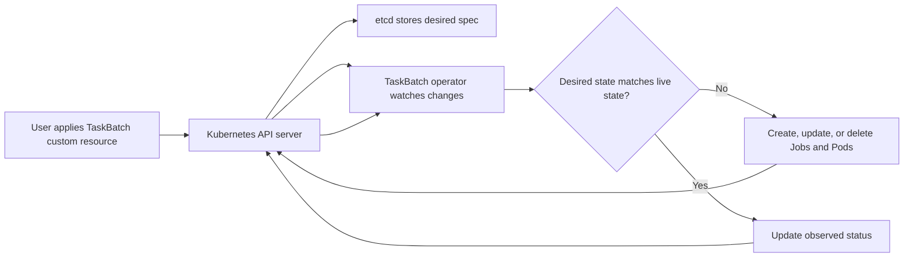
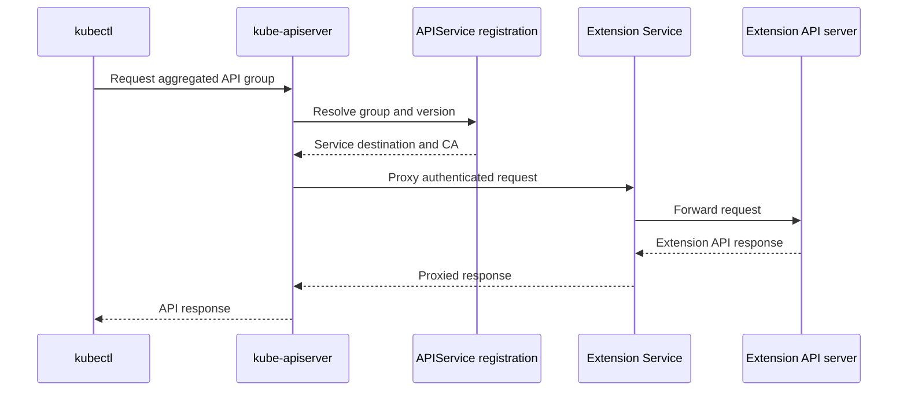
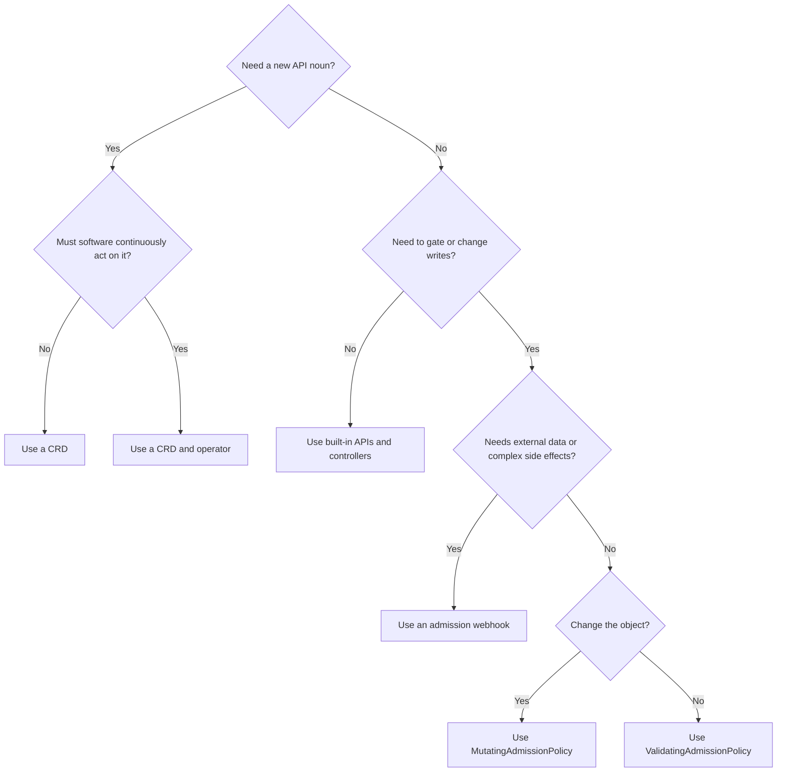

# Chapter 29 — Extending Kubernetes

> **Learning Objectives**
>
> By the end of this chapter, you will be able to:
>
> - Define CustomResourceDefinitions (CRDs) and use custom resources like built-in types
> - Explain the operator pattern and when a controller earns its keep
> - Describe the API aggregation layer and how extension API servers plug in
> - Configure validating and mutating admission webhooks responsibly
> - Write **ValidatingAdmissionPolicy** and **MutatingAdmissionPolicy** (GA in Kubernetes 1.36) with CEL
> - Choose between webhooks, in-process CEL policies, and operators for a given extension need

---

## 29.1 Opening story: the platform that grew rooms

Kubernetes ships a useful apartment building: Pods, Deployments, Services, Jobs. Real platforms need extra rooms—databases as APIs, certificates as APIs, tenant quotas as APIs. The project anticipated that. Instead of forking the apiserver for every idea, Kubernetes gives you **extension points**: new resource types (CRDs), reconcilers that drive them (operators), optional aggregated APIs, and admission hooks that enforce house rules when objects enter the building.

On Kubernetes **1.36**, declarative admission took a major step forward: **MutatingAdmissionPolicy** joined **ValidatingAdmissionPolicy** as stable, CEL-powered, in-process policies. Many “tiny webhook” use cases can now live entirely inside the apiserver.

---

## 29.2 CustomResourceDefinitions

### In plain terms

A **CustomResourceDefinition** teaches the API server a new noun. After you apply a CRD for `BackupSchedule`, `kubectl get backupschedules` works like `kubectl get pods`. The API stores your objects in etcd; it does not automatically *do* anything with them until a controller watches and reconciles.

CRDs extend the API with new resource types. They are contracts—breaking schemas break controllers and users. You might think CRDs are “just YAML”—they are API surface with upgrade duties.

> ⚠️ **Common Pitfall:** Shipping CRDs without conversion strategy when changing versions.

### Under the hood

Minimal CRD for a namespaced `TaskBatch` in group `tasks.example.com`:

```yaml
# crd-taskbatch.yaml
apiVersion: apiextensions.k8s.io/v1
kind: CustomResourceDefinition
metadata:
  name: taskbatches.tasks.example.com
spec:
  group: tasks.example.com
  scope: Namespaced
  names:
    plural: taskbatches
    singular: taskbatch
    kind: TaskBatch
    shortNames:
      - tb
  versions:
    - name: v1
      served: true
      storage: true
      schema:
        openAPIV3Schema:
          type: object
          properties:
            spec:
              type: object
              required: ["image", "completions"]
              properties:
                image:
                  type: string
                  minLength: 1
                completions:
                  type: integer
                  minimum: 1
                  maximum: 1000
                parallelism:
                  type: integer
                  minimum: 1
                  default: 1
            status:
              type: object
              properties:
                succeeded:
                  type: integer
                phase:
                  type: string
      subresources:
        status: {}
      additionalPrinterColumns:
        - name: Image
          type: string
          jsonPath: .spec.image
        - name: Phase
          type: string
          jsonPath: .status.phase
```

```bash
$ kubectl apply -f crd-taskbatch.yaml
customresourcedefinition.apiextensions.k8s.io/taskbatches.tasks.example.com created

$ kubectl api-resources | grep taskbatch
taskbatches   tb   tasks.example.com/v1   true   TaskBatch
```

Create an instance:

```yaml
# sample-taskbatch.yaml
apiVersion: tasks.example.com/v1
kind: TaskBatch
metadata:
  name: nightly-reports
  namespace: tasks
spec:
  image: example/task-api:1.0.0
  completions: 5
  parallelism: 2
```

```bash
$ kubectl apply -f sample-taskbatch.yaml
taskbatch.tasks.example.com/nightly-reports created

$ kubectl get tb -n tasks
NAME              IMAGE                     PHASE
nightly-reports   example/task-api:1.0.0
```

Structural schemas (OpenAPI v3 in the CRD) are required for modern CRDs. They enable validation, pruning of unknown fields (when configured), and server-side apply awareness.

Versioning tips:

- One version is marked `storage: true`.
- Serve multiple versions with conversion webhooks (or none, if you only ever serve one).
- Prefer additive schema evolution; breaking field removals need a new version and a migration story.

### In production

**Ownership:** Platform/extension owners own CRD lifecycle; app teams consume documented versions only.

**Failure mode:** Breaking CRD change → controller mass failure. Detect with webhook/conversion errors. Mitigate with served versions and staged deprecation.

| Do | Don't |
|----|-------|
| Version and convert carefully | Delete CRDs that still have CRs |
| RBAC for new resources | Cluster-admin for every operator |

**Before you leave this section**

- **Understand:** CRDs are API contracts with upgrade and RBAC duties.
- **Try:** Inspect a CRD’s versions and stored version.
- **Watch in prod:** Breaking CRD upgrades without conversion.


---

## 29.3 The operator pattern

### In plain terms

An **operator** is a controller (often packaged with its CRDs) that encodes human operational knowledge: provision a database, rotate its certificates, take backups, fail over. Users declare *what* they want (`kind: PostgresCluster`); the operator continuously drives the cluster toward that desire.

Operators reconcile desired CR state to reality. Bugs amplify with cluster-admin. You might think more operators always mean more automation—each adds failure domain and RBAC surface.

> ⚠️ **Common Pitfall:** Operators running as cluster-admin “to get it working.”

### Under the hood

The reconciliation loop is the same idea as built-in controllers:



*Figure 29.1: A CRD stores desired state while an operator repeatedly reconciles child resources and reports status.*

```text
Watch TaskBatch objects
        │
        ▼
Read desired spec ──► Compare to live Jobs/Pods ──► Create/Update/Delete children
        │
        ▼
Update TaskBatch.status
```

A sketch in Go-shaped pseudocode (not a full project):

```text
for each TaskBatch tb:
  ensure Job exists with Completions=tb.spec.completions
  set tb.status.succeeded = job.status.succeeded
  set tb.status.phase = "Running" or "Completed"
```

Operators commonly use:

- **controller-runtime** / Operator SDK / Kubebuilder scaffolding
- **ownerReferences** so garbage collection deletes children when the CR goes away
- finalizers for cleanup that must happen before the API object disappears
- RBAC limited to the resources the operator truly needs

```yaml
# Example ownerReference on a child Job (set by the operator)
apiVersion: batch/v1
kind: Job
metadata:
  name: nightly-reports-batch
  namespace: tasks
  ownerReferences:
    - apiVersion: tasks.example.com/v1
      kind: TaskBatch
      name: nightly-reports
      uid: 4f2a9c1e-8b3d-4e2a-9f1c-123456789abc
      controller: true
      blockOwnerDeletion: true
spec:
  completions: 5
  parallelism: 2
  template:
    spec:
      restartPolicy: Never
      containers:
        - name: worker
          image: example/task-api:1.0.0
```

### In production

**Ownership:** Platform approves operators; owners on-call for their controllers.

**Failure mode:** Reconcile loops gone wrong → cascading changes. Detect with leader metrics and audit of operator SA. Mitigate with least-privilege Roles and rate limits.

| Do | Don't |
|----|-------|
| Least-privilege operator SA | cluster-admin operators |
| On-call + runbook per operator | Install operators without upgrade plan |

**Before you leave this section**

- **Understand:** Operators are controllers with blast radius—privilege and on-call required.
- **Try:** Map one operator’s SA and Role rules.
- **Watch in prod:** Over-privileged operators.


---

## 29.4 API aggregation layer

### In plain terms

CRDs extend the *same* apiserver process with new types. The **aggregation layer** lets you run a *separate* extension API server and register it so that `kubectl` and clients still talk to the front door (`kube-apiserver`), which proxies specific API groups to your backend.

Aggregation mounts extension API servers behind the main API. Powerful and operationally heavy. You might think aggregation is required for every CRD—CRDs usually suffice.

> ⚠️ **Common Pitfall:** Choosing aggregation when a CRD+controller would do.

### Under the hood

You register an `APIService` that maps a group-version to a Service running your extension server:



*Figure 29.2: The aggregation layer keeps kube-apiserver as the front door while proxying selected API groups to an extension server.*

```yaml
apiVersion: apiregistration.k8s.io/v1
kind: APIService
metadata:
  name: v1beta1.metrics.k8s.io
spec:
  service:
    name: metrics-server
    namespace: kube-system
    port: 443
  group: metrics.k8s.io
  version: v1beta1
  insecureSkipTLSVerify: false
  groupPriorityMinimum: 100
  versionPriority: 100
  caBundle: LS0tLS1CRUdJTi...   # PEM CA bundle, base64-encoded
```

Flow:

```text
kubectl get --raw /apis/metrics.k8s.io/v1beta1/nodes
        │
        ▼
kube-apiserver (aggregation) ──proxy──► metrics-server Service
```

The **metrics-server** is the classic in-tree-ecosystem example. Custom aggregated APIs appear when CRD storage semantics are not enough (specialized query APIs, different persistence, or protocol needs).

Front-proxy certificates (chapter 28’s `front-proxy-ca`) authenticate the apiserver to the extension server so the extension can trust the identity of the original user via impersonation headers.

### In production

**Ownership:** Platform owns aggregated API HA and authn wiring.

**Failure mode:** Extension API down → clients fail for those resources. Detect with apiservice availability. Mitigate with HA extension servers and documented dependencies.

| Do | Don't |
|----|-------|
| Prefer CRDs unless you need aggregation | Snowflake extension API without HA |
| Monitor APIServices | Ignore TLS/authn for extension servers |

**Before you leave this section**

- **Understand:** Aggregation is specialized; CRDs cover most extension needs.
- **Try:** List APIServices and note unavailable ones.
- **Watch in prod:** Unavailable aggregated APIs.


---

## 29.5 Admission webhooks

### In plain terms

Admission webhooks are **phone-a-friend** checks during API requests. After authentication and authorization, the apiserver can call your HTTPS endpoint to **mutate** (change) or **validate** (allow/deny) the object before it is persisted.

Validating/mutating webhooks enforce policy at admit time. Failure policy and timeouts are production settings. You might think a down webhook only blocks bad objects—`Fail` can block the API for matching resources.

> ⚠️ **Common Pitfall:** `failurePolicy: Fail` without HA webhooks on critical resources.

### Under the hood

Two configuration kinds:

| Kind | Role |
|------|------|
| `MutatingWebhookConfiguration` | Can change the object (patches) |
| `ValidatingWebhookConfiguration` | Can only accept or reject |

```yaml
# validating-webhook-config.yaml
apiVersion: admissionregistration.k8s.io/v1
kind: ValidatingWebhookConfiguration
metadata:
  name: taskbatch-policy
webhooks:
  - name: validate.taskbatches.tasks.example.com
    admissionReviewVersions: ["v1"]
    sideEffects: None
    timeoutSeconds: 5
    failurePolicy: Fail
    clientConfig:
      service:
        namespace: platform-system
        name: taskbatch-webhook
        path: /validate-taskbatch
        port: 443
      caBundle: LS0tLS1CRUdJTi...
    rules:
      - apiGroups: ["tasks.example.com"]
        apiVersions: ["v1"]
        operations: ["CREATE", "UPDATE"]
        resources: ["taskbatches"]
        scope: Namespaced
```

Request/response use `AdmissionReview` objects. Your service must present a certificate trusted via `caBundle`.

Ordering and risk:

- Mutating webhooks run before validating webhooks.
- `failurePolicy: Ignore` fails open (availability over safety); `Fail` fails closed (safety over availability).
- Long timeouts stall **every** matching API call cluster-wide.

### In production

**Ownership:** Platform owns webhook HA and failurePolicy; policy teams own rules.

**Failure mode:** Webhook outage → create/update failures cluster-wide for matched resources. Detect with webhook latency/error and API error rates. Mitigate with HA, timeouts, and careful namespace selectors.

> 🏭 **Production floor:** A single-replica validating webhook with `failurePolicy: Fail` on Pods is a cluster-wide outage waiting to happen. Treat webhook HA like control-plane HA.

| Do | Don't |
|----|-------|
| HA webhooks + sensible failurePolicy | Single-replica Fail webhooks on Pods |
| Exclude kube-system carefully | Mutate without SSA awareness |

**Before you leave this section**

- **Understand:** Webhooks are on the admit path—HA and failurePolicy are safety.
- **Try:** Inspect a validating webhook’s failurePolicy and namespaceSelector.
- **Watch in prod:** Admit outages from Fail + down webhooks.


---

## 29.6 ValidatingAdmissionPolicy and CEL (stable)

### In plain terms

A **ValidatingAdmissionPolicy** is a validating webhook written as **declarations and CEL expressions** inside the apiserver. No sidecar service, no TLS bundle rotation for your app, no extra Deployment to page on. You express rules like “every Pod must set `runAsNonRoot`” in CEL; the API server evaluates them in-process.

In-process CEL policies reduce webhook sprawl for many validation cases (stable path on modern clusters). You might think CEL replaces all webhooks—complex side effects still need webhooks/operators.

> ⚠️ **Common Pitfall:** Policies that deny broadly without warn/dry-run rollout.

### Under the hood

ValidatingAdmissionPolicy has been stable since Kubernetes 1.30 and remains the validation half of the CEL admission story on 1.36. You typically create:

1. `ValidatingAdmissionPolicy` — the logic
2. `ValidatingAdmissionPolicyBinding` — where it applies (and optional params)

```yaml
# vap-require-app-label.yaml
apiVersion: admissionregistration.k8s.io/v1
kind: ValidatingAdmissionPolicy
metadata:
  name: require-app-label
spec:
  failurePolicy: Fail
  matchConstraints:
    resourceRules:
      - apiGroups: ["apps"]
        apiVersions: ["v1"]
        operations: ["CREATE", "UPDATE"]
        resources: ["deployments"]
  validations:
    - expression: "has(object.metadata.labels) && has(object.metadata.labels.app)"
      message: "Deployments must carry an 'app' label"
      reason: Invalid
---
apiVersion: admissionregistration.k8s.io/v1
kind: ValidatingAdmissionPolicyBinding
metadata:
  name: require-app-label-binding
spec:
  policyName: require-app-label
  validationActions: ["Deny"]
  matchResources:
    namespaceSelector:
      matchLabels:
        policy.example.com/enforce: "true"
```

```bash
$ kubectl apply -f vap-require-app-label.yaml
validatingadmissionpolicy.admissionregistration.k8s.io/require-app-label created
validatingadmissionpolicybinding.admissionregistration.k8s.io/require-app-label-binding created
```

CEL sees variables such as `object`, `oldObject`, `request`, `params`, `namespaceObject`, and `authorizer`. Example requiring resource requests:

```yaml
validations:
  - expression: >
      object.spec.template.spec.containers.all(c,
        has(c.resources) && has(c.resources.requests) &&
        has(c.resources.requests.memory) && has(c.resources.requests.cpu))
    message: "All containers must set cpu and memory requests"
```

`validationActions` may include `Deny`, `Warn`, and `Audit`—useful for rolling out policy without a big-bang outage.

### In production

**Ownership:** Platform owns policy engine enablement; security owns policy content rollouts.

**Failure mode:** Bad policy → mass deny. Detect with deny metrics and audit annotations. Mitigate with warn → enforce and staged namespace matchers.

| Do | Don't |
|----|-------|
| warn/audit before enforce | Enforce global denies on day one |
| Test CEL against sample objects | Unowned policies nobody can revert |

**Before you leave this section**

- **Understand:** CEL ValidatingAdmissionPolicy is in-process validation with staged rollout.
- **Try:** Read one ValidatingAdmissionPolicy and its bindings.
- **Watch in prod:** Sudden mass denies from new policies.


---

## 29.7 MutatingAdmissionPolicy (GA in 1.36)

### In plain terms

If ValidatingAdmissionPolicy is the bouncer who rejects bad outfits, **MutatingAdmissionPolicy** is the stylist who quietly adds the missing badge on the way in. As of Kubernetes **1.36**, MutatingAdmissionPolicy is **GA** (`admissionregistration.k8s.io/v1`), enabled by default—mutations via CEL without running a mutating webhook server.

MutatingAdmissionPolicy (GA in **1.36**) mutates objects in-API with CEL-oriented policies—another way to enforce defaults without a webhook. You might think mutation order does not matter—managers and webhooks still interact.

> ⚠️ **Common Pitfall:** Mutating the same fields from Helm, SSA, and policies without a field-owner story.

### Under the hood

Core pieces:

| Resource | Role |
|----------|------|
| `MutatingAdmissionPolicy` | Mutation logic (CEL apply configuration or JSON patch) |
| `MutatingAdmissionPolicyBinding` | Activates and scopes the policy |
| Optional parameter CR / ConfigMap | Makes the policy reusable with different values |

Label injection example:

```yaml
# map-add-managed-by.yaml
apiVersion: admissionregistration.k8s.io/v1
kind: MutatingAdmissionPolicy
metadata:
  name: add-managed-by-label
spec:
  failurePolicy: Fail
  reinvocationPolicy: IfNeeded
  matchConstraints:
    resourceRules:
      - apiGroups: [""]
        apiVersions: ["v1"]
        operations: ["CREATE"]
        resources: ["pods"]
  mutations:
    - patchType: ApplyConfiguration
      applyConfiguration:
        expression: >
          Object{
            metadata: Object.metadata{
              labels: {"managed-by": "cel-policy"}
            }
          }
---
apiVersion: admissionregistration.k8s.io/v1
kind: MutatingAdmissionPolicyBinding
metadata:
  name: add-managed-by-label-binding
spec:
  policyName: add-managed-by-label
```

```bash
$ kubectl apply -f map-add-managed-by.yaml
mutatingadmissionpolicy.admissionregistration.k8s.io/add-managed-by-label created
mutatingadmissionpolicybinding.admissionregistration.k8s.io/add-managed-by-label-binding created

$ kubectl run demo --image=nginx:1.27 -n tasks
pod/demo created

$ kubectl get pod demo -n tasks -o jsonpath='{.metadata.labels.managed-by}{"\n"}'
cel-policy
```

**ApplyConfiguration** mutations merge with server-side apply semantics—safer for additive fields. **JSONPatch** mutations are available when you need explicit list operations. Match conditions can skip work:

```yaml
matchConditions:
  - name: missing-managed-by
    expression: '!has(object.metadata.labels) || !("managed-by" in object.metadata.labels)'
```

Sidecar-style mutation (init container) pattern from the official docs shape:

```yaml
mutations:
  - patchType: ApplyConfiguration
    applyConfiguration:
      expression: >
        Object{
          spec: Object.spec{
            initContainers: [
              Object.spec.initContainers{
                name: "mesh-proxy",
                image: "mesh/proxy:v1.0.0",
                args: ["proxy", "sidecar"],
                restartPolicy: "Always"
              }
            ]
          }
        }
```

Use match conditions so you do not stack duplicate sidecars on every update. Policies and bindings that configure admission are exempt from being mutated by MutatingAdmissionPolicy via the REST API path—guards against unrecoverable self-modification loops.

### In production

**Ownership:** Platform owns mutation policy rollout; document field ownership vs SSA managers.

**Failure mode:** Fighting managers → apply errors. Detect with SSA conflict metrics. Mitigate with clear owner per field and staged mutation.

| Do | Don't |
|----|-------|
| Document who owns mutated fields | Silent mutations in prod without warn |
| GA features still need soak | Mutate secrets into plaintext env carelessly |

**Before you leave this section**

- **Understand:** MutatingAdmissionPolicy (GA 1.36) needs field-ownership discipline.
- **Try:** Compare a mutation policy to your SSA field managers.
- **Watch in prod:** Apply conflicts after mutation policies ship.


---

## 29.8 Choosing an extension mechanism

| Need | Prefer |
|------|--------|
| New declarative API noun + stored objects | CRD |
| Continuously act on those objects | Operator / controller |
| Non-CRD API semantics or separate storage | Aggregated API server |
| Reject bad objects with local logic | ValidatingAdmissionPolicy (CEL) |
| Default/inject fields with local logic | MutatingAdmissionPolicy (CEL, GA 1.36) |
| Admission that calls inventory/DB/IdP | Admission webhook |
| Package CRDs + controller + RBAC for others | Operator + Helm/OLM-style distribution |

Admission choices differ operationally as well as functionally:

| Mechanism | Mutates | Validates | External lookup | Extra service | Best fit |
|---|---:|---:|---:|---:|---|
| ValidatingAdmissionPolicy | No | Yes | No | No | Local CEL validation |
| MutatingAdmissionPolicy | Yes | Indirectly with paired validation | No | No | Local defaulting or injection |
| Validating webhook | No | Yes | Yes | Yes | External or complex decisions |
| Mutating webhook | Yes | Often paired with validation | Yes | Yes | Complex mutation needing external context |



*Figure 29.3: Choose CRDs and operators for new declarative APIs, and choose CEL policies or webhooks for admission-time decisions.*

---

## 29.9 Common pitfalls

> ⚠️ **Common Pitfall:** Publishing a CRD without a controller and wondering why nothing happens. The API will store objects happily forever; reconciliation is your job.

> ⚠️ **Common Pitfall:** Conversion webhook or admission webhook downtime blocking upgrades and CRD changes. Budget HA for anything on the request path.

> ⚠️ **Common Pitfall:** CEL policies that assume fields always exist. Use `has()` and safe navigation patterns; test CREATE and UPDATE separately.

> ⚠️ **Common Pitfall:** Mutating the same list with ApplyConfiguration incorrectly and wiping sibling elements. Know SSA merge rules; use JSONPatch when you must append carefully.

> ⚠️ **Common Pitfall:** Granting operators `cluster-admin`. Scope RBAC to the CRDs and child resources they manage.

---

## 29.10 Hands-on exercises

1. Apply the `TaskBatch` CRD from this chapter, create an instance, and inspect it with `kubectl get tb -o yaml`. Confirm no Jobs exist until a controller creates them.
2. Write a ValidatingAdmissionPolicy that denies Deployments missing `spec.template.spec.containers[*].resources.requests.cpu` in a labeled namespace. Prove Warn vs Deny behavior.
3. Add a MutatingAdmissionPolicy that sets `metadata.labels.managed-by=cel-policy` on Pod CREATE. Show the label appearing without any webhook Pod running.
4. Inspect `kubectl get apiservices` on your cluster and identify which groups are `Local` versus backed by a Service.
5. (Stretch) Scaffold a tiny controller with Kubebuilder or Operator SDK that creates a Job per TaskBatch and updates status.

---

## 29.11 Check Your Understanding

**Q1.** Does creating a CRD automatically enforce business logic like “create five Jobs”?

<details>
<summary>Show answer</summary>

No. A CRD only registers the API type and schema. A controller or operator must watch instances and reconcile dependent objects.
</details>

**Q2.** What problem does the aggregation layer solve that CRDs do not?

<details>
<summary>Show answer</summary>

It lets a separate extension API server serve an API group behind kube-apiserver—useful for custom storage, protocols, or implementations that do not fit CRD etcd storage.
</details>

**Q3.** What became GA in Kubernetes 1.36 for admission?

<details>
<summary>Show answer</summary>

MutatingAdmissionPolicy (and its binding) graduated to stable `admissionregistration.k8s.io/v1`, enabling CEL-based in-process mutations without a mutating webhook service.
</details>

**Q4.** When would you still use a validating admission webhook instead of ValidatingAdmissionPolicy?

<details>
<summary>Show answer</summary>

When validation needs external data, proprietary engines, or logic that CEL in-process cannot express cleanly—or when you are not yet ready to migrate an existing webhook investment.
</details>

**Q5.** Why are `failurePolicy` and webhook timeouts operationally critical?

<details>
<summary>Show answer</summary>

They determine whether API requests fail closed or open when the webhook is down or slow, and slow webhooks stall the apiserver’s admission path for every matching request.
</details>

---

## 29.12 Key takeaways

- **CRDs** add nouns; **operators** add verbs that reconcile them.
- The **aggregation layer** proxies specialized APIs through the front door when CRDs are not enough.
- **Admission webhooks** remain powerful but operationally heavy—HA, TLS, and blast radius matter.
- **ValidatingAdmissionPolicy** and **MutatingAdmissionPolicy** (GA in 1.36) bring CEL policies in-process for the common validation and mutation cases.
- Pick the **smallest extension point** that meets the need; not every platform problem deserves a new webhook service.

---

## 29.13 Official documentation map

| Topic | Official page |
|-------|---------------|
| Custom Resources | [Custom Resources](https://kubernetes.io/docs/concepts/extend-kubernetes/api-extension/custom-resources/) |
| Extend the API with CRDs | [Extend the Kubernetes API with CustomResourceDefinitions](https://kubernetes.io/docs/tasks/extend-kubernetes/custom-resources/custom-resource-definitions/) |
| Operator pattern | [Operator pattern](https://kubernetes.io/docs/concepts/extend-kubernetes/operator/) |
| API aggregation | [Configure the aggregation layer](https://kubernetes.io/docs/tasks/extend-kubernetes/configure-aggregation-layer/) |
| Dynamic admission | [Dynamic Admission Control](https://kubernetes.io/docs/reference/access-authn-authz/extensible-admission-controllers/) |
| ValidatingAdmissionPolicy | [Validating Admission Policy](https://kubernetes.io/docs/reference/access-authn-authz/validating-admission-policy/) |
| MutatingAdmissionPolicy | [Mutating Admission Policy](https://kubernetes.io/docs/reference/access-authn-authz/mutating-admission-policy/) |
| CEL in Kubernetes | [Common Expression Language in Kubernetes](https://kubernetes.io/docs/reference/using-api/cel/) |

**Previous:** [Chapter 28 — Cluster Lifecycle with kubeadm](28-cluster-lifecycle-kubeadm.md) | **Next:** [Chapter 30 — Advanced Object Management](30-object-management-advanced.md)
