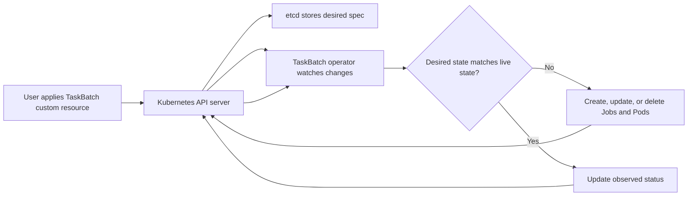
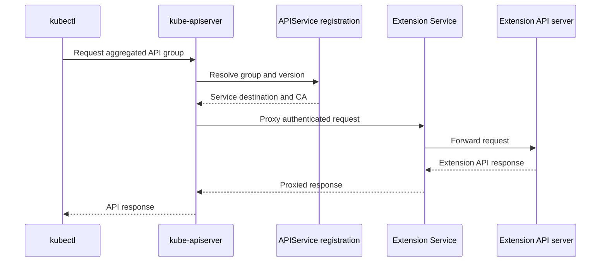
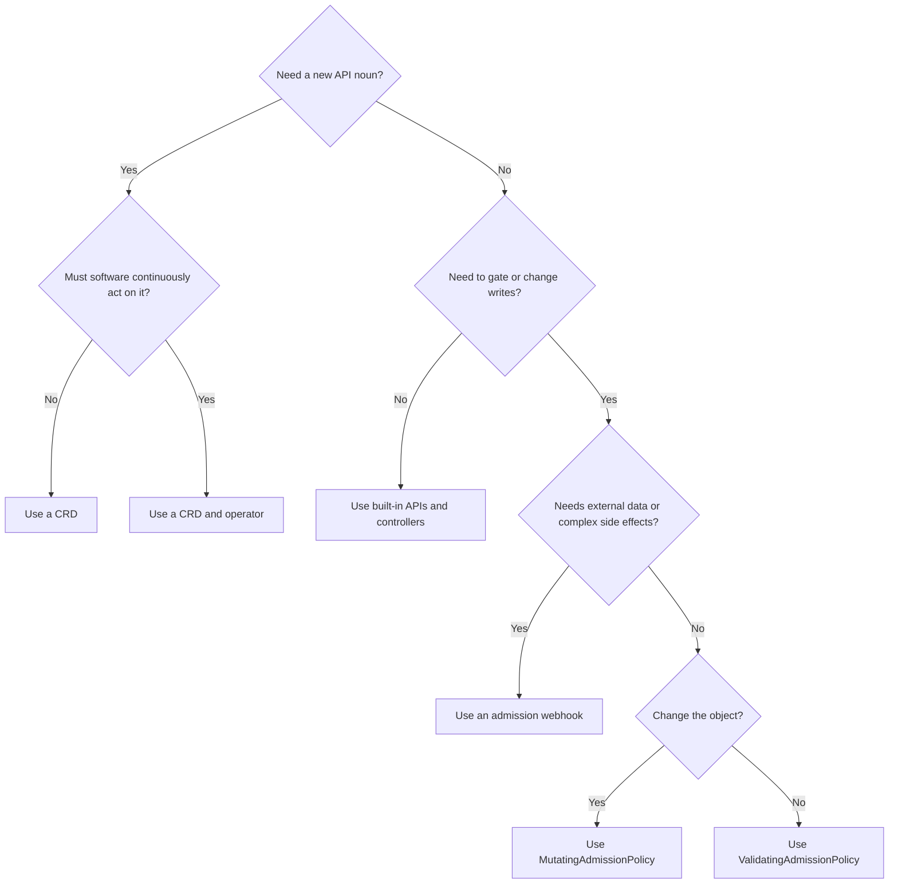

# Chapter 29 — Extending Kubernetes

> **Learning Objectives**
>
> By the end of this chapter, you will be able to:
>
> - Teach the Kubernetes API a new object type with a CustomResourceDefinition (CRD), and use it just like a built-in one
> - Explain what an operator does, and decide when writing one is worth the trouble
> - Describe how a separate API server can be plugged in behind the main one
> - Set up admission webhooks without giving your cluster a new way to break
> - Write cluster rules in CEL using **ValidatingAdmissionPolicy** and **MutatingAdmissionPolicy** (both stable in Kubernetes 1.36)
> - Pick the right tool for the job: a webhook, a built-in CEL policy, or a full operator

---

## 29.1 Opening story: the platform that grew rooms

Kubernetes arrives as a well-built apartment building. It has Pods, Deployments, Services, and Jobs. For most people that is enough.

Real platforms want more rooms. A team wants to ask for a database by writing a few lines of YAML. Another wants certificates issued the same way. Someone in finance wants tenant quotas to be a real object you can list and audit.

The Kubernetes authors expected this. Rather than making everyone fork the API server, they left doors open on purpose. These are the **extension points**, and there are four of them.

You can add new object types with CRDs. You can write controllers, called operators, that act on those objects. You can plug in a whole separate API server behind the main one. And you can add rules that inspect objects as they arrive, before anything is saved.

Kubernetes **1.36** made the last of those much easier. **MutatingAdmissionPolicy** joined **ValidatingAdmissionPolicy** as a stable feature. Both let you write rules in a small expression language that the API server runs itself. A lot of jobs that used to need a separate service running in your cluster no longer do.

---

## 29.2 CustomResourceDefinitions

### In plain terms

A **CustomResourceDefinition**, or **CRD**, teaches the Kubernetes API a new kind of object. Apply a CRD for `BackupSchedule`, and from that moment `kubectl get backupschedules` works exactly like `kubectl get pods`.

Why is that useful? Because your new object gets everything the built-in ones have, for free. It is validated against a schema, stored in etcd, protected by RBAC, versioned, watchable, and visible to `kubectl`. Writing that yourself would be a project. Writing a CRD is a YAML file.

Be clear about what it does not do. A CRD stores your object; it does not act on it. Create a `BackupSchedule` and nothing gets backed up. The CRD is the form; something still has to read the form and do the work, which is the controller in the next section.

The other thing to understand is that a CRD is a promise. Once teams write YAML against your new type, that schema is an API they depend on. Rename a field or tighten a rule and their manifests stop applying and your controller may stop working. Real APIs get new versions rather than edits, with both versions served and a conversion path between them, so nobody has to rewrite everything on your schedule. That is why "it's just YAML" is the wrong way to think about it.

> ⚠️ **Common Pitfall:** Shipping CRDs without conversion strategy when changing versions.

### Under the hood

Here is a complete CRD and what using it looks like.

Minimal CRD for a namespaced `TaskBatch` in group `tasks.example.com`:

```yaml
# crd-taskbatch.yaml
apiVersion: apiextensions.k8s.io/v1
kind: CustomResourceDefinition
metadata:
  name: taskbatches.tasks.example.com
spec:
  group: tasks.example.com
  scope: Namespaced
  names:
    plural: taskbatches
    singular: taskbatch
    kind: TaskBatch
    shortNames:
      - tb
  versions:
    - name: v1
      served: true
      storage: true
      schema:
        openAPIV3Schema:
          type: object
          properties:
            spec:
              type: object
              required: ["image", "completions"]
              properties:
                image:
                  type: string
                  minLength: 1
                completions:
                  type: integer
                  minimum: 1
                  maximum: 1000
                parallelism:
                  type: integer
                  minimum: 1
                  default: 1
            status:
              type: object
              properties:
                succeeded:
                  type: integer
                phase:
                  type: string
      subresources:
        status: {}
      additionalPrinterColumns:
        - name: Image
          type: string
          jsonPath: .spec.image
        - name: Phase
          type: string
          jsonPath: .status.phase
```

```bash
$ kubectl apply -f crd-taskbatch.yaml
customresourcedefinition.apiextensions.k8s.io/taskbatches.tasks.example.com created

$ kubectl api-resources | grep taskbatch
taskbatches   tb   tasks.example.com/v1   true   TaskBatch
```

Create an instance:

```yaml
# sample-taskbatch.yaml
apiVersion: tasks.example.com/v1
kind: TaskBatch
metadata:
  name: nightly-reports
  namespace: tasks
spec:
  image: example/task-api:1.0.0
  completions: 5
  parallelism: 2
```

```bash
$ kubectl apply -f sample-taskbatch.yaml
taskbatch.tasks.example.com/nightly-reports created

$ kubectl get tb -n tasks
NAME              IMAGE                     PHASE
nightly-reports   example/task-api:1.0.0
```

Structural schemas (OpenAPI v3 in the CRD) are required for modern CRDs. They enable validation, pruning of unknown fields (when configured), and server-side apply awareness.

Versioning tips:

- One version is marked `storage: true`.
- Serve multiple versions with conversion webhooks (or none, if you only ever serve one).
- Prefer additive schema evolution; breaking field removals need a new version and a migration story.

### In production

**Ownership:** Whoever ships the CRD owns its whole lifecycle, including versions and upgrades. App teams use only the versions that are documented.

**Failure mode:** A breaking schema change makes every controller that reads the type fail at once. Detect it through conversion and webhook errors, which spike immediately. Prevent it by serving the old version alongside the new one and deprecating in stages.

| Do | Don't |
|----|-------|
| Version and convert carefully | Delete CRDs that still have CRs |
| RBAC for new resources | Cluster-admin for every operator |

**Before you leave this section**

- **Understand:** CRDs are API contracts with upgrade and RBAC duties.
- **Try:** Inspect a CRD’s versions and stored version.
- **Watch in prod:** Breaking CRD upgrades without conversion.


---

## 29.3 The operator pattern

### In plain terms

An **operator** is a program that runs in your cluster, watches your custom objects, and does whatever it takes to make reality match them. It usually ships together with the CRDs it understands.

The point of an operator is to capture what an experienced human would do. Provision the database. Rotate its certificates before they expire. Take a backup every night. Promote a replica when the primary dies. A user writes `kind: PostgresCluster` with three replicas, and the operator handles the rest, forever, without being asked again.

This works the same way the built-in controllers do. It is a loop: look at what was asked for, look at what exists, and change what exists until the two agree. That loop is called **reconciliation**, and it never stops. Delete a Pod the operator created and it comes back, because from the operator's point of view reality just drifted.

> 💡 **In one line:** A CRD is the request form; the operator is the person who reads it and does the work, over and over.

That persistence is also the risk. An operator with a bug does not make one mistake, it makes the same mistake in a loop, as fast as the API will accept it. So privilege matters enormously here. An operator granted `cluster-admin` "just to get it working" can delete anything in the cluster, and a bad reconcile will. Give each one a ServiceAccount with permissions for exactly the resources it touches, and remember that every operator you install is one more thing that can break and needs someone on call.

> ⚠️ **Common Pitfall:** Operators running as cluster-admin “to get it working.”

### Under the hood

Here is what that loop looks like in practice.

The reconciliation loop is the same idea as built-in controllers:



*Figure 29.1: A CRD stores desired state while an operator repeatedly reconciles child resources and reports status.*

```text
Watch TaskBatch objects
        │
        ▼
Read desired spec ──► Compare to live Jobs/Pods ──► Create/Update/Delete children
        │
        ▼
Update TaskBatch.status
```

A sketch in Go-shaped pseudocode (not a full project):

```text
for each TaskBatch tb:
  ensure Job exists with Completions=tb.spec.completions
  set tb.status.succeeded = job.status.succeeded
  set tb.status.phase = "Running" or "Completed"
```

Operators commonly use:

- **controller-runtime** / Operator SDK / Kubebuilder scaffolding
- **ownerReferences** so garbage collection deletes children when the CR goes away
- finalizers for cleanup that must happen before the API object disappears
- RBAC limited to the resources the operator truly needs

```yaml
# Example ownerReference on a child Job (set by the operator)
apiVersion: batch/v1
kind: Job
metadata:
  name: nightly-reports-batch
  namespace: tasks
  ownerReferences:
    - apiVersion: tasks.example.com/v1
      kind: TaskBatch
      name: nightly-reports
      uid: 4f2a9c1e-8b3d-4e2a-9f1c-123456789abc
      controller: true
      blockOwnerDeletion: true
spec:
  completions: 5
  parallelism: 2
  template:
    spec:
      restartPolicy: Never
      containers:
        - name: worker
          image: example/task-api:1.0.0
```

### In production

**Ownership:** The platform team approves every operator before it is installed. Whoever owns an operator is on call for it.

**Failure mode:** A reconcile loop goes wrong and makes the same change over and over across the cluster. Detect it with leader-election metrics and by auditing what the operator's ServiceAccount is actually doing. Contain it with Roles that grant only what the operator needs and rate limits on its actions.

| Do | Don't |
|----|-------|
| Least-privilege operator SA | cluster-admin operators |
| On-call + runbook per operator | Install operators without upgrade plan |

**Before you leave this section**

- **Understand:** Operators are controllers with blast radius—privilege and on-call required.
- **Try:** Map one operator’s SA and Role rules.
- **Watch in prod:** Over-privileged operators.


---

## 29.4 API aggregation layer

### In plain terms

The **aggregation layer** lets you run your own separate API server and hide it behind the main one. Clients keep talking to `kube-apiserver` as usual, and it quietly forwards requests for certain API groups to your server.

Compare that with a CRD. A CRD adds new types inside the existing API server, and those objects are stored in etcd like everything else. Aggregation gives you a different program entirely, with its own code and its own storage, that merely looks like part of the Kubernetes API from outside.

You need that in a small number of cases: when the data should not live in etcd, when you need query behavior CRDs cannot express, or when the data is computed on demand rather than stored. The best-known example is **metrics-server**, which serves live CPU and memory readings. Storing those in etcd would be absurd, so it does not.

For almost everything else, a CRD with a controller is the right answer, and it is far less work. Aggregation means you now run an API server: it needs high availability, certificates, and monitoring, and when it is down, every request for its API group fails. Reach for it only when a CRD genuinely cannot do the job.

> ⚠️ **Common Pitfall:** Choosing aggregation when a CRD+controller would do.

### Under the hood

Here is how the registration and the request path work.

You register an `APIService` that maps a group-version to a Service running your extension server:



*Figure 29.2: The aggregation layer keeps kube-apiserver as the front door while proxying selected API groups to an extension server.*

```yaml
apiVersion: apiregistration.k8s.io/v1
kind: APIService
metadata:
  name: v1beta1.metrics.k8s.io
spec:
  service:
    name: metrics-server
    namespace: kube-system
    port: 443
  group: metrics.k8s.io
  version: v1beta1
  insecureSkipTLSVerify: false
  groupPriorityMinimum: 100
  versionPriority: 100
  caBundle: LS0tLS1CRUdJTi...   # PEM CA bundle, base64-encoded
```

Flow:

```text
kubectl get --raw /apis/metrics.k8s.io/v1beta1/nodes
        │
        ▼
kube-apiserver (aggregation) ──proxy──► metrics-server Service
```

The **metrics-server** is the classic in-tree-ecosystem example. Custom aggregated APIs appear when CRD storage semantics are not enough (specialized query APIs, different persistence, or protocol needs).

Front-proxy certificates (chapter 28’s `front-proxy-ca`) authenticate the apiserver to the extension server so the extension can trust the identity of the original user via impersonation headers.

### In production

**Ownership:** The platform team owns keeping aggregated API servers highly available and wiring up their authentication.

**Failure mode:** The extension server goes down and every request for its resources fails, even though the main API is fine. Detect it by monitoring the availability of each `APIService`. Reduce it by running the extension server with more than one replica and writing down what depends on it.

| Do | Don't |
|----|-------|
| Prefer CRDs unless you need aggregation | Snowflake extension API without HA |
| Monitor APIServices | Ignore TLS/authn for extension servers |

**Before you leave this section**

- **Understand:** Aggregation is specialized; CRDs cover most extension needs.
- **Try:** List APIServices and note unavailable ones.
- **Watch in prod:** Unavailable aggregated APIs.


---

## 29.5 Admission webhooks

### In plain terms

An **admission webhook** is a service of yours that the API server calls in the middle of handling a request, after it has checked who you are and what you may do, but before it saves anything. Your service can **mutate** the object, meaning change it, or **validate** it, meaning allow or reject it.

This is how a cluster enforces house rules. Every Deployment must have an owner label. No image may come from an unapproved registry. Every Pod gets a sidecar injected. The rule lives in your code, and the API server asks before letting anything in.

The catch is easy to miss. Your webhook is now on the critical path for every matching request. The setting `failurePolicy` decides what happens when it cannot be reached. With `Ignore`, the request proceeds unchecked, and your rule silently stops applying. With `Fail`, the request is rejected, which is safe from a policy point of view and means an outage of your little service becomes an outage of the Kubernetes API for those resources.

Neither answer is free, so treat webhooks as production services. Run more than one replica, keep the timeout short, and scope the match rules narrowly so a failure cannot block the whole cluster. Above all, never let a webhook match the namespace it runs in, or a restart can leave you unable to fix it.

> ⚠️ **Common Pitfall:** `failurePolicy: Fail` without HA webhooks on critical resources.

### Under the hood

Here are the two configuration kinds and how a request flows through them.

Two configuration kinds:

| Kind | Role |
|------|------|
| `MutatingWebhookConfiguration` | Can change the object (patches) |
| `ValidatingWebhookConfiguration` | Can only accept or reject |

```yaml
# validating-webhook-config.yaml
apiVersion: admissionregistration.k8s.io/v1
kind: ValidatingWebhookConfiguration
metadata:
  name: taskbatch-policy
webhooks:
  - name: validate.taskbatches.tasks.example.com
    admissionReviewVersions: ["v1"]
    sideEffects: None
    timeoutSeconds: 5
    failurePolicy: Fail
    clientConfig:
      service:
        namespace: platform-system
        name: taskbatch-webhook
        path: /validate-taskbatch
        port: 443
      caBundle: LS0tLS1CRUdJTi...
    rules:
      - apiGroups: ["tasks.example.com"]
        apiVersions: ["v1"]
        operations: ["CREATE", "UPDATE"]
        resources: ["taskbatches"]
        scope: Namespaced
```

Request/response use `AdmissionReview` objects. Your service must present a certificate trusted via `caBundle`.

Ordering and risk:

- Mutating webhooks run before validating webhooks.
- `failurePolicy: Ignore` fails open (availability over safety); `Fail` fails closed (safety over availability).
- Long timeouts stall **every** matching API call cluster-wide.

### In production

**Ownership:** The platform team owns webhook availability and the `failurePolicy` setting. The policy team owns the rules the webhook enforces.

**Failure mode:** The webhook goes down and creates and updates fail cluster-wide for every resource it matches. Detect it by watching webhook latency and error rates alongside API server error rates. Reduce it with multiple replicas, short timeouts, and namespace selectors that keep the blast radius small.

> 🏭 **Production floor:** A single-replica validating webhook with `failurePolicy: Fail` on Pods is a cluster-wide outage waiting to happen. Treat webhook HA like control-plane HA.

| Do | Don't |
|----|-------|
| HA webhooks + sensible failurePolicy | Single-replica Fail webhooks on Pods |
| Exclude kube-system carefully | Mutate without SSA awareness |

**Before you leave this section**

- **Understand:** Webhooks are on the admit path—HA and failurePolicy are safety.
- **Try:** Inspect a validating webhook’s failurePolicy and namespaceSelector.
- **Watch in prod:** Admit outages from Fail + down webhooks.


---

## 29.6 ValidatingAdmissionPolicy and CEL (stable)

### In plain terms

A **ValidatingAdmissionPolicy** is a rule you write as a short expression, which the API server evaluates itself. It does the same job as a validating webhook, without any service of yours running anywhere.

The expressions are written in **CEL**, the Common Expression Language, a small read-only language built for exactly this: look at an object and return true or false. A rule like "every Pod must set `runAsNonRoot`" is one line of CEL.

Why prefer this over a webhook? Because it deletes an entire production dependency. No Deployment to keep running, no certificates to rotate, no timeout to tune, no pager at 3 a.m. because the policy service crashed and now nobody can create a Pod. The rule lives in the API server, so if the API server is up, the rule works.

CEL does not replace webhooks entirely. It can only inspect the object in front of it: no database lookups, no external calls, no side effects. Anything needing outside information still needs a webhook or an operator. But a large share of real-world rules are simple checks, and those belong here.

Roll new policies out gently. A binding can be set to `Warn` or `Audit` before `Deny`, so you can see what a rule would have rejected before it starts rejecting. A policy that denies broadly on day one will break deployments nobody expected it to touch.

> ⚠️ **Common Pitfall:** Policies that deny broadly without warn/dry-run rollout.

### Under the hood

Here are the two objects involved and some working examples.

ValidatingAdmissionPolicy has been stable since Kubernetes 1.30 and remains the validation half of the CEL admission story on 1.36. You typically create:

1. `ValidatingAdmissionPolicy` — the logic
2. `ValidatingAdmissionPolicyBinding` — where it applies (and optional params)

```yaml
# vap-require-app-label.yaml
apiVersion: admissionregistration.k8s.io/v1
kind: ValidatingAdmissionPolicy
metadata:
  name: require-app-label
spec:
  failurePolicy: Fail
  matchConstraints:
    resourceRules:
      - apiGroups: ["apps"]
        apiVersions: ["v1"]
        operations: ["CREATE", "UPDATE"]
        resources: ["deployments"]
  validations:
    - expression: "has(object.metadata.labels) && has(object.metadata.labels.app)"
      message: "Deployments must carry an 'app' label"
      reason: Invalid
---
apiVersion: admissionregistration.k8s.io/v1
kind: ValidatingAdmissionPolicyBinding
metadata:
  name: require-app-label-binding
spec:
  policyName: require-app-label
  validationActions: ["Deny"]
  matchResources:
    namespaceSelector:
      matchLabels:
        policy.example.com/enforce: "true"
```

```bash
$ kubectl apply -f vap-require-app-label.yaml
validatingadmissionpolicy.admissionregistration.k8s.io/require-app-label created
validatingadmissionpolicybinding.admissionregistration.k8s.io/require-app-label-binding created
```

CEL sees variables such as `object`, `oldObject`, `request`, `params`, `namespaceObject`, and `authorizer`. Example requiring resource requests:

```yaml
validations:
  - expression: >
      object.spec.template.spec.containers.all(c,
        has(c.resources) && has(c.resources.requests) &&
        has(c.resources.requests.memory) && has(c.resources.requests.cpu))
    message: "All containers must set cpu and memory requests"
```

`validationActions` may include `Deny`, `Warn`, and `Audit`—useful for rolling out policy without a big-bang outage.

### In production

**Ownership:** The platform team owns turning the policy engine on. The security team owns the rules themselves and how they are rolled out.

**Failure mode:** One bad policy rejects a huge number of valid requests at once. Detect it with metrics on denials and with the audit annotations policies leave behind. Prevent it by shipping every policy as `Warn` first, then enforcing, and by matching a few namespaces before the whole cluster.

| Do | Don't |
|----|-------|
| warn/audit before enforce | Enforce global denies on day one |
| Test CEL against sample objects | Unowned policies nobody can revert |

**Before you leave this section**

- **Understand:** CEL ValidatingAdmissionPolicy is in-process validation with staged rollout.
- **Try:** Read one ValidatingAdmissionPolicy and its bindings.
- **Watch in prod:** Sudden mass denies from new policies.


---

## 29.7 MutatingAdmissionPolicy (GA in 1.36)

### In plain terms

A **MutatingAdmissionPolicy** changes an object on its way into the cluster, using CEL, with no webhook server involved. It is the other half of the pair: if ValidatingAdmissionPolicy is the bouncer who turns people away, this is the stylist who quietly clips on the missing badge as they walk in.

As of Kubernetes **1.36** it is generally available in `admissionregistration.k8s.io/v1` and on by default. That matters because setting defaults used to be the most common reason teams ran a mutating webhook, and now most of those can be a few lines of policy instead.

Typical uses are small and repetitive: stamp a `managed-by` label on everything, add a default security context, set an imagePullPolicy nobody remembers to set. Things you want to be true everywhere and do not want to ask every team to type.

There is one real hazard, and it is about ownership rather than syntax. If Helm sets a field, the developer's manifest sets it, and a policy also sets it, they take turns overwriting each other. Server-side apply tracks who owns which field, and it will report conflicts when two managers claim the same one. So decide in advance which fields belong to policy and which belong to the user, write it down, and roll mutations out in stages so you can see the conflicts before everyone else does.

> ⚠️ **Common Pitfall:** Mutating the same fields from Helm, SSA, and policies without a field-owner story.

### Under the hood

Here are the pieces and a worked example.

Core pieces:

| Resource | Role |
|----------|------|
| `MutatingAdmissionPolicy` | Mutation logic (CEL apply configuration or JSON patch) |
| `MutatingAdmissionPolicyBinding` | Activates and scopes the policy |
| Optional parameter CR / ConfigMap | Makes the policy reusable with different values |

Label injection example:

```yaml
# map-add-managed-by.yaml
apiVersion: admissionregistration.k8s.io/v1
kind: MutatingAdmissionPolicy
metadata:
  name: add-managed-by-label
spec:
  failurePolicy: Fail
  reinvocationPolicy: IfNeeded
  matchConstraints:
    resourceRules:
      - apiGroups: [""]
        apiVersions: ["v1"]
        operations: ["CREATE"]
        resources: ["pods"]
  mutations:
    - patchType: ApplyConfiguration
      applyConfiguration:
        expression: >
          Object{
            metadata: Object.metadata{
              labels: {"managed-by": "cel-policy"}
            }
          }
---
apiVersion: admissionregistration.k8s.io/v1
kind: MutatingAdmissionPolicyBinding
metadata:
  name: add-managed-by-label-binding
spec:
  policyName: add-managed-by-label
```

```bash
$ kubectl apply -f map-add-managed-by.yaml
mutatingadmissionpolicy.admissionregistration.k8s.io/add-managed-by-label created
mutatingadmissionpolicybinding.admissionregistration.k8s.io/add-managed-by-label-binding created

$ kubectl run demo --image=nginx:1.27 -n tasks
pod/demo created

$ kubectl get pod demo -n tasks -o jsonpath='{.metadata.labels.managed-by}{"\n"}'
cel-policy
```

**ApplyConfiguration** mutations merge with server-side apply semantics—safer for additive fields. **JSONPatch** mutations are available when you need explicit list operations. Match conditions can skip work:

```yaml
matchConditions:
  - name: missing-managed-by
    expression: '!has(object.metadata.labels) || !("managed-by" in object.metadata.labels)'
```

Sidecar-style mutation (init container) pattern from the official docs shape:

```yaml
mutations:
  - patchType: ApplyConfiguration
    applyConfiguration:
      expression: >
        Object{
          spec: Object.spec{
            initContainers: [
              Object.spec.initContainers{
                name: "mesh-proxy",
                image: "mesh/proxy:v1.0.0",
                args: ["proxy", "sidecar"],
                restartPolicy: "Always"
              }
            ]
          }
        }
```

Use match conditions so you do not stack duplicate sidecars on every update. Policies and bindings that configure admission are exempt from being mutated by MutatingAdmissionPolicy via the REST API path—guards against unrecoverable self-modification loops.

### In production

**Ownership:** The platform team owns rolling out mutation policies, and writes down which fields belong to policy versus to the teams applying manifests.

**Failure mode:** Two managers claim the same field and every apply turns into a conflict error. Detect it with server-side apply conflict metrics. Prevent it by naming one owner per field and enabling new mutations in stages.

| Do | Don't |
|----|-------|
| Document who owns mutated fields | Silent mutations in prod without warn |
| GA features still need soak | Mutate secrets into plaintext env carelessly |

**Before you leave this section**

- **Understand:** MutatingAdmissionPolicy (GA 1.36) needs field-ownership discipline.
- **Try:** Compare a mutation policy to your SSA field managers.
- **Watch in prod:** Apply conflicts after mutation policies ship.


---

## 29.8 Choosing an extension mechanism

| Need | Prefer |
|------|--------|
| New declarative API noun + stored objects | CRD |
| Continuously act on those objects | Operator / controller |
| Non-CRD API semantics or separate storage | Aggregated API server |
| Reject bad objects with local logic | ValidatingAdmissionPolicy (CEL) |
| Default/inject fields with local logic | MutatingAdmissionPolicy (CEL, GA 1.36) |
| Admission that calls inventory/DB/IdP | Admission webhook |
| Package CRDs + controller + RBAC for others | Operator + Helm/OLM-style distribution |

Admission choices differ operationally as well as functionally:

| Mechanism | Mutates | Validates | External lookup | Extra service | Best fit |
|---|---:|---:|---:|---:|---|
| ValidatingAdmissionPolicy | No | Yes | No | No | Local CEL validation |
| MutatingAdmissionPolicy | Yes | Indirectly with paired validation | No | No | Local defaulting or injection |
| Validating webhook | No | Yes | Yes | Yes | External or complex decisions |
| Mutating webhook | Yes | Often paired with validation | Yes | Yes | Complex mutation needing external context |



*Figure 29.3: Choose CRDs and operators for new declarative APIs, and choose CEL policies or webhooks for admission-time decisions.*

---

## 29.9 Common pitfalls

> ⚠️ **Common Pitfall:** Publishing a CRD without a controller and wondering why nothing happens. The API will store objects happily forever; reconciliation is your job.

> ⚠️ **Common Pitfall:** Conversion webhook or admission webhook downtime blocking upgrades and CRD changes. Budget HA for anything on the request path.

> ⚠️ **Common Pitfall:** CEL policies that assume fields always exist. Use `has()` and safe navigation patterns; test CREATE and UPDATE separately.

> ⚠️ **Common Pitfall:** Mutating the same list with ApplyConfiguration incorrectly and wiping sibling elements. Know SSA merge rules; use JSONPatch when you must append carefully.

> ⚠️ **Common Pitfall:** Granting operators `cluster-admin`. Scope RBAC to the CRDs and child resources they manage.

---

## 29.10 Hands-on exercises

1. Apply the `TaskBatch` CRD from this chapter, create an instance, and inspect it with `kubectl get tb -o yaml`. Confirm no Jobs exist until a controller creates them.
2. Write a ValidatingAdmissionPolicy that denies Deployments missing `spec.template.spec.containers[*].resources.requests.cpu` in a labeled namespace. Prove Warn vs Deny behavior.
3. Add a MutatingAdmissionPolicy that sets `metadata.labels.managed-by=cel-policy` on Pod CREATE. Show the label appearing without any webhook Pod running.
4. Inspect `kubectl get apiservices` on your cluster and identify which groups are `Local` versus backed by a Service.
5. (Stretch) Scaffold a tiny controller with Kubebuilder or Operator SDK that creates a Job per TaskBatch and updates status.

---

## 29.11 Check Your Understanding

**Q1.** Does creating a CRD automatically enforce business logic like “create five Jobs”?

<details>
<summary>Show answer</summary>

No. A CRD only registers the API type and schema. A controller or operator must watch instances and reconcile dependent objects.
</details>

**Q2.** What problem does the aggregation layer solve that CRDs do not?

<details>
<summary>Show answer</summary>

It lets a separate extension API server serve an API group behind kube-apiserver—useful for custom storage, protocols, or implementations that do not fit CRD etcd storage.
</details>

**Q3.** What became GA in Kubernetes 1.36 for admission?

<details>
<summary>Show answer</summary>

MutatingAdmissionPolicy (and its binding) graduated to stable `admissionregistration.k8s.io/v1`, enabling CEL-based in-process mutations without a mutating webhook service.
</details>

**Q4.** When would you still use a validating admission webhook instead of ValidatingAdmissionPolicy?

<details>
<summary>Show answer</summary>

When validation needs external data, proprietary engines, or logic that CEL in-process cannot express cleanly—or when you are not yet ready to migrate an existing webhook investment.
</details>

**Q5.** Why are `failurePolicy` and webhook timeouts operationally critical?

<details>
<summary>Show answer</summary>

They determine whether API requests fail closed or open when the webhook is down or slow, and slow webhooks stall the apiserver’s admission path for every matching request.
</details>

---

## 29.12 Key takeaways

- A **CRD** adds a new kind of object. An **operator** is what actually does something about it.
- A CRD with no controller stores your YAML and nothing else happens. That is expected, not a bug.
- Your CRD schema is an API other people depend on. Add versions; do not edit fields in place.
- Use the **aggregation layer** only when a CRD truly cannot store or serve what you need.
- An **admission webhook** puts your service on the critical path. Run it with replicas and scope it narrowly.
- **ValidatingAdmissionPolicy** and **MutatingAdmissionPolicy** run CEL rules inside the API server, with no service to operate.
- Ship every new policy as `Warn` before `Deny`, and to a few namespaces before all of them.
- Choose the **smallest extension** that solves the problem. Most platform problems do not need a new service.

---

## 29.13 Official documentation map

| Topic | Official page |
|-------|---------------|
| Custom Resources | [Custom Resources](https://kubernetes.io/docs/concepts/extend-kubernetes/api-extension/custom-resources/) |
| Extend the API with CRDs | [Extend the Kubernetes API with CustomResourceDefinitions](https://kubernetes.io/docs/tasks/extend-kubernetes/custom-resources/custom-resource-definitions/) |
| Operator pattern | [Operator pattern](https://kubernetes.io/docs/concepts/extend-kubernetes/operator/) |
| API aggregation | [Configure the aggregation layer](https://kubernetes.io/docs/tasks/extend-kubernetes/configure-aggregation-layer/) |
| Dynamic admission | [Dynamic Admission Control](https://kubernetes.io/docs/reference/access-authn-authz/extensible-admission-controllers/) |
| ValidatingAdmissionPolicy | [Validating Admission Policy](https://kubernetes.io/docs/reference/access-authn-authz/validating-admission-policy/) |
| MutatingAdmissionPolicy | [Mutating Admission Policy](https://kubernetes.io/docs/reference/access-authn-authz/mutating-admission-policy/) |
| CEL in Kubernetes | [Common Expression Language in Kubernetes](https://kubernetes.io/docs/reference/using-api/cel/) |

**Previous:** [Chapter 28 — Cluster Lifecycle with kubeadm](28-cluster-lifecycle-kubeadm.md) | **Next:** [Chapter 30 — Advanced Object Management](30-object-management-advanced.md)
