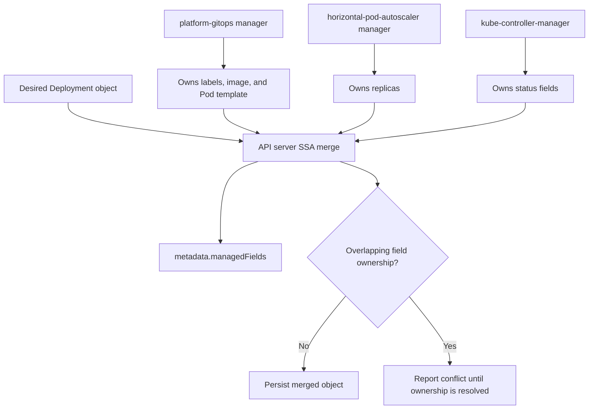
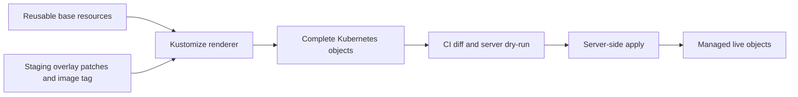
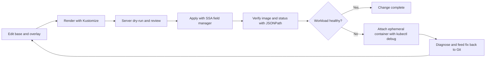

# Chapter 30 — Advanced Object Management

> **Learning Objectives**
>
> By the end of this chapter, you will be able to:
>
> - Use **server-side apply**, and work out who owns a field when two tools fight over it
> - Keep one set of manifests and adjust it per environment with **Kustomize**
> - Pull exactly the field you want out of an object with **JSONPath**
> - Explain what **KYAML** fixes about YAML, and print objects with `-o kyaml`
> - Set your own kubectl defaults and aliases in **kuberc**, separate from your cluster credentials
> - Get a shell and real tools inside a running Pod using **kubectl debug**

---

## 30.1 Opening story: many hands on one document

Think of a Kubernetes object as a document that several people edit at once. That is not a metaphor. It is literally what happens.

The platform team stamps standard labels onto it. A GitOps controller keeps pulling it back toward whatever is in Git. An autoscaler rewrites the replica count every few minutes. And at two in the morning, someone runs `kubectl edit` to fix an incident.

Without rules, the last writer wins. Someone's change quietly disappears, and nobody can say when or why. If you have ever watched a replica count snap back to three for no apparent reason, you have met this problem.

This chapter is about writing to objects on purpose. You will see how the API server tracks who owns each field, how to keep one set of manifests that adapts per environment, how to pull single values out of objects for scripts, a safer way to write YAML, how to set your own kubectl defaults, and how to debug a container that has no shell in it.

---

## 30.2 Server-side apply and field managers

### In plain terms

**Server-side apply**, usually shortened to **SSA**, means the API server does the merging and remembers who set each field. The name attached to each writer is called a **field manager**.

To see why that matters, look at what came before. The old client-side apply worked out the merge on your machine and sent the whole result. The server had no idea which parts you actually cared about and which were just there. If your file happened to include a replica count and an autoscaler had changed it, your apply put it back, and nobody was told.

With SSA the server keeps a record: this manager owns the image, that one owns the replicas, the controller owns status. When you try to change a field somebody else owns, you get a conflict error rather than a silent overwrite.

> 💡 **In one line:** Server-side apply remembers who set each field, so a conflict is an error instead of a surprise.

Treat those conflicts as information, not as an obstacle. A conflict is the cluster telling you two things are trying to control one value, which is a real problem you would otherwise discover much later. You have two honest fixes. Remove the field from your manifest if it genuinely belongs to something else, such as replicas belonging to the autoscaler. Or take ownership deliberately with `--force-conflicts`, knowing what you are overriding.

The trap is mixing styles. Client-side apply, server-side apply, Helm, and `kubectl edit` all leave different ownership footprints on the same object. When a value keeps resetting and nobody admits to changing it, read `metadata.managedFields` on the object. It names the culprit.

> ⚠️ **Common Pitfall:** Mixing client-side apply, SSA, and helm without understanding field managers—mystery resets.

### Under the hood

Here is how to use it and where that ownership record lives.

Enable SSA on apply (default for recent kubectl in many flows; be explicit in scripts):

```bash
$ kubectl apply --server-side -f task-api-deploy.yaml
deployment.apps/task-api serverside-applied
```

Inspect managed fields:

```bash
$ kubectl get deploy task-api -n tasks -o yaml
```

Relevant excerpt:

```yaml
metadata:
  name: task-api
  namespace: tasks
  managedFields:
    - manager: kubectl
      operation: Apply
      apiVersion: apps/v1
      fieldsType: FieldsV1
      fieldsV1:
        f:metadata:
          f:labels:
            f:app: {}
        f:spec:
          f:replicas: {}
          f:template:
            f:spec:
              f:containers: {}
    - manager: kube-controller-manager
      operation: Update
      apiVersion: apps/v1
      fieldsType: FieldsV1
      fieldsV1:
        f:status:
          f:availableReplicas: {}
```

Status is owned by controllers; spec fields you applied are owned by your manager name (often `kubectl` or a custom `--field-manager`).



*Figure 30.1: Server-side apply records field-level ownership so GitOps, autoscalers, and controllers can share an object without silent overwrites.*

Force ownership when you intentionally take over a field:

```bash
$ kubectl apply --server-side --field-manager=platform-gitops --force-conflicts -f task-api-deploy.yaml
```

Dry-run against the live API:

```bash
$ kubectl apply --server-side --dry-run=server -f task-api-deploy.yaml -o yaml
```

Compare with a strategic merge patch from an imperative change:

```bash
$ kubectl scale deploy/task-api -n tasks --replicas=3
```

After scaling, `replicas` may be owned by `kubectl-scale` (or similar). The next SSA apply that also sets `replicas` can conflict until you drop the field from your manifest (let HPA/scale own it) or force the manager.

### In production

**Ownership:** The platform team sets the apply conventions. Every piece of automation applies under its own named field manager, never the default.

**Failure mode:** Field conflicts break applies, or worse, silent overwrites undo changes nobody notices. Detect them from conflict errors surfacing in CI/CD rather than in production. Prevent them by using server-side apply everywhere with an explicit `--field-manager=...`.

| Do | Don't |
|----|-------|
| Named field managers per tool | Force overwrite as daily habit |
| Inspect managedFields in incidents | Three tools editing the same fields |

**Before you leave this section**

- **Understand:** SSA field managers make ownership explicit—use them in prod apply paths.
- **Try:** Inspect `managedFields` on a Deployment after an apply.
- **Watch in prod:** Apply wars between CI and operators.

> 🏭 **Production floor:** **SSA field managers** are change-safety evidence. Standardize `--field-manager` names (`helm`, `flux`, `kubectl-ci`). On conflicts: `kubectl get <obj> -o yaml` → read managedFields → decide owner in the ticket—do not `--force-conflicts` without naming who loses.


---

## 30.3 Kustomize

### In plain terms

**Kustomize** lets you keep one set of manifests, called the **base**, and describe each environment as a small list of changes on top, called an **overlay**. It is built into kubectl, so `kubectl -k` just works.

The problem it solves shows up fast. You have a Deployment that works in staging, and production needs four replicas instead of one, a different image tag, and an extra label. The tempting move is to copy the whole folder and edit it. Do that three times and you have four copies of the same YAML that quietly drift apart, and a security fix has to be made in all of them.

An overlay avoids the copy. Production says "same as base, but replicas is four," and nothing else. The difference between environments becomes something you can read in a few lines, which is exactly what you want in a review.

Kustomize is not templating and it is not a replacement for Helm. It patches plain YAML with no variables or loops, and there is no package to install or version. Helm packages and distributes an app; Kustomize adapts manifests you already own. Plenty of teams use both, rendering a Helm chart and then patching the output.

One caution about the shared base. A change there reaches every environment at once, which is the feature and the danger. Render every overlay in CI and show the diff in the pull request, so a one-line base edit cannot surprise production.

> ⚠️ **Common Pitfall:** Edits in base that surprise every overlay environment.

### Under the hood

Here is a full layout with a base and two overlays.

Directory layout:

```text
task-api/
  base/
    kustomization.yaml
    deployment.yaml
    service.yaml
  overlays/
    staging/
      kustomization.yaml
      replicas.yaml
    production/
      kustomization.yaml
      replicas.yaml
```

Base:

```yaml
# task-api/base/kustomization.yaml
apiVersion: kustomize.config.k8s.io/v1beta1
kind: Kustomization
resources:
  - deployment.yaml
  - service.yaml
commonLabels:
  app: task-api
```

```yaml
# task-api/base/deployment.yaml
apiVersion: apps/v1
kind: Deployment
metadata:
  name: task-api
spec:
  replicas: 1
  selector:
    matchLabels:
      app: task-api
  template:
    metadata:
      labels:
        app: task-api
    spec:
      containers:
        - name: api
          image: example/task-api:1.0.0
          ports:
            - containerPort: 8080
```

```yaml
# task-api/base/service.yaml
apiVersion: v1
kind: Service
metadata:
  name: task-api
spec:
  selector:
    app: task-api
  ports:
    - port: 80
      targetPort: 8080
```

Staging overlay:

```yaml
# task-api/overlays/staging/kustomization.yaml
apiVersion: kustomize.config.k8s.io/v1beta1
kind: Kustomization
namespace: tasks-staging
resources:
  - ../../base
images:
  - name: example/task-api
    newTag: "1.0.0-rc2"
patches:
  - path: replicas.yaml
```

```yaml
# task-api/overlays/staging/replicas.yaml
apiVersion: apps/v1
kind: Deployment
metadata:
  name: task-api
spec:
  replicas: 2
```

```bash
$ kubectl kustomize task-api/overlays/staging
# renders complete YAML to stdout

$ kubectl apply -k task-api/overlays/staging
namespace/tasks-staging configured
deployment.apps/task-api configured
service/task-api configured
```



*Figure 30.2: Kustomize combines a reusable base with environment overlays before review and server-side apply.*

Useful Kustomize features for day-two ops:

| Feature | Use |
|---------|-----|
| `images` | Retag without editing Deployment files |
| `configMapGenerator` / `secretGenerator` | Build ConfigMaps/Secrets with content hashes |
| `patches` / strategic merge / JSON6902 | Targeted overlays |
| `replacements` | Copy a value from one object to another |
| `components` | Reusable snippets across overlays |

### In production

**Ownership:** App teams own their overlays. The platform team may supply patches in the base that enforce guardrails.

**Failure mode:** One bad change in the base breaks every environment at the same time. Detect it by rendering the manifests and showing the diff in the pull request. Prevent it by running `kustomize build` for every overlay in CI and comparing against the previous output.

| Do | Don't |
|----|-------|
| PR diffs of rendered overlays | Hand-edit live and ignore overlays |
| Keep secrets out of bases | One mega-overlay for all clusters |

**Before you leave this section**

- **Understand:** Kustomize overlays need rendered diffs in CI.
- **Try:** Build two overlays and diff them.
- **Watch in prod:** Base changes breaking all environments.


---

## 30.4 JSONPath queries

### In plain terms

**JSONPath** is a small query language for pulling specific fields out of API objects. You tell kubectl the path to what you want, and it prints just that: the image names, the node IPs, the Pod phases.

The reason to learn it is the alternative. Without it, scripts end up running `kubectl get pods` and slicing the output with `awk`, counting columns. That table is designed for humans to read, which means it can gain a column or change its width in any release, and your script breaks. It usually breaks during an incident, because that is when you run it.

JSONPath reads the object itself instead of the printed table. `.status.podIP` is part of the API and does not move. A query written today still works after the next upgrade.

It is best at one-liners and CI checks. For anything with real logic, `-o json` piped into `jq` is easier to read and easier to test. Whichever you choose, test the query somewhere other than the incident, and stick to fields that are actually part of the API rather than something you noticed in the output once.

> ⚠️ **Common Pitfall:** Parsing `kubectl` columnar output in production scripts.

### Under the hood

Here are the patterns worth memorizing.

```bash
$ kubectl get pods -n tasks -o jsonpath='{range .items[*]}{.metadata.name}{"\t"}{.status.phase}{"\n"}{end}'
task-api-7d9c4f6b8-abcd1	Running
task-api-7d9c4f6b8-efgh2	Running

$ kubectl get deploy task-api -n tasks -o jsonpath='{.spec.template.spec.containers[*].image}{"\n"}'
example/task-api:1.0.0

$ kubectl get nodes -o jsonpath='{range .items[*]}{.metadata.name}{"\t"}{.status.addresses[?(@.type=="InternalIP")].address}{"\n"}{end}'
cp-1	192.168.10.11
wk-1	192.168.10.21
```

From a file:

```bash
$ kubectl get pods -n tasks -o jsonpath-file=pod-names.jsonpath
```

```gotemplate
# pod-names.jsonpath
{range .items[*]}{.metadata.name}{"\n"}{end}
```

Custom columns (cousin of JSONPath) for tables:

```bash
$ kubectl get pods -n tasks -o custom-columns=NAME:.metadata.name,NODE:.spec.nodeName,IP:.status.podIP
NAME                         NODE   IP
task-api-7d9c4f6b8-abcd1     wk-1   10.244.1.15
task-api-7d9c4f6b8-efgh2     wk-2   10.244.2.18
```

Common gotchas:

- Use spaces carefully inside expressions; quote the whole jsonpath for the shell.
- `range` / `end` pairs iterate lists.
- Filters like `?(@.type=="InternalIP")` narrow arrays.
- For complex scripting, `-o json` plus `jq` may be clearer—JSONPath shines for one-liners and CI checks.

### In production

**Ownership:** Anyone writing automation owns making their queries durable. The platform team publishes snippets everyone can reuse.

**Failure mode:** A script breaks in the middle of an incident because the output it parsed changed. Detect it by running the queries in CI, not by finding out at 3 a.m. Prevent it by querying objects with JSONPath or go-templates and testing them against saved sample objects.

| Do | Don't |
|----|-------|
| JSONPath/go-template in scripts | Parse table output |
| Test queries in CI | Undocumented one-liners as SoT |

**Before you leave this section**

- **Understand:** JSONPath is for stable automation and triage.
- **Try:** Write a JSONPath that lists image digests for a Deployment.
- **Watch in prod:** Scripts parsing kubectl tables.


---

## 30.5 KYAML overview

### In plain terms

**KYAML** is a stricter way of writing YAML for Kubernetes: braces and brackets instead of significant indentation, and every string in quotes. It is still valid YAML, so any parser reads it.

It exists because plain YAML guesses at types, and its guesses are sometimes wrong in ways that cost you an afternoon. The famous one is the Norway problem: the country code `NO` is read as the boolean `false` unless you quote it. `1.10` becomes the number `1.1`, which is a fun way to deploy the wrong version. And a single mis-indented line can move a field into the wrong block while remaining perfectly valid.

Quoting everything removes the guessing. Using explicit braces removes the indentation risk. The file is uglier and much harder to get subtly wrong, which is a good trade for something that configures production.

Two things to be clear about. This changes nothing about the cluster or the API; it is purely how you write and print the file. And support depends on your tooling: KYAML arrived as an alpha kubectl output format in 1.34 and is available as `-o kyaml` on 1.36. Check what your editors, linters, and CI actually handle before you make it a team standard.

> ⚠️ **Common Pitfall:** Mandating KYAML fleet-wide before toolchain support is even.

### Under the hood

Here is what it looks like and how to produce it.

KYAML was introduced as an alpha kubectl output format in 1.34, moved forward in 1.35, and remains available on the 1.36 toolchain as `-o kyaml` (beta in the kubectl output table). Input-wise, KYAML documents are valid YAML, so older servers still accept them when you `kubectl apply -f`.

Example shape:

```yaml
---
{
  apiVersion: "v1",
  kind: "Pod",
  metadata: {
    name: "demo",
    labels: {
      app: "task-api",
    },
  },
  spec: {
    containers: [{
      name: "api",
      image: "example/task-api:1.0.0",
    }],
  },
}
```

```bash
$ kubectl get pod demo -n tasks -o kyaml
```

Compared to classic YAML:

| Concern | Classic YAML | KYAML |
|---------|--------------|-------|
| Significant indentation | Yes | Flow `{}` / `[]` reduce indent traps |
| Unquoted strings | Can coerce types | Strings are double-quoted |
| Comments | Supported | Compatible YAML subset |
| Tooling | Universal | Still YAML-parseable |

### In production

**Ownership:** The platform team decides which authoring formats are supported and keeps the renderers in CI consistent with them.

**Failure mode:** One tool in the chain does not understand the format and rejects the manifests. Detect it in CI, where the same rendering runs on every change. Prevent it by pinning the kubectl and kustomize versions used everywhere.

| Do | Don't |
|----|-------|
| Pin toolchain versions | Mix unsupported KYAML in prod GitOps early |
| Document team standard | Assume all editors round-trip identically |

**Before you leave this section**

- **Understand:** KYAML is authoring ergonomics—standardize only when tooling is ready.
- **Try:** Check your kubectl version notes for KYAML support.
- **Watch in prod:** Format mismatch between local and CI.


---

## 30.6 kuberc — kubectl user preferences

### In plain terms

**kuberc** is a file holding your personal kubectl preferences: aliases, default flags, and rules about which credential plugins may run. Your kubeconfig stays what it always was, the list of clusters and how to authenticate to them.

Splitting them is the point. Cluster access files get shared, copied into CI, and handed to new teammates. Your shortcuts should not travel with them, and their shortcuts should not arrive on your laptop when you copy a kubeconfig. Two files, two jobs.

Day to day this is a quality-of-life feature. Make `get` always print wide output. Make `delete` ask before it acts. Alias `kgp` to listing Pods across all namespaces. There is also a genuinely useful security setting here: a policy listing which exec credential plugins are allowed, so a kubeconfig from someone else cannot silently run a program on your machine.

The danger is invisibility. A default that changes your namespace or output format is fine while you are working alone and dangerous during an incident, when someone reads a command out of a runbook and gets a different result than the author did. Write runbooks with explicit flags, especially `-n`, and if a shared jump host has a kuberc, document exactly what it sets.

> ⚠️ **Common Pitfall:** Silent defaults that change namespace or output format during incidents.

### Under the hood

Here is where the file lives and what it can hold.

Default path: `$HOME/.kube/kuberc` (Windows: `%USERPROFILE%\.kube\kuberc`). Override with `--kuberc` or the `KUBERC` environment variable. Disable with `KUBERC=off` when you need a clean slate.

Feature state: introduced alpha in 1.33, **beta and on by default from 1.34**, and part of the normal kubectl experience on **1.36**. Prefer the `kubectl.config.k8s.io/v1beta1` preference format.

```bash
$ kubectl kuberc view

$ kubectl kuberc set --section defaults --command get --option output=wide

$ kubectl kuberc set --section aliases --name getn \
    --command get --prependarg nodes --option output=wide
```

Illustrative file:

```yaml
apiVersion: kubectl.config.k8s.io/v1beta1
kind: Preference
defaults:
  - command: get
    options:
      - name: output
        default: wide
  - command: delete
    options:
      - name: interactive
        default: "true"
aliases:
  - name: getn
    command: get
    prependArgs:
      - nodes
    options:
      - name: output
        default: wide
  - name: kgp
    command: get
    prependArgs:
      - pods
      - -A
```

Credential plugin policy (allowlist/deny) belongs here so a malicious kubeconfig cannot freely execute unexpected exec plugins without your consent:

```bash
$ kubectl kuberc set --section credentialplugin --policy Allowlist \
    --allowlist-entry command=my-oidc-plugin
```

### In production

**Ownership:** Each person owns the kuberc on their own laptop. Shared bastion hosts must have their defaults written down where everyone can see them.

**Failure mode:** A command lands in the wrong namespace because a default was not what the operator assumed. Detect it by showing the current context and namespace in the shell prompt. Prevent it by writing `-n` explicitly in every runbook command.

| Do | Don't |
|----|-------|
| Explicit -n in runbooks | Rely on hidden default namespace |
| Document bastion kuberc | Undocumented aliases that mutate clusters |

**Before you leave this section**

- **Understand:** kuberc personalizes kubectl—keep incident commands explicit.
- **Try:** Inspect whether you use kuberc and what it sets.
- **Watch in prod:** Wrong-namespace actions from defaults.


---

## 30.7 kubectl debug and ephemeral containers

### In plain terms

An **ephemeral container** is a temporary container you attach to a Pod that is already running, so you can look around inside it. `kubectl debug` is the command that sets one up.

You need this because good production images are nearly empty. A **distroless** image contains your application and its runtime, and nothing else: no shell, no `curl`, no package manager, nothing for an attacker to use. That is excellent for security and infuriating the first time you want to check whether a container can reach the database.

The ephemeral container solves it by joining the same namespaces as the target container. It shares the network, so `curl` from the debug container tests the real Pod's connectivity. With the right settings it shares the process namespace too, so you can inspect the running process. Meanwhile your application keeps running, untouched and unrestarted.

Two things to know. These containers are added to the Pod and are never restarted, and you cannot remove them; they stay on the Pod object until it is replaced. And this is powerful access, so it is a separate permission, `pods/ephemeralcontainers`, and Pod Security Admission may block privileged debug images. If a debug attempt is refused in a shared cluster, that is the system working. Grant the permission narrowly, as break-glass access, and audit its use.

> ⚠️ **Common Pitfall:** Granting widespread `pods/ephemeralcontainers` in multi-tenant clusters.

### Under the hood

Here is how to attach one and what it looks like on the Pod.

Ephemeral containers appear in `PodSpec.ephemeralContainers` and are never restarted; they are a diagnostic side-car injected via the API.

```bash
$ kubectl debug -it pod/task-api-7d9c4f6b8-abcd1 -n tasks \
    --image=busybox:1.36 --target=api -- sh
Defaulting debug container name to debugger-a1b2c.
If you don't see a command prompt, try pressing enter.
/ #
```

`--target` selects which container’s namespaces to share (important for network and PID troubleshooting).

Copy a Pod with different command/image (useful when the Pod is CrashLooping and you never get a shell):

```bash
$ kubectl debug task-api-7d9c4f6b8-abcd1 -n tasks \
    -it --copy-to=task-api-debug --container=api \
    -- sh
```

Node debugging (run a privileged Pod on a node—use with care):

```bash
$ kubectl debug node/wk-1 -it --image=busybox:1.36
```

Verify ephemeral containers on the live object:

```bash
$ kubectl get pod task-api-7d9c4f6b8-abcd1 -n tasks \
    -o jsonpath='{.spec.ephemeralContainers[*].name}{"\n"}'
debugger-a1b2c
```

RBAC: users need permission to `update` (or the subresource that grants ephemeral container creation, depending on your policy setup) on Pods—treat this as sensitive.

### In production

**Ownership:** The platform team limits who can create debug containers through RBAC. App teams use it in production only under change control.

**Failure mode:** Unrestricted debug access lets someone move from one workload into others they should not reach. Detect it by auditing every use of `pods/ephemeralcontainers`. Contain it with break-glass RoleBindings that are granted for an incident and removed afterward.

| Do | Don't |
|----|-------|
| Break-glass debug RBAC | Cluster-wide debug permission |
| Prefer ephemeral over docker.sock | Debug by shipping shells into every image |

**Before you leave this section**

- **Understand:** Ephemeral debug is powerful—scope with RBAC and audits.
- **Try:** Debug a lab Pod with an ephemeral container.
- **Watch in prod:** Broad pods/ephemeralcontainers grants.


---

## 30.8 Putting the toolkit together

A realistic change flow for the task-api:

1. Edit **base** manifests; adjust **overlay** for staging with Kustomize.
2. `kubectl apply --server-side -k overlays/staging` under field manager `platform-gitops`.
3. Verify images with JSONPath; render KYAML into the PR for reviewers who want unambiguous diffs.
4. If a Pod misbehaves, `kubectl debug` with an ephemeral busybox—do not bake `curl` into the production image “just in case.”
5. Keep personal kubectl aliases in **kuberc**, not in shared kubeconfig checked into a team vault.



*Figure 30.3: The object-management loop renders an overlay, applies it with SSA, verifies the result, and enters a controlled debug path only when needed.*

---

## 30.9 Common pitfalls

> ⚠️ **Common Pitfall:** Mixing client-side apply annotations with server-side apply on the same object until ownership is confused. Standardize on SSA for a given resource set.

> ⚠️ **Common Pitfall:** Giant Kustomize overlays that duplicate the whole Deployment. Patch only what changes.

> ⚠️ **Common Pitfall:** JSONPath scripts that break when a field is missing—test against empty lists and Pending Pods.

> ⚠️ **Common Pitfall:** Assuming ephemeral containers require a Pod restart. They attach to the live Pod; CrashLoop copies are the separate `--copy-to` workflow.

> ⚠️ **Common Pitfall:** Storing cluster credentials in kuberc. Wrong file—use kubeconfig (and preferably short-lived auth).

---

## 30.10 Hands-on exercises

1. Apply a Deployment with `--server-side --field-manager=chapter30`. Scale it with `kubectl scale`, then re-apply and resolve the `replicas` conflict deliberately (omit vs `--force-conflicts`).
2. Build a Kustomize base plus staging/production overlays for the task-api image tag and replica count. Apply staging with `kubectl apply -k`.
3. Write a JSONPath one-liner that prints every container image in a namespace. Fail the command in a script if any image ends with `:latest`.
4. Run `kubectl get deploy -n tasks -o kyaml` and compare type-safety of a string that looks like a boolean against classic YAML.
5. Configure a kuberc alias for `kubectl get pods -A -o wide`. Prove it disappears with `KUBERC=off`.
6. Deploy a distroless or minimal image Pod and attach an ephemeral debug container with `kubectl debug --target=...`.

---

## 30.11 Check Your Understanding

**Q1.** What does a field manager record in server-side apply?

<details>
<summary>Show answer</summary>

Which actor last applied ownership for specific fields on an object. The API server uses that tracking to detect conflicts when another manager tries to change the same fields.
</details>

**Q2.** Why use Kustomize overlays instead of copying YAML per environment?

<details>
<summary>Show answer</summary>

Overlays keep a single base and express only deltas (images, replicas, namespaces), reducing drift and duplicated edits across staging and production.
</details>

**Q3.** What class of YAML bugs is KYAML designed to reduce?

<details>
<summary>Show answer</summary>

Ambiguities from significant indentation and implicit type coercion of unquoted scalars (among other YAML footguns), while remaining valid YAML for existing parsers.
</details>

**Q4.** How does kuberc differ from kubeconfig?

<details>
<summary>Show answer</summary>

kubeconfig holds clusters, users, and contexts (connection and auth). kuberc holds user preferences such as aliases, default flags, and credential plugin policy—not cluster endpoints or passwords.
</details>

**Q5.** When do you choose `kubectl debug --copy-to` instead of an ephemeral container on the live Pod?

<details>
<summary>Show answer</summary>

When the original Pod never stays up long enough to debug (for example, CrashLoopBackOff) or you need a modified command/image. Ephemeral containers attach to a running Pod; copy-to creates a new Pod for investigation.
</details>

---

## 30.12 Key takeaways

- **Server-side apply** records who set each field. Decide up front who owns what.
- A conflict error is the cluster telling you two writers want the same field. Fix the ownership, do not just force it.
- When a value keeps resetting on its own, read `metadata.managedFields` and it will name the writer.
- **Kustomize** keeps one base plus small per-environment overlays, so nobody copies a YAML tree.
- Render every overlay in CI. A change in the base reaches all environments at once.
- Query objects with **JSONPath** in scripts. Never parse the printed table.
- **KYAML** quotes everything and uses braces, which removes YAML's type guessing and indentation traps.
- **kuberc** holds your kubectl preferences; kubeconfig holds cluster access. Keep runbook commands explicit anyway.
- **kubectl debug** attaches a toolbox to a running Pod, so production images can stay empty.

---

## 30.13 Official documentation map

| Topic | Official page |
|-------|---------------|
| Server-Side Apply | [Server-Side Apply](https://kubernetes.io/docs/reference/using-api/server-side-apply/) |
| Managed fields | [Managed Fields](https://kubernetes.io/docs/reference/using-api/server-side-apply/#field-management) |
| Declarative management | [Declarative Management of Kubernetes Objects Using Configuration Files](https://kubernetes.io/docs/tasks/manage-kubernetes-objects/declarative-config/) |
| Kustomize | [Declarative Management of Kubernetes Objects Using Kustomize](https://kubernetes.io/docs/tasks/manage-kubernetes-objects/kustomization/) |
| JSONPath support | [JSONPath Support](https://kubernetes.io/docs/reference/kubectl/jsonpath/) |
| kubectl output options | [Command line tool (kubectl)](https://kubernetes.io/docs/reference/kubectl/) |
| KYAML reference | [KYAML Reference](https://kubernetes.io/docs/reference/encodings/kyaml/) |
| kuberc preferences | [Kubectl user preferences (kuberc)](https://kubernetes.io/docs/reference/kubectl/kuberc/) |
| Debug running Pods | [Debug Running Pods](https://kubernetes.io/docs/tasks/debug/debug-application/debug-running-pod/) |
| Ephemeral containers | [Ephemeral Containers](https://kubernetes.io/docs/concepts/workloads/pods/ephemeral-containers/) |
| kubectl debug | [kubectl debug](https://kubernetes.io/docs/reference/kubectl/generated/kubectl_debug/) |

**Previous:** [Chapter 29 — Extending Kubernetes](29-extending-kubernetes.md) | **Next:** [Chapter 31 — Multitenancy, Policy, and Governance](31-multitenancy-policy-governance.md)
