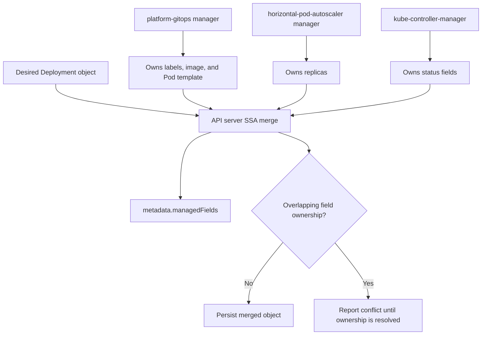
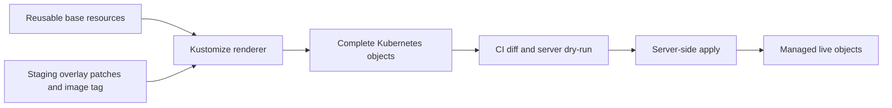
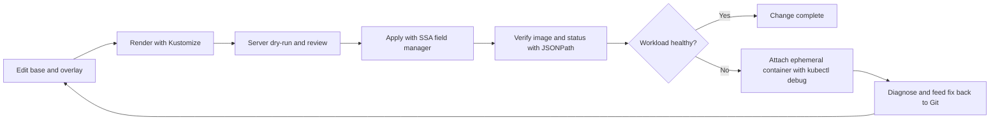

# Chapter 30 — Advanced Object Management

> **Learning Objectives**
>
> By the end of this chapter, you will be able to:
>
> - Use **server-side apply** and reason about **field managers** during conflicts
> - Structure overlays with **Kustomize** for environment promotion
> - Extract and filter object data with **JSONPath**
> - Explain **KYAML** as a safer YAML dialect and use `-o kyaml`
> - Personalize kubectl with **kuberc** without polluting kubeconfig
> - Debug running Pods with **kubectl debug** and **ephemeral containers**

---

## 30.1 Opening story: many hands on one document

A Kubernetes object is a shared document. Platform teams stamp defaults, GitOps controllers reconcile desired state, horizontal autoscalers rewrite replicas, and you occasionally `kubectl edit` at 2 a.m. Without clear rules, the last writer wins and someone else’s change vanishes.

This chapter is about **owning writes deliberately**: server-side apply and field managers, generating variants with Kustomize, querying with JSONPath, safer markup with KYAML, friendlier kubectl via kuberc, and debugging without rebuilding images—ephemeral containers.

---

## 30.2 Server-side apply and field managers

### In plain terms

**Client-side apply** (`kubectl apply` the old way) merged locally and sent a big patch. **Server-side apply (SSA)** asks the API server to merge fields and remember *who owns which field* via **field managers**. Conflicts become visible instead of silent last-write-wins surprises.

SSA tracks which manager owns which fields so kubectl, Helm, and controllers do not clobber blindly. Conflicts are evidence, not noise. You might think `kubectl apply` client-side is the same—ownership tracking differs.

> ⚠️ **Common Pitfall:** Mixing client-side apply, SSA, and helm without understanding field managers—mystery resets.

### Under the hood

Enable SSA on apply (default for recent kubectl in many flows; be explicit in scripts):

```bash
$ kubectl apply --server-side -f task-api-deploy.yaml
deployment.apps/task-api serverside-applied
```

Inspect managed fields:

```bash
$ kubectl get deploy task-api -n tasks -o yaml
```

Relevant excerpt:

```yaml
metadata:
  name: task-api
  namespace: tasks
  managedFields:
    - manager: kubectl
      operation: Apply
      apiVersion: apps/v1
      fieldsType: FieldsV1
      fieldsV1:
        f:metadata:
          f:labels:
            f:app: {}
        f:spec:
          f:replicas: {}
          f:template:
            f:spec:
              f:containers: {}
    - manager: kube-controller-manager
      operation: Update
      apiVersion: apps/v1
      fieldsType: FieldsV1
      fieldsV1:
        f:status:
          f:availableReplicas: {}
```

Status is owned by controllers; spec fields you applied are owned by your manager name (often `kubectl` or a custom `--field-manager`).



*Figure 30.1: Server-side apply records field-level ownership so GitOps, autoscalers, and controllers can share an object without silent overwrites.*

Force ownership when you intentionally take over a field:

```bash
$ kubectl apply --server-side --field-manager=platform-gitops --force-conflicts -f task-api-deploy.yaml
```

Dry-run against the live API:

```bash
$ kubectl apply --server-side --dry-run=server -f task-api-deploy.yaml -o yaml
```

Compare with a strategic merge patch from an imperative change:

```bash
$ kubectl scale deploy/task-api -n tasks --replicas=3
```

After scaling, `replicas` may be owned by `kubectl-scale` (or similar). The next SSA apply that also sets `replicas` can conflict until you drop the field from your manifest (let HPA/scale own it) or force the manager.

### In production

**Ownership:** Platform sets apply conventions; every automation identity is a named field manager.

**Failure mode:** Field conflicts → apply failures or silent overwrites. Detect with conflict errors in CI/CD. Mitigate with consistent SSA and `kubectl apply --server-side --field-manager=...`.

| Do | Don't |
|----|-------|
| Named field managers per tool | Force overwrite as daily habit |
| Inspect managedFields in incidents | Three tools editing the same fields |

**Before you leave this section**

- **Understand:** SSA field managers make ownership explicit—use them in prod apply paths.
- **Try:** Inspect `managedFields` on a Deployment after an apply.
- **Watch in prod:** Apply wars between CI and operators.

> 🏭 **Production floor:** **SSA field managers** are change-safety evidence. Standardize `--field-manager` names (`helm`, `flux`, `kubectl-ci`). On conflicts: `kubectl get <obj> -o yaml` → read managedFields → decide owner in the ticket—do not `--force-conflicts` without naming who loses.


---

## 30.3 Kustomize

### In plain terms

**Kustomize** is the built-in way to say: “here is a base app, and here are overlays that tweak it for staging or production”—without forking entire YAML trees or learning a separate templating language. `kubectl -k` runs it natively.

Kustomize overlays patch bases without forked YAML sprawl. Overlays are change-controlled. You might think Kustomize replaces Helm always—different composition models; pick deliberately.

> ⚠️ **Common Pitfall:** Edits in base that surprise every overlay environment.

### Under the hood

Directory layout:

```text
task-api/
  base/
    kustomization.yaml
    deployment.yaml
    service.yaml
  overlays/
    staging/
      kustomization.yaml
      replicas.yaml
    production/
      kustomization.yaml
      replicas.yaml
```

Base:

```yaml
# task-api/base/kustomization.yaml
apiVersion: kustomize.config.k8s.io/v1beta1
kind: Kustomization
resources:
  - deployment.yaml
  - service.yaml
commonLabels:
  app: task-api
```

```yaml
# task-api/base/deployment.yaml
apiVersion: apps/v1
kind: Deployment
metadata:
  name: task-api
spec:
  replicas: 1
  selector:
    matchLabels:
      app: task-api
  template:
    metadata:
      labels:
        app: task-api
    spec:
      containers:
        - name: api
          image: example/task-api:1.0.0
          ports:
            - containerPort: 8080
```

```yaml
# task-api/base/service.yaml
apiVersion: v1
kind: Service
metadata:
  name: task-api
spec:
  selector:
    app: task-api
  ports:
    - port: 80
      targetPort: 8080
```

Staging overlay:

```yaml
# task-api/overlays/staging/kustomization.yaml
apiVersion: kustomize.config.k8s.io/v1beta1
kind: Kustomization
namespace: tasks-staging
resources:
  - ../../base
images:
  - name: example/task-api
    newTag: "1.0.0-rc2"
patches:
  - path: replicas.yaml
```

```yaml
# task-api/overlays/staging/replicas.yaml
apiVersion: apps/v1
kind: Deployment
metadata:
  name: task-api
spec:
  replicas: 2
```

```bash
$ kubectl kustomize task-api/overlays/staging
# renders complete YAML to stdout

$ kubectl apply -k task-api/overlays/staging
namespace/tasks-staging configured
deployment.apps/task-api configured
service/task-api configured
```



*Figure 30.2: Kustomize combines a reusable base with environment overlays before review and server-side apply.*

Useful Kustomize features for day-two ops:

| Feature | Use |
|---------|-----|
| `images` | Retag without editing Deployment files |
| `configMapGenerator` / `secretGenerator` | Build ConfigMaps/Secrets with content hashes |
| `patches` / strategic merge / JSON6902 | Targeted overlays |
| `replacements` | Copy a value from one object to another |
| `components` | Reusable snippets across overlays |

### In production

**Ownership:** App teams own overlays; platform may provide base guardrail patches.

**Failure mode:** Bad base change → all envs break. Detect with rendered diff in PR. Mitigate with CI `kustomize build` diffs per overlay.

| Do | Don't |
|----|-------|
| PR diffs of rendered overlays | Hand-edit live and ignore overlays |
| Keep secrets out of bases | One mega-overlay for all clusters |

**Before you leave this section**

- **Understand:** Kustomize overlays need rendered diffs in CI.
- **Try:** Build two overlays and diff them.
- **Watch in prod:** Base changes breaking all environments.


---

## 30.4 JSONPath queries

### In plain terms

JSONPath is a **query language for picking fields** out of API objects. Instead of piping YAML through ad-hoc scripts, you ask kubectl for exactly the nodes, images, or IPs you need.

JSONPath extracts fields for scripts and incident triage. Prefer stable fields. You might think scraping human `kubectl` tables in scripts is fine—tables change; JSONPath on objects is stabler.

> ⚠️ **Common Pitfall:** Parsing `kubectl` columnar output in production scripts.

### Under the hood

```bash
$ kubectl get pods -n tasks -o jsonpath='{range .items[*]}{.metadata.name}{"\t"}{.status.phase}{"\n"}{end}'
task-api-7d9c4f6b8-abcd1	Running
task-api-7d9c4f6b8-efgh2	Running

$ kubectl get deploy task-api -n tasks -o jsonpath='{.spec.template.spec.containers[*].image}{"\n"}'
example/task-api:1.0.0

$ kubectl get nodes -o jsonpath='{range .items[*]}{.metadata.name}{"\t"}{.status.addresses[?(@.type=="InternalIP")].address}{"\n"}{end}'
cp-1	192.168.10.11
wk-1	192.168.10.21
```

From a file:

```bash
$ kubectl get pods -n tasks -o jsonpath-file=pod-names.jsonpath
```

```gotemplate
# pod-names.jsonpath
{range .items[*]}{.metadata.name}{"\n"}{end}
```

Custom columns (cousin of JSONPath) for tables:

```bash
$ kubectl get pods -n tasks -o custom-columns=NAME:.metadata.name,NODE:.spec.nodeName,IP:.status.podIP
NAME                         NODE   IP
task-api-7d9c4f6b8-abcd1     wk-1   10.244.1.15
task-api-7d9c4f6b8-efgh2     wk-2   10.244.2.18
```

Common gotchas:

- Use spaces carefully inside expressions; quote the whole jsonpath for the shell.
- `range` / `end` pairs iterate lists.
- Filters like `?(@.type=="InternalIP")` narrow arrays.
- For complex scripting, `-o json` plus `jq` may be clearer—JSONPath shines for one-liners and CI checks.

### In production

**Ownership:** Everyone writing automation owns resilient queries; platform publishes common snippets.

**Failure mode:** Broken scripts mid-incident. Detect with CI tests of queries. Mitigate with go-templates/jsonpath against fixtures.

| Do | Don't |
|----|-------|
| JSONPath/go-template in scripts | Parse table output |
| Test queries in CI | Undocumented one-liners as SoT |

**Before you leave this section**

- **Understand:** JSONPath is for stable automation and triage.
- **Try:** Write a JSONPath that lists image digests for a Deployment.
- **Watch in prod:** Scripts parsing kubectl tables.


---

## 30.5 KYAML overview

### In plain terms

YAML’s indentation and “helpful” type guessing cause famous bugs (the Norway problem: `NO` becoming boolean `false`). **KYAML** is a Kubernetes-oriented, less ambiguous YAML subset: flow-style objects and arrays, explicitly quoted strings, still parseable as ordinary YAML.

KYAML aims at safer Kubernetes YAML authoring ergonomics—know what your kubectl version supports before standardizing. You might think KYAML changes cluster APIs—it is an authoring/representation concern.

> ⚠️ **Common Pitfall:** Mandating KYAML fleet-wide before toolchain support is even.

### Under the hood

KYAML was introduced as an alpha kubectl output format in 1.34, moved forward in 1.35, and remains available on the 1.36 toolchain as `-o kyaml` (beta in the kubectl output table). Input-wise, KYAML documents are valid YAML, so older servers still accept them when you `kubectl apply -f`.

Example shape:

```yaml
---
{
  apiVersion: "v1",
  kind: "Pod",
  metadata: {
    name: "demo",
    labels: {
      app: "task-api",
    },
  },
  spec: {
    containers: [{
      name: "api",
      image: "example/task-api:1.0.0",
    }],
  },
}
```

```bash
$ kubectl get pod demo -n tasks -o kyaml
```

Compared to classic YAML:

| Concern | Classic YAML | KYAML |
|---------|--------------|-------|
| Significant indentation | Yes | Flow `{}` / `[]` reduce indent traps |
| Unquoted strings | Can coerce types | Strings are double-quoted |
| Comments | Supported | Compatible YAML subset |
| Tooling | Universal | Still YAML-parseable |

### In production

**Ownership:** Platform decides supported authoring formats; keep CI renderers consistent.

**Failure mode:** Tooling mismatch → rejected manifests. Detect in CI. Mitigate with version-pinned kubectl/kustomize.

| Do | Don't |
|----|-------|
| Pin toolchain versions | Mix unsupported KYAML in prod GitOps early |
| Document team standard | Assume all editors round-trip identically |

**Before you leave this section**

- **Understand:** KYAML is authoring ergonomics—standardize only when tooling is ready.
- **Try:** Check your kubectl version notes for KYAML support.
- **Watch in prod:** Format mismatch between local and CI.


---

## 30.6 kuberc — kubectl user preferences

### In plain terms

**kubeconfig** is about *which clusters and credentials*. **kuberc** is about *how you like kubectl to behave*: aliases, default flags, and credential plugin policy. Separating them means you can share cluster access files without sharing your personal shortcuts—and vice versa.

kuberc stores kubectl user preferences (aliases, defaults)—helpful locally, dangerous if it hides flags on-call needs. You might think shared kuberc on jump hosts is fine—document it or surprise juniors.

> ⚠️ **Common Pitfall:** Silent defaults that change namespace or output format during incidents.

### Under the hood

Default path: `$HOME/.kube/kuberc` (Windows: `%USERPROFILE%\.kube\kuberc`). Override with `--kuberc` or the `KUBERC` environment variable. Disable with `KUBERC=off` when you need a clean slate.

Feature state: introduced alpha in 1.33, **beta and on by default from 1.34**, and part of the normal kubectl experience on **1.36**. Prefer the `kubectl.config.k8s.io/v1beta1` preference format.

```bash
$ kubectl kuberc view

$ kubectl kuberc set --section defaults --command get --option output=wide

$ kubectl kuberc set --section aliases --name getn \
    --command get --prependarg nodes --option output=wide
```

Illustrative file:

```yaml
apiVersion: kubectl.config.k8s.io/v1beta1
kind: Preference
defaults:
  - command: get
    options:
      - name: output
        default: wide
  - command: delete
    options:
      - name: interactive
        default: "true"
aliases:
  - name: getn
    command: get
    prependArgs:
      - nodes
    options:
      - name: output
        default: wide
  - name: kgp
    command: get
    prependArgs:
      - pods
      - -A
```

Credential plugin policy (allowlist/deny) belongs here so a malicious kubeconfig cannot freely execute unexpected exec plugins without your consent:

```bash
$ kubectl kuberc set --section credentialplugin --policy Allowlist \
    --allowlist-entry command=my-oidc-plugin
```

### In production

**Ownership:** Individuals own laptop kuberc; shared bastions need documented defaults.

**Failure mode:** Wrong namespace applies. Detect with prompt showing context/namespace. Mitigate with explicit `-n` in runbooks.

| Do | Don't |
|----|-------|
| Explicit -n in runbooks | Rely on hidden default namespace |
| Document bastion kuberc | Undocumented aliases that mutate clusters |

**Before you leave this section**

- **Understand:** kuberc personalizes kubectl—keep incident commands explicit.
- **Try:** Inspect whether you use kuberc and what it sets.
- **Watch in prod:** Wrong-namespace actions from defaults.


---

## 30.7 kubectl debug and ephemeral containers

### In plain terms

Production images are often distroless: no shell, no `curl`, no package manager. **Ephemeral containers** let you attach a temporary toolbox container to a **running Pod’s namespaces** for debugging—without rebuilding or restarting the app container. `kubectl debug` is the ergonomic CLI for that (and for node copy debugging).

Ephemeral debug containers attach troubleshooting tools without rebuilding images—great for distroless. You might think debug access is always allowed—RBAC and PSA may block; that is good.

> ⚠️ **Common Pitfall:** Granting widespread `pods/ephemeralcontainers` in multi-tenant clusters.

### Under the hood

Ephemeral containers appear in `PodSpec.ephemeralContainers` and are never restarted; they are a diagnostic side-car injected via the API.

```bash
$ kubectl debug -it pod/task-api-7d9c4f6b8-abcd1 -n tasks \
    --image=busybox:1.36 --target=api -- sh
Defaulting debug container name to debugger-a1b2c.
If you don't see a command prompt, try pressing enter.
/ #
```

`--target` selects which container’s namespaces to share (important for network and PID troubleshooting).

Copy a Pod with different command/image (useful when the Pod is CrashLooping and you never get a shell):

```bash
$ kubectl debug task-api-7d9c4f6b8-abcd1 -n tasks \
    -it --copy-to=task-api-debug --container=api \
    -- sh
```

Node debugging (run a privileged Pod on a node—use with care):

```bash
$ kubectl debug node/wk-1 -it --image=busybox:1.36
```

Verify ephemeral containers on the live object:

```bash
$ kubectl get pod task-api-7d9c4f6b8-abcd1 -n tasks \
    -o jsonpath='{.spec.ephemeralContainers[*].name}{"\n"}'
debugger-a1b2c
```

RBAC: users need permission to `update` (or the subresource that grants ephemeral container creation, depending on your policy setup) on Pods—treat this as sensitive.

### In production

**Ownership:** Platform RBAC-scopes debug; app teams use it under change control in prod.

**Failure mode:** Unrestricted debug → lateral movement. Detect with audit on ephemeralcontainers. Mitigate with break-glass RoleBindings.

| Do | Don't |
|----|-------|
| Break-glass debug RBAC | Cluster-wide debug permission |
| Prefer ephemeral over docker.sock | Debug by shipping shells into every image |

**Before you leave this section**

- **Understand:** Ephemeral debug is powerful—scope with RBAC and audits.
- **Try:** Debug a lab Pod with an ephemeral container.
- **Watch in prod:** Broad pods/ephemeralcontainers grants.


---

## 30.8 Putting the toolkit together

A realistic change flow for the task-api:

1. Edit **base** manifests; adjust **overlay** for staging with Kustomize.
2. `kubectl apply --server-side -k overlays/staging` under field manager `platform-gitops`.
3. Verify images with JSONPath; render KYAML into the PR for reviewers who want unambiguous diffs.
4. If a Pod misbehaves, `kubectl debug` with an ephemeral busybox—do not bake `curl` into the production image “just in case.”
5. Keep personal kubectl aliases in **kuberc**, not in shared kubeconfig checked into a team vault.



*Figure 30.3: The object-management loop renders an overlay, applies it with SSA, verifies the result, and enters a controlled debug path only when needed.*

---

## 30.9 Common pitfalls

> ⚠️ **Common Pitfall:** Mixing client-side apply annotations with server-side apply on the same object until ownership is confused. Standardize on SSA for a given resource set.

> ⚠️ **Common Pitfall:** Giant Kustomize overlays that duplicate the whole Deployment. Patch only what changes.

> ⚠️ **Common Pitfall:** JSONPath scripts that break when a field is missing—test against empty lists and Pending Pods.

> ⚠️ **Common Pitfall:** Assuming ephemeral containers require a Pod restart. They attach to the live Pod; CrashLoop copies are the separate `--copy-to` workflow.

> ⚠️ **Common Pitfall:** Storing cluster credentials in kuberc. Wrong file—use kubeconfig (and preferably short-lived auth).

---

## 30.10 Hands-on exercises

1. Apply a Deployment with `--server-side --field-manager=chapter30`. Scale it with `kubectl scale`, then re-apply and resolve the `replicas` conflict deliberately (omit vs `--force-conflicts`).
2. Build a Kustomize base plus staging/production overlays for the task-api image tag and replica count. Apply staging with `kubectl apply -k`.
3. Write a JSONPath one-liner that prints every container image in a namespace. Fail the command in a script if any image ends with `:latest`.
4. Run `kubectl get deploy -n tasks -o kyaml` and compare type-safety of a string that looks like a boolean against classic YAML.
5. Configure a kuberc alias for `kubectl get pods -A -o wide`. Prove it disappears with `KUBERC=off`.
6. Deploy a distroless or minimal image Pod and attach an ephemeral debug container with `kubectl debug --target=...`.

---

## 30.11 Check Your Understanding

**Q1.** What does a field manager record in server-side apply?

<details>
<summary>Show answer</summary>

Which actor last applied ownership for specific fields on an object. The API server uses that tracking to detect conflicts when another manager tries to change the same fields.
</details>

**Q2.** Why use Kustomize overlays instead of copying YAML per environment?

<details>
<summary>Show answer</summary>

Overlays keep a single base and express only deltas (images, replicas, namespaces), reducing drift and duplicated edits across staging and production.
</details>

**Q3.** What class of YAML bugs is KYAML designed to reduce?

<details>
<summary>Show answer</summary>

Ambiguities from significant indentation and implicit type coercion of unquoted scalars (among other YAML footguns), while remaining valid YAML for existing parsers.
</details>

**Q4.** How does kuberc differ from kubeconfig?

<details>
<summary>Show answer</summary>

kubeconfig holds clusters, users, and contexts (connection and auth). kuberc holds user preferences such as aliases, default flags, and credential plugin policy—not cluster endpoints or passwords.
</details>

**Q5.** When do you choose `kubectl debug --copy-to` instead of an ephemeral container on the live Pod?

<details>
<summary>Show answer</summary>

When the original Pod never stays up long enough to debug (for example, CrashLoopBackOff) or you need a modified command/image. Ephemeral containers attach to a running Pod; copy-to creates a new Pod for investigation.
</details>

---

## 30.12 Key takeaways

- **Server-side apply** makes multi-writer ownership explicit via **field managers**—design who owns which fields.
- **Kustomize** scales manifests across environments without a second templating language.
- **JSONPath** turns objects into precise answers for humans and CI.
- **KYAML** offers a safer YAML dialect for Kubernetes-shaped documents.
- **kuberc** personalizes kubectl without contaminating kubeconfig.
- **kubectl debug** and **ephemeral containers** let you troubleshoot minimal images without baking shells into production.

---

## 30.13 Official documentation map

| Topic | Official page |
|-------|---------------|
| Server-Side Apply | [Server-Side Apply](https://kubernetes.io/docs/reference/using-api/server-side-apply/) |
| Managed fields | [Managed Fields](https://kubernetes.io/docs/reference/using-api/server-side-apply/#field-management) |
| Declarative management | [Declarative Management of Kubernetes Objects Using Configuration Files](https://kubernetes.io/docs/tasks/manage-kubernetes-objects/declarative-config/) |
| Kustomize | [Declarative Management of Kubernetes Objects Using Kustomize](https://kubernetes.io/docs/tasks/manage-kubernetes-objects/kustomization/) |
| JSONPath support | [JSONPath Support](https://kubernetes.io/docs/reference/kubectl/jsonpath/) |
| kubectl output options | [Command line tool (kubectl)](https://kubernetes.io/docs/reference/kubectl/) |
| KYAML reference | [KYAML Reference](https://kubernetes.io/docs/reference/encodings/kyaml/) |
| kuberc preferences | [Kubectl user preferences (kuberc)](https://kubernetes.io/docs/reference/kubectl/kuberc/) |
| Debug running Pods | [Debug Running Pods](https://kubernetes.io/docs/tasks/debug/debug-application/debug-running-pod/) |
| Ephemeral containers | [Ephemeral Containers](https://kubernetes.io/docs/concepts/workloads/pods/ephemeral-containers/) |
| kubectl debug | [kubectl debug](https://kubernetes.io/docs/reference/kubectl/generated/kubectl_debug/) |

**Previous:** [Chapter 29 — Extending Kubernetes](29-extending-kubernetes.md) | **Next:** [Chapter 31 — Multitenancy, Policy, and Governance](31-multitenancy-policy-governance.md)
