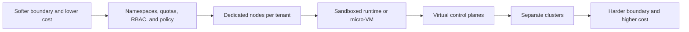
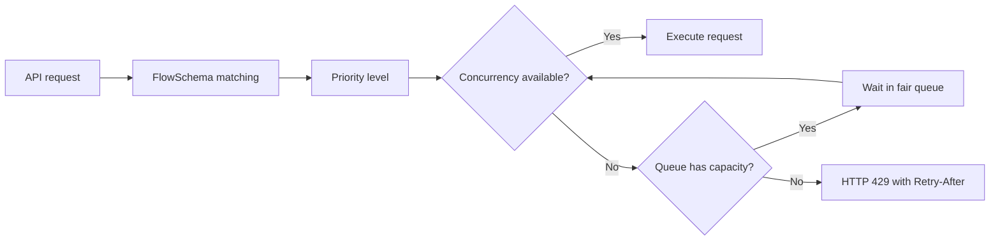

# Chapter 31 — Multitenancy, Policy, and Governance

> **Learning Objectives**
>
> By the end of this chapter, you will be able to:
>
> - Choose between namespace-based (soft) and cluster-based (hard) multitenancy for a given trust boundary
> - Design `ResourceQuota` and `LimitRange` so tenants share a cluster without starving one another
> - Enforce Pod Security Standards with Pod Security Admission, and know when to reach for a policy engine
> - Apply RBAC good practices that survive audits and staff turnover
> - Explain how API Priority and Fairness protects the API server from noisy clients
> - Turn on the audit log and read an audit event
> - Reason about feature gates, the Kubernetes deprecation policy, and safe API migration

---

## 31.1 One cluster, many tenants

Picture an apartment building. Some buildings are **converted houses**: thin interior walls, shared plumbing, and a landlord who trusts everyone to be reasonable. Other buildings are **poured-concrete high-rises**: fire-rated walls between units, separate meters, and a hard boundary that holds even when a neighbor is hostile. Both are "multi-unit housing." They differ in the *strength of the boundary* between residents.

A Kubernetes cluster is the building, and your teams, apps, and customers are the residents. **Multitenancy** is the practice of letting more than one of them share the cluster. The central question is never "how do I split the cluster?" but "**how much do these tenants trust one another, and what happens when one misbehaves?**" That answer drives every decision in this chapter: how you carve up namespaces, how you cap resource use, which security profile you enforce, and who is allowed to do what.

Sharing is attractive because clusters have real fixed costs: control-plane nodes, monitoring, the platform team's attention. Packing many tenants onto one cluster raises utilization and shrinks the number of clusters you operate. The risk is that Kubernetes namespaces are *soft* walls by default — thin drywall, not concrete. This chapter is about knowing which walls you have and reinforcing them deliberately.

> 💡 **Tip:** Write down your tenants and their trust relationship *before* touching YAML. "Three internal teams who trust each other" and "hostile customers running arbitrary code" lead to completely different architectures.

---

## 31.2 Tenancy models

### In plain terms

There are two honest answers to "how do I isolate tenants?"

- **Soft multitenancy (namespaces as tenants):** everyone lives in the same cluster, separated by namespaces, quotas, RBAC, and policy. Good when tenants are *cooperative* — teams inside one company. The kernel and control plane are shared, so a determined attacker who escapes a container could, in principle, reach a neighbor.
- **Hard multitenancy (clusters as tenants):** each tenant gets its own cluster (or a strongly isolated virtual control plane). Good when tenants are *untrusted* — external customers running arbitrary workloads. Stronger boundary, higher cost and operational overhead.

Most organizations end up somewhere in between: soft multitenancy for internal teams, and a full cluster (or a sandboxed runtime) for anything running untrusted code.

Namespace tenancy vs cluster-per-tenant vs virtual clusters—blast radius and cost trade off. You might think namespaces alone equal hard multi-tenancy—without quota, PSA, NetworkPolicy, and RBAC they do not.

> ⚠️ **Common Pitfall:** Soft multi-tenancy sold as hard isolation to regulated tenants.

### Under the hood

The building block of soft multitenancy is the **namespace**. It is a scope for names and a hook for policy — it is *not* a security sandbox by itself. A namespace gives you:

- A place to attach `ResourceQuota` and `LimitRange`
- A subject boundary for `Role`/`RoleBinding` RBAC
- A label target for Pod Security Admission
- A DNS scope (`svc.<ns>.svc.cluster.local`) and a NetworkPolicy scope

```bash
$ kubectl create namespace team-payments
namespace/team-payments created

$ kubectl label namespace team-payments team=payments cost-center=fin-204
namespace/team-payments labeled
```

What a namespace does **not** give you: a separate kernel, a separate API server, node-level isolation, or protection from a container escape. Pods from different namespaces can land on the same node and share that node's kernel.

For stronger isolation without one-cluster-per-tenant, three techniques stack up:

| Technique | Boundary strengthened | Cost |
|---|---|---|
| Node isolation (taints + `nodeSelector`/affinity per tenant) | Tenants no longer share a kernel/node | Lower bin-packing efficiency |
| Sandboxed runtimes (gVisor, Kata Containers via `RuntimeClass`) | Container escape is contained by a user-space kernel or micro-VM | Some performance overhead |
| Virtual control planes (e.g. the vCluster pattern) | Each tenant gets an apparent API server and CRDs | Extra moving parts to operate |



*Figure 31.1: Tenancy is a spectrum of isolation strength, not a binary choice.*

### In production

**Ownership:** Platform owns tenancy model choice and guardrails; tenants own workloads inside the contract.

**Failure mode:** Noisy neighbor or escape → cross-tenant incident. Detect with quota breaches and network denies. Mitigate with layered controls (Ch 19/21/24).

| Do | Don't |
|----|-------|
| Match model to isolation needs | Promise hypervisor isolation with shared nodes casually |
| Document shared fate | Unlimited cluster-admin per tenant |

**Before you leave this section**

- **Understand:** Tenancy model sets blast radius—namespaces need layered controls.
- **Try:** Classify your lab as soft vs hard tenancy and why.
- **Watch in prod:** Overpromised isolation.


---

## 31.3 ResourceQuota: capping a tenant's share

### In plain terms

A `ResourceQuota` is the electricity meter and the fuse box for a namespace. It answers "how much of the cluster may everything in this namespace consume, in total?" — total CPU, total memory, total number of pods, total number of Services, and so on. Without it, one team's runaway Deployment can eat the whole cluster and evict everyone else.

Quotas stop one tenant from eating the cluster. Tie them to chargeback classes. You might think CPU quota without object count quotas is enough—CRD spam still hurts API.

> ⚠️ **Common Pitfall:** Quotas on CPU/memory only while allowing unbounded Secret/ConfigMap counts.

### Under the hood

`ResourceQuota` is enforced by an admission controller. When a request would push a namespace over its quota, the API server rejects it at creation time.

```yaml
apiVersion: v1
kind: ResourceQuota
metadata:
  name: team-payments-quota
  namespace: team-payments
spec:
  hard:
    requests.cpu: "20"
    requests.memory: 40Gi
    limits.cpu: "40"
    limits.memory: 80Gi
    pods: "100"
    count/deployments.apps: "50"
    services.loadbalancers: "2"
    persistentvolumeclaims: "30"
    requests.storage: 500Gi
```

```bash
$ kubectl apply -f team-payments-quota.yaml
resourcequota/team-payments-quota created

$ kubectl get resourcequota -n team-payments
NAME                  AGE   REQUEST                                                          LIMIT
team-payments-quota   5s    pods: 12/100, requests.cpu: 6/20, requests.memory: 12Gi/40Gi    limits.cpu: 9/40, limits.memory: 20Gi/80Gi
```

Two categories of quota matter most:

- **Compute quotas** (`requests.cpu`, `limits.memory`, …) govern the sum of all containers' requests and limits. The catch: once *any* compute quota is set, every pod in the namespace **must** declare the matching request/limit or it is rejected. That is what `LimitRange` (next section) is for.
- **Object-count quotas** (`pods`, `services`, `count/<resource>.<group>`) cap how many of a kind can exist. The generic `count/deployments.apps` syntax works for almost any resource, including CRDs.

You can also scope a quota. A common pattern caps high-priority workloads separately using `scopeSelector`:

```yaml
spec:
  hard:
    pods: "10"
  scopeSelector:
    matchExpressions:
      - operator: In
        scopeName: PriorityClass
        values: ["high"]
```

### In production

**Ownership:** Platform assigns quota classes; tenants request bumps via tickets with capacity review.

**Failure mode:** Quota hit mid-deploy. Detect with used/hard metrics per tenant. Mitigate with dashboards and headroom.

| Do | Don't |
|----|-------|
| Include object-count quotas | Silent infinite namespaces |
| Capacity review on bumps | Copy prod quota into tiny clusters blindly |

**Before you leave this section**

- **Understand:** Quotas enforce fair share; include object counts.
- **Try:** Inspect a tenant namespace’s quota used vs hard.
- **Watch in prod:** API spam without object quotas.


---

## 31.4 LimitRange: sane defaults and guardrails per object

### In plain terms

Where `ResourceQuota` caps the *namespace total*, a `LimitRange` sets rules for *each individual* pod, container, or PVC: a default request if you forgot one, a ceiling no single container may exceed, and a floor so nobody games the scheduler by requesting `1m` of CPU.

LimitRanges default and bound container resources so tenants cannot omit requests. You might think LimitRange replaces quota—different layers.

> ⚠️ **Common Pitfall:** Defaults so high that two Pods exhaust the namespace quota.

### Under the hood

```yaml
apiVersion: v1
kind: LimitRange
metadata:
  name: team-payments-limits
  namespace: team-payments
spec:
  limits:
    - type: Container
      default:                 # applied as the limit if none set
        cpu: "500m"
        memory: 512Mi
      defaultRequest:          # applied as the request if none set
        cpu: "100m"
        memory: 128Mi
      max:                     # no container may exceed these
        cpu: "2"
        memory: 2Gi
      min:                     # no container may request less
        cpu: "50m"
        memory: 64Mi
    - type: PersistentVolumeClaim
      max:
        storage: 100Gi
      min:
        storage: 1Gi
```

The interaction with quota is the key insight. With the `LimitRange` above, a developer can submit a bare pod with no resource stanza:

```yaml
apiVersion: v1
kind: Pod
metadata:
  name: quick-test
  namespace: team-payments
spec:
  containers:
    - name: app
      image: ghcr.io/example/task-api:1.0.0
```

The `LimitRange` admission controller mutates it to carry `requests: {cpu: 100m, memory: 128Mi}` and `limits: {cpu: 500m, memory: 512Mi}`. *Now* the `ResourceQuota` can account for it, and the pod is admitted. Without the `LimitRange`, that same pod would be rejected by the quota for having no requests.

### In production

**Ownership:** Platform owns LimitRange templates per tier; tenants override within bounds.

**Failure mode:** Bad defaults → instant quota exhaustion. Detect with create failures and defaulted resources in admits. Mitigate with tuned templates.

| Do | Don't |
|----|-------|
| Defaults fit quota math | No LimitRange in multi-tenant NS |
| Document min/max | Defaults that force privileged patterns |

**Before you leave this section**

- **Understand:** LimitRange defaults must fit quota arithmetic.
- **Try:** Apply a LimitRange and create a Pod without requests.
- **Watch in prod:** Defaults that exhaust quotas immediately.


---

## 31.5 Pod Security Standards, in depth

### In plain terms

**Pod Security Standards (PSS)** are three named security profiles — `privileged`, `baseline`, `restricted` — that describe *how hardened* a pod's spec must be. **Pod Security Admission (PSA)** is the built-in admission controller that enforces a chosen profile per namespace using labels. Think of PSS as the building code and PSA as the inspector at the door.

PSA replaced the removed PodSecurityPolicy (gone since 1.25) and is a stable, always-on part of Kubernetes 1.36.

PSS/PSA are tenancy guardrails—baseline/restricted per namespace class. You might think privileged namespaces for every team “temporarily” is OK—they become permanent.

> ⚠️ **Common Pitfall:** Permanent privileged exceptions without expiry.

### Under the hood

The three profiles form a ladder:

| Profile | What it allows | Typical use |
|---|---|---|
| `privileged` | Everything; no restrictions | System/infra namespaces (CNI, CSI, monitoring agents) that genuinely need host access |
| `baseline` | Blocks the well-known escapes: `privileged: true`, host namespaces, most `hostPath`, adding dangerous capabilities | Reasonable default for general apps |
| `restricted` | Everything in baseline **plus** must run non-root, drop `ALL` capabilities, `seccompProfile: RuntimeDefault`, `allowPrivilegeEscalation: false`, restricted volume types | The target for anything you can harden |

PSA runs in three independent **modes**, each with its own label, so you can observe before you enforce:

- `enforce` — reject violating pods
- `audit` — allow, but record a violation in the audit log
- `warn` — allow, but return a warning to the client (`kubectl` prints it)

```bash
$ kubectl label namespace team-payments \
    pod-security.kubernetes.io/enforce=baseline \
    pod-security.kubernetes.io/enforce-version=v1.36 \
    pod-security.kubernetes.io/warn=restricted \
    pod-security.kubernetes.io/warn-version=v1.36 \
    pod-security.kubernetes.io/audit=restricted \
    pod-security.kubernetes.io/audit-version=v1.36 \
    --overwrite
namespace/team-payments labeled
```

This says: *enforce* `baseline` (reject the obviously dangerous), but *warn* and *audit* against `restricted` so you can see how far each workload is from the hardened target. Pinning `*-version` to `v1.36` (rather than `latest`) freezes the rule set, so a cluster upgrade cannot silently tighten enforcement and break running teams.

A pod that violates the enforced profile is rejected clearly:

```bash
$ kubectl apply -f privileged-pod.yaml
Error from server (Forbidden): error when creating "privileged-pod.yaml":
pods "snoop" is forbidden: violates PodSecurity "baseline:v1.36":
privileged (container "snoop" must not set securityContext.privileged=true)
```

Here is the shape of a pod that satisfies `restricted`:

```yaml
apiVersion: v1
kind: Pod
metadata:
  name: hardened
  namespace: team-payments
spec:
  securityContext:
    runAsNonRoot: true
    seccompProfile:
      type: RuntimeDefault
  containers:
    - name: app
      image: ghcr.io/example/task-api:1.0.0
      securityContext:
        allowPrivilegeEscalation: false
        capabilities:
          drop: ["ALL"]
        readOnlyRootFilesystem: true
      volumeMounts:
        - name: tmp
          mountPath: /tmp
  volumes:
    - name: tmp
      emptyDir: {}
```

### In production

**Ownership:** Platform owns PSS labels by namespace class; exemptions ticketed with expiry.

**Failure mode:** Privileged escape risk. Detect with PSA audit and privileged Pod inventories. Mitigate with time-boxed exemptions.

| Do | Don't |
|----|-------|
| baseline/restricted by default | Open privileged for convenience |
| Expire exemptions | One privileged label for all tenants |

**Before you leave this section**

- **Understand:** PSS is a tenancy control with managed exemptions.
- **Try:** List namespaces and their PSA enforce labels.
- **Watch in prod:** Eternal privileged exceptions.


---

## 31.6 RBAC good practices

### In plain terms

RBAC (covered mechanically in Chapter 21) decides *who may call which verb on which resource*. This section is about the *habits* that keep RBAC safe as the number of humans, CI systems, and controllers grows — the difference between a policy that passes an audit and one that quietly grants `cluster-admin` to a leaked CI token.

Tenant admins get namespace admin—not cluster-admin. Group bindings over individuals when possible. You might think cluster-reader for all humans is harmless—still a data leak surface.

> ⚠️ **Common Pitfall:** Binding tenant CI to cluster-admin.

### Under the hood

The good practices that matter most in a multi-tenant cluster:

1. **Prefer `Role` + `RoleBinding` over cluster-wide grants.** Namespaced permissions keep a tenant's blast radius inside their namespace. Reach for `ClusterRole`/`ClusterRoleBinding` only for genuinely cluster-scoped needs (nodes, PVs, CRDs).

2. **Bind a `ClusterRole` with a namespaced `RoleBinding` to reuse rules safely.** This is the idiomatic way to grant a common permission set (like a reusable "logs reader") in just one namespace:

```yaml
apiVersion: rbac.authorization.k8s.io/v1
kind: RoleBinding
metadata:
  name: payments-viewers
  namespace: team-payments
subjects:
  - kind: Group
    name: payments-team
    apiGroup: rbac.authorization.k8s.io
roleRef:
  kind: ClusterRole          # reuse the built-in "view" role...
  name: view                 # ...but only inside team-payments
  apiGroup: rbac.authorization.k8s.io
```

3. **Separate identities by function.** A human admin, the CI deployer, and the running workload's ServiceAccount should be three different subjects with three different permission sets. When the CI token leaks, it should not also be your break-glass admin.

4. **Avoid wildcards.** `verbs: ["*"]` or `resources: ["*"]` grants tomorrow's new resource types too. Enumerate what you mean.

5. **Never bind `cluster-admin` "just for now."** It is the single most common way clusters get compromised. If someone needs broad power temporarily, use a time-boxed break-glass procedure and audit it.

6. **Verify with `kubectl auth can-i`** — as the *subject*, not as yourself:

```bash
$ kubectl auth can-i delete pods -n team-payments \
    --as=system:serviceaccount:team-payments:ci-deployer
no

$ kubectl auth can-i --list \
    --as=system:serviceaccount:team-payments:ci-deployer -n team-payments
Resources        Non-Resource URLs   Resource Names   Verbs
deployments.apps  []                 []               [get list create update patch]
pods              []                 []               [get list watch]
```

7. **Watch out for privilege escalation via `escalate`/`bind`.** A subject who can create `RoleBindings` in a namespace can grant themselves any permission that exists there unless restricted. Kubernetes guards this: to create a binding to a role, you must already hold those permissions (or hold the `escalate` verb). Do not hand out `escalate`.

8. **Aggregate carefully.** ClusterRoles can aggregate others via `aggregationRule` and label selectors — powerful for platform roles, but it means adding a labeled ClusterRole silently expands an aggregated role. Review label selectors when auditing.

### In production

**Ownership:** Platform owns binding patterns; tenants manage in-namespace Roles within guardrails.

**Failure mode:** Privilege escalation across tenants. Detect with audit on ClusterRoleBindings. Mitigate with least privilege and periodic access reviews.

| Do | Don't |
|----|-------|
| Namespace-scoped tenant admin | cluster-admin per tenant |
| Access reviews | Orphaned bindings after offboarding |

**Before you leave this section**

- **Understand:** Tenant RBAC stays namespaced; review bindings.
- **Try:** List ClusterRoleBindings and justify each.
- **Watch in prod:** Tenant CI with cluster-admin.

> 🏭 **Production floor:** **RBAC least privilege** for tenants: no cluster-admin, CI uses deploy-only Roles, paste `auth can-i` evidence in onboarding tickets.


---

## 31.7 API Priority and Fairness

### In plain terms

The API server is the front door to the whole cluster, and it can only process so many requests at once. **API Priority and Fairness (APF)** is the bouncer-and-queues system that decides, when the door is crowded, *whose* requests get served and whose wait — so that one runaway controller listing every pod every second cannot lock out `kubelet` heartbeats or your `kubectl`. APF is stable and on by default in Kubernetes 1.36.

APF protects the API server from noisy tenants by queuing/fairness. You might think rate limits alone on ingress fix API storms—APF is specifically for kube-apiserver.

> ⚠️ **Common Pitfall:** Disabling APF to “fix” timeouts without understanding workload.

### Under the hood

APF replaces a crude global `--max-requests-inflight` limit with fair queuing across categories of traffic. Two object types configure it:

- **`FlowSchema`** — matches incoming requests (by user, ServiceAccount, verb, resource) and assigns them to a priority level, plus a "flow distinguisher" (e.g. by user) so one noisy client does not crowd out its peers *within* the same priority level.
- **`PriorityLevelConfiguration`** — defines a priority level's share of the server's concurrency and its queuing behavior.

Kubernetes ships sensible defaults. Critical traffic (leader election, kubelet, system components) is protected in high-priority levels; a catch-all `global-default` handles everyday requests; and there is a special exempt level for the most critical system calls.

```bash
$ kubectl get flowschemas
NAME                           PRIORITYLEVEL     MATCHINGPRECEDENCE   AGE
exempt                         exempt            1                    40d
system-leader-election         leader-election   100                  40d
kube-controller-manager        workload-high     800                  40d
service-accounts               workload-low      9000                 40d
global-default                 global-default    9900                 40d

$ kubectl get prioritylevelconfigurations
NAME              TYPE      NOMINALCONCURRENCYSHARES   QUEUES   AGE
exempt            Exempt    <none>                     <none>   40d
workload-high     Limited   98                         128      40d
workload-low      Limited   98                         128      40d
global-default    Limited   20                         128      40d
```

When a priority level is saturated, excess requests are **queued** (up to a limit) and then rejected with **HTTP 429 (Too Many Requests)** and a `Retry-After`. Well-behaved clients back off and retry. You can see rejections and waits in the API server's `apiserver_flowcontrol_*` metrics.



*Figure 31.3: API Priority and Fairness classifies requests, protects concurrency, and rejects only after the matching queue fills.*

A custom `FlowSchema` is useful to *isolate* a badly behaved integration into its own low-priority level so it cannot harm anyone else:

```yaml
apiVersion: flowcontrol.apiserver.k8s.io/v1
kind: PriorityLevelConfiguration
metadata:
  name: batch-low
spec:
  type: Limited
  limited:
    nominalConcurrencyShares: 5
    limitResponse:
      type: Queue
      queuing:
        queues: 64
        queueLengthLimit: 50
        handSize: 6
---
apiVersion: flowcontrol.apiserver.k8s.io/v1
kind: FlowSchema
metadata:
  name: batch-jobs
spec:
  priorityLevelConfiguration:
    name: batch-low
  matchingPrecedence: 1000
  distinguisherMethod:
    type: ByUser
  rules:
    - subjects:
        - kind: ServiceAccount
          serviceAccount:
            name: batch-runner
            namespace: analytics
      resourceRules:
        - verbs: ["list", "get", "watch"]
          apiGroups: [""]
          resources: ["pods"]
          namespaces: ["*"]
```

### In production

**Ownership:** Platform owns APF configuration; investigate before raising limits.

**Failure mode:** API latency/503 under load. Detect with APF rejected/queue metrics. Mitigate by finding noisy verbs/users and tuning wisely.

| Do | Don't |
|----|-------|
| Watch APF metrics | Disable APF in prod |
| Find noisy controllers | Blindly raise all limits |

**Before you leave this section**

- **Understand:** APF sheds/fair-queues API load—tune with evidence.
- **Try:** Find APF metrics on your metrics stack if exposed.
- **Watch in prod:** API storms from runaway controllers.


---

## 31.8 Auditing

### In plain terms

The **audit log** is the cluster's security camera: a structured record of *who* did *what*, *to which object*, *when*, and *whether it was allowed*. When something goes wrong — a deleted namespace, a leaked token, a surprise `cluster-admin` binding — the audit log is how you reconstruct the story.

Multi-tenant clusters need audit evidence per tenant actions. Retention and access to audits are security controls. You might think cloud trail alone covers Kubernetes RBAC changes—verify API audit is enabled.

> ⚠️ **Common Pitfall:** Tenants able to delete their audit trails.

### Under the hood

Auditing is configured on the **API server** (not via a cluster object), because the API server is where all mutations flow. You provide an **audit policy** file and a backend (log file or webhook):

```yaml
# audit-policy.yaml
apiVersion: audit.k8s.io/v1
kind: Policy
omitStages:
  - RequestReceived
rules:
  # Don't log noisy, low-value reads
  - level: None
    resources:
      - group: ""
        resources: ["events"]
  # Log secret access at Metadata level (never log the secret body)
  - level: Metadata
    resources:
      - group: ""
        resources: ["secrets", "configmaps"]
  # Log RBAC changes with full request/response bodies
  - level: RequestResponse
    resources:
      - group: "rbac.authorization.k8s.io"
        resources: ["roles", "clusterroles", "rolebindings", "clusterrolebindings"]
  # Everything else: metadata only
  - level: Metadata
```

The four audit **levels** control how much is captured per rule:

| Level | Captures |
|---|---|
| `None` | Nothing (use to drop noise) |
| `Metadata` | Who/what/when/verb/response code — no bodies |
| `Request` | Metadata + the request body |
| `RequestResponse` | Metadata + request and response bodies |

On a self-managed control plane you wire it into the API server:

```text
--audit-policy-file=/etc/kubernetes/audit-policy.yaml
--audit-log-path=/var/log/kubernetes/audit.log
--audit-log-maxage=30
--audit-log-maxbackup=10
--audit-log-maxsize=100
```

A single event looks like this (trimmed):

```json
{
  "kind": "Event",
  "level": "RequestResponse",
  "verb": "create",
  "user": { "username": "alice@example.com", "groups": ["payments-team"] },
  "objectRef": {
    "resource": "rolebindings",
    "namespace": "team-payments",
    "name": "payments-admin"
  },
  "responseStatus": { "code": 201 },
  "requestReceivedTimestamp": "2026-07-25T18:04:11Z",
  "stageTimestamp":         "2026-07-25T18:04:11Z"
}
```

### In production

**Ownership:** Platform owns immutable audit shipping; security owns detections.

**Failure mode:** No evidence after cross-tenant incident. Detect with audit pipeline SLOs. Mitigate with central immutable storage.

| Do | Don't |
|----|-------|
| Immutable off-cluster audits | Audits only on control-plane disk |
| Alert on privileged bindings | Tenant-writable audit buckets |

**Before you leave this section**

- **Understand:** Audits are multi-tenant incident evidence—protect them.
- **Try:** Query one tenant’s Secret access in audits if available.
- **Watch in prod:** Missing API audits in “managed” clusters.


---

## 31.9 Feature gates, deprecation, and API migration

### In plain terms

Kubernetes evolves fast, and it makes two promises that let you keep up without chaos: **feature gates** let a feature graduate through Alpha → Beta → GA so you can opt in early or wait for maturity; and the **deprecation policy** guarantees that an API you depend on will not vanish overnight. Governance is not only about tenants *today* — it is about surviving the cluster's own upgrades.

Feature gates and API deprecations are change-safety events. Track removed APIs before upgrades (1.33–1.36 window). You might think manifests that “still apply” are future-proof—removed versions fail hard later.

> ⚠️ **Common Pitfall:** Ignoring deprecation warnings in CI until upgrade day.

### Under the hood

**Feature gates** are named booleans passed to control-plane components and the kubelet:

| Stage | Default | Meaning |
|---|---|---|
| Alpha | off | Experimental; may change or be removed; not for production |
| Beta | on (by default) | Well-tested; enabled by default but still evolving |
| GA (Stable) | on, locked | Generally available; the gate becomes a no-op and is later removed |

You can inspect and (on self-managed clusters) set them:

```text
--feature-gates=MutatingAdmissionPolicy=true,SomeAlphaThing=false
```

A concrete 1.36 example from this book's stack: **DRA admin access** (`DRAAdminAccess`) went **Alpha in 1.33, Beta in 1.34, and GA in 1.36** — you will meet it again in Chapter 33. Once GA, the gate is on and locked; eventually the flag itself is removed.

**The deprecation policy** is the contract that makes upgrades safe:

- **Stable (GA) API versions** (`v1`) may be deprecated but are supported for a long window — a deprecated GA API element is supported for **no fewer than 12 months or 3 releases**, whichever is longer — before removal.
- **Beta** versions are supported for 3 releases (or 9 months) after deprecation.
- **Alpha** versions may change or disappear in any release.

A key rule: **the same object is reachable through all its served API versions.** A resource created via `apps/v1beta1` is readable via `apps/v1` — Kubernetes converts between versions internally through a common storage version. That is what makes migration a *relabel*, not a *rewrite*.

**Detecting deprecated API use** before an upgrade removes it:

```bash
# Warnings are emitted automatically by newer clients:
$ kubectl apply -f old-ingress.yaml
Warning: extensions/v1beta1 Ingress is deprecated in v1.14+, unavailable in v1.22+;
use networking.k8s.io/v1 Ingress

# Audit-annotation metric on the API server counts deprecated requests:
apiserver_requested_deprecated_apis
```

Tools like **`kubent` (kube-no-trouble)** and **Pluto** scan live objects and manifests for APIs that a target version will remove.

### In production

**Ownership:** Platform publishes allowed API versions; app teams migrate before upgrade waves.

**Failure mode:** Upgrade blocked by removed APIs. Detect with continuous deprecated API metrics. Mitigate with CI checks and migration PRs.

| Do | Don't |
|----|-------|
| Fail CI on removed APIs | Silence deprecation warnings |
| Migrate before upgrade | Enable alpha gates in prod casually |

**Before you leave this section**

- **Understand:** Deprecations are scheduled outages if ignored—migrate early.
- **Try:** Scan manifests for deprecated apiVersions.
- **Watch in prod:** Upgrade-day API removals.


---

## 31.10 Common pitfalls

> ⚠️ **Common Pitfall:** Treating namespaces as hard security boundaries. They isolate names and policy, not kernels. Untrusted code needs separate clusters or a sandboxed runtime.

> ⚠️ **Common Pitfall:** Setting a `ResourceQuota` without a matching `LimitRange`. Pods without explicit requests/limits are then rejected, and developers blame "the cluster."

> ⚠️ **Common Pitfall:** Jumping straight to `enforce=restricted` on a busy namespace. Roll out `warn`/`audit` first, fix workloads, then enforce.

> ⚠️ **Common Pitfall:** Granting `cluster-admin` to CI. A leaked pipeline token then owns the cluster. Scope CI to exactly the namespaces and verbs it needs.

> ⚠️ **Common Pitfall:** Reading `429`s from the API server as "too small a control plane." Usually it is one client over-polling; APF is protecting everyone else.

> ⚠️ **Common Pitfall:** Discovering a removed API *after* upgrading. Scan with `kubent`/Pluto and read Urgent Upgrade Notes first.

---

## 31.11 Hands-on exercises

1. **Tenancy design.** For each scenario, decide soft vs hard multitenancy and justify it in two sentences: (a) three internal microservice teams; (b) a SaaS running customer-supplied container images; (c) a data-science group needing GPUs. 
2. **Quota + LimitRange pair.** Create a namespace `lab`, apply a `ResourceQuota` (`requests.cpu: 4`, `pods: 10`) and a matching `LimitRange` with defaults. Deploy a pod with *no* resource stanza and confirm it is admitted and mutated. Then remove the `LimitRange`, delete and recreate the pod, and observe the rejection.
3. **PSA ladder.** Label `lab` with `warn=restricted` and `enforce=baseline` (pin to `v1.36`). Apply a pod that runs as root and note the warning but successful creation. Then set `enforce=restricted` and confirm the same pod is now rejected. Fix the pod to satisfy `restricted`.
4. **RBAC least privilege.** Create a ServiceAccount `ci-deployer` in `lab`, bind the built-in `edit` ClusterRole via a namespaced RoleBinding, and prove with `kubectl auth can-i --as=...` that it can create Deployments but cannot edit RBAC or read cluster-scoped nodes.
5. **APF isolation.** Inspect the default `flowschemas` and `prioritylevelconfigurations`. Write a low-share `PriorityLevelConfiguration` + `FlowSchema` that would corral a `batch-runner` ServiceAccount's `list pods` calls. Explain what a client sees when the level saturates.
6. **Deprecation scan.** Point `kubent` (or Pluto) at a manifest that uses a deprecated API version and produce the report. Rewrite the manifest to the stable version and confirm the scan is clean.

---

## 31.12 Check Your Understanding

**Q1.** Why is a namespace not a sufficient boundary for running untrusted, customer-supplied code?

<details>
<summary>Show answer</summary>

A namespace isolates names, RBAC scope, quotas, and policy — but pods across namespaces still share the node's kernel and control plane. A container escape or kernel exploit can cross a namespace boundary. Untrusted code needs a stronger boundary: separate clusters, node isolation, or a sandboxed `RuntimeClass` (gVisor/Kata).

</details>

**Q2.** You set a compute `ResourceQuota` on a namespace and suddenly plain pods are rejected with "must specify limits.cpu." What is missing and why?

<details>
<summary>Show answer</summary>

A `LimitRange`. Once any compute quota exists, every pod must declare the matching request/limit so quota can account for it. A `LimitRange` with `default`/`defaultRequest` fills those in automatically for pods that omit them.

</details>

**Q3.** What is the difference between the `enforce`, `audit`, and `warn` modes of Pod Security Admission?

<details>
<summary>Show answer</summary>

`enforce` rejects violating pods; `audit` allows them but records a violation in the audit log; `warn` allows them but returns a warning to the client. They are independent, so you can `enforce=baseline` while `warn=restricted`/`audit=restricted` to see how far workloads are from a stricter target before tightening.

</details>

**Q4.** A controller you wrote is causing HTTP 429s from the API server. Is enlarging the API server the right first move? What does APF want you to do?

<details>
<summary>Show answer</summary>

No — the `429`s mean APF is throttling your client to protect the cluster, which is working as designed. The fix is usually on the client: stop tight `list` loops and use a shared informer/watch cache, or isolate the integration into its own low-share `FlowSchema` so it cannot harm others. Only after fixing the client behavior would you consider control-plane capacity.

</details>

**Q5.** A beta API you use is deprecated in the next release but not yet removed. When and how should you migrate?

<details>
<summary>Show answer</summary>

Migrate *now*, while both versions are still served. Because every version of an object is reachable through all served API versions (backed by a common storage version), you can safely update your manifests to the stable version and re-apply — the same objects remain accessible. Do it ahead of the removal release, not during an upgrade outage, and scan with `kubent`/Pluto to confirm nothing still uses the old version.

</details>

---

## 31.13 Key takeaways

- Tenancy is a spectrum: namespaces + quotas + RBAC + PSA for *cooperative* tenants; separate clusters or sandboxed runtimes for *untrusted* code. Match the boundary to the threat.
- `ResourceQuota` caps a namespace's total consumption; `LimitRange` sets per-object defaults and guardrails. A compute quota without a `LimitRange` rejects plain pods — always deploy them as a pair.
- Pod Security Standards (`privileged`/`baseline`/`restricted`) are enforced per namespace by Pod Security Admission in `enforce`/`audit`/`warn` modes; adopt gradually and pin the version label.
- RBAC good practices — namespaced roles, separated identities, no wildcards, no casual `cluster-admin`, verify with `auth can-i`, keep it in Git — matter more than the mechanics.
- API Priority and Fairness fair-queues API traffic so no single client starves the control plane; `429`s point you at a misbehaving client, not a small API server.
- Auditing records who did what; log Secrets/RBAC at higher fidelity and ship logs off-node.
- Feature gates (Alpha→Beta→GA) and the deprecation policy make upgrades safe — migrate deprecated APIs early and read Urgent Upgrade Notes before every bump.

---

## 31.14 Official documentation map

| Topic | Official page |
|-------|---------------|
| Multi-tenancy overview | [Multi-tenancy](https://kubernetes.io/docs/concepts/security/multi-tenancy/) |
| Namespaces | [Namespaces](https://kubernetes.io/docs/concepts/overview/working-with-objects/namespaces/) |
| Resource quotas | [Resource Quotas](https://kubernetes.io/docs/concepts/policy/resource-quotas/) |
| Limit ranges | [Limit Ranges](https://kubernetes.io/docs/concepts/policy/limit-range/) |
| Pod Security Standards | [Pod Security Standards](https://kubernetes.io/docs/concepts/security/pod-security-standards/) |
| Pod Security Admission | [Enforce Pod Security Standards with Namespace Labels](https://kubernetes.io/docs/tasks/configure-pod-container/enforce-standards-namespace-labels/) |
| RBAC | [Using RBAC Authorization](https://kubernetes.io/docs/reference/access-authn-authz/rbac/) |
| API Priority and Fairness | [API Priority and Fairness](https://kubernetes.io/docs/concepts/cluster-administration/flow-control/) |
| Auditing | [Auditing](https://kubernetes.io/docs/tasks/debug/debug-cluster/audit/) |
| Feature gates | [Feature Gates](https://kubernetes.io/docs/reference/command-line-tools-reference/feature-gates/) |
| Deprecation policy | [Kubernetes Deprecation Policy](https://kubernetes.io/docs/reference/using-api/deprecation-policy/) |
| Deprecated API migration | [Deprecated API Migration Guide](https://kubernetes.io/docs/reference/using-api/deprecation-guide/) |

---

**Previous:** [Chapter 30 — Advanced Object Management](30-object-management-advanced.md) | **Next:** [Chapter 32 — Advanced Networking and Traffic](32-advanced-networking-traffic.md)