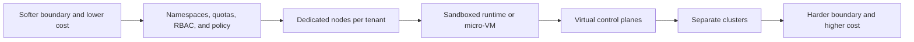
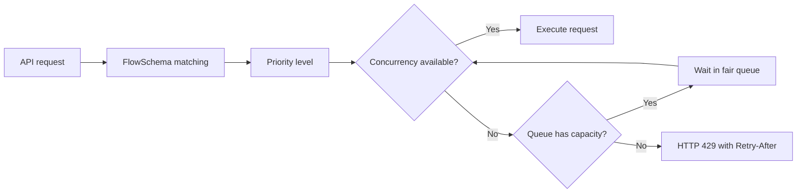

# Chapter 31 — Multitenancy, Policy, and Governance

> **Learning Objectives**
>
> By the end of this chapter, you will be able to:
>
> - Decide whether teams can share one cluster, or whether each needs its own, based on how much they trust each other
> - Set up `ResourceQuota` and `LimitRange` so one team cannot use up everything and starve the rest
> - Lock down what Pods may do using Pod Security Admission, and know when you need more than it offers
> - Grant permissions in ways that still make sense after an audit and after people leave
> - Explain how the API server keeps one noisy client from crowding out everyone else
> - Turn on the audit log and read what it recorded
> - Follow feature gates and deprecations so a cluster upgrade does not break your manifests

---

## 31.1 One cluster, many tenants

Picture two apartment buildings. One is a converted house: thin interior walls, shared plumbing, and a landlord who trusts everyone to be reasonable. The other is a poured-concrete high-rise, with fire-rated walls between units and separate meters for each.

Both are multi-unit housing. What differs is how strong the wall between neighbors is, and whether it holds when one of them is hostile.

A Kubernetes cluster is the building. Your teams, apps, and customers are the residents. **Multitenancy** means letting more than one of them share the cluster.

The question to ask is not "how do I split the cluster?" It is "how much do these tenants trust each other, and what happens when one of them misbehaves?" Everything in this chapter follows from that answer: how you divide namespaces, how you cap resource use, which security profile you enforce, and who may do what.

Sharing is appealing because clusters cost real money whether they are busy or not. Control-plane nodes, monitoring, and the platform team's attention are fixed costs. Putting many tenants on one cluster spreads those costs and leaves you with fewer clusters to run.

The risk is that Kubernetes namespaces are soft walls by default. They are drywall, not concrete. This chapter is about knowing which walls you actually have, and reinforcing them on purpose.

> 💡 **Tip:** Write down your tenants and their trust relationship *before* touching YAML. "Three internal teams who trust each other" and "hostile customers running arbitrary code" lead to completely different architectures.

---

## 31.2 Tenancy models

### In plain terms

A **tenancy model** is your answer to one question: what actually separates one tenant from another? There are two honest answers.

- **Soft multitenancy (namespaces as tenants):** everyone lives in the same cluster, separated by namespaces, quotas, RBAC, and policy. Good when tenants are *cooperative* — teams inside one company. The kernel and control plane are shared, so a determined attacker who escapes a container could, in principle, reach a neighbor.
- **Hard multitenancy (clusters as tenants):** each tenant gets its own cluster (or a strongly isolated virtual control plane). Good when tenants are *untrusted* — external customers running arbitrary workloads. Stronger boundary, higher cost and operational overhead.

The choice matters because it decides what happens on your worst day. With soft tenancy, one tenant's mistake can affect the others, and the containment you get is only as good as the controls you configured. With hard tenancy, a compromised tenant is a compromised cluster and nothing more, which is why regulators and external customers usually require it.

Most organizations land in the middle. Internal teams that trust each other share a cluster with soft tenancy. Anything running code you did not write gets its own cluster, or at least a sandboxed runtime.

> 💡 **In one line:** A namespace is a name and policy boundary. It is not a wall between kernels, and it never was.

Be honest about which one you have. Namespaces on their own isolate almost nothing. They become a real boundary only once you add quotas, Pod Security Admission, NetworkPolicies, and carefully scoped RBAC, and even then two tenants still share the same nodes and the same Linux kernel. Selling that as hard isolation to a regulated customer is a promise you cannot keep.

> ⚠️ **Common Pitfall:** Soft multi-tenancy sold as hard isolation to regulated tenants.

### Under the hood

Here is what a namespace actually gives you, and how to strengthen the boundary further.

The building block of soft multitenancy is the **namespace**. It is a scope for names and a hook for policy — it is *not* a security sandbox by itself. A namespace gives you:

- A place to attach `ResourceQuota` and `LimitRange`
- A subject boundary for `Role`/`RoleBinding` RBAC
- A label target for Pod Security Admission
- A DNS scope (`svc.<ns>.svc.cluster.local`) and a NetworkPolicy scope

```bash
$ kubectl create namespace team-payments
namespace/team-payments created

$ kubectl label namespace team-payments team=payments cost-center=fin-204
namespace/team-payments labeled
```

What a namespace does **not** give you: a separate kernel, a separate API server, node-level isolation, or protection from a container escape. Pods from different namespaces can land on the same node and share that node's kernel.

For stronger isolation without one-cluster-per-tenant, three techniques stack up:

| Technique | Boundary strengthened | Cost |
|---|---|---|
| Node isolation (taints + `nodeSelector`/affinity per tenant) | Tenants no longer share a kernel/node | Lower bin-packing efficiency |
| Sandboxed runtimes (gVisor, Kata Containers via `RuntimeClass`) | Container escape is contained by a user-space kernel or micro-VM | Some performance overhead |
| Virtual control planes (e.g. the vCluster pattern) | Each tenant gets an apparent API server and CRDs | Extra moving parts to operate |



*Figure 31.1: Tenancy is a spectrum of isolation strength, not a binary choice.*

### In production

**Ownership:** The platform team chooses the tenancy model and owns the guardrails. Tenants own their workloads within that contract.

**Failure mode:** A noisy neighbor or a container escape turns into an incident that crosses tenants. Detect it through quota breaches and denied network connections. Reduce it by layering the controls from Chapters 19, 21, and 24 rather than relying on any single one.

| Do | Don't |
|----|-------|
| Match model to isolation needs | Promise hypervisor isolation with shared nodes casually |
| Document shared fate | Unlimited cluster-admin per tenant |

**Before you leave this section**

- **Understand:** Tenancy model sets blast radius—namespaces need layered controls.
- **Try:** Classify your lab as soft vs hard tenancy and why.
- **Watch in prod:** Overpromised isolation.


---

## 31.3 ResourceQuota: capping a tenant's share

### In plain terms

A **ResourceQuota** is a hard ceiling on what one namespace may use in total: so much CPU, so much memory, so many Pods, so many Services. It is the electricity meter and the fuse box for that tenant.

Without one, nothing stops a single team from taking the whole cluster. A Deployment with a typo in its replica count, or an autoscaler with a bad target, will happily request every core you have. The other tenants find out when their Pods stop being scheduled and their running Pods get evicted, and none of them did anything wrong.

A quota turns that shared disaster into a local one. The offending namespace hits its ceiling and its own creates start failing, which is annoying for one team and invisible to everyone else. That is the trade you want.

Cap object counts as well as compute, because compute is not the only thing that hurts. Tens of thousands of Secrets, ConfigMaps, or custom resources put real pressure on etcd and the API server, and no amount of CPU quota stops that. Use the `count/<resource>.<group>` form so custom resources are covered too.

> ⚠️ **Common Pitfall:** Quotas on CPU/memory only while allowing unbounded Secret/ConfigMap counts.

### Under the hood

Here is a full quota and what happens when it binds.

`ResourceQuota` is enforced by an admission controller. When a request would push a namespace over its quota, the API server rejects it at creation time.

```yaml
apiVersion: v1
kind: ResourceQuota
metadata:
  name: team-payments-quota
  namespace: team-payments
spec:
  hard:
    requests.cpu: "20"
    requests.memory: 40Gi
    limits.cpu: "40"
    limits.memory: 80Gi
    pods: "100"
    count/deployments.apps: "50"
    services.loadbalancers: "2"
    persistentvolumeclaims: "30"
    requests.storage: 500Gi
```

```bash
$ kubectl apply -f team-payments-quota.yaml
resourcequota/team-payments-quota created

$ kubectl get resourcequota -n team-payments
NAME                  AGE   REQUEST                                                          LIMIT
team-payments-quota   5s    pods: 12/100, requests.cpu: 6/20, requests.memory: 12Gi/40Gi    limits.cpu: 9/40, limits.memory: 20Gi/80Gi
```

Two categories of quota matter most:

- **Compute quotas** (`requests.cpu`, `limits.memory`, …) govern the sum of all containers' requests and limits. The catch: once *any* compute quota is set, every pod in the namespace **must** declare the matching request/limit or it is rejected. That is what `LimitRange` (next section) is for.
- **Object-count quotas** (`pods`, `services`, `count/<resource>.<group>`) cap how many of a kind can exist. The generic `count/deployments.apps` syntax works for almost any resource, including CRDs.

You can also scope a quota. A common pattern caps high-priority workloads separately using `scopeSelector`:

```yaml
spec:
  hard:
    pods: "10"
  scopeSelector:
    matchExpressions:
      - operator: In
        scopeName: PriorityClass
        values: ["high"]
```

### In production

**Ownership:** The platform team assigns each namespace a quota class. Tenants ask for an increase through a ticket, and the request gets a capacity review before it is granted.

**Failure mode:** A deploy stops halfway because the namespace hit its quota. Detect it by tracking used against hard limits for every tenant, not just the ones that complain. Prevent it with dashboards tenants can see themselves and enough headroom that normal growth does not hit the ceiling.

| Do | Don't |
|----|-------|
| Include object-count quotas | Silent infinite namespaces |
| Capacity review on bumps | Copy prod quota into tiny clusters blindly |

**Before you leave this section**

- **Understand:** Quotas enforce fair share; include object counts.
- **Try:** Inspect a tenant namespace’s quota used vs hard.
- **Watch in prod:** API spam without object quotas.


---

## 31.4 LimitRange: sane defaults and guardrails per object

### In plain terms

A **LimitRange** sets rules for each individual object in a namespace, rather than for the namespace as a whole. It supplies a default request when someone forgot to set one, a ceiling no single container may exceed, and a floor so nobody requests `1m` of CPU to sneak onto a busy node.

The two work as a pair, which is easier to see through the problem they create together. The moment you set a compute quota, every Pod in that namespace must declare its CPU and memory requests, or the API server rejects it. Suddenly every manifest that omitted resources stops working, and the team blames the cluster.

A LimitRange fixes that by filling in the missing values automatically. The quota still counts totals; the LimitRange makes sure each Pod arrives with numbers to count. One is the building's total power budget, the other is the rule about how much any single appliance may draw.

Choose the defaults carefully, since they apply to Pods nobody thought about. Set them too high and two forgotten Pods consume the entire namespace quota. Set them too low and applications get throttled or killed for no obvious reason. Look at what workloads in that tier actually use, and revisit the numbers rather than copying them between clusters forever.

> ⚠️ **Common Pitfall:** Defaults so high that two Pods exhaust the namespace quota.

### Under the hood

Here is a LimitRange covering both containers and volume claims.

```yaml
apiVersion: v1
kind: LimitRange
metadata:
  name: team-payments-limits
  namespace: team-payments
spec:
  limits:
    - type: Container
      default:                 # applied as the limit if none set
        cpu: "500m"
        memory: 512Mi
      defaultRequest:          # applied as the request if none set
        cpu: "100m"
        memory: 128Mi
      max:                     # no container may exceed these
        cpu: "2"
        memory: 2Gi
      min:                     # no container may request less
        cpu: "50m"
        memory: 64Mi
    - type: PersistentVolumeClaim
      max:
        storage: 100Gi
      min:
        storage: 1Gi
```

The interaction with quota is the key insight. With the `LimitRange` above, a developer can submit a bare pod with no resource stanza:

```yaml
apiVersion: v1
kind: Pod
metadata:
  name: quick-test
  namespace: team-payments
spec:
  containers:
    - name: app
      image: ghcr.io/example/task-api:1.0.0
```

The `LimitRange` admission controller mutates it to carry `requests: {cpu: 100m, memory: 128Mi}` and `limits: {cpu: 500m, memory: 512Mi}`. *Now* the `ResourceQuota` can account for it, and the pod is admitted. Without the `LimitRange`, that same pod would be rejected by the quota for having no requests.

### In production

**Ownership:** The platform team owns a LimitRange template for each service tier. Tenants set their own values within the allowed range.

**Failure mode:** Defaults that are too generous exhaust the namespace quota after a couple of Pods. Detect it from creation failures and by looking at how often resources are being filled in by default rather than declared. Fix it by tuning the templates against what workloads in that tier really use.

| Do | Don't |
|----|-------|
| Defaults fit quota math | No LimitRange in multi-tenant NS |
| Document min/max | Defaults that force privileged patterns |

**Before you leave this section**

- **Understand:** LimitRange defaults must fit quota arithmetic.
- **Try:** Apply a LimitRange and create a Pod without requests.
- **Watch in prod:** Defaults that exhaust quotas immediately.


---

## 31.5 Pod Security Standards, in depth

### In plain terms

**Pod Security Standards**, abbreviated **PSS**, are three named security profiles: `privileged`, `baseline`, and `restricted`. Each describes how locked down a Pod's spec has to be. **Pod Security Admission**, or **PSA**, is the built-in checker that enforces one of those profiles on a namespace, chosen with labels.

PSS is the building code. PSA is the inspector standing at the door.

You want this because a Pod can ask for far more power than it needs. Run as root, mount the host's filesystem, share the host's network namespace, add kernel capabilities. Any one of those turns a compromised container into a compromised node. Nothing in Kubernetes stops a team from asking, unless something is checking.

PSA is the check, and it is a good one because it is built in, always on, and enforced per namespace, which fits multitenancy exactly. It replaced PodSecurityPolicy, removed back in 1.25, and is a stable part of Kubernetes 1.36.

The discipline to keep is about exceptions. Some namespaces genuinely need `privileged`: the network plugin, storage drivers, and monitoring agents really do need host access. The failure pattern is granting the same exception to an app team "temporarily" while they fix an image, and finding it still there two years later. Every exception needs a ticket, a reason, and an expiry date, or you have quietly turned the whole cluster back into `privileged`.

> ⚠️ **Common Pitfall:** Permanent privileged exceptions without expiry.

### Under the hood

Here are the three profiles, the three modes, and a Pod that satisfies the strictest one.

The three profiles form a ladder:

| Profile | What it allows | Typical use |
|---|---|---|
| `privileged` | Everything; no restrictions | System/infra namespaces (CNI, CSI, monitoring agents) that genuinely need host access |
| `baseline` | Blocks the well-known escapes: `privileged: true`, host namespaces, most `hostPath`, adding dangerous capabilities | Reasonable default for general apps |
| `restricted` | Everything in baseline **plus** must run non-root, drop `ALL` capabilities, `seccompProfile: RuntimeDefault`, `allowPrivilegeEscalation: false`, restricted volume types | The target for anything you can harden |

PSA runs in three independent **modes**, each with its own label, so you can observe before you enforce:

- `enforce` — reject violating pods
- `audit` — allow, but record a violation in the audit log
- `warn` — allow, but return a warning to the client (`kubectl` prints it)

```bash
$ kubectl label namespace team-payments \
    pod-security.kubernetes.io/enforce=baseline \
    pod-security.kubernetes.io/enforce-version=v1.36 \
    pod-security.kubernetes.io/warn=restricted \
    pod-security.kubernetes.io/warn-version=v1.36 \
    pod-security.kubernetes.io/audit=restricted \
    pod-security.kubernetes.io/audit-version=v1.36 \
    --overwrite
namespace/team-payments labeled
```

This says: *enforce* `baseline` (reject the obviously dangerous), but *warn* and *audit* against `restricted` so you can see how far each workload is from the hardened target. Pinning `*-version` to `v1.36` (rather than `latest`) freezes the rule set, so a cluster upgrade cannot silently tighten enforcement and break running teams.

A pod that violates the enforced profile is rejected clearly:

```bash
$ kubectl apply -f privileged-pod.yaml
Error from server (Forbidden): error when creating "privileged-pod.yaml":
pods "snoop" is forbidden: violates PodSecurity "baseline:v1.36":
privileged (container "snoop" must not set securityContext.privileged=true)
```

Here is the shape of a pod that satisfies `restricted`:

```yaml
apiVersion: v1
kind: Pod
metadata:
  name: hardened
  namespace: team-payments
spec:
  securityContext:
    runAsNonRoot: true
    seccompProfile:
      type: RuntimeDefault
  containers:
    - name: app
      image: ghcr.io/example/task-api:1.0.0
      securityContext:
        allowPrivilegeEscalation: false
        capabilities:
          drop: ["ALL"]
        readOnlyRootFilesystem: true
      volumeMounts:
        - name: tmp
          mountPath: /tmp
  volumes:
    - name: tmp
      emptyDir: {}
```

### In production

**Ownership:** The platform team sets the PSS labels for each class of namespace. Every exemption has a ticket and an expiry date.

**Failure mode:** A privileged Pod becomes the route from one compromised container to the whole node. Detect it with PSA audit records and by keeping an inventory of every privileged Pod running. Contain it by making exemptions time-boxed so they expire on their own.

| Do | Don't |
|----|-------|
| baseline/restricted by default | Open privileged for convenience |
| Expire exemptions | One privileged label for all tenants |

**Before you leave this section**

- **Understand:** PSS is a tenancy control with managed exemptions.
- **Try:** List namespaces and their PSA enforce labels.
- **Watch in prod:** Eternal privileged exceptions.


---

## 31.6 RBAC good practices

### In plain terms

RBAC decides who may perform which action on which resource. Chapter 21 covered how it works; this section is about the habits that keep it safe once your cluster has dozens of humans, CI pipelines, and controllers in it.

The reason habits matter more than mechanics is that RBAC rots quietly. Nobody grants too much access on purpose. It happens one shortcut at a time: a binding made during an incident and never removed, a CI account given `cluster-admin` because the exact permission was hard to find, an engineer who left the team but not the group. None of it fails visibly. It just accumulates until a leaked token can do anything.

Two habits prevent most of it. Give tenant admins full control of their own namespace and nothing outside it, using a `Role` and `RoleBinding` rather than cluster-wide grants. And bind to groups instead of individuals, so access follows the group membership your identity provider already manages, and leaving a team actually removes access.

Watch read access too. Granting everyone a cluster-wide reader role feels harmless, and it means every engineer can read every Secret in every namespace. In a multi-tenant cluster that is a data leak waiting for an audit to find it.

> ⚠️ **Common Pitfall:** Binding tenant CI to cluster-admin.

### Under the hood

Here are the practices that matter most, with the YAML for each.

The good practices that matter most in a multi-tenant cluster:

1. **Prefer `Role` + `RoleBinding` over cluster-wide grants.** Namespaced permissions keep a tenant's blast radius inside their namespace. Reach for `ClusterRole`/`ClusterRoleBinding` only for genuinely cluster-scoped needs (nodes, PVs, CRDs).

2. **Bind a `ClusterRole` with a namespaced `RoleBinding` to reuse rules safely.** This is the idiomatic way to grant a common permission set (like a reusable "logs reader") in just one namespace:

```yaml
apiVersion: rbac.authorization.k8s.io/v1
kind: RoleBinding
metadata:
  name: payments-viewers
  namespace: team-payments
subjects:
  - kind: Group
    name: payments-team
    apiGroup: rbac.authorization.k8s.io
roleRef:
  kind: ClusterRole          # reuse the built-in "view" role...
  name: view                 # ...but only inside team-payments
  apiGroup: rbac.authorization.k8s.io
```

3. **Separate identities by function.** A human admin, the CI deployer, and the running workload's ServiceAccount should be three different subjects with three different permission sets. When the CI token leaks, it should not also be your break-glass admin.

4. **Avoid wildcards.** `verbs: ["*"]` or `resources: ["*"]` grants tomorrow's new resource types too. Enumerate what you mean.

5. **Never bind `cluster-admin` "just for now."** It is the single most common way clusters get compromised. If someone needs broad power temporarily, use a time-boxed break-glass procedure and audit it.

6. **Verify with `kubectl auth can-i`** — as the *subject*, not as yourself:

```bash
$ kubectl auth can-i delete pods -n team-payments \
    --as=system:serviceaccount:team-payments:ci-deployer
no

$ kubectl auth can-i --list \
    --as=system:serviceaccount:team-payments:ci-deployer -n team-payments
Resources        Non-Resource URLs   Resource Names   Verbs
deployments.apps  []                 []               [get list create update patch]
pods              []                 []               [get list watch]
```

7. **Watch out for privilege escalation via `escalate`/`bind`.** A subject who can create `RoleBindings` in a namespace can grant themselves any permission that exists there unless restricted. Kubernetes guards this: to create a binding to a role, you must already hold those permissions (or hold the `escalate` verb). Do not hand out `escalate`.

8. **Aggregate carefully.** ClusterRoles can aggregate others via `aggregationRule` and label selectors — powerful for platform roles, but it means adding a labeled ClusterRole silently expands an aggregated role. Review label selectors when auditing.

### In production

**Ownership:** The platform team owns the binding patterns everyone uses. Tenants manage Roles inside their own namespace within those guardrails.

**Failure mode:** Someone gains privileges that reach into another tenant. Detect it by auditing every change to ClusterRoleBindings, which are the grants that cross namespaces. Prevent it by granting the least access that works and reviewing who has what on a fixed schedule.

| Do | Don't |
|----|-------|
| Namespace-scoped tenant admin | cluster-admin per tenant |
| Access reviews | Orphaned bindings after offboarding |

**Before you leave this section**

- **Understand:** Tenant RBAC stays namespaced; review bindings.
- **Try:** List ClusterRoleBindings and justify each.
- **Watch in prod:** Tenant CI with cluster-admin.

> 🏭 **Production floor:** **RBAC least privilege** for tenants: no cluster-admin, CI uses deploy-only Roles, paste `auth can-i` evidence in onboarding tickets.


---

## 31.7 API Priority and Fairness

### In plain terms

**API Priority and Fairness**, usually shortened to **APF**, decides which requests the API server handles first when more arrive than it can process. It sorts traffic into categories, gives each a share of capacity, and queues the rest.

The API server is the front door to everything, and it has a finite number of requests it can serve at once. Without APF, whoever shouts loudest wins. One badly written controller listing every Pod in the cluster every second can consume the whole budget, and then kubelet heartbeats start timing out, nodes are marked `NotReady`, and your `kubectl` hangs. A single tenant's bug becomes a cluster outage.

APF prevents that by protecting the traffic that must not fail. Leader election and kubelet heartbeats sit in high-priority levels with reserved capacity. Everyday requests share a general pool. Within a level, requests are also spread across users, so one noisy client cannot crowd out its peers. When a level is full, extra requests wait in a queue and are eventually rejected with HTTP 429 and a `Retry-After`, which well-behaved clients handle by backing off.

Those 429s are the system working, not breaking. The instinct when the API feels slow is to turn APF off or raise every limit, and that removes the only thing keeping one client from starving the rest. Read the `apiserver_flowcontrol_*` metrics first, find which user or verb is generating the load, and fix that. If you must change the configuration, the useful move is usually to push the offender into its own low-priority level rather than to give everyone more room. Note also that rate limiting at your ingress does nothing here, because this traffic comes from inside the cluster.

> ⚠️ **Common Pitfall:** Disabling APF to “fix” timeouts without understanding workload.

### Under the hood

Here are the two objects that configure it and how to isolate a noisy client.

APF replaces a crude global `--max-requests-inflight` limit with fair queuing across categories of traffic. Two object types configure it:

- **`FlowSchema`** — matches incoming requests (by user, ServiceAccount, verb, resource) and assigns them to a priority level, plus a "flow distinguisher" (e.g. by user) so one noisy client does not crowd out its peers *within* the same priority level.
- **`PriorityLevelConfiguration`** — defines a priority level's share of the server's concurrency and its queuing behavior.

Kubernetes ships sensible defaults. Critical traffic (leader election, kubelet, system components) is protected in high-priority levels; a catch-all `global-default` handles everyday requests; and there is a special exempt level for the most critical system calls.

```bash
$ kubectl get flowschemas
NAME                           PRIORITYLEVEL     MATCHINGPRECEDENCE   AGE
exempt                         exempt            1                    40d
system-leader-election         leader-election   100                  40d
kube-controller-manager        workload-high     800                  40d
service-accounts               workload-low      9000                 40d
global-default                 global-default    9900                 40d

$ kubectl get prioritylevelconfigurations
NAME              TYPE      NOMINALCONCURRENCYSHARES   QUEUES   AGE
exempt            Exempt    <none>                     <none>   40d
workload-high     Limited   98                         128      40d
workload-low      Limited   98                         128      40d
global-default    Limited   20                         128      40d
```

When a priority level is saturated, excess requests are **queued** (up to a limit) and then rejected with **HTTP 429 (Too Many Requests)** and a `Retry-After`. Well-behaved clients back off and retry. You can see rejections and waits in the API server's `apiserver_flowcontrol_*` metrics.



*Figure 31.3: API Priority and Fairness classifies requests, protects concurrency, and rejects only after the matching queue fills.*

A custom `FlowSchema` is useful to *isolate* a badly behaved integration into its own low-priority level so it cannot harm anyone else:

```yaml
apiVersion: flowcontrol.apiserver.k8s.io/v1
kind: PriorityLevelConfiguration
metadata:
  name: batch-low
spec:
  type: Limited
  limited:
    nominalConcurrencyShares: 5
    limitResponse:
      type: Queue
      queuing:
        queues: 64
        queueLengthLimit: 50
        handSize: 6
---
apiVersion: flowcontrol.apiserver.k8s.io/v1
kind: FlowSchema
metadata:
  name: batch-jobs
spec:
  priorityLevelConfiguration:
    name: batch-low
  matchingPrecedence: 1000
  distinguisherMethod:
    type: ByUser
  rules:
    - subjects:
        - kind: ServiceAccount
          serviceAccount:
            name: batch-runner
            namespace: analytics
      resourceRules:
        - verbs: ["list", "get", "watch"]
          apiGroups: [""]
          resources: ["pods"]
          namespaces: ["*"]
```

### In production

**Ownership:** The platform team owns the APF configuration, and investigates the cause before raising any limit.

**Failure mode:** The API server slows down or starts returning errors under load. Detect it with the APF metrics for rejected requests and queue wait times. Fix it by identifying which user or verb is generating the traffic and tuning from there, not by widening every limit.

| Do | Don't |
|----|-------|
| Watch APF metrics | Disable APF in prod |
| Find noisy controllers | Blindly raise all limits |

**Before you leave this section**

- **Understand:** APF sheds/fair-queues API load—tune with evidence.
- **Try:** Find APF metrics on your metrics stack if exposed.
- **Watch in prod:** API storms from runaway controllers.


---

## 31.8 Auditing

### In plain terms

The **audit log** is a record of every request the API server handled: who made it, what they asked for, which object it touched, when, and whether it was allowed. It is the cluster's security camera.

You need it for the questions that only come up afterward. Who deleted that namespace? When did this ServiceAccount get `cluster-admin`? Was the leaked token used, and what did it touch? Without an audit log those questions have no answer, and in a shared cluster "we cannot tell which tenant did it" is a bad thing to say out loud.

Two design points make the difference between a log and actual evidence. It must be complete enough, which means the policy has to record the things you will care about later, particularly RBAC changes, Secret access, and deletes. And it must be somewhere the people it watches cannot reach. Ship it off the cluster to storage that cannot be edited or deleted, because an audit trail a tenant can erase is not an audit trail.

Check what you actually have rather than assuming. Managed Kubernetes usually has API auditing available but not necessarily switched on, and your cloud provider's own activity log records what happened to the cloud resources, not who changed RBAC inside the cluster. Those are different logs answering different questions.

> ⚠️ **Common Pitfall:** Tenants able to delete their audit trails.

### Under the hood

Here is how the policy is configured and what an event looks like.

Auditing is configured on the **API server** (not via a cluster object), because the API server is where all mutations flow. You provide an **audit policy** file and a backend (log file or webhook):

```yaml
# audit-policy.yaml
apiVersion: audit.k8s.io/v1
kind: Policy
omitStages:
  - RequestReceived
rules:
  # Don't log noisy, low-value reads
  - level: None
    resources:
      - group: ""
        resources: ["events"]
  # Log secret access at Metadata level (never log the secret body)
  - level: Metadata
    resources:
      - group: ""
        resources: ["secrets", "configmaps"]
  # Log RBAC changes with full request/response bodies
  - level: RequestResponse
    resources:
      - group: "rbac.authorization.k8s.io"
        resources: ["roles", "clusterroles", "rolebindings", "clusterrolebindings"]
  # Everything else: metadata only
  - level: Metadata
```

The four audit **levels** control how much is captured per rule:

| Level | Captures |
|---|---|
| `None` | Nothing (use to drop noise) |
| `Metadata` | Who/what/when/verb/response code — no bodies |
| `Request` | Metadata + the request body |
| `RequestResponse` | Metadata + request and response bodies |

On a self-managed control plane you wire it into the API server:

```text
--audit-policy-file=/etc/kubernetes/audit-policy.yaml
--audit-log-path=/var/log/kubernetes/audit.log
--audit-log-maxage=30
--audit-log-maxbackup=10
--audit-log-maxsize=100
```

A single event looks like this (trimmed):

```json
{
  "kind": "Event",
  "level": "RequestResponse",
  "verb": "create",
  "user": { "username": "alice@example.com", "groups": ["payments-team"] },
  "objectRef": {
    "resource": "rolebindings",
    "namespace": "team-payments",
    "name": "payments-admin"
  },
  "responseStatus": { "code": 201 },
  "requestReceivedTimestamp": "2026-07-25T18:04:11Z",
  "stageTimestamp":         "2026-07-25T18:04:11Z"
}
```

### In production

**Ownership:** The platform team owns shipping audit logs to storage nobody can alter. The security team owns the rules that watch those logs for trouble.

**Failure mode:** An incident crosses tenants and there is no record of what happened. Detect the gap in advance by tracking whether the audit pipeline is actually delivering events. Prevent it by writing to central storage that cannot be edited or deleted.

| Do | Don't |
|----|-------|
| Immutable off-cluster audits | Audits only on control-plane disk |
| Alert on privileged bindings | Tenant-writable audit buckets |

**Before you leave this section**

- **Understand:** Audits are multi-tenant incident evidence—protect them.
- **Try:** Query one tenant’s Secret access in audits if available.
- **Watch in prod:** Missing API audits in “managed” clusters.


---

## 31.9 Feature gates, deprecation, and API migration

### In plain terms

Kubernetes changes three times a year, and two mechanisms keep that from being chaos. A **feature gate** is a named on/off switch for a feature as it matures from Alpha to Beta to generally available, so you can adopt it early or wait. The **deprecation policy** is the project's promise about how long an API stays available after it is marked for removal.

This belongs in a governance chapter because it is the part of upgrades that catches teams by surprise. An API version is not removed on the day it is deprecated. It keeps working, and your manifests keep applying, and a warning scrolls past in CI that nobody reads. Then one upgrade removes it, and manifests that worked yesterday are rejected today. The outage was scheduled months ago; you just were not watching the calendar.

So treat a deprecation warning as a dated task rather than noise. Fail your CI build on APIs the next version will remove. Run a scanner such as `kubent` or Pluto against your live objects and your manifests before an upgrade, not during it. The migration itself is usually trivial, changing an `apiVersion` line, because Kubernetes serves the same object through all its supported versions. It is only painful when discovered at the worst possible moment.

Be similarly deliberate about feature gates. Alpha features are off by default because they can change or disappear in any release, so enabling one in production is a commitment you may have to unwind. Beta features are on by default and still evolving. Once a feature reaches GA the gate is locked on and eventually removed entirely.

> ⚠️ **Common Pitfall:** Ignoring deprecation warnings in CI until upgrade day.

### Under the hood

Here are the maturity stages, the support windows, and how to find deprecated usage.

**Feature gates** are named booleans passed to control-plane components and the kubelet:

| Stage | Default | Meaning |
|---|---|---|
| Alpha | off | Experimental; may change or be removed; not for production |
| Beta | on (by default) | Well-tested; enabled by default but still evolving |
| GA (Stable) | on, locked | Generally available; the gate becomes a no-op and is later removed |

You can inspect and (on self-managed clusters) set them:

```text
--feature-gates=MutatingAdmissionPolicy=true,SomeAlphaThing=false
```

A concrete 1.36 example from this book's stack: **DRA admin access** (`DRAAdminAccess`) went **Alpha in 1.33, Beta in 1.34, and GA in 1.36** — you will meet it again in Chapter 33. Once GA, the gate is on and locked; eventually the flag itself is removed.

**The deprecation policy** is the contract that makes upgrades safe:

- **Stable (GA) API versions** (`v1`) may be deprecated but are supported for a long window — a deprecated GA API element is supported for **no fewer than 12 months or 3 releases**, whichever is longer — before removal.
- **Beta** versions are supported for 3 releases (or 9 months) after deprecation.
- **Alpha** versions may change or disappear in any release.

A key rule: **the same object is reachable through all its served API versions.** A resource created via `apps/v1beta1` is readable via `apps/v1` — Kubernetes converts between versions internally through a common storage version. That is what makes migration a *relabel*, not a *rewrite*.

**Detecting deprecated API use** before an upgrade removes it:

```bash
# Warnings are emitted automatically by newer clients:
$ kubectl apply -f old-ingress.yaml
Warning: extensions/v1beta1 Ingress is deprecated in v1.14+, unavailable in v1.22+;
use networking.k8s.io/v1 Ingress

# Audit-annotation metric on the API server counts deprecated requests:
apiserver_requested_deprecated_apis
```

Tools like **`kubent` (kube-no-trouble)** and **Pluto** scan live objects and manifests for APIs that a target version will remove.

### In production

**Ownership:** The platform team publishes which API versions are allowed. App teams migrate off deprecated ones before the upgrade wave reaches them.

**Failure mode:** An upgrade cannot proceed because workloads still use APIs the new version removed. Detect it continuously with the API server's deprecated-request metrics, not in the upgrade window. Prevent it with CI checks that fail on removed APIs and migration pull requests raised early.

| Do | Don't |
|----|-------|
| Fail CI on removed APIs | Silence deprecation warnings |
| Migrate before upgrade | Enable alpha gates in prod casually |

**Before you leave this section**

- **Understand:** Deprecations are scheduled outages if ignored—migrate early.
- **Try:** Scan manifests for deprecated apiVersions.
- **Watch in prod:** Upgrade-day API removals.


---

## 31.10 Common pitfalls

> ⚠️ **Common Pitfall:** Treating namespaces as hard security boundaries. They isolate names and policy, not kernels. Untrusted code needs separate clusters or a sandboxed runtime.

> ⚠️ **Common Pitfall:** Setting a `ResourceQuota` without a matching `LimitRange`. Pods without explicit requests/limits are then rejected, and developers blame "the cluster."

> ⚠️ **Common Pitfall:** Jumping straight to `enforce=restricted` on a busy namespace. Roll out `warn`/`audit` first, fix workloads, then enforce.

> ⚠️ **Common Pitfall:** Granting `cluster-admin` to CI. A leaked pipeline token then owns the cluster. Scope CI to exactly the namespaces and verbs it needs.

> ⚠️ **Common Pitfall:** Reading `429`s from the API server as "too small a control plane." Usually it is one client over-polling; APF is protecting everyone else.

> ⚠️ **Common Pitfall:** Discovering a removed API *after* upgrading. Scan with `kubent`/Pluto and read Urgent Upgrade Notes first.

---

## 31.11 Hands-on exercises

1. **Tenancy design.** For each scenario, decide soft vs hard multitenancy and justify it in two sentences: (a) three internal microservice teams; (b) a SaaS running customer-supplied container images; (c) a data-science group needing GPUs. 
2. **Quota + LimitRange pair.** Create a namespace `lab`, apply a `ResourceQuota` (`requests.cpu: 4`, `pods: 10`) and a matching `LimitRange` with defaults. Deploy a pod with *no* resource stanza and confirm it is admitted and mutated. Then remove the `LimitRange`, delete and recreate the pod, and observe the rejection.
3. **PSA ladder.** Label `lab` with `warn=restricted` and `enforce=baseline` (pin to `v1.36`). Apply a pod that runs as root and note the warning but successful creation. Then set `enforce=restricted` and confirm the same pod is now rejected. Fix the pod to satisfy `restricted`.
4. **RBAC least privilege.** Create a ServiceAccount `ci-deployer` in `lab`, bind the built-in `edit` ClusterRole via a namespaced RoleBinding, and prove with `kubectl auth can-i --as=...` that it can create Deployments but cannot edit RBAC or read cluster-scoped nodes.
5. **APF isolation.** Inspect the default `flowschemas` and `prioritylevelconfigurations`. Write a low-share `PriorityLevelConfiguration` + `FlowSchema` that would corral a `batch-runner` ServiceAccount's `list pods` calls. Explain what a client sees when the level saturates.
6. **Deprecation scan.** Point `kubent` (or Pluto) at a manifest that uses a deprecated API version and produce the report. Rewrite the manifest to the stable version and confirm the scan is clean.

---

## 31.12 Check Your Understanding

**Q1.** Why is a namespace not a sufficient boundary for running untrusted, customer-supplied code?

<details>
<summary>Show answer</summary>

A namespace isolates names, RBAC scope, quotas, and policy — but pods across namespaces still share the node's kernel and control plane. A container escape or kernel exploit can cross a namespace boundary. Untrusted code needs a stronger boundary: separate clusters, node isolation, or a sandboxed `RuntimeClass` (gVisor/Kata).

</details>

**Q2.** You set a compute `ResourceQuota` on a namespace and suddenly plain pods are rejected with "must specify limits.cpu." What is missing and why?

<details>
<summary>Show answer</summary>

A `LimitRange`. Once any compute quota exists, every pod must declare the matching request/limit so quota can account for it. A `LimitRange` with `default`/`defaultRequest` fills those in automatically for pods that omit them.

</details>

**Q3.** What is the difference between the `enforce`, `audit`, and `warn` modes of Pod Security Admission?

<details>
<summary>Show answer</summary>

`enforce` rejects violating pods; `audit` allows them but records a violation in the audit log; `warn` allows them but returns a warning to the client. They are independent, so you can `enforce=baseline` while `warn=restricted`/`audit=restricted` to see how far workloads are from a stricter target before tightening.

</details>

**Q4.** A controller you wrote is causing HTTP 429s from the API server. Is enlarging the API server the right first move? What does APF want you to do?

<details>
<summary>Show answer</summary>

No — the `429`s mean APF is throttling your client to protect the cluster, which is working as designed. The fix is usually on the client: stop tight `list` loops and use a shared informer/watch cache, or isolate the integration into its own low-share `FlowSchema` so it cannot harm others. Only after fixing the client behavior would you consider control-plane capacity.

</details>

**Q5.** A beta API you use is deprecated in the next release but not yet removed. When and how should you migrate?

<details>
<summary>Show answer</summary>

Migrate *now*, while both versions are still served. Because every version of an object is reachable through all served API versions (backed by a common storage version), you can safely update your manifests to the stable version and re-apply — the same objects remain accessible. Do it ahead of the removal release, not during an upgrade outage, and scan with `kubent`/Pluto to confirm nothing still uses the old version.

</details>

---

## 31.13 Key takeaways

- Match the wall to the threat. Namespaces plus quotas, RBAC, and PSA work for teams that trust each other. Untrusted code needs its own cluster or a sandboxed runtime.
- A namespace is a name and policy boundary, not a kernel boundary. Say so plainly when someone asks about isolation.
- `ResourceQuota` caps the namespace total. `LimitRange` sets per-Pod defaults and bounds. Ship them together, because a quota alone rejects Pods with no requests.
- Cap object counts too. Thousands of Secrets hurt etcd no matter how much CPU quota you set.
- Pod Security Admission enforces `privileged`, `baseline`, or `restricted` per namespace. Pin the version label and give every exemption an expiry date.
- Grant namespaced Roles to groups, not cluster-wide roles to individuals. Cluster-wide read access still exposes every Secret.
- HTTP 429 from the API server means one client is being throttled to protect everyone else. Fix the client before touching APF.
- An audit log tenants can delete is not evidence. Ship it off the cluster to storage nobody can edit.
- Deprecated APIs are scheduled outages. Fail CI on them and migrate before the upgrade, not during it.

---

## 31.14 Official documentation map

| Topic | Official page |
|-------|---------------|
| Multi-tenancy overview | [Multi-tenancy](https://kubernetes.io/docs/concepts/security/multi-tenancy/) |
| Namespaces | [Namespaces](https://kubernetes.io/docs/concepts/overview/working-with-objects/namespaces/) |
| Resource quotas | [Resource Quotas](https://kubernetes.io/docs/concepts/policy/resource-quotas/) |
| Limit ranges | [Limit Ranges](https://kubernetes.io/docs/concepts/policy/limit-range/) |
| Pod Security Standards | [Pod Security Standards](https://kubernetes.io/docs/concepts/security/pod-security-standards/) |
| Pod Security Admission | [Enforce Pod Security Standards with Namespace Labels](https://kubernetes.io/docs/tasks/configure-pod-container/enforce-standards-namespace-labels/) |
| RBAC | [Using RBAC Authorization](https://kubernetes.io/docs/reference/access-authn-authz/rbac/) |
| API Priority and Fairness | [API Priority and Fairness](https://kubernetes.io/docs/concepts/cluster-administration/flow-control/) |
| Auditing | [Auditing](https://kubernetes.io/docs/tasks/debug/debug-cluster/audit/) |
| Feature gates | [Feature Gates](https://kubernetes.io/docs/reference/command-line-tools-reference/feature-gates/) |
| Deprecation policy | [Kubernetes Deprecation Policy](https://kubernetes.io/docs/reference/using-api/deprecation-policy/) |
| Deprecated API migration | [Deprecated API Migration Guide](https://kubernetes.io/docs/reference/using-api/deprecation-guide/) |

---

**Previous:** [Chapter 30 — Advanced Object Management](30-object-management-advanced.md) | **Next:** [Chapter 32 — Advanced Networking and Traffic](32-advanced-networking-traffic.md)