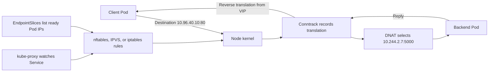
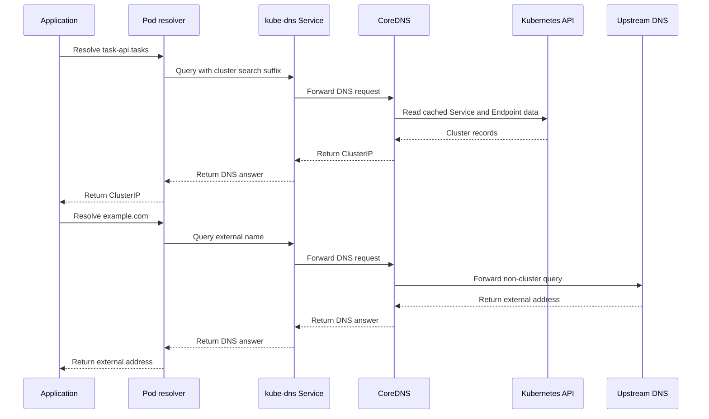
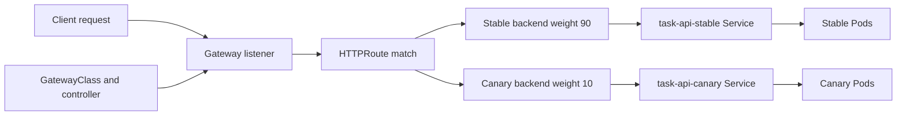

# Chapter 32 — Advanced Networking and Traffic

> **Learning Objectives**
>
> By the end of this chapter, you will be able to:
>
> - Explain how a Service IP that belongs to no network card still receives packets, and compare kube-proxy's iptables, IPVS, and newer nftables modes
> - Follow a name lookup from a Pod through CoreDNS and explain why some lookups are slow
> - Give Pods and Services both IPv4 and IPv6 addresses, and know what else has to change
> - Split traffic, match on headers, and rewrite URLs with the Gateway API instead of vendor annotations
> - Decide whether a service mesh is worth its complexity, or whether what you already have is enough

---

## 32.1 The city's hidden plumbing

Turn on a tap and water arrives. You never think about the reservoir, the pumping stations, the pressure regulators, or the pipes under the street.

Then one day the pressure drops. Now you need to know how all of it works, and you need to know today.

Kubernetes networking is the same deal. Earlier chapters handed you the taps. A Service has a stable name and IP. A Pod talks to it. An Ingress routes HTTP from outside. All of that works beautifully and you can build real systems without looking underneath.

Until a connection hangs for exactly thirty seconds. Or DNS is slow but only sometimes. Or a canary release quietly sends traffic to the wrong version. Those are plumbing problems, and no amount of reading the Service docs solves them.

So this chapter opens the walls. We start by following one request from a Pod to a backend, including the strange fact that a Service IP belongs to no network card anywhere. Then we look at how names become addresses, how to run IPv4 and IPv6 together, and how to split and reshape traffic with the Gateway API.

We finish with the question every platform team eventually argues about. Do we need a service mesh, or are we about to build a worse one by accident?

---

## 32.2 kube-proxy modes and virtual IPs

### In plain terms

A Service's ClusterIP is a **virtual IP**, often shortened to **VIP**. No network card anywhere owns it. It is an address the whole cluster has agreed to pretend exists.

So how does a packet sent to it arrive anywhere? Something on the node rewrites the destination address before the packet leaves, swapping the VIP for the real IP of one healthy Pod behind that Service. That something is **kube-proxy**, running on every node, or a CNI plugin doing the same job. It watches which Pods are ready and keeps the kernel's rules up to date.

Picture a receptionist with a directory. Callers all dial one number, and she connects each to whichever colleague is actually at their desk right now. The number never changes even as people come and go.

> 💡 **In one line:** A Service IP is not a place. It is a rule on each node that rewrites the destination to a real Pod.

Two practical consequences follow. First, a VIP is not a host, so pinging it proves nothing; test the actual Service port with `curl` or `nc` instead. Second, Services do not work by magic: if kube-proxy is unhealthy on a node, Pods on that node cannot reach any ClusterIP, and the symptom looks like a broken application. When connections time out for no obvious reason, check the health of kube-proxy or your CNI's replacement for it before you go reading application logs.

> ⚠️ **Common Pitfall:** Debugging app timeouts without checking kube-proxy/eBPF health on nodes.

### Under the hood

Here is how the pieces fit and how each mode programs the kernel.

The flow of a Service in three layers:

1. You create a `Service`; the API server allocates it a `ClusterIP` from the service CIDR.
2. **EndpointSlices** are maintained (by the endpointslice controller) listing the *ready* Pod IPs and ports behind that Service.
3. **kube-proxy** watches Services and EndpointSlices and programs the node's kernel so that traffic to the VIP is load-balanced to those Pod IPs.

The interesting part is *how* kube-proxy programs the kernel. It has three data-plane modes:

| Mode | Mechanism | Scaling behavior | Notes |
|---|---|---|---|
| `iptables` | Linear-ish chains of iptables rules; random selection for load balancing | Rule updates and matching cost grow with number of Services/endpoints | Long the default; battle-tested |
| `ipvs` | In-kernel IPVS hash tables with real LB schedulers (rr, lc, …) | O(1)-ish lookups; scales to thousands of Services | Needs kernel IPVS modules; richer algorithms |
| `nftables` | Modern `nftables` backend replacing iptables | Better update and lookup performance at scale | The recommended modern Linux mode; stable and increasingly the default |

> 💡 **Tip:** On Kubernetes 1.36, the **nftables** kube-proxy mode is stable and the recommended choice for new Linux clusters at scale, since the legacy `iptables` backend struggles as Service/endpoint counts grow. Many CNIs (e.g. Cilium) replace kube-proxy entirely with eBPF, achieving the same VIP behavior without iptables/IPVS at all.

Check which mode you are running:

```bash
$ kubectl -n kube-system get configmap kube-proxy -o yaml | grep mode
    mode: "nftables"

$ kubectl -n kube-system logs ds/kube-proxy | head -n 3
I0725 18:10:02  server_linux.go  Using nftables Proxier.
```

What the receptionist actually does for a `ClusterIP` VIP `10.96.40.10:80` backed by three Pods:

```text
Client Pod  ── dst 10.96.40.10:80 ──▶  [node kernel: DNAT via kube-proxy rules]
                                        ├─▶ 10.244.1.5:5000   (Pod A)
                                        ├─▶ 10.244.2.7:5000   (Pod B)
                                        └─▶ 10.244.3.9:5000   (Pod C)   (one chosen)
```

The kernel performs **DNAT** (destination NAT): it rewrites the destination from the VIP to a chosen Pod IP, records the mapping in the conntrack table, and the reply is un-NATed on the way back. The VIP never appears "on the wire" as a source or a real interface — it exists only as these translation rules.



*Figure 32.1: A ClusterIP is a virtual IP realized by kernel DNAT; kube-proxy programs the rules from EndpointSlices.*

Two Service traffic-policy fields change the receptionist's choices:

- **`internalTrafficPolicy: Local`** — route to Pods on the *same node* only (saves a hop, but if none exist locally, the traffic is dropped).
- **`externalTrafficPolicy: Local`** — for externally-facing Services, preserve the client source IP and avoid an extra hop, at the cost of uneven load if Pods are unevenly spread.

### In production

**Ownership:** The platform team owns which data-plane mode the cluster runs and when it changes. App teams own their Service definitions.

**Failure mode:** kube-proxy fails on a node and every ClusterIP silently stops working for Pods there. Detect it with probes that actually connect to a Service rather than only checking that the Pod is running. Reduce it by monitoring the kube-proxy DaemonSet on every node and changing modes in stages, never fleet-wide at once.

| Do | Don't |
|----|-------|
| Probe ClusterIP from Pods | Change proxy mode mid-incident fleet-wide |
| Document mode (iptables/IPVS/eBPF) | Assume cloud LB issues are always kube-proxy |

**Before you leave this section**

- **Understand:** Service VIPs need a healthy proxy/eBPF dataplane.
- **Try:** Identify your cluster’s kube-proxy mode.
- **Watch in prod:** Node-local Service blackholes.


---

## 32.3 DNS internals

### In plain terms

**CoreDNS** is the cluster's phone book. It is the service that turns a name such as `task-api` into an IP address, and it runs as an ordinary Deployment in `kube-system`.

Pods need it because IPs change constantly. Every deploy replaces Pods, and a Service's backends are different an hour later. Names are the only stable thing to write in a config file, so essentially every connection inside your cluster begins with a DNS lookup. That makes CoreDNS one of the busiest and most load-bearing components you run.

It also makes DNS a common suspect when things are slow, and this is where a little knowledge pays off. Two lines in every Pod's `/etc/resolv.conf` explain most surprising behavior. The **search** list appends cluster suffixes to short names, which is why `users` finds a Service in your own namespace. The **ndots** setting, normally 5, says any name with fewer than five dots should try those suffixes first.

That second one has a real cost. Looking up `example.com` from inside a Pod tries `example.com.tasks.svc.cluster.local`, then two more suffixes, and only then the name you meant. Four queries where you expected one, on every lookup, for every Pod. When someone says external calls feel slow, this is usually why. Ending the name with a dot, as in `example.com.`, skips the search entirely.

> ⚠️ **Common Pitfall:** Setting ndots without understanding extra search queries.

### Under the hood

Here is how a Pod is configured, what CoreDNS does with the query, and how it is set up.

CoreDNS runs as a Deployment in `kube-system`, fronted by a `ClusterIP` Service (conventionally `10.96.0.10`) named `kube-dns`. Every Pod is configured to use it via `/etc/resolv.conf`, which the kubelet injects:

```bash
$ kubectl exec -it deploy/task-api -- cat /etc/resolv.conf
search tasks.svc.cluster.local svc.cluster.local cluster.local
nameserver 10.96.0.10
options ndots:5
```

Two lines explain most DNS behavior:

- **`search`** — suffixes appended to short names. So inside namespace `tasks`, looking up `users` tries `users.tasks.svc.cluster.local` first. Cross-namespace, you use `users.other-ns` (which becomes `users.other-ns.svc.cluster.local`).
- **`ndots:5`** — a name with fewer than 5 dots is treated as *relative* and gets the search suffixes appended before being tried as absolute. This is why `curl example.com` inside a Pod can generate several failed lookups before the correct one — `example.com` has 1 dot, so the resolver tries `example.com.tasks.svc.cluster.local`, etc., first.

Service DNS naming:

| Record | Resolves to |
|---|---|
| `my-svc.my-ns.svc.cluster.local` | The Service's ClusterIP (A/AAAA) |
| `my-svc.my-ns.svc.cluster.local` (headless) | Multiple A/AAAA records, one per ready Pod |
| `<hostname>.my-svc.my-ns.svc.cluster.local` | A specific Pod behind a headless Service (StatefulSet) |
| `_https._tcp.my-svc.my-ns.svc.cluster.local` | SRV record (port discovery) |

CoreDNS is configured by the **Corefile** ConfigMap. A typical cluster Corefile:

```text
.:53 {
    errors
    health
    ready
    kubernetes cluster.local in-addr.arpa ip6.arpa {
        pods insecure
        fallthrough in-addr.arpa ip6.arpa
        ttl 30
    }
    prometheus :9153
    forward . /etc/resolv.conf {
        max_concurrent 1000
    }
    cache 30
    loop
    reload
    loadbalance
}
```

The `kubernetes` plugin answers cluster names; `forward` sends everything else (like `example.com`) to the node's upstream resolver; `cache` holds answers for 30s.



*Figure 32.2: CoreDNS answers Kubernetes service names from cluster state and forwards non-cluster names to upstream DNS.*

### In production

**Ownership:** The platform team owns the CoreDNS ConfigMap. App teams use fully qualified names when calling across namespaces.

**Failure mode:** DNS gets slow and applications start timing out for reasons that look unrelated. Detect it with CoreDNS latency histograms, which show the problem before users do. Reduce it by running enough CoreDNS replicas for your query volume, and by using Autopath only after you understand what it changes.

| Do | Don't |
|----|-------|
| Monitor CoreDNS latency/errors | Edit CoreDNS ConfigMap casually |
| FQDN across namespaces | Unbounded stub domains |

**Before you leave this section**

- **Understand:** DNS internals drive latency and failure modes—measure them.
- **Try:** Read CoreDNS ConfigMap and note servers/stub domains.
- **Watch in prod:** DNS latency after ConfigMap edits.


---

## 32.4 Dual-stack networking

### In plain terms

**Dual-stack** means every Pod, and optionally every Service, gets both an IPv4 and an IPv6 address at the same time. Both work, and clients use whichever they prefer.

The reason to want it is usually addresses. Large clusters and merged networks run out of usable private IPv4 space, and IPv6 has effectively unlimited room. Some organizations also need IPv6 to reach clients or partners that are already IPv6-only. Running both means you get that reach without cutting off anything that still speaks IPv4.

The trap is that dual-stack is a property of the whole network, not a field on a Service. Setting `ipFamilyPolicy: PreferDualStack` on one Service does not make the cluster dual-stack; it just asks for something the cluster may not be able to deliver. The Pod and Service CIDRs must list both families, the CNI plugin must support both, the nodes need working IPv6 routes, and your load balancers and firewalls need to handle both.

Half-finished is the worst state to be in. A Service that advertises an IPv6 address the network cannot actually route produces failures only for the clients that prefer IPv6, which looks random from the outside and is miserable to debug. Write your NetworkPolicies for both families as well, since a rule listing only IPv4 CIDRs quietly permits nothing on IPv6.

> ⚠️ **Common Pitfall:** IPv6 routes missing while Services advertise IPv6.

### Under the hood

Here is what dual-stack looks like on the cluster, a Pod, and a Service.

Dual-stack requires that the cluster be configured for it end to end: the pod and service CIDRs must list both families, and the CNI must support it.

```text
# control-plane / kube-controller-manager flags (self-managed)
--service-cluster-ip-range=10.96.0.0/16,fd00:10:96::/112
--cluster-cidr=10.244.0.0/16,fd00:10:244::/56
```

A dual-stack Pod simply has two IPs:

```bash
$ kubectl get pod task-api-0 -o jsonpath='{.status.podIPs}'
[{"ip":"10.244.1.5"},{"ip":"fd00:10:244:1::5"}]
```

For Services, the new field is `ipFamilyPolicy`:

| `ipFamilyPolicy` | Meaning |
|---|---|
| `SingleStack` | One family (default if not set) |
| `PreferDualStack` | Both families if available, else single |
| `RequireDualStack` | Both families required; fail if not possible |

```yaml
apiVersion: v1
kind: Service
metadata:
  name: task-api
  namespace: tasks
spec:
  ipFamilyPolicy: PreferDualStack
  ipFamilies:            # optional: order/selection of families
    - IPv4
    - IPv6
  selector:
    app: task-api
  ports:
    - port: 80
      targetPort: 5000
```

```bash
$ kubectl get svc task-api -n tasks -o jsonpath='{.spec.clusterIPs}'
["10.96.40.10","fd00:10:96::28"]
```

The `ipFamilies` list controls order and the primary family; `clusterIPs` (plural) then holds one VIP per family. The older singular `clusterIP` continues to hold the primary for backward compatibility.

### In production

**Ownership:** The platform team owns dual-stack from the CIDRs through the CNI to the load balancers. App teams test their services over both families.

**Failure mode:** A partly configured dual-stack cluster fails only for clients that pick IPv6, so the errors look intermittent and random. Detect it with probes that test each family separately rather than one combined check. Prevent it by rolling out in stages and writing NetworkPolicies that cover both sets of CIDRs.

| Do | Don't |
|----|-------|
| E2E dual-family tests | Enable only at Service layer |
| Update NetworkPolicies for IPv6 | Assume cloud LB IPv6 without checking |

**Before you leave this section**

- **Understand:** Dual-stack is a platform project with probes on both families.
- **Try:** List Service ipFamilies in your cluster.
- **Watch in prod:** Partial IPv6 enablement.


---

## 32.5 Gateway API: advanced routing

### In plain terms

The **Gateway API** is the modern way to describe how traffic enters your cluster and where it goes. Chapter 16 introduced its three objects: the **GatewayClass** names the implementation, the **Gateway** defines the listeners and belongs to the platform team, and an **HTTPRoute** holds the routing rules and belongs to the app team.

This section is about why that is worth adopting, and the answer is that the interesting routing is finally part of the API. Splitting ten percent of traffic to a canary, routing users with a particular header to a beta version, redirecting old paths, rewriting URLs before they reach the backend: all of it is typed fields you can validate, review, and move between implementations.

Compare that with classic Ingress, where the same features lived in annotations that every controller spelled differently. Your manifests were tied to one vendor, nothing validated them, and a typo in an annotation key simply did nothing at all. The Gateway API replaces that with fields the API server checks.

The role split is the other half of the value, and it needs to be enforced rather than assumed. A Gateway is a real load balancer with real listeners and certificates; letting every team create their own in a shared cluster gives you the same sprawl you were escaping. Platform owns Gateways, apps own routes, and routes attach to a Gateway that already exists.

Migrate gradually. Stand the Gateway up beside your existing Ingress, move one route, compare the traffic, and continue. An overnight cutover of your edge is a bet with no upside.

> ⚠️ **Common Pitfall:** App teams creating Gateways in shared clusters without infra ownership.

### Under the hood

Here are the routing features that make it worth the move.

Assume the CRDs and a controller (Envoy Gateway, NGINX Gateway Fabric, Istio, Cilium, …) are installed, and a `Gateway` named `main-gateway` exists with HTTP/HTTPS listeners (as in Chapter 16).

**Weighted traffic splitting (canary / blue-green).** Split by `weight` across backends — the core of progressive delivery:

```yaml
apiVersion: gateway.networking.k8s.io/v1
kind: HTTPRoute
metadata:
  name: task-api-canary
  namespace: tasks
spec:
  parentRefs:
    - name: main-gateway
  hostnames: ["api.example.com"]
  rules:
    - matches:
        - path:
            type: PathPrefix
            value: /tasks
      backendRefs:
        - name: task-api-stable
          port: 80
          weight: 90
        - name: task-api-canary
          port: 80
          weight: 10
```

Shift the weights (90/10 → 50/50 → 0/100) to progress or roll back a release. No annotations, portable across implementations.



*Figure 32.3: Gateway API separates listener ownership from an HTTPRoute that progressively splits traffic between stable and canary backends.*

**Header- and method-based matching.** Route by request headers, query params, or HTTP method — first-class fields:

```yaml
  rules:
    - matches:
        - path: { type: PathPrefix, value: /tasks }
          headers:
            - name: x-api-version
              value: "2"
      backendRefs:
        - name: task-api-v2
          port: 80
    - matches:
        - path: { type: PathPrefix, value: /tasks }
      backendRefs:
        - name: task-api-stable
          port: 80
```

**Filters: redirects, rewrites, and header mutation.** `HTTPRoute` supports `filters` that transform requests/responses without touching the backend:

```yaml
  rules:
    # Permanent redirect http path to a new location
    - matches:
        - path: { type: PathPrefix, value: /old-tasks }
      filters:
        - type: RequestRedirect
          requestRedirect:
            scheme: https
            path:
              type: ReplacePrefixMatch
              replacePrefixMatch: /tasks
            statusCode: 301
    # Rewrite the path prefix before forwarding to the backend
    - matches:
        - path: { type: PathPrefix, value: /api/tasks }
      filters:
        - type: URLRewrite
          urlRewrite:
            path:
              type: ReplacePrefixMatch
              replacePrefixMatch: /tasks
        - type: RequestHeaderModifier
          requestHeaderModifier:
            set:
              - name: x-forwarded-by
                value: gateway
      backendRefs:
        - name: task-api-stable
          port: 80
```

**Cross-namespace routing with `ReferenceGrant`.** By default a route cannot target a Service (or TLS Secret) in another namespace. The owner of the *target* namespace must opt in — a deliberate security boundary Ingress never had:

```yaml
apiVersion: gateway.networking.k8s.io/v1beta1
kind: ReferenceGrant
metadata:
  name: allow-gateway-to-tasks
  namespace: tasks             # the namespace being referenced
spec:
  from:
    - group: gateway.networking.k8s.io
      kind: HTTPRoute
      namespace: edge          # where the route lives
  to:
    - group: ""
      kind: Service
```

Confirm the controller programmed everything:

```bash
$ kubectl get httproute task-api-canary -n tasks
NAME              HOSTNAMES               AGE
task-api-canary   ["api.example.com"]     20s

$ kubectl describe httproute task-api-canary -n tasks | grep -A3 Conditions
  Conditions:
    Type:    Accepted
    Status:  True
    Reason:  Accepted
```

Beyond HTTP, the Gateway API also standardizes `GRPCRoute`, `TCPRoute`, `UDPRoute`, and `TLSRoute`, so the same model covers non-HTTP protocols — something Ingress could never express cleanly.

### In production

**Ownership:** The platform team owns GatewayClasses and Gateways. App teams own their HTTPRoutes and attach them to an existing Gateway.

**Failure mode:** One bad change to a Gateway takes down HTTP for everything behind it. Detect it by watching the status conditions on routes and the error and latency signals at the edge. Contain it by keeping the roles separate, so an app team's change cannot alter the listener, and by shifting weights gradually instead of all at once.

> 🏭 **Production floor:** Shared Gateways are blast-radius objects. App teams own HTTPRoutes; only platform changes Gateways—and only under a change window with canary listeners.

| Do | Don't |
|----|-------|
| Role-separate Gateway vs Routes | Everyone edits shared Gateway |
| Canary migrations from Ingress | Delete Ingress before Gateway soak |

**Before you leave this section**

- **Understand:** Gateway API needs clear ownership of Gateway vs Routes.
- **Try:** Inspect GatewayClass and who can create Gateways.
- **Watch in prod:** Shared Gateway edits without change control.


---

## 32.6 The service mesh boundary: when not to reinvent

### In plain terms

A **service mesh** puts a proxy next to every workload and sends all service-to-service traffic through it. Istio, Linkerd, Cilium's mesh, and Consul are the common ones. The proxy was traditionally a **sidecar** container in each Pod; newer designs run one per node instead.

Because every call passes through a proxy the platform controls, you get three things without changing any application code. **Mutual TLS**, meaning both sides prove their identity and the traffic is encrypted, everywhere by default. Traffic behavior as configuration: retries, timeouts, circuit breaking, and canaries deep inside the call graph. And automatic metrics and traces for every call, in every language.

The honest question is when you need that, because Kubernetes already gives you a great deal. Services and DNS handle discovery. NetworkPolicy segments traffic. Gateway API handles the edge. Some CNIs encrypt node-to-node traffic on their own.

The signal that you have outgrown those is when you notice you are building a mesh by hand. Retry logic copied into four languages. Certificates rotated by a cron job somebody wrote. Each team instrumenting metrics slightly differently. At that point a real mesh replaces something you are already maintaining badly.

The signal that you do not need one is installing it to fix something else. A mesh will not repair a broken CNI or slow DNS; it adds a proxy on top of the same broken thing and makes the next debugging session harder. Nor does it replace NetworkPolicy: that works at the network layer and stays in force even for traffic that never reaches a proxy. Most teams that run a mesh keep both.

> ⚠️ **Common Pitfall:** Installing a mesh to “fix” DNS or CNI problems.

### Under the hood

Here is what a mesh gives you, and what it costs.

What a mesh provides, mapped to what you'd otherwise cobble together:

| Capability | Built-in / DIY approach | What a mesh gives |
|---|---|---|
| Encryption in transit (east-west) | Per-app TLS, manual certs, or CNI-level encryption | Automatic **mTLS** with identity per workload and rotation |
| Retries / timeouts / circuit breaking | Library code in every service, per language | Uniform, config-driven, language-agnostic |
| East-west traffic splitting | Not expressible with plain Services | Per-route weights deep in the call graph |
| L7 authz (per-path, per-identity) | NetworkPolicy is L3/L4 only | L7 policies (method/path/identity) |
| Golden-signal metrics + tracing | Instrument every service by hand | Automatic per-call metrics and trace propagation |

The cost side is real: every meshed pod carries proxy overhead (CPU, memory, latency), the mesh control plane is another system to run and upgrade, certificate and policy misconfiguration can break *all* traffic at once, and debugging now includes an extra hop. Newer **sidecarless / ambient** meshes reduce the per-pod cost but do not eliminate the operational surface.

### In production — a decision guide

**Ownership:** If you adopt a mesh, the platform team owns its whole lifecycle. App teams opt in with agreed service level objectives. Treat installing a mesh as a change to the cluster's data plane: staged, watched, and reversible.

**Failure mode:** The mesh control plane goes down, proxies lose their configuration, and services return errors everywhere at once. Detect it with objectives on the control plane itself and by tracking proxies running older versions than the control plane expects. Contain it by injecting proxies gradually, keeping namespaces where injection is off as an escape hatch, and writing the rollback before you need it.

Reach for **built-in primitives** (and stop there) when:

- You mainly need **north-south** routing and TLS termination → Gateway API / Ingress + cert-manager.
- You need **coarse** segmentation → NetworkPolicy (default-deny + explicit allows).
- You have a **handful** of services and retries/timeouts fit comfortably in a shared client library.

Reach for a **service mesh** when several of these are true:

- You must guarantee **mTLS everywhere** for compliance, across many teams and languages, and cannot mandate a shared TLS library.
- You need **L7 authorization** (per-path, per-identity) between services — beyond what L3/L4 NetworkPolicy expresses.
- You want **uniform, automatic** golden-signal metrics and distributed tracing without instrumenting each service.
- You need **east-west** progressive delivery, retries, and circuit breaking as policy, consistently, at scale.

| Do | Don't |
|----|-------|
| Adopt mesh for clear requirements | Mesh as first fix for CNI/DNS bugs |
| Track control-plane SLOs | Mandatory injection without break-glass |

> ⚠️ **Warning:** Adopting a mesh "because it's best practice" on a five-service cluster usually adds more failure modes than it removes. The mesh control plane, sidecar upgrades, and cert rotation become new sources of outages. Adopt when the *problems* a mesh solves are problems you actually have.

The honest middle path: start with Gateway API + NetworkPolicy + cert-manager. Add a mesh when you catch yourself building retries, mTLS, and per-service metrics *by hand across many teams* — that is the signal you're reinventing a mesh, and it's time to use a real one.

> 📘 **Deep Dive (optional):** The Gateway API is growing **GAMMA** (Gateway API for Mesh Management and Administration), which lets you configure east-west mesh routing with the same `HTTPRoute` resources you use at the edge. This blurs the old line between "ingress config" and "mesh config," so a future adoption may be less of a jump than it once was.

**Before you leave this section**

- **Understand:** Meshes are optional complexity—adopt with requirements and SLOs; NetworkPolicy still matters.
- **Try:** Write a one-paragraph mesh go/no-go for Task API listing two tipping capabilities.
- **Watch in prod:** Mesh outages amplifying app incidents; injection without escape hatches.

---

## 32.7 Common pitfalls

> ⚠️ **Common Pitfall:** `ping`ing a ClusterIP and concluding the Service is down. VIPs are DNAT targets, not pingable interfaces. Test with `curl`/`nc` to the Service port.

> ⚠️ **Common Pitfall:** Blaming "the network" for slow external calls caused by `ndots:5`. Each external name triggers several search-suffix lookups first. Use FQDNs or tune `dnsConfig`.

> ⚠️ **Common Pitfall:** Cross-namespace name confusion — `db` resolves in the pod's *own* namespace. Use `db.<namespace>` or the FQDN.

> ⚠️ **Common Pitfall:** Enabling dual-stack but writing NetworkPolicies for only one family. The other family may be silently unrestricted. Cover both.

> ⚠️ **Common Pitfall:** Gateway API cross-namespace routes without a `ReferenceGrant` — the route is rejected by design until the target namespace opts in.

> ⚠️ **Common Pitfall:** Deploying a service mesh for capabilities you don't yet need, then debugging outages caused by the mesh itself. Match the tool to real requirements.

---

## 32.8 Hands-on exercises

1. **Find your proxy mode.** Inspect the `kube-proxy` ConfigMap and logs on your cluster. Which mode is it (`iptables`, `ipvs`, `nftables`) or is an eBPF CNI replacing kube-proxy? Explain how a `ClusterIP` becomes a Pod IP in that mode.
2. **VIP is virtual.** Create a `ClusterIP` Service for the Task API. Try to `ping` the ClusterIP (observe failure) and then `curl` the ClusterIP:port from another Pod (observe success). Explain the difference.
3. **DNS trace.** From a Pod, `cat /etc/resolv.conf`, then use `nslookup`/`dig` to resolve the Service short name, the FQDN, and an external name. Count the queries the external lookup generates and relate it to `ndots:5`.
4. **Dual-stack (if available).** On a dual-stack cluster, create a `PreferDualStack` Service and show its two `clusterIPs`. Curl the Service over both families from a Pod.
5. **Canary with Gateway API.** With `task-api-stable` and `task-api-canary` Deployments, write an `HTTPRoute` splitting `/tasks` 90/10. Shift to 50/50, then 0/100. Verify with repeated `curl`.
6. **Rewrite + header filter.** Add an `HTTPRoute` rule that rewrites `/api/tasks` → `/tasks` and injects a request header. Confirm the backend sees the rewritten path and header.
7. **Mesh decision memo.** For your own (or a hypothetical) platform, write a one-paragraph decision: do you need a mesh now? List the two capabilities that would tip you toward adopting one.

---

## 32.9 Check Your Understanding

**Q1.** Where does a `ClusterIP` actually "live," and what makes traffic to it reach a Pod?

<details>
<summary>Show answer</summary>

Nowhere as a real interface — it is a virtual IP. kube-proxy (or an eBPF CNI) programs the node kernel so packets to the VIP are DNATed to one of the ready Pod IPs from the Service's EndpointSlices, with conntrack tracking the mapping for the return path.

</details>

**Q2.** Why might a single external DNS lookup from a Pod generate several queries, and how do you avoid it?

<details>
<summary>Show answer</summary>

Because of `ndots:5` plus the `search` list: a name with fewer than 5 dots is first tried with each cluster search suffix before being tried as absolute. Avoid it by using a fully-qualified name (trailing dot) or tuning the Pod's `dnsConfig`/`ndots`.

</details>

**Q3.** What does `ipFamilyPolicy: PreferDualStack` do, and what must also be true for it to work?

<details>
<summary>Show answer</summary>

It requests both an IPv4 and IPv6 ClusterIP for the Service, falling back to single-stack if dual-stack isn't available. It only works if the cluster's service and pod CIDRs include both families and the CNI supports dual-stack.

</details>

**Q4.** In the Gateway API, how do you run a 10% canary, and why is it more portable than the Ingress equivalent?

<details>
<summary>Show answer</summary>

Give two `backendRefs` under one rule with `weight: 90` and `weight: 10`. It's portable because weight is a typed field in the standard `HTTPRoute` API, understood by any conformant controller — unlike Ingress, which needs controller-specific annotations for traffic splitting.

</details>

**Q5.** Name two conditions under which adopting a service mesh is justified, and one under which it is probably premature.

<details>
<summary>Show answer</summary>

Justified when you need automatic mTLS across many teams/languages, L7 (per-path/identity) authorization beyond NetworkPolicy, uniform golden-signal metrics/tracing without per-app instrumentation, or consistent east-west retries/canaries at scale. Premature when you have a handful of services needing only north-south routing and TLS, which the Gateway API, NetworkPolicy, and cert-manager already cover.

</details>

---

## 32.10 Key takeaways

- A ClusterIP is a **virtual IP** that no network card owns. Each node rewrites it to a real Pod IP.
- Never ping a Service IP to test it. Connect to the Service port with `curl` or `nc`.
- kube-proxy writes those rules from EndpointSlices. If it is unhealthy on a node, every Service breaks for Pods there.
- Use the **nftables** mode on new Linux clusters, or let an eBPF CNI replace kube-proxy entirely.
- `search` suffixes and `ndots:5` explain most DNS oddities, including why external lookups take four queries instead of one.
- **Dual-stack** is a property of the whole network, not a field on a Service. Cover both families in policies and firewalls.
- The **Gateway API** puts canary weights, header matching, redirects, and rewrites in real API fields instead of vendor annotations.
- Platform owns Gateways, apps own routes. Migrate beside your existing Ingress, not overnight.
- Adopt a **service mesh** when you catch yourself hand-building mTLS, retries, and metrics across many teams. Not to fix a CNI or DNS problem.

---

## 32.11 Official documentation map

| Topic | Official page |
|-------|---------------|
| Service concepts and virtual IPs | [Service](https://kubernetes.io/docs/concepts/services-networking/service/) |
| Virtual IPs and Service proxies | [Virtual IPs and Service Proxies](https://kubernetes.io/docs/reference/networking/virtual-ips/) |
| kube-proxy nftables mode | [kube-proxy nftables](https://kubernetes.io/docs/reference/networking/virtual-ips/#proxy-mode-nftables) |
| EndpointSlices | [EndpointSlices](https://kubernetes.io/docs/concepts/services-networking/endpoint-slices/) |
| DNS for Services and Pods | [DNS for Services and Pods](https://kubernetes.io/docs/concepts/services-networking/dns-pod-service/) |
| Customizing DNS | [Customizing DNS Service](https://kubernetes.io/docs/tasks/administer-cluster/dns-custom-nameservers/) |
| Dual-stack | [IPv4/IPv6 Dual-Stack](https://kubernetes.io/docs/concepts/services-networking/dual-stack/) |
| Gateway API | [Gateway API](https://gateway-api.sigs.k8s.io/) |
| HTTPRoute | [HTTPRoute](https://gateway-api.sigs.k8s.io/api-types/httproute/) |
| Gateway API for mesh (GAMMA) | [Service Mesh with Gateway API](https://gateway-api.sigs.k8s.io/mesh/) |

---

**Previous:** [Chapter 31 — Multitenancy, Policy, and Governance](31-multitenancy-policy-governance.md) | **Next:** [Chapter 33 — Day-2 Operations and SRE](33-day2-operations-and-sre.md)
