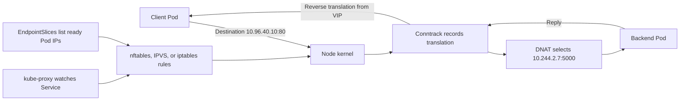
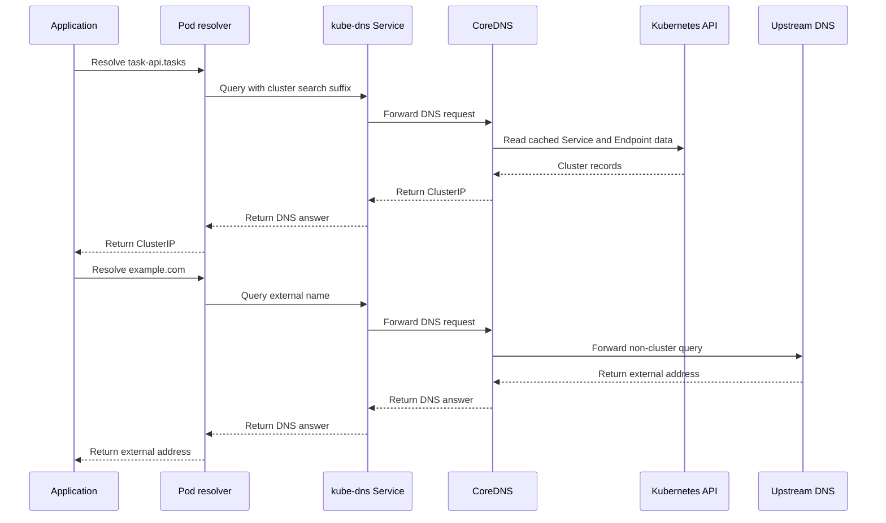
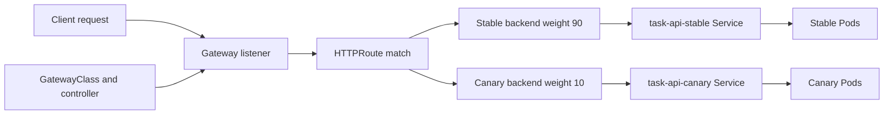

# Chapter 32 — Advanced Networking and Traffic

> **Learning Objectives**
>
> By the end of this chapter, you will be able to:
>
> - Explain how a Service's virtual IP becomes real packets, and compare kube-proxy's iptables and IPVS modes with the newer nftables mode
> - Trace what happens inside the cluster when a Pod resolves a Service name through CoreDNS
> - Configure and reason about dual-stack (IPv4/IPv6) networking
> - Use the Gateway API for advanced routing: traffic splitting, header matching, redirects, rewrites, and cross-namespace references
> - Decide when a service mesh earns its complexity — and when built-in primitives are enough

---

## 32.1 The city's hidden plumbing

When you turn on a tap, water arrives. You do not think about the reservoir, the pumping stations, the pressure regulators, or the maze of pipes under the street. The abstraction "tap → water" hides an enormous amount of engineering — and the day something goes wrong, you suddenly need to understand that plumbing.

Kubernetes networking is the same. Earlier chapters gave you the taps: a `Service` gets a stable name and IP, a `Pod` talks to it, an `Ingress` routes HTTP. Those abstractions are wonderful right up until a connection hangs, a DNS lookup is slow, or a canary sends traffic to the wrong version. Then you need the plumbing: how a **virtual IP** with no network interface anywhere still receives packets, how a name becomes an address, and how modern routing splits and shapes traffic.

This chapter opens the walls. We will follow a single request from a Pod all the way to a backend, then build up to advanced L7 routing with the Gateway API, and finish with the honest question every platform team eventually faces: *do we need a service mesh, or are we about to reinvent one badly?*

---

## 32.2 kube-proxy modes and virtual IPs

### In plain terms

A `ClusterIP` Service has an IP address — but if you go looking, no network card anywhere owns that IP. It is a **virtual IP (VIP)**: a fiction that the cluster agrees to honor. When a Pod sends a packet to that VIP, something on the node quietly rewrites the destination to one of the real Pod IPs behind the Service. That "something" is **kube-proxy** (or, increasingly, a CNI plugin doing the same job), and it is essentially a programmable receptionist that redirects callers to whichever backend is healthy and available.

kube-proxy (iptables/IPVS) or eBPF replacements implement Service VIPs. Mode choice affects performance and debugging. You might think Services work without any dataplane—something always implements DNAT/load-balancing.

> ⚠️ **Common Pitfall:** Debugging app timeouts without checking kube-proxy/eBPF health on nodes.

### Under the hood

The flow of a Service in three layers:

1. You create a `Service`; the API server allocates it a `ClusterIP` from the service CIDR.
2. **EndpointSlices** are maintained (by the endpointslice controller) listing the *ready* Pod IPs and ports behind that Service.
3. **kube-proxy** watches Services and EndpointSlices and programs the node's kernel so that traffic to the VIP is load-balanced to those Pod IPs.

The interesting part is *how* kube-proxy programs the kernel. It has three data-plane modes:

| Mode | Mechanism | Scaling behavior | Notes |
|---|---|---|---|
| `iptables` | Linear-ish chains of iptables rules; random selection for load balancing | Rule updates and matching cost grow with number of Services/endpoints | Long the default; battle-tested |
| `ipvs` | In-kernel IPVS hash tables with real LB schedulers (rr, lc, …) | O(1)-ish lookups; scales to thousands of Services | Needs kernel IPVS modules; richer algorithms |
| `nftables` | Modern `nftables` backend replacing iptables | Better update and lookup performance at scale | The recommended modern Linux mode; stable and increasingly the default |

> 💡 **Tip:** On Kubernetes 1.36, the **nftables** kube-proxy mode is stable and the recommended choice for new Linux clusters at scale, since the legacy `iptables` backend struggles as Service/endpoint counts grow. Many CNIs (e.g. Cilium) replace kube-proxy entirely with eBPF, achieving the same VIP behavior without iptables/IPVS at all.

Check which mode you are running:

```bash
$ kubectl -n kube-system get configmap kube-proxy -o yaml | grep mode
    mode: "nftables"

$ kubectl -n kube-system logs ds/kube-proxy | head -n 3
I0725 18:10:02  server_linux.go  Using nftables Proxier.
```

What the receptionist actually does for a `ClusterIP` VIP `10.96.40.10:80` backed by three Pods:

```text
Client Pod  ── dst 10.96.40.10:80 ──▶  [node kernel: DNAT via kube-proxy rules]
                                        ├─▶ 10.244.1.5:5000   (Pod A)
                                        ├─▶ 10.244.2.7:5000   (Pod B)
                                        └─▶ 10.244.3.9:5000   (Pod C)   (one chosen)
```

The kernel performs **DNAT** (destination NAT): it rewrites the destination from the VIP to a chosen Pod IP, records the mapping in the conntrack table, and the reply is un-NATed on the way back. The VIP never appears "on the wire" as a source or a real interface — it exists only as these translation rules.



*Figure 32.1: A ClusterIP is a virtual IP realized by kernel DNAT; kube-proxy programs the rules from EndpointSlices.*

Two Service traffic-policy fields change the receptionist's choices:

- **`internalTrafficPolicy: Local`** — route to Pods on the *same node* only (saves a hop, but if none exist locally, the traffic is dropped).
- **`externalTrafficPolicy: Local`** — for externally-facing Services, preserve the client source IP and avoid an extra hop, at the cost of uneven load if Pods are unevenly spread.

### In production

**Ownership:** Platform owns kube-proxy/eBPF mode and upgrades; app teams own Service definitions.

**Failure mode:** kube-proxy fail → ClusterIP blackhole. Detect with Service connectivity probes. Mitigate with DaemonSet monitoring and staged mode changes.

| Do | Don't |
|----|-------|
| Probe ClusterIP from Pods | Change proxy mode mid-incident fleet-wide |
| Document mode (iptables/IPVS/eBPF) | Assume cloud LB issues are always kube-proxy |

**Before you leave this section**

- **Understand:** Service VIPs need a healthy proxy/eBPF dataplane.
- **Try:** Identify your cluster’s kube-proxy mode.
- **Watch in prod:** Node-local Service blackholes.


---

## 32.3 DNS internals

### In plain terms

Pods talk to each other by *name* — `task-api`, `task-api.tasks.svc.cluster.local` — not by chasing IPs that change every deploy. The service that turns those names into addresses is **CoreDNS**, the cluster's phone book. Understanding it turns "DNS is flaky" from a shrug into a diagnosis.

CoreDNS config, autopath, stub domains, and ndots affect latency and correctness. You might think DNS issues are always NetworkPolicy—ndots and search paths cause surprising cross-domain queries.

> ⚠️ **Common Pitfall:** Setting ndots without understanding extra search queries.

### Under the hood

CoreDNS runs as a Deployment in `kube-system`, fronted by a `ClusterIP` Service (conventionally `10.96.0.10`) named `kube-dns`. Every Pod is configured to use it via `/etc/resolv.conf`, which the kubelet injects:

```bash
$ kubectl exec -it deploy/task-api -- cat /etc/resolv.conf
search tasks.svc.cluster.local svc.cluster.local cluster.local
nameserver 10.96.0.10
options ndots:5
```

Two lines explain most DNS behavior:

- **`search`** — suffixes appended to short names. So inside namespace `tasks`, looking up `users` tries `users.tasks.svc.cluster.local` first. Cross-namespace, you use `users.other-ns` (which becomes `users.other-ns.svc.cluster.local`).
- **`ndots:5`** — a name with fewer than 5 dots is treated as *relative* and gets the search suffixes appended before being tried as absolute. This is why `curl example.com` inside a Pod can generate several failed lookups before the correct one — `example.com` has 1 dot, so the resolver tries `example.com.tasks.svc.cluster.local`, etc., first.

Service DNS naming:

| Record | Resolves to |
|---|---|
| `my-svc.my-ns.svc.cluster.local` | The Service's ClusterIP (A/AAAA) |
| `my-svc.my-ns.svc.cluster.local` (headless) | Multiple A/AAAA records, one per ready Pod |
| `<hostname>.my-svc.my-ns.svc.cluster.local` | A specific Pod behind a headless Service (StatefulSet) |
| `_https._tcp.my-svc.my-ns.svc.cluster.local` | SRV record (port discovery) |

CoreDNS is configured by the **Corefile** ConfigMap. A typical cluster Corefile:

```text
.:53 {
    errors
    health
    ready
    kubernetes cluster.local in-addr.arpa ip6.arpa {
        pods insecure
        fallthrough in-addr.arpa ip6.arpa
        ttl 30
    }
    prometheus :9153
    forward . /etc/resolv.conf {
        max_concurrent 1000
    }
    cache 30
    loop
    reload
    loadbalance
}
```

The `kubernetes` plugin answers cluster names; `forward` sends everything else (like `example.com`) to the node's upstream resolver; `cache` holds answers for 30s.



*Figure 32.2: CoreDNS answers Kubernetes service names from cluster state and forwards non-cluster names to upstream DNS.*

### In production

**Ownership:** Platform owns CoreDNS ConfigMap; app teams prefer FQDNs across namespaces.

**Failure mode:** DNS latency → app timeouts. Detect with CoreDNS latency histograms. Mitigate with Autopath carefully and right-sized replicas.

| Do | Don't |
|----|-------|
| Monitor CoreDNS latency/errors | Edit CoreDNS ConfigMap casually |
| FQDN across namespaces | Unbounded stub domains |

**Before you leave this section**

- **Understand:** DNS internals drive latency and failure modes—measure them.
- **Try:** Read CoreDNS ConfigMap and note servers/stub domains.
- **Watch in prod:** DNS latency after ConfigMap edits.


---

## 32.4 Dual-stack networking

### In plain terms

**Dual-stack** means every Pod and (optionally) every Service can have *both* an IPv4 and an IPv6 address at once. You get IPv6's vast address space and native reachability without giving up IPv4 compatibility. Dual-stack is a stable, default-available capability in modern Kubernetes.

Production dual-stack needs CNI, routes, policies, and LBs for both families—not only Service fields. You might think PreferDualStack on one Service finishes the project.

> ⚠️ **Common Pitfall:** IPv6 routes missing while Services advertise IPv6.

### Under the hood

Dual-stack requires that the cluster be configured for it end to end: the pod and service CIDRs must list both families, and the CNI must support it.

```text
# control-plane / kube-controller-manager flags (self-managed)
--service-cluster-ip-range=10.96.0.0/16,fd00:10:96::/112
--cluster-cidr=10.244.0.0/16,fd00:10:244::/56
```

A dual-stack Pod simply has two IPs:

```bash
$ kubectl get pod task-api-0 -o jsonpath='{.status.podIPs}'
[{"ip":"10.244.1.5"},{"ip":"fd00:10:244:1::5"}]
```

For Services, the new field is `ipFamilyPolicy`:

| `ipFamilyPolicy` | Meaning |
|---|---|
| `SingleStack` | One family (default if not set) |
| `PreferDualStack` | Both families if available, else single |
| `RequireDualStack` | Both families required; fail if not possible |

```yaml
apiVersion: v1
kind: Service
metadata:
  name: task-api
  namespace: tasks
spec:
  ipFamilyPolicy: PreferDualStack
  ipFamilies:            # optional: order/selection of families
    - IPv4
    - IPv6
  selector:
    app: task-api
  ports:
    - port: 80
      targetPort: 5000
```

```bash
$ kubectl get svc task-api -n tasks -o jsonpath='{.spec.clusterIPs}'
["10.96.40.10","fd00:10:96::28"]
```

The `ipFamilies` list controls order and the primary family; `clusterIPs` (plural) then holds one VIP per family. The older singular `clusterIP` continues to hold the primary for backward compatibility.

### In production

**Ownership:** Platform owns dual-stack enablement end-to-end; app teams test both families.

**Failure mode:** Half-broken dual-stack → intermittent client failures. Detect with dual-family probes. Mitigate with staged rollout and policy for both CIDRs.

| Do | Don't |
|----|-------|
| E2E dual-family tests | Enable only at Service layer |
| Update NetworkPolicies for IPv6 | Assume cloud LB IPv6 without checking |

**Before you leave this section**

- **Understand:** Dual-stack is a platform project with probes on both families.
- **Try:** List Service ipFamilies in your cluster.
- **Watch in prod:** Partial IPv6 enablement.


---

## 32.5 Gateway API: advanced routing

### In plain terms

Chapter 16 introduced the Gateway API and its role-oriented split — **GatewayClass** (the implementation), **Gateway** (the listeners, owned by the platform team), and **HTTPRoute** (the rules, owned by app teams). This section goes deeper into what makes it worth adopting: the *routing* is expressive enough to do canary releases, blue/green, header-based routing, and URL surgery **as typed API fields**, with no controller-specific annotations.

Gateway API separates roles (infra vs app routes) better than classical Ingress sprawl. Treat Gateway like a production load balancer. You might think migrating overnight is safe—run parallel and compare.

> ⚠️ **Common Pitfall:** App teams creating Gateways in shared clusters without infra ownership.

### Under the hood

Assume the CRDs and a controller (Envoy Gateway, NGINX Gateway Fabric, Istio, Cilium, …) are installed, and a `Gateway` named `main-gateway` exists with HTTP/HTTPS listeners (as in Chapter 16).

**Weighted traffic splitting (canary / blue-green).** Split by `weight` across backends — the core of progressive delivery:

```yaml
apiVersion: gateway.networking.k8s.io/v1
kind: HTTPRoute
metadata:
  name: task-api-canary
  namespace: tasks
spec:
  parentRefs:
    - name: main-gateway
  hostnames: ["api.example.com"]
  rules:
    - matches:
        - path:
            type: PathPrefix
            value: /tasks
      backendRefs:
        - name: task-api-stable
          port: 80
          weight: 90
        - name: task-api-canary
          port: 80
          weight: 10
```

Shift the weights (90/10 → 50/50 → 0/100) to progress or roll back a release. No annotations, portable across implementations.



*Figure 32.3: Gateway API separates listener ownership from an HTTPRoute that progressively splits traffic between stable and canary backends.*

**Header- and method-based matching.** Route by request headers, query params, or HTTP method — first-class fields:

```yaml
  rules:
    - matches:
        - path: { type: PathPrefix, value: /tasks }
          headers:
            - name: x-api-version
              value: "2"
      backendRefs:
        - name: task-api-v2
          port: 80
    - matches:
        - path: { type: PathPrefix, value: /tasks }
      backendRefs:
        - name: task-api-stable
          port: 80
```

**Filters: redirects, rewrites, and header mutation.** `HTTPRoute` supports `filters` that transform requests/responses without touching the backend:

```yaml
  rules:
    # Permanent redirect http path to a new location
    - matches:
        - path: { type: PathPrefix, value: /old-tasks }
      filters:
        - type: RequestRedirect
          requestRedirect:
            scheme: https
            path:
              type: ReplacePrefixMatch
              replacePrefixMatch: /tasks
            statusCode: 301
    # Rewrite the path prefix before forwarding to the backend
    - matches:
        - path: { type: PathPrefix, value: /api/tasks }
      filters:
        - type: URLRewrite
          urlRewrite:
            path:
              type: ReplacePrefixMatch
              replacePrefixMatch: /tasks
        - type: RequestHeaderModifier
          requestHeaderModifier:
            set:
              - name: x-forwarded-by
                value: gateway
      backendRefs:
        - name: task-api-stable
          port: 80
```

**Cross-namespace routing with `ReferenceGrant`.** By default a route cannot target a Service (or TLS Secret) in another namespace. The owner of the *target* namespace must opt in — a deliberate security boundary Ingress never had:

```yaml
apiVersion: gateway.networking.k8s.io/v1beta1
kind: ReferenceGrant
metadata:
  name: allow-gateway-to-tasks
  namespace: tasks             # the namespace being referenced
spec:
  from:
    - group: gateway.networking.k8s.io
      kind: HTTPRoute
      namespace: edge          # where the route lives
  to:
    - group: ""
      kind: Service
```

Confirm the controller programmed everything:

```bash
$ kubectl get httproute task-api-canary -n tasks
NAME              HOSTNAMES               AGE
task-api-canary   ["api.example.com"]     20s

$ kubectl describe httproute task-api-canary -n tasks | grep -A3 Conditions
  Conditions:
    Type:    Accepted
    Status:  True
    Reason:  Accepted
```

Beyond HTTP, the Gateway API also standardizes `GRPCRoute`, `TCPRoute`, `UDPRoute`, and `TLSRoute`, so the same model covers non-HTTP protocols — something Ingress could never express cleanly.

### In production

**Ownership:** Platform owns GatewayClasses/Gateways; app teams own HTTPRoutes.

**Failure mode:** Bad Gateway change → mass HTTP outage. Detect with route status and edge SLIs. Mitigate with role separation and canary routes.

> 🏭 **Production floor:** Shared Gateways are blast-radius objects. App teams own HTTPRoutes; only platform changes Gateways—and only under a change window with canary listeners.

| Do | Don't |
|----|-------|
| Role-separate Gateway vs Routes | Everyone edits shared Gateway |
| Canary migrations from Ingress | Delete Ingress before Gateway soak |

**Before you leave this section**

- **Understand:** Gateway API needs clear ownership of Gateway vs Routes.
- **Try:** Inspect GatewayClass and who can create Gateways.
- **Watch in prod:** Shared Gateway edits without change control.


---

## 32.6 The service mesh boundary: when not to reinvent

### In plain terms

A **service mesh** (Istio, Linkerd, Cilium's mesh, Consul) puts a smart proxy next to every workload — historically a **sidecar** container, increasingly a per-node or "ambient" proxy — and routes *all* service-to-service traffic through it. That gives you, uniformly and without app changes: **mutual TLS** everywhere, fine-grained traffic control (retries, timeouts, circuit breaking, east-west canaries), and rich **observability** (golden metrics, distributed traces) for every call.

The boundary question is: Kubernetes already gives you Services, DNS, NetworkPolicy, Ingress/Gateway API, and (via CNIs) even mTLS in some cases. When do those primitives run out, and when are you about to hand-build a worse mesh out of retries-in-code and cron-rotated certificates?

Meshes add mTLS, traffic policy, and observability—also complexity and failure modes. You might think a mesh replaces NetworkPolicy—layers differ; often you want both.

> ⚠️ **Common Pitfall:** Installing a mesh to “fix” DNS or CNI problems.

### Under the hood

What a mesh provides, mapped to what you'd otherwise cobble together:

| Capability | Built-in / DIY approach | What a mesh gives |
|---|---|---|
| Encryption in transit (east-west) | Per-app TLS, manual certs, or CNI-level encryption | Automatic **mTLS** with identity per workload and rotation |
| Retries / timeouts / circuit breaking | Library code in every service, per language | Uniform, config-driven, language-agnostic |
| East-west traffic splitting | Not expressible with plain Services | Per-route weights deep in the call graph |
| L7 authz (per-path, per-identity) | NetworkPolicy is L3/L4 only | L7 policies (method/path/identity) |
| Golden-signal metrics + tracing | Instrument every service by hand | Automatic per-call metrics and trace propagation |

The cost side is real: every meshed pod carries proxy overhead (CPU, memory, latency), the mesh control plane is another system to run and upgrade, certificate and policy misconfiguration can break *all* traffic at once, and debugging now includes an extra hop. Newer **sidecarless / ambient** meshes reduce the per-pod cost but do not eliminate the operational surface.

### In production — a decision guide

**Ownership:** Platform owns mesh lifecycle if adopted; app teams opt in with clear SLOs. Treat mesh install like a cluster dataplane change—staged, observed, reversible.

**Failure mode:** Mesh control-plane outage → sidecar/proxy storms and mass 5xx. Detect with control-plane SLOs and sidecar version skew. Mitigate with gradual injection, break-glass non-injection namespaces, and clear rollback.

Reach for **built-in primitives** (and stop there) when:

- You mainly need **north-south** routing and TLS termination → Gateway API / Ingress + cert-manager.
- You need **coarse** segmentation → NetworkPolicy (default-deny + explicit allows).
- You have a **handful** of services and retries/timeouts fit comfortably in a shared client library.

Reach for a **service mesh** when several of these are true:

- You must guarantee **mTLS everywhere** for compliance, across many teams and languages, and cannot mandate a shared TLS library.
- You need **L7 authorization** (per-path, per-identity) between services — beyond what L3/L4 NetworkPolicy expresses.
- You want **uniform, automatic** golden-signal metrics and distributed tracing without instrumenting each service.
- You need **east-west** progressive delivery, retries, and circuit breaking as policy, consistently, at scale.

| Do | Don't |
|----|-------|
| Adopt mesh for clear requirements | Mesh as first fix for CNI/DNS bugs |
| Track control-plane SLOs | Mandatory injection without break-glass |

> ⚠️ **Warning:** Adopting a mesh "because it's best practice" on a five-service cluster usually adds more failure modes than it removes. The mesh control plane, sidecar upgrades, and cert rotation become new sources of outages. Adopt when the *problems* a mesh solves are problems you actually have.

The honest middle path: start with Gateway API + NetworkPolicy + cert-manager. Add a mesh when you catch yourself building retries, mTLS, and per-service metrics *by hand across many teams* — that is the signal you're reinventing a mesh, and it's time to use a real one.

> 📘 **Deep Dive (optional):** The Gateway API is growing **GAMMA** (Gateway API for Mesh Management and Administration), which lets you configure east-west mesh routing with the same `HTTPRoute` resources you use at the edge. This blurs the old line between "ingress config" and "mesh config," so a future adoption may be less of a jump than it once was.

**Before you leave this section**

- **Understand:** Meshes are optional complexity—adopt with requirements and SLOs; NetworkPolicy still matters.
- **Try:** Write a one-paragraph mesh go/no-go for Task API listing two tipping capabilities.
- **Watch in prod:** Mesh outages amplifying app incidents; injection without escape hatches.

---

## 32.7 Common pitfalls

> ⚠️ **Common Pitfall:** `ping`ing a ClusterIP and concluding the Service is down. VIPs are DNAT targets, not pingable interfaces. Test with `curl`/`nc` to the Service port.

> ⚠️ **Common Pitfall:** Blaming "the network" for slow external calls caused by `ndots:5`. Each external name triggers several search-suffix lookups first. Use FQDNs or tune `dnsConfig`.

> ⚠️ **Common Pitfall:** Cross-namespace name confusion — `db` resolves in the pod's *own* namespace. Use `db.<namespace>` or the FQDN.

> ⚠️ **Common Pitfall:** Enabling dual-stack but writing NetworkPolicies for only one family. The other family may be silently unrestricted. Cover both.

> ⚠️ **Common Pitfall:** Gateway API cross-namespace routes without a `ReferenceGrant` — the route is rejected by design until the target namespace opts in.

> ⚠️ **Common Pitfall:** Deploying a service mesh for capabilities you don't yet need, then debugging outages caused by the mesh itself. Match the tool to real requirements.

---

## 32.8 Hands-on exercises

1. **Find your proxy mode.** Inspect the `kube-proxy` ConfigMap and logs on your cluster. Which mode is it (`iptables`, `ipvs`, `nftables`) or is an eBPF CNI replacing kube-proxy? Explain how a `ClusterIP` becomes a Pod IP in that mode.
2. **VIP is virtual.** Create a `ClusterIP` Service for the Task API. Try to `ping` the ClusterIP (observe failure) and then `curl` the ClusterIP:port from another Pod (observe success). Explain the difference.
3. **DNS trace.** From a Pod, `cat /etc/resolv.conf`, then use `nslookup`/`dig` to resolve the Service short name, the FQDN, and an external name. Count the queries the external lookup generates and relate it to `ndots:5`.
4. **Dual-stack (if available).** On a dual-stack cluster, create a `PreferDualStack` Service and show its two `clusterIPs`. Curl the Service over both families from a Pod.
5. **Canary with Gateway API.** With `task-api-stable` and `task-api-canary` Deployments, write an `HTTPRoute` splitting `/tasks` 90/10. Shift to 50/50, then 0/100. Verify with repeated `curl`.
6. **Rewrite + header filter.** Add an `HTTPRoute` rule that rewrites `/api/tasks` → `/tasks` and injects a request header. Confirm the backend sees the rewritten path and header.
7. **Mesh decision memo.** For your own (or a hypothetical) platform, write a one-paragraph decision: do you need a mesh now? List the two capabilities that would tip you toward adopting one.

---

## 32.9 Check Your Understanding

**Q1.** Where does a `ClusterIP` actually "live," and what makes traffic to it reach a Pod?

<details>
<summary>Show answer</summary>

Nowhere as a real interface — it is a virtual IP. kube-proxy (or an eBPF CNI) programs the node kernel so packets to the VIP are DNATed to one of the ready Pod IPs from the Service's EndpointSlices, with conntrack tracking the mapping for the return path.

</details>

**Q2.** Why might a single external DNS lookup from a Pod generate several queries, and how do you avoid it?

<details>
<summary>Show answer</summary>

Because of `ndots:5` plus the `search` list: a name with fewer than 5 dots is first tried with each cluster search suffix before being tried as absolute. Avoid it by using a fully-qualified name (trailing dot) or tuning the Pod's `dnsConfig`/`ndots`.

</details>

**Q3.** What does `ipFamilyPolicy: PreferDualStack` do, and what must also be true for it to work?

<details>
<summary>Show answer</summary>

It requests both an IPv4 and IPv6 ClusterIP for the Service, falling back to single-stack if dual-stack isn't available. It only works if the cluster's service and pod CIDRs include both families and the CNI supports dual-stack.

</details>

**Q4.** In the Gateway API, how do you run a 10% canary, and why is it more portable than the Ingress equivalent?

<details>
<summary>Show answer</summary>

Give two `backendRefs` under one rule with `weight: 90` and `weight: 10`. It's portable because weight is a typed field in the standard `HTTPRoute` API, understood by any conformant controller — unlike Ingress, which needs controller-specific annotations for traffic splitting.

</details>

**Q5.** Name two conditions under which adopting a service mesh is justified, and one under which it is probably premature.

<details>
<summary>Show answer</summary>

Justified when you need automatic mTLS across many teams/languages, L7 (per-path/identity) authorization beyond NetworkPolicy, uniform golden-signal metrics/tracing without per-app instrumentation, or consistent east-west retries/canaries at scale. Premature when you have a handful of services needing only north-south routing and TLS, which the Gateway API, NetworkPolicy, and cert-manager already cover.

</details>

---

## 32.10 Key takeaways

- A `ClusterIP` is a **virtual IP** realized by kernel DNAT; kube-proxy programs those rules from EndpointSlices in `iptables`, `ipvs`, or the recommended modern **nftables** mode (or an eBPF CNI replaces it entirely).
- CoreDNS is the cluster phone book; `search` suffixes and `ndots:5` explain most name-resolution behavior and pitfalls — scale it and consider NodeLocal DNSCache under load.
- **Dual-stack** gives Pods and Services both IPv4 and IPv6 via `ipFamilyPolicy`/`ipFamilies`; design it in early and cover both families in NetworkPolicy and firewalls.
- The **Gateway API** expresses canary weights, header/method matching, redirects, rewrites, and cross-namespace references (`ReferenceGrant`) as typed fields — portable progressive delivery without annotations.
- A **service mesh** adds uniform mTLS, L7 policy, east-west traffic control, and observability — powerful but costly. Adopt it when you're otherwise reinventing it by hand across many teams; stick to built-ins when you aren't.

---

## 32.11 Official documentation map

| Topic | Official page |
|-------|---------------|
| Service concepts and virtual IPs | [Service](https://kubernetes.io/docs/concepts/services-networking/service/) |
| Virtual IPs and Service proxies | [Virtual IPs and Service Proxies](https://kubernetes.io/docs/reference/networking/virtual-ips/) |
| kube-proxy nftables mode | [kube-proxy nftables](https://kubernetes.io/docs/reference/networking/virtual-ips/#proxy-mode-nftables) |
| EndpointSlices | [EndpointSlices](https://kubernetes.io/docs/concepts/services-networking/endpoint-slices/) |
| DNS for Services and Pods | [DNS for Services and Pods](https://kubernetes.io/docs/concepts/services-networking/dns-pod-service/) |
| Customizing DNS | [Customizing DNS Service](https://kubernetes.io/docs/tasks/administer-cluster/dns-custom-nameservers/) |
| Dual-stack | [IPv4/IPv6 Dual-Stack](https://kubernetes.io/docs/concepts/services-networking/dual-stack/) |
| Gateway API | [Gateway API](https://gateway-api.sigs.k8s.io/) |
| HTTPRoute | [HTTPRoute](https://gateway-api.sigs.k8s.io/api-types/httproute/) |
| Gateway API for mesh (GAMMA) | [Service Mesh with Gateway API](https://gateway-api.sigs.k8s.io/mesh/) |

---

**Previous:** [Chapter 31 — Multitenancy, Policy, and Governance](31-multitenancy-policy-governance.md) | **Next:** [Chapter 33 — Day-2 Operations and SRE](33-day2-operations-and-sre.md)
