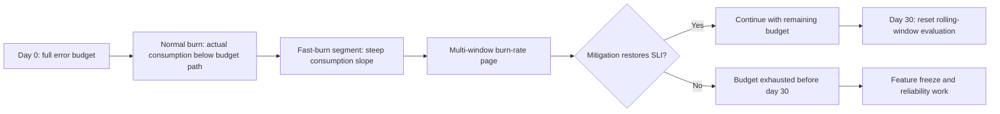
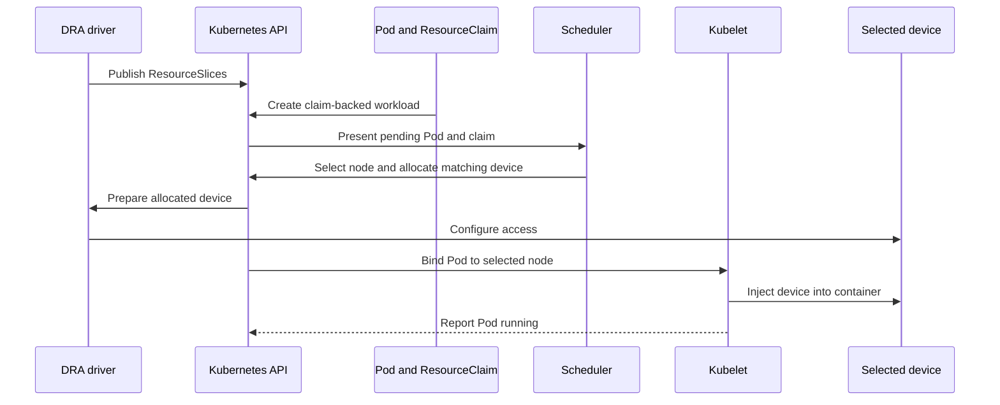
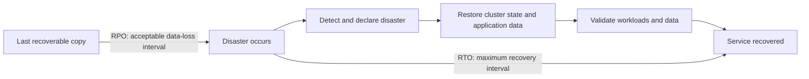

# Chapter 33 — Day-2 Operations and SRE

> **Learning Objectives**
>
> By the end of this chapter, you will be able to:
>
> - Define SLIs, SLOs, and error budgets, and use them to make operational decisions
> - Schedule GPUs and other specialized hardware with Dynamic Resource Allocation, including admin access (GA in 1.36)
> - Do capacity planning that balances cost, headroom, and autoscaling
> - Design a disaster-recovery strategy: etcd backups, restore drills, and RTO/RPO targets
> - Write an incident runbook that a tired on-call engineer can actually follow

---

## 33.1 The day after launch

There is a myth that shipping is the finish line. In reality, the day you go to production is **day one**. Everything after — keeping the service healthy, fast, and affordable while the world throws traffic, hardware failures, and 3 a.m. pages at it — is **day two**, and it never ends. This is the domain of **Site Reliability Engineering (SRE)**: treating operations as an engineering problem, with measurable goals and error budgets instead of heroics and hope.

Think of a restaurant. Opening night (day one) is exciting: the menu is set, the doors open. But the restaurant's *reputation* is built on day two and every day after — consistent food, predictable wait times, a plan for when the walk-in freezer dies on a Saturday night, and a calm response when it does. A great kitchen isn't one that never has problems; it's one that has *rehearsed* its problems.

This chapter is about running the kitchen. We start with how you *measure* reliability (SLOs), then handle the specialized hardware modern workloads demand (GPUs via DRA), then plan capacity, prepare for disaster, and finally write the runbooks that turn a chaotic incident into a checklist.

---

## 33.2 SLIs, SLOs, and error budgets

### In plain terms

You cannot manage what you do not measure, and "is the site up?" is too crude to be useful. SRE gives three precise tools:

- **SLI (Service Level Indicator):** a *measurement* of how good the service is right now — e.g. "the fraction of requests served in under 300 ms," or "the fraction of requests that succeed."
- **SLO (Service Level Objective):** the *target* for an SLI over a window — e.g. "99.9% of requests succeed over 30 days."
- **Error budget:** the *allowance* for failure that the SLO implies — 99.9% success means you may fail 0.1% of requests. That leftover 0.1% is a budget you get to *spend*.

The error budget is the quiet genius of SRE. It turns "should we ship this risky change?" from an argument into arithmetic: if you have budget left, ship; if you've burned it, freeze features and fix reliability.

### Under the hood

Common SLIs, expressed as ratios of good events to valid events:

| SLI | Definition |
|---|---|
| Availability | successful requests ÷ total valid requests |
| Latency | requests faster than threshold ÷ total requests |
| Correctness | responses with correct data ÷ total responses |
| Freshness | records updated within target window ÷ total records |

An SLO turns an SLI into a target over a window. Given a 99.9% availability SLO over 30 days, the error budget is concrete:

```text
30 days              = 43,200 minutes
Allowed downtime     = 0.1% × 43,200 = 43.2 minutes / 30 days
```

A quick reference for availability targets ("the nines"):

| SLO | Allowed unavailability / 30 days |
|---|---|
| 99%    | ~7.2 hours |
| 99.9%  | ~43 minutes |
| 99.95% | ~21.6 minutes |
| 99.99% | ~4.3 minutes |

In Kubernetes, you measure SLIs from metrics (Chapter 22). A Prometheus availability SLI for the Task API, and an alert that fires when you're **burning** the budget fast:

```yaml
# Availability SLI: success ratio over 30 days
- record: sli:task_api_availability:ratio30d
  expr: |
    sum(rate(http_requests_total{job="task-api",code!~"5.."}[30d]))
    /
    sum(rate(http_requests_total{job="task-api"}[30d]))

# Multi-window burn-rate alert: fast burn (page now)
- alert: TaskApiErrorBudgetFastBurn
  expr: |
    (
      sum(rate(http_requests_total{job="task-api",code=~"5.."}[5m]))
      / sum(rate(http_requests_total{job="task-api"}[5m]))
    ) > (14.4 * 0.001)
    and
    (
      sum(rate(http_requests_total{job="task-api",code=~"5.."}[1h]))
      / sum(rate(http_requests_total{job="task-api"}[1h]))
    ) > (14.4 * 0.001)
  for: 2m
  labels: { severity: page }
  annotations:
    summary: "Task API is burning error budget 14.4x too fast"
```

The `14.4` multiplier is the classic "consume 2% of a 30-day budget in 1 hour" fast-burn threshold; pairing a short and a long window suppresses flapping. Slow-burn alerts (lower multiplier, longer windows) page less urgently.



*Figure 33.1: The error budget is spent over the window; burn-rate alerts fire on the slope, not just the level.*

### In production

- **Set SLOs from the *user's* perspective, not the server's.** "CPU < 80%" is not an SLO; "checkout completes in < 2 s for 99% of users" is. Measure as close to the user as you can.
- **Fewer, meaningful SLOs beat dozens of vanity metrics.** Pick the handful that reflect real user pain (availability + latency for the critical path) and defend them.
- **Use the error budget as policy.** Agree in advance: budget healthy → teams ship features freely; budget exhausted → reliability work takes priority until it recovers. This aligns dev and ops without blame.
- **Alert on burn rate, not on every blip.** Multi-window, multi-burn-rate alerts page humans only when the budget is genuinely at risk, cutting alert fatigue.
- **100% is the wrong target.** Chasing 100% is infinitely expensive and removes the budget you need for shipping and maintenance. Choose the *lowest* SLO users won't notice.

> 💡 **Tip:** Distinguish SLOs (internal targets, e.g. 99.95%) from **SLAs** (contractual promises to customers, e.g. 99.9%, with penalties). Always set your internal SLO *stricter* than any external SLA so you find trouble before customers — and lawyers — do.

---

## 33.3 Dynamic Resource Allocation for AI/GPU

### In plain terms

Classic Kubernetes resources are simple counters: "this pod wants 2 CPUs and 4 GiB of memory." That model breaks down for modern accelerators. A GPU isn't just "one unit" — it has a model, a memory size, a driver version, sharing modes (time-slicing, MIG partitions), and topology constraints. **Dynamic Resource Allocation (DRA)** is the framework that lets workloads *describe* the hardware they need in rich detail, and lets specialized drivers *allocate* it intelligently — instead of pretending a GPU is just another integer in `resources.limits`.

DRA is the way Kubernetes now does AI/GPU scheduling: the core DRA APIs are **stable** (GA) in the 1.34–1.35 window and remain the baseline in **1.36**, where the **DRA admin access** feature itself reached **GA** — giving cluster admins a secure, permanent way to reach devices already in use by other workloads for monitoring and maintenance.

### Under the hood

DRA introduces a small vocabulary of objects in the `resource.k8s.io/v1` API:

| Object | Role |
|---|---|
| `DeviceClass` | A category of devices (e.g. "NVIDIA GPUs"), defined by the driver/admin |
| `ResourceClaim` | A request for one or more devices, made by/for a workload |
| `ResourceClaimTemplate` | A stamp that generates a per-Pod `ResourceClaim` (like a PVC template) |
| `ResourceSlice` | Published by the driver; advertises the devices a node actually has |

A workload requests hardware through a template, and the Pod references the claim by name:

```yaml
apiVersion: resource.k8s.io/v1
kind: ResourceClaimTemplate
metadata:
  name: single-gpu
  namespace: ml
spec:
  spec:
    devices:
      requests:
        - name: gpu
          exactly:
            deviceClassName: gpu.example.com
---
apiVersion: v1
kind: Pod
metadata:
  name: trainer
  namespace: ml
spec:
  containers:
    - name: train
      image: ghcr.io/example/trainer:1.0.0
      resources:
        claims:
          - name: gpu
  resourceClaims:
    - name: gpu
      resourceClaimTemplateName: single-gpu
```

The scheduler, the DRA driver, and the kubelet cooperate: the driver publishes a `ResourceSlice` per node describing available devices; the scheduler picks a node whose devices satisfy the claim; the driver allocates the specific device and prepares it; the kubelet injects it into the container.



*Figure 33.2: DRA carries a ResourceClaim from advertised capacity through scheduling, driver preparation, and device injection.*

**Admin access (GA in 1.36).** Operators sometimes need to reach a device that a tenant's workload is *already using* — to check health, read telemetry, or run maintenance — without disrupting it. DRA admin access provides exactly this, guarded so tenants cannot abuse it:

```yaml
apiVersion: resource.k8s.io/v1
kind: ResourceClaimTemplate
metadata:
  name: gpu-admin-monitor
  namespace: gpu-admin        # namespace must carry the admin-access label
spec:
  spec:
    devices:
      requests:
        - name: all-gpus
          exactly:
            deviceClassName: gpu.example.com
            allocationMode: All
            adminAccess: true   # privileged: reach in-use devices
```

The critical guardrail: `adminAccess: true` is only honored when the object lives in a namespace explicitly labeled for it, so ordinary tenants cannot set the flag and grab everyone else's GPUs:

```bash
$ kubectl label namespace gpu-admin resource.kubernetes.io/admin-access=true
namespace/gpu-admin labeled
```

Without that label (case-sensitive), the API server refuses the privileged request. This is what "GA" means in 1.36: the mechanism and its authorization model are now stable and enabled by default.

### In production

- **Prefer DRA over the legacy device-plugin `nvidia.com/gpu: 1` counter for anything nuanced.** Fractional GPUs, MIG partitions, specific memory sizes, and topology-aware placement are what DRA expresses and the old counter cannot.
- **Restrict `adminAccess` tightly.** Only label the specific namespace(s) your platform/GPU-ops team uses with `resource.kubernetes.io/admin-access: "true"`, and lock down RBAC so only admins can create claims there. It grants access to devices *other tenants are actively using*.
- **Right-size and share expensive accelerators.** GPUs are the costliest thing in most AI clusters; use DRA's partitioning/consumable-capacity features (advancing in 1.36) plus quotas so one team's idle notebook doesn't hoard an A100.
- **Watch driver/version skew.** DRA drivers, GPU drivers, and node images must be compatible; a driver mismatch shows up as claims stuck `Pending` with no allocation. Treat the DRA driver as a first-class, monitored component.
- **Capacity-plan GPUs separately** from CPU/memory — they're scarce, slow to provision, and often the binding constraint for AI workloads (see next section).

> ⚠️ **Common Pitfall:** Setting `adminAccess: true` in a normal namespace and expecting it to work. The API server rejects it unless the namespace carries the `resource.kubernetes.io/admin-access: "true"` label — a deliberate safeguard against privilege abuse in multi-tenant clusters.

---

## 33.4 Capacity planning

### In plain terms

Capacity planning is answering three questions before your users answer them for you: *How much do we need? How much headroom for spikes and failures? How do we grow without overpaying?* Too little capacity means outages and throttling; too much means burning money on idle nodes. The art is deliberate headroom, not guesswork.

### Under the hood

Kubernetes gives you three autoscaling axes, and they work together:

| Autoscaler | Scales | Reacts to |
|---|---|---|
| **HPA** (Horizontal Pod Autoscaler) | Pod *replicas* | CPU/memory or custom/external metrics |
| **VPA** (Vertical Pod Autoscaler) | Pod *requests/limits* | Historical usage |
| **Cluster Autoscaler / Karpenter** | *Nodes* | Pending pods that don't fit |

A representative HPA driving replicas from a latency-correlated metric:

```yaml
apiVersion: autoscaling/v2
kind: HorizontalPodAutoscaler
metadata:
  name: task-api
  namespace: tasks
spec:
  scaleTargetRef:
    apiVersion: apps/v1
    kind: Deployment
    name: task-api
  minReplicas: 3
  maxReplicas: 30
  metrics:
    - type: Resource
      resource:
        name: cpu
        target:
          type: Utilization
          averageUtilization: 60
  behavior:
    scaleDown:
      stabilizationWindowSeconds: 300   # avoid flapping
```

The chain that keeps things sized correctly:

```text
Traffic up → pods hit 60% CPU → HPA adds replicas → pods don't fit →
Cluster Autoscaler adds a node → replicas schedule → latency recovers
```

Requests and limits are the foundation of all of it: the scheduler bin-packs by **requests**, so requests that are too high waste capacity (pods reserve more than they use) and requests too low overcommit the node (noisy-neighbor CPU throttling and OOM kills). VPA (in recommendation mode) helps you find the right numbers from real usage.

### In production

- **Plan for N+1 (or N+2) node failures.** Keep enough headroom that losing a node (or a whole zone) doesn't cascade. `PodDisruptionBudget`s ensure voluntary disruptions (drains, upgrades) don't take too many replicas at once:

```yaml
apiVersion: policy/v1
kind: PodDisruptionBudget
metadata:
  name: task-api
  namespace: tasks
spec:
  minAvailable: 2
  selector:
    matchLabels:
      app: task-api
```

- **Right-size requests from data, not vibes.** Use VPA recommendations or historical percentiles (e.g. p95 usage) to set requests; review quarterly as traffic changes.
- **Prefer scaling out to scaling up** for stateless services — more, smaller replicas spread risk and schedule faster than a few huge pods.
- **Model growth and lead times.** If node provisioning takes minutes (or GPU nodes take *days* to procure), your autoscaler can't save you from a spike; pre-provision headroom for known events (launches, sales).
- **Track utilization and cost together.** Tools like Kubecost or cloud cost dashboards, joined with your namespace labels from Chapter 31, tell you where money goes and which teams to right-size.

> 💡 **Tip:** Set HPA `minReplicas` ≥ 2 (usually 3) for anything user-facing. `minReplicas: 1` means a single pod restart is a full outage, no matter how clever the autoscaling.

---

## 33.5 Disaster recovery

### In plain terms

Disaster recovery (DR) is your answer to "the cluster (or region) is *gone* — now what?" It rests on two numbers you must choose *before* the disaster: **RTO (Recovery Time Objective)**, how long you can be down, and **RPO (Recovery Point Objective)**, how much data you can afford to lose. A backup you have never restored is not a backup; it's a hope. DR is the rehearsed ability to get back.

### Under the hood

Kubernetes DR has two distinct concerns, and people conflate them at their peril:

1. **Cluster state** lives in **etcd** — every object (Deployments, Services, Secrets, RBAC, CRDs). Losing etcd loses the *desired state* of everything.
2. **Application data** lives in **PersistentVolumes** — databases, uploads, queues. Losing PVs loses *user data*.

**Backing up etcd** (self-managed control plane):

```bash
$ ETCDCTL_API=3 etcdctl snapshot save /backup/etcd-$(date +%F).db \
    --endpoints=https://127.0.0.1:2379 \
    --cacert=/etc/kubernetes/pki/etcd/ca.crt \
    --cert=/etc/kubernetes/pki/etcd/server.crt \
    --key=/etc/kubernetes/pki/etcd/server.key
Snapshot saved at /backup/etcd-2026-07-25.db

$ etcdctl snapshot status /backup/etcd-2026-07-25.db --write-out=table
+----------+----------+------------+------------+
|   HASH   | REVISION | TOTAL KEYS | TOTAL SIZE |
+----------+----------+------------+------------+
| a1b2c3d4 |  4821004 |      18342 |     52 MB  |
+----------+----------+------------+------------+
```

**Restoring** initializes a new data dir from the snapshot; you then point the etcd member at it and bring the control plane back:

```bash
$ etcdctl snapshot restore /backup/etcd-2026-07-25.db \
    --data-dir=/var/lib/etcd-restored
```

**Application-level backup** with **Velero** captures Kubernetes objects *and* snapshots PersistentVolumes to object storage — the standard tool, and the right layer on *managed* clusters where you can't touch etcd:

```bash
$ velero backup create nightly-tasks \
    --include-namespaces tasks,team-payments \
    --snapshot-volumes
Backup request "nightly-tasks" submitted successfully.

$ velero restore create --from-backup nightly-tasks
```

Choosing targets:

| Strategy | RTO | RPO | Cost |
|---|---|---|---|
| Nightly etcd + Velero to object storage | Hours | Up to 24 h | Low |
| Frequent snapshots + PV snapshots | ~1 h | Minutes–1 h | Medium |
| Warm standby cluster (GitOps + replicated data) | Minutes | Seconds–minutes | High |
| Active-active multi-region | ~0 | ~0 | Highest |



*Figure 33.3: RPO measures backward from the disaster to the last recoverable data, while RTO measures forward to restored service.*

### In production

- **GitOps *is* your DR for cluster config.** If every manifest lives in Git and a controller (Argo CD/Flux) reconciles it, rebuilding a cluster is "point the controller at the repo." That covers desired state; you still need PV data and any imperative bits (etcd-only objects).
- **Restore-test on a schedule.** A quarterly game day where you actually restore etcd/Velero into a scratch cluster is the only proof your DR works. Untested backups fail exactly when you need them.
- **Store backups off the cluster and cross-region.** Backups on the same failure domain die with it. Encrypt them; they contain Secrets.
- **Know who owns what on managed Kubernetes.** The provider backs up the control plane/etcd; *you* still own PV data and object-level backups (Velero). Don't assume "managed" means "backed up for me."
- **Write RTO/RPO into the runbook** so on-call knows the target and the procedure, not just the theory.

> ⚠️ **Warning:** etcd snapshots contain **Secrets** (base64, and only encrypted at rest if you enabled encryption-at-rest). Treat backup files as top-secret: encrypt, restrict access, and audit who can read them.

---

## 33.6 Incident runbooks

### In plain terms

At 3 a.m., a paged engineer has adrenaline, not genius. A **runbook** is a pre-written, step-by-step guide for a specific alert or failure so the response is a *checklist*, not an improvisation. Good runbooks convert institutional knowledge (usually stuck in one senior engineer's head) into something anyone on-call can execute.

### Under the hood

A useful runbook is short, specific, and action-first. A template:

```text
# Runbook: Task API — High 5xx Error Rate

## Alert
TaskApiErrorBudgetFastBurn (severity: page)

## Impact
Users see failed requests on /tasks. Error budget burning ~14x.

## Quick triage (first 5 minutes)
1. Confirm scope:
   kubectl -n tasks get deploy,pods -l app=task-api
   kubectl -n tasks logs -l app=task-api --tail=100 | grep -i error
2. Check recent changes:
   kubectl -n tasks rollout history deploy/task-api
3. Check dependencies (DB, cache) dashboards.

## Likely causes & actions
- Bad deploy? -> Roll back:
    kubectl -n tasks rollout undo deploy/task-api
- DB saturated? -> Check connections; scale read replicas.
- Traffic spike? -> Confirm HPA scaled; check node capacity/Pending pods.
- Dependency outage? -> Enable degraded mode / circuit breaker.

## Escalation
If not mitigated in 15 min, page secondary + DB on-call (#sev-tasks).

## Verify recovery
- 5xx ratio < 0.1% for 10 min; burn-rate alert cleared.

## After
Open incident doc; schedule blameless postmortem within 48h.
```

The incident lifecycle the runbook plugs into:

```text
Detect (alert) → Triage (scope/severity) → Mitigate (stop the bleeding) →
Resolve (fix root cause) → Postmortem (learn, blamelessly)
```

Note the order: **mitigate before you diagnose**. Rolling back a bad deploy to restore users *now* beats a 40-minute root-cause investigation while customers suffer. Root cause is for the postmortem.

### In production

- **Every paging alert should link to a runbook.** An alert with no runbook is a 3 a.m. research project. Put the runbook URL in the alert annotation (`runbook_url`).
- **Mitigate, then investigate.** Prefer fast, reversible mitigations (rollback, scale out, feature flag off, shed load) over root-causing live. Restore service first.
- **Run blameless postmortems.** Focus on *systems and processes* that let the failure happen, not on who typed the command. Blame kills the honesty that prevents repeats. Track action items to completion.
- **Rehearse with game days / chaos engineering.** Deliberately kill a node, expire a cert, or fail a dependency in staging (or carefully in prod) to test runbooks and find gaps before real incidents do.
- **Keep runbooks with the code and review them.** Stale runbooks (wrong command, renamed service) are worse than none. Treat them as living docs in the repo, updated after every incident.

> 💡 **Tip:** Define severity levels (SEV1/2/3) with clear criteria and expectations up front, so the person paged knows immediately whether to wake the VP or fix it and file a ticket. Ambiguous severity wastes the most precious incident resource: time.

---

## 33.7 Common pitfalls

> ⚠️ **Common Pitfall:** Targeting 100% availability. It's infinitely expensive and leaves no error budget for shipping or maintenance. Pick the lowest SLO users won't notice.

> ⚠️ **Common Pitfall:** Alerting on raw error *counts* or CPU spikes. Alert on **burn rate** against the error budget so humans are paged only when the SLO is truly at risk.

> ⚠️ **Common Pitfall:** Requesting GPUs via the legacy integer counter when you need partitions, specific memory, or topology. Use DRA, which expresses those; and never set `adminAccess: true` outside a label-gated namespace.

> ⚠️ **Common Pitfall:** `minReplicas: 1` on a user-facing HPA. One restart is a full outage. Use ≥ 2–3 and add a PodDisruptionBudget.

> ⚠️ **Common Pitfall:** Backups you've never restored. Untested DR fails when it matters. Schedule restore drills; store backups off-cluster and encrypted (they contain Secrets).

> ⚠️ **Common Pitfall:** Diagnosing root cause during a live incident while users suffer. Mitigate first (roll back, scale, flag off); root-cause in the postmortem.

---

## 33.8 Hands-on exercises

1. **Define an SLO.** For the Task API, write one availability SLO and one latency SLO from the *user's* perspective. Compute the 30-day error budget in minutes for each and state what happens when it's exhausted.
2. **Burn-rate alert.** Using the Prometheus metrics from Chapter 22, write a multi-window fast-burn alert for your availability SLO. Explain why two windows reduce false pages.
3. **DRA claim.** On a GPU-capable cluster (or by reading the DRA docs), write a `ResourceClaimTemplate` + Pod that requests one GPU via a `DeviceClass`. Then write an admin-access claim and explain the namespace label it requires and why.
4. **Autoscaling chain.** Configure an HPA (min 3, max 20, 60% CPU) and a PodDisruptionBudget (`minAvailable: 2`) for the Task API. Load-test it and describe the HPA → Cluster Autoscaler chain you observe.
5. **DR drill.** Take an etcd snapshot (or a Velero backup of the `tasks` namespace). Delete a resource, then restore it. Record the RTO you actually achieved and compare to your target.
6. **Runbook.** Write a one-page runbook for "Task API high 5xx" following §33.6: alert, impact, 5-minute triage, likely causes/actions, escalation, verify, after. Have a teammate execute it cold and note where it was unclear.

---

## 33.9 Check Your Understanding

**Q1.** What is an error budget, and how does it change the "should we ship this?" conversation?

<details>
<summary>Show answer</summary>

An error budget is the allowed amount of failure implied by an SLO (e.g. 99.9% → 0.1% of requests may fail). It turns risk decisions into arithmetic: if budget remains, teams ship features; if it's exhausted, they freeze features and prioritize reliability until it recovers — aligning dev and ops without blame.

</details>

**Q2.** Why is Dynamic Resource Allocation better than the legacy `nvidia.com/gpu: 1` counter for AI workloads, and what changed in Kubernetes 1.36?

<details>
<summary>Show answer</summary>

DRA lets workloads describe hardware richly (model, memory, partitions/MIG, sharing, topology) and lets drivers allocate it intelligently, rather than treating a GPU as an opaque integer. In 1.36, DRA **admin access** reached GA, giving admins a stable, authorization-gated way to reach in-use devices for monitoring and maintenance.

</details>

**Q3.** What guardrail prevents a normal tenant from abusing DRA `adminAccess: true`?

<details>
<summary>Show answer</summary>

The API server only honors `adminAccess: true` for ResourceClaims/Templates created in a namespace labeled `resource.kubernetes.io/admin-access: "true"` (case-sensitive). Without that label, the privileged request is rejected, so tenants can't grab devices others are using.

</details>

**Q4.** What do RTO and RPO mean, and why must you set them before a disaster?

<details>
<summary>Show answer</summary>

RTO (Recovery Time Objective) is how long you can be down; RPO (Recovery Point Objective) is how much data loss is acceptable. They must be chosen up front because they dictate your backup frequency, DR architecture (nightly backups vs warm standby vs active-active), and cost — you can't design the recovery after the disaster starts.

</details>

**Q5.** During a live incident with users failing, should you first find the root cause or mitigate? Why?

<details>
<summary>Show answer</summary>

Mitigate first — roll back, scale out, disable a feature flag, or shed load to restore service now. Root-causing while users suffer prolongs the outage. Diagnosis belongs in the blameless postmortem after service is restored.

</details>

---

## 33.10 Key takeaways

- SRE measures reliability with **SLIs**, targets it with **SLOs**, and manages risk with the **error budget**; alert on **burn rate**, and never chase 100%.
- **Dynamic Resource Allocation** is how Kubernetes schedules AI/GPU hardware with real detail; core DRA is stable, and **admin access is GA in 1.36**, gated by the `resource.kubernetes.io/admin-access` namespace label.
- **Capacity planning** combines right-sized requests, HPA/VPA, Cluster Autoscaler/Karpenter, and PodDisruptionBudgets, with deliberate N+1 headroom and cost tracking.
- **Disaster recovery** means chosen **RTO/RPO**, etcd *and* PersistentVolume backups (Velero + GitOps), and — above all — **tested restores**; backups contain Secrets, so encrypt them.
- **Incident runbooks** turn 3 a.m. chaos into a checklist: detect → triage → **mitigate first** → resolve → blameless postmortem; link every page to a runbook and rehearse with game days.

---

## 33.11 Official documentation map

| Topic | Official page |
|-------|---------------|
| Dynamic Resource Allocation | [Dynamic Resource Allocation](https://kubernetes.io/docs/concepts/scheduling-eviction/dynamic-resource-allocation/) |
| DRA admin access | [DRA — Admin access](https://kubernetes.io/docs/concepts/scheduling-eviction/dynamic-resource-allocation/#admin-access) |
| Set up DRA | [Set Up DRA in a Cluster](https://kubernetes.io/docs/tasks/configure-pod-container/assign-resources/set-up-dra-cluster/) |
| Allocate devices with DRA | [Allocate Devices to Workloads with DRA](https://kubernetes.io/docs/tasks/configure-pod-container/assign-resources/allocate-devices-dra/) |
| DRA hardening | [Hardening Guide - Dynamic Resource Allocation](https://kubernetes.io/docs/concepts/security/hardening-guide/dynamic-resource-allocation/) |
| Horizontal Pod Autoscaling | [Horizontal Pod Autoscaler](https://kubernetes.io/docs/tasks/run-application/horizontal-pod-autoscale/) |
| Vertical Pod Autoscaling | [Vertical Pod Autoscaling](https://kubernetes.io/docs/concepts/workloads/autoscaling/vertical-pod-autoscale/) |
| Node autoscaling | [Node Autoscaling](https://kubernetes.io/docs/concepts/cluster-administration/node-autoscaling/) |
| Pod Disruption Budgets | [Specifying a Disruption Budget](https://kubernetes.io/docs/tasks/run-application/configure-pdb/) |
| Backing up etcd | [Operating etcd — Backing up](https://kubernetes.io/docs/tasks/administer-cluster/configure-upgrade-etcd/#backing-up-an-etcd-cluster) |
| Encryption at rest (Secrets) | [Encrypting Confidential Data at Rest](https://kubernetes.io/docs/tasks/administer-cluster/encrypt-data/) |
| Velero (backup/restore) | [Velero documentation](https://velero.io/docs/) |
| SRE / SLOs (Google SRE book) | [Service Level Objectives](https://sre.google/sre-book/service-level-objectives/) |

---

**Previous:** [Chapter 32 — Advanced Networking and Traffic](32-advanced-networking-traffic.md) | **Next:** [Appendix A — Docker Cheatsheet](appendices/a-cheatsheet-docker.md)
