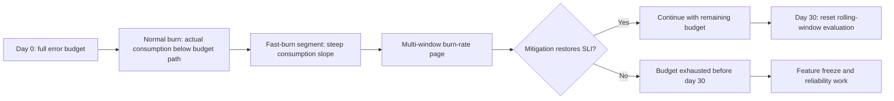
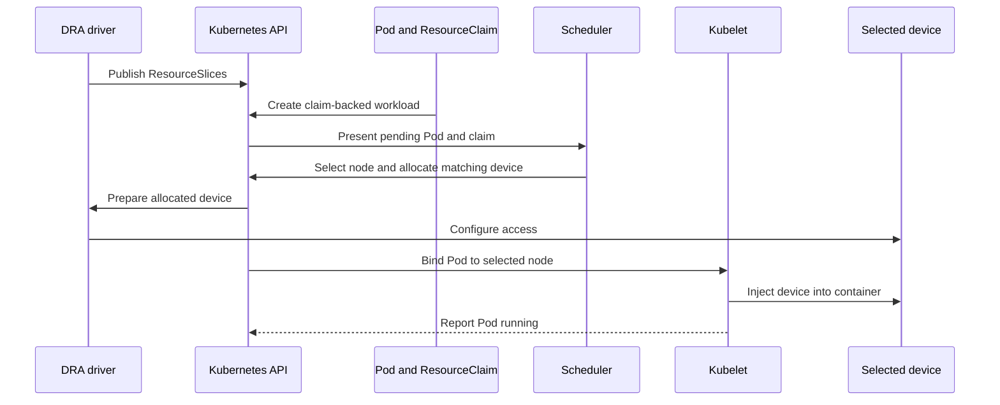
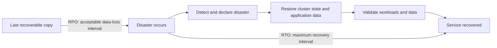

# Chapter 33 — Day-2 Operations and SRE

> **Learning Objectives**
>
> By the end of this chapter, you will be able to:
>
> - Explain what SLIs, SLOs, and error budgets are, and use them to settle arguments about shipping
> - Give workloads GPUs and other special hardware using Dynamic Resource Allocation, including the admin access that became stable in 1.36
> - Plan capacity so you have room for spikes and failures without paying for idle machines
> - Build a recovery plan with real targets for how long you can be down and how much data you can lose
> - Write a runbook a tired on-call engineer can actually follow at 3 a.m.

---

## 33.1 The day after launch

There is a myth that shipping is the finish line. Going to production is day one.

Everything after that is day two, and day two never ends. Keeping the service healthy, fast, and affordable while the world throws traffic spikes, dead disks, and 3 a.m. pages at it is a job of its own. **Site Reliability Engineering**, or **SRE**, is the practice of treating that job as engineering: measurable targets and deliberate trade-offs instead of heroics and hope.

Think of a restaurant. Opening night is the exciting part. The menu is set, the doors open, everyone is watching.

But the reputation is built on every night after. Food that tastes the same on a Tuesday. Wait times people can predict. A plan for when the walk-in freezer dies mid-service on a Saturday, and a calm response when it does.

A great kitchen is not one that never has problems. It is one that has rehearsed its problems.

This chapter is about running the kitchen. We start with how to measure reliability, then look at giving workloads the specialized hardware modern applications want, then plan capacity, prepare for the day something is truly gone, and finally write the runbooks that turn a chaotic incident into a checklist.

---

## 33.2 SLIs, SLOs, and error budgets

### In plain terms

These are three tools for turning "is the site okay?" into something you can actually measure and act on.

- **SLI (Service Level Indicator):** a *measurement* of how good the service is right now — e.g. "the fraction of requests served in under 300 ms," or "the fraction of requests that succeed."
- **SLO (Service Level Objective):** the *target* for an SLI over a window — e.g. "99.9% of requests succeed over 30 days."
- **Error budget:** the *allowance* for failure that the SLO implies — 99.9% success means you may fail 0.1% of requests. That leftover 0.1% is a budget you get to *spend*.

Why go to this trouble? Because without it, "is the site up?" is a matter of opinion, and every conversation about risk becomes an argument between the people who want to ship and the people who want stability. Neither side has evidence, so the louder one wins.

The error budget is what settles it, and it is the quietly brilliant part of SRE. It turns a judgment call into arithmetic. Budget left over means you can afford the risky deploy, so ship it. Budget gone means you stop shipping features and spend the time on reliability instead. Nobody has to win an argument.

> 💡 **In one line:** The error budget is how much failure you are allowed. Spend it on shipping, or waste it on outages.

Two things people get wrong. Aiming for 100% sounds professional and is actually a refusal to choose: it costs enormously, no real system achieves it, and it leaves no room for the changes that keep a product alive. And measuring the wrong thing is worse than measuring nothing. An SLI should track something a user would notice, such as failed or slow requests. Paging someone because CPU hit 80% while every request succeeded just teaches them to ignore the pager.

> ⚠️ **Common Pitfall:** Burning budget with endless risky deploys while paging on vanity metrics.

### Under the hood

Here is how to define these concretely and alert on them.

Common SLIs, expressed as ratios of good events to valid events:

| SLI | Definition |
|---|---|
| Availability | successful requests ÷ total valid requests |
| Latency | requests faster than threshold ÷ total requests |
| Correctness | responses with correct data ÷ total responses |
| Freshness | records updated within target window ÷ total records |

An SLO turns an SLI into a target over a window. Given a 99.9% availability SLO over 30 days, the error budget is concrete:

```text
30 days              = 43,200 minutes
Allowed downtime     = 0.1% × 43,200 = 43.2 minutes / 30 days
```

A quick reference for availability targets ("the nines"):

| SLO | Allowed unavailability / 30 days |
|---|---|
| 99%    | ~7.2 hours |
| 99.9%  | ~43 minutes |
| 99.95% | ~21.6 minutes |
| 99.99% | ~4.3 minutes |

In Kubernetes, you measure SLIs from metrics (Chapter 22). A Prometheus availability SLI for the Task API, and an alert that fires when you're **burning** the budget fast:

```yaml
# Availability SLI: success ratio over 30 days
- record: sli:task_api_availability:ratio30d
  expr: |
    sum(rate(http_requests_total{job="task-api",code!~"5.."}[30d]))
    /
    sum(rate(http_requests_total{job="task-api"}[30d]))

# Multi-window burn-rate alert: fast burn (page now)
- alert: TaskApiErrorBudgetFastBurn
  expr: |
    (
      sum(rate(http_requests_total{job="task-api",code=~"5.."}[5m]))
      / sum(rate(http_requests_total{job="task-api"}[5m]))
    ) > (14.4 * 0.001)
    and
    (
      sum(rate(http_requests_total{job="task-api",code=~"5.."}[1h]))
      / sum(rate(http_requests_total{job="task-api"}[1h]))
    ) > (14.4 * 0.001)
  for: 2m
  labels: { severity: page }
  annotations:
    summary: "Task API is burning error budget 14.4x too fast"
```

The `14.4` multiplier is the classic "consume 2% of a 30-day budget in 1 hour" fast-burn threshold; pairing a short and a long window suppresses flapping. Slow-burn alerts (lower multiplier, longer windows) page less urgently.



*Figure 33.1: The error budget is spent over the window; burn-rate alerts fire on the slope, not just the level.*

### In production

**Ownership:** Each service's owners set and own its SLOs and error budget. The platform team supplies the measurement. Every incident review includes the budget burn chart as evidence.

**Failure mode:** Budgets get ignored and the service is chronically unreliable, one small outage at a time. Detect it with burn-rate alerts that fire while the budget is being spent, not after it is gone. Act on it by freezing risky changes when the budget is exhausted.

| Do | Don't |
|----|-------|
| User-facing SLIs | CPU as the only SLO |
| Budget-driven change freeze | 100% targets with no budget |

**Before you leave this section**

- **Understand:** Error budgets connect reliability to change safety.
- **Try:** Write one SLI/SLO/budget for Task API availability.
- **Watch in prod:** Deploying through exhausted budgets.

> 🏭 **Production floor:** **Error budgets** gate change: when budget is exhausted, only risk-reducing changes ship. Paste burn rate, remaining budget, and decision (ship/freeze) into the change ticket and incident timeline.


---

## 33.3 Dynamic Resource Allocation for AI/GPU

### In plain terms

**Dynamic Resource Allocation**, or **DRA**, is the way workloads ask for specialized hardware such as GPUs by describing what they need, rather than by counting units.

The problem it solves is that CPU and memory are simple. Two cores is two cores, and four gibibytes is four gibibytes; the scheduler adds them up and finds a node. A GPU is not like that. It has a model, an amount of onboard memory, a driver version, ways of being shared such as time-slicing or partitioning, and a physical position relative to other GPUs that matters for fast interconnects.

Writing `nvidia.com/gpu: 1` throws all of that away. It says "give me one thing that is a GPU," and then your training job lands on a card with too little memory or the wrong driver, and the scheduler had no way to know. DRA lets the request carry the real requirements and lets the hardware vendor's driver decide what satisfies them.

It is the standard path now. The core DRA APIs became stable across the 1.34 and 1.35 releases and are the baseline in **1.36**, where **DRA admin access** also reached general availability. That last feature gives cluster administrators a supported way to reach a device that a workload is already using, so they can monitor it or run maintenance without evicting anyone.

One rule for adoption: pick one model per cluster. Running some workloads on classic device plugin requests and others on DRA means two systems are handing out the same physical cards with no shared view of what is free. Announce the standard, publish the classes teams should request, and migrate deliberately.

> ⚠️ **Common Pitfall:** Mixing classical GPU requests and DRA without a platform standard.

### Under the hood

Here are the objects involved and how a workload asks for a device.

DRA introduces a small vocabulary of objects in the `resource.k8s.io/v1` API:

| Object | Role |
|---|---|
| `DeviceClass` | A category of devices (e.g. "NVIDIA GPUs"), defined by the driver/admin |
| `ResourceClaim` | A request for one or more devices, made by/for a workload |
| `ResourceClaimTemplate` | A stamp that generates a per-Pod `ResourceClaim` (like a PVC template) |
| `ResourceSlice` | Published by the driver; advertises the devices a node actually has |

A workload requests hardware through a template, and the Pod references the claim by name:

```yaml
apiVersion: resource.k8s.io/v1
kind: ResourceClaimTemplate
metadata:
  name: single-gpu
  namespace: ml
spec:
  spec:
    devices:
      requests:
        - name: gpu
          exactly:
            deviceClassName: gpu.example.com
---
apiVersion: v1
kind: Pod
metadata:
  name: trainer
  namespace: ml
spec:
  containers:
    - name: train
      image: ghcr.io/example/trainer:1.0.0
      resources:
        claims:
          - name: gpu
  resourceClaims:
    - name: gpu
      resourceClaimTemplateName: single-gpu
```

The scheduler, the DRA driver, and the kubelet cooperate: the driver publishes a `ResourceSlice` per node describing available devices; the scheduler picks a node whose devices satisfy the claim; the driver allocates the specific device and prepares it; the kubelet injects it into the container.



*Figure 33.2: DRA carries a ResourceClaim from advertised capacity through scheduling, driver preparation, and device injection.*

**Admin access (GA in 1.36).** Operators sometimes need to reach a device that a tenant's workload is *already using* — to check health, read telemetry, or run maintenance — without disrupting it. DRA admin access provides exactly this, guarded so tenants cannot abuse it:

```yaml
apiVersion: resource.k8s.io/v1
kind: ResourceClaimTemplate
metadata:
  name: gpu-admin-monitor
  namespace: gpu-admin        # namespace must carry the admin-access label
spec:
  spec:
    devices:
      requests:
        - name: all-gpus
          exactly:
            deviceClassName: gpu.example.com
            allocationMode: All
            adminAccess: true   # privileged: reach in-use devices
```

The critical guardrail: `adminAccess: true` is only honored when the object lives in a namespace explicitly labeled for it, so ordinary tenants cannot set the flag and grab everyone else's GPUs:

```bash
$ kubectl label namespace gpu-admin resource.kubernetes.io/admin-access=true
namespace/gpu-admin labeled
```

Without that label (case-sensitive), the API server refuses the privileged request. This is what "GA" means in 1.36: the mechanism and its authorization model are now stable and enabled by default.

### In production

**Ownership:** The platform team owns enabling DRA, running the drivers, and managing the GPU node pools. ML teams request hardware through the device classes the platform publishes.

**Failure mode:** Free capacity ends up scattered in pieces too small to use, and GPU jobs sit `Pending` while the dashboard shows idle cards. Detect it by tracking free versus allocated devices, not just total utilization. Reduce it by pooling GPU nodes rather than dedicating them per team, and by giving teams a small set of clear request options instead of arbitrary ones.

| Do | Don't |
|----|-------|
| One platform standard for GPU requests | Snowflake GPU YAML per team |
| Monitor fragmentation | Overcommit GPUs silently |

**Before you leave this section**

- **Understand:** DRA/GPU needs a platform contract and fragmentation monitoring.
- **Try:** Read whether your cluster exposes DRA/GPU resources.
- **Watch in prod:** Pending GPU work from fragmentation.


---

## 33.4 Capacity planning

### In plain terms

Capacity planning is deciding how much you need before your users decide it for you. Three questions: how much capacity does normal traffic require, how much spare do you keep for spikes and failures, and how do you grow without paying for idle machines?

Getting it wrong hurts in both directions. Too little and you get throttling, evictions, and outages. Too much and you burn money on nodes doing nothing, month after month. The goal is headroom you chose on purpose, not headroom that happens to exist.

Two things get overlooked. Headroom is not only for traffic spikes: draining a node for maintenance has to put those Pods somewhere, and a cluster running at 100% of allocatable cannot do it. And your capacity is not just node count. It is the requests and limits on every Pod, since the scheduler packs nodes by requests. Requests set too high waste capacity you paid for; set too low they overcommit the node and you get throttling and out-of-memory kills.

Autoscaling helps, and it does not remove the planning. It also creates a specific trap worth naming. When latency rises, the autoscaler adds replicas, and if the real bottleneck is your database, those new replicas each open more connections and make it worse. Scaling faster into a saturated dependency is how a slow afternoon becomes an outage. Load-test the things you depend on, and cap how far an application may scale past what they can serve.

> ⚠️ **Common Pitfall:** Autoscaling nodes while the database is the real bottleneck.

### Under the hood

Here are the three autoscalers and how they work together.

Kubernetes gives you three autoscaling axes, and they work together:

| Autoscaler | Scales | Reacts to |
|---|---|---|
| **HPA** (Horizontal Pod Autoscaler) | Pod *replicas* | CPU/memory or custom/external metrics |
| **VPA** (Vertical Pod Autoscaler) | Pod *requests/limits* | Historical usage |
| **Cluster Autoscaler / Karpenter** | *Nodes* | Pending pods that don't fit |

A representative HPA driving replicas from a latency-correlated metric:

```yaml
apiVersion: autoscaling/v2
kind: HorizontalPodAutoscaler
metadata:
  name: task-api
  namespace: tasks
spec:
  scaleTargetRef:
    apiVersion: apps/v1
    kind: Deployment
    name: task-api
  minReplicas: 3
  maxReplicas: 30
  metrics:
    - type: Resource
      resource:
        name: cpu
        target:
          type: Utilization
          averageUtilization: 60
  behavior:
    scaleDown:
      stabilizationWindowSeconds: 300   # avoid flapping
```

The chain that keeps things sized correctly:

```text
Traffic up → pods hit 60% CPU → HPA adds replicas → pods don't fit →
Cluster Autoscaler adds a node → replicas schedule → latency recovers
```

Requests and limits are the foundation of all of it: the scheduler bin-packs by **requests**, so requests that are too high waste capacity (pods reserve more than they use) and requests too low overcommit the node (noisy-neighbor CPU throttling and OOM kills). VPA (in recommendation mode) helps you find the right numbers from real usage.

### In production

**Ownership:** The platform team owns cluster-wide headroom. App teams forecast their own growth and set caps so they cannot scale past what their dependencies can serve.

**Failure mode:** The cluster runs out of room without warning and the error budget burns. Detect it by tracking committed requests against allocatable capacity, and by watching queue depth rather than only CPU. Prevent it with forecasts that account for seasonal peaks and load tests that include your dependencies.

| Do | Don't |
|----|-------|
| Plan drain headroom | 100% allocatable committed |
| Load-test dependencies | Scale apps past DB capacity |

**Before you leave this section**

- **Understand:** Capacity planning includes headroom and dependencies.
- **Try:** Compute % allocatable committed on a node pool.
- **Watch in prod:** Autoscaler storms that overload DBs.


---

## 33.5 Disaster recovery

### In plain terms

**Disaster recovery**, shortened to **DR**, is your written answer to a simple question: the cluster is gone, or the whole region is gone, so what happens now?

It rests on two numbers you choose in advance. **RTO**, the recovery time objective, is how long you can be down. **RPO**, the recovery point objective, is how much recent data you can afford to lose. Pick them before the disaster, because during one every answer is "as fast as possible," which is not a plan.

Those numbers decide everything else. An RPO of one hour means hourly backups are enough. An RPO of one minute means continuous replication and a much larger bill. An RTO of four hours allows a rebuild from scratch; an RTO of fifteen minutes means a standby environment already running. The point of naming the numbers is to make the cost visible while there is still time to argue about it.

Recovery has two halves and people plan only one. Cluster state lives in etcd: every Deployment, Secret, and RBAC rule. Application data lives in your volumes and databases: the things your users actually created. Restoring etcd gives you a cluster that knows what should be running and has none of the data it was running on. You need both, restored in an order you have written down.

Finally, spreading across availability zones is not disaster recovery. It handles one zone failing, which is real and worth doing, and it does nothing when the region goes or when somebody deletes the wrong thing everywhere at once. Rehearse the restore on a schedule and time it. A backup nobody has restored is a hope with a filename.

> ⚠️ **Common Pitfall:** etcd backups without app datastore restores.

### Under the hood

Here are the two halves and the commands for each.

Kubernetes DR has two distinct concerns, and people conflate them at their peril:

1. **Cluster state** lives in **etcd** — every object (Deployments, Services, Secrets, RBAC, CRDs). Losing etcd loses the *desired state* of everything.
2. **Application data** lives in **PersistentVolumes** — databases, uploads, queues. Losing PVs loses *user data*.

**Backing up etcd** (self-managed control plane):

```bash
$ ETCDCTL_API=3 etcdctl snapshot save /backup/etcd-$(date +%F).db \
    --endpoints=https://127.0.0.1:2379 \
    --cacert=/etc/kubernetes/pki/etcd/ca.crt \
    --cert=/etc/kubernetes/pki/etcd/server.crt \
    --key=/etc/kubernetes/pki/etcd/server.key
Snapshot saved at /backup/etcd-2026-07-25.db

$ etcdctl snapshot status /backup/etcd-2026-07-25.db --write-out=table
+----------+----------+------------+------------+
|   HASH   | REVISION | TOTAL KEYS | TOTAL SIZE |
+----------+----------+------------+------------+
| a1b2c3d4 |  4821004 |      18342 |     52 MB  |
+----------+----------+------------+------------+
```

**Restoring** initializes a new data dir from the snapshot; you then point the etcd member at it and bring the control plane back:

```bash
$ etcdctl snapshot restore /backup/etcd-2026-07-25.db \
    --data-dir=/var/lib/etcd-restored
```

**Application-level backup** with **Velero** captures Kubernetes objects *and* snapshots PersistentVolumes to object storage — the standard tool, and the right layer on *managed* clusters where you can't touch etcd:

```bash
$ velero backup create nightly-tasks \
    --include-namespaces tasks,team-payments \
    --snapshot-volumes
Backup request "nightly-tasks" submitted successfully.

$ velero restore create --from-backup nightly-tasks
```

Choosing targets:

| Strategy | RTO | RPO | Cost |
|---|---|---|---|
| Nightly etcd + Velero to object storage | Hours | Up to 24 h | Low |
| Frequent snapshots + PV snapshots | ~1 h | Minutes–1 h | Medium |
| Warm standby cluster (GitOps + replicated data) | Minutes | Seconds–minutes | High |
| Active-active multi-region | ~0 | ~0 | Highest |



*Figure 33.3: RPO measures backward from the disaster to the last recoverable data, while RTO measures forward to restored service.*

### In production

**Ownership:** The platform team owns recovering the control plane. App teams own their own data, and rehearse restoring it against their stated targets.

**Failure mode:** A recovery plan nobody has tested turns a bad day into a multi-day outage. Detect the gap by tracking how long it has been since each team ran a drill. Close it with scheduled game days where you actually restore, and record the time it took.

| Do | Don't |
|----|-------|
| Game-day restores | Paper-only DR plans |
| Separate etcd vs app data | Single-region hope as DR |

**Before you leave this section**

- **Understand:** DR requires tested restores for control plane and app data.
- **Try:** List RTO/RPO for Task API and last drill dates.
- **Watch in prod:** Backups never restored.

> 🏭 **Production floor:** Tie DR to **etcd backup tested restores** plus application snapshot/restore evidence. Game days produce timestamps and owners in the ticket—not slideware.


---

## 33.6 Incident runbooks

### In plain terms

A **runbook** is a written, step-by-step response to one specific alert. It says what the alert means, who is affected, which commands to run first, and when to escalate.

Write them because of who reads them. At 3 a.m. a paged engineer has adrenaline, not genius, and may have never seen this service before. Under that much stress people forget things they know perfectly well in daylight. A checklist beats recall every time.

Runbooks also move knowledge out of one person's head. Every team has someone who just knows that this alert usually means the connection pool. That works until they are asleep, on a plane, or no longer at the company. Writing it down is how the team stops depending on one person being reachable.

A runbook is only useful if it is specific. "Investigate the issue" helps nobody. Real commands they can paste, the name of the dashboard, the rollback command, a time limit before escalating, and who to escalate to. Link it directly from the alert so nobody is searching a wiki while the pager is going off.

One habit the runbook should encode: mitigate before you diagnose. Rolling back a bad deploy to stop users hurting right now beats a forty-minute investigation into why it broke. Root cause belongs in the postmortem, when everyone is calm and nothing is on fire.

> ⚠️ **Common Pitfall:** Runbooks that say “fix it” without commands, owners, or rollback.

### Under the hood

Here is a template you can copy, and where it fits in the incident lifecycle.

A useful runbook is short, specific, and action-first. A template:

```text
# Runbook: Task API — High 5xx Error Rate

## Alert
TaskApiErrorBudgetFastBurn (severity: page)

## Impact
Users see failed requests on /tasks. Error budget burning ~14x.

## Quick triage (first 5 minutes)
1. Confirm scope:
   kubectl -n tasks get deploy,pods -l app=task-api
   kubectl -n tasks logs -l app=task-api --tail=100 | grep -i error
2. Check recent changes:
   kubectl -n tasks rollout history deploy/task-api
3. Check dependencies (DB, cache) dashboards.

## Likely causes & actions
- Bad deploy? -> Roll back:
    kubectl -n tasks rollout undo deploy/task-api
- DB saturated? -> Check connections; scale read replicas.
- Traffic spike? -> Confirm HPA scaled; check node capacity/Pending pods.
- Dependency outage? -> Enable degraded mode / circuit breaker.

## Escalation
If not mitigated in 15 min, page secondary + DB on-call (#sev-tasks).

## Verify recovery
- 5xx ratio < 0.1% for 10 min; burn-rate alert cleared.

## After
Open incident doc; schedule blameless postmortem within 48h.
```

The incident lifecycle the runbook plugs into:

```text
Detect (alert) → Triage (scope/severity) → Mitigate (stop the bleeding) →
Resolve (fix root cause) → Postmortem (learn, blamelessly)
```

Note the order: **mitigate before you diagnose**. Rolling back a bad deploy to restore users *now* beats a 40-minute root-cause investigation while customers suffer. Root cause is for the postmortem.

### In production

**Ownership:** Service owners write and maintain the runbooks for their own alerts. The platform team maintains the cluster-level ones. Every alert links to its runbook.

**Failure mode:** There is no runbook, so recovery takes far longer than it should. Detect it from postmortems that keep citing missing or outdated documentation. Fix it by putting a runbook URL in every alert and reviewing them quarterly, since a runbook that no longer matches reality is worse than none.

| Do | Don't |
|----|-------|
| Alert links to runbook | Orphan alerts without owners |
| Paste evidence templates | Heroics without timelines |

**Before you leave this section**

- **Understand:** Runbooks make detect→mitigate repeatable with evidence.
- **Try:** Write a one-page runbook for Task API 5xx burn.
- **Watch in prod:** Alerts without runbook links.


---

## 33.7 Common pitfalls

> ⚠️ **Common Pitfall:** Targeting 100% availability. It's infinitely expensive and leaves no error budget for shipping or maintenance. Pick the lowest SLO users won't notice.

> ⚠️ **Common Pitfall:** Alerting on raw error *counts* or CPU spikes. Alert on **burn rate** against the error budget so humans are paged only when the SLO is truly at risk.

> ⚠️ **Common Pitfall:** Requesting GPUs via the legacy integer counter when you need partitions, specific memory, or topology. Use DRA, which expresses those; and never set `adminAccess: true` outside a label-gated namespace.

> ⚠️ **Common Pitfall:** `minReplicas: 1` on a user-facing HPA. One restart is a full outage. Use ≥ 2–3 and add a PodDisruptionBudget.

> ⚠️ **Common Pitfall:** Backups you've never restored. Untested DR fails when it matters. Schedule restore drills; store backups off-cluster and encrypted (they contain Secrets).

> ⚠️ **Common Pitfall:** Diagnosing root cause during a live incident while users suffer. Mitigate first (roll back, scale, flag off); root-cause in the postmortem.

---

## 33.8 Hands-on exercises

1. **Define an SLO.** For the Task API, write one availability SLO and one latency SLO from the *user's* perspective. Compute the 30-day error budget in minutes for each and state what happens when it's exhausted.
2. **Burn-rate alert.** Using the Prometheus metrics from Chapter 22, write a multi-window fast-burn alert for your availability SLO. Explain why two windows reduce false pages.
3. **DRA claim.** On a GPU-capable cluster (or by reading the DRA docs), write a `ResourceClaimTemplate` + Pod that requests one GPU via a `DeviceClass`. Then write an admin-access claim and explain the namespace label it requires and why.
4. **Autoscaling chain.** Configure an HPA (min 3, max 20, 60% CPU) and a PodDisruptionBudget (`minAvailable: 2`) for the Task API. Load-test it and describe the HPA → Cluster Autoscaler chain you observe.
5. **DR drill.** Take an etcd snapshot (or a Velero backup of the `tasks` namespace). Delete a resource, then restore it. Record the RTO you actually achieved and compare to your target.
6. **Runbook.** Write a one-page runbook for "Task API high 5xx" following §33.6: alert, impact, 5-minute triage, likely causes/actions, escalation, verify, after. Have a teammate execute it cold and note where it was unclear.

---

## 33.9 Check Your Understanding

**Q1.** What is an error budget, and how does it change the "should we ship this?" conversation?

<details>
<summary>Show answer</summary>

An error budget is the allowed amount of failure implied by an SLO (e.g. 99.9% → 0.1% of requests may fail). It turns risk decisions into arithmetic: if budget remains, teams ship features; if it's exhausted, they freeze features and prioritize reliability until it recovers — aligning dev and ops without blame.

</details>

**Q2.** Why is Dynamic Resource Allocation better than the legacy `nvidia.com/gpu: 1` counter for AI workloads, and what changed in Kubernetes 1.36?

<details>
<summary>Show answer</summary>

DRA lets workloads describe hardware richly (model, memory, partitions/MIG, sharing, topology) and lets drivers allocate it intelligently, rather than treating a GPU as an opaque integer. In 1.36, DRA **admin access** reached GA, giving admins a stable, authorization-gated way to reach in-use devices for monitoring and maintenance.

</details>

**Q3.** What guardrail prevents a normal tenant from abusing DRA `adminAccess: true`?

<details>
<summary>Show answer</summary>

The API server only honors `adminAccess: true` for ResourceClaims/Templates created in a namespace labeled `resource.kubernetes.io/admin-access: "true"` (case-sensitive). Without that label, the privileged request is rejected, so tenants can't grab devices others are using.

</details>

**Q4.** What do RTO and RPO mean, and why must you set them before a disaster?

<details>
<summary>Show answer</summary>

RTO (Recovery Time Objective) is how long you can be down; RPO (Recovery Point Objective) is how much data loss is acceptable. They must be chosen up front because they dictate your backup frequency, DR architecture (nightly backups vs warm standby vs active-active), and cost — you can't design the recovery after the disaster starts.

</details>

**Q5.** During a live incident with users failing, should you first find the root cause or mitigate? Why?

<details>
<summary>Show answer</summary>

Mitigate first — roll back, scale out, disable a feature flag, or shed load to restore service now. Root-causing while users suffer prolongs the outage. Diagnosis belongs in the blameless postmortem after service is restored.

</details>

---

## 33.10 Key takeaways

- An **SLI** measures reliability, an **SLO** is the target, and the **error budget** is the failure you are allowed to spend.
- Alert on how fast the budget is burning, not on CPU. Never chase 100%; it costs everything and buys nothing.
- Measure something a user would notice. Paging on a metric users cannot feel just teaches people to ignore pages.
- **Dynamic Resource Allocation** lets workloads describe the hardware they need instead of counting GPUs. Pick one model per cluster and stick to it.
- Keep headroom for draining nodes, not just for traffic. A cluster at 100% cannot be maintained.
- Requests are how the scheduler packs nodes. Too high wastes money, too low causes throttling and out-of-memory kills.
- Never autoscale into a saturated dependency. More replicas on a struggling database makes it worse.
- Choose your **RTO** and **RPO** before the disaster, because during one every answer is "immediately."
- Back up etcd *and* your application data. Restoring one without the other gives you half a system.
- A backup nobody has restored is a hope with a filename. Drill it and time it.
- **Mitigate before you diagnose.** Roll back now; find the root cause in the postmortem.
- Every alert links to a runbook with real commands, an owner, and an escalation deadline.

---

## 33.11 Official documentation map

| Topic | Official page |
|-------|---------------|
| Dynamic Resource Allocation | [Dynamic Resource Allocation](https://kubernetes.io/docs/concepts/scheduling-eviction/dynamic-resource-allocation/) |
| DRA admin access | [DRA — Admin access](https://kubernetes.io/docs/concepts/scheduling-eviction/dynamic-resource-allocation/#admin-access) |
| Set up DRA | [Set Up DRA in a Cluster](https://kubernetes.io/docs/tasks/configure-pod-container/assign-resources/set-up-dra-cluster/) |
| Allocate devices with DRA | [Allocate Devices to Workloads with DRA](https://kubernetes.io/docs/tasks/configure-pod-container/assign-resources/allocate-devices-dra/) |
| DRA hardening | [Hardening Guide - Dynamic Resource Allocation](https://kubernetes.io/docs/concepts/security/hardening-guide/dynamic-resource-allocation/) |
| Horizontal Pod Autoscaling | [Horizontal Pod Autoscaler](https://kubernetes.io/docs/tasks/run-application/horizontal-pod-autoscale/) |
| Vertical Pod Autoscaling | [Vertical Pod Autoscaling](https://kubernetes.io/docs/concepts/workloads/autoscaling/vertical-pod-autoscale/) |
| Node autoscaling | [Node Autoscaling](https://kubernetes.io/docs/concepts/cluster-administration/node-autoscaling/) |
| Pod Disruption Budgets | [Specifying a Disruption Budget](https://kubernetes.io/docs/tasks/run-application/configure-pdb/) |
| Backing up etcd | [Operating etcd — Backing up](https://kubernetes.io/docs/tasks/administer-cluster/configure-upgrade-etcd/#backing-up-an-etcd-cluster) |
| Encryption at rest (Secrets) | [Encrypting Confidential Data at Rest](https://kubernetes.io/docs/tasks/administer-cluster/encrypt-data/) |
| Velero (backup/restore) | [Velero documentation](https://velero.io/docs/) |
| SRE / SLOs (Google SRE book) | [Service Level Objectives](https://sre.google/sre-book/service-level-objectives/) |

---

**Previous:** [Chapter 32 — Advanced Networking and Traffic](32-advanced-networking-traffic.md) | **Next:** [Appendix A — Docker Cheatsheet](appendices/a-cheatsheet-docker.md)
