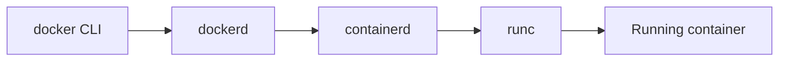

# Authoring Style Guide

Internal contract for every chapter in *Mastering Docker and Kubernetes: From Zero to Production*. Follow this file when creating or rewriting content.

---

## Version baseline

| Product | Target |
|---------|--------|
| Docker Engine / Desktop | **29.x** (Compose V2, BuildKit and buildx default) |
| Kubernetes | **1.36** (supported window noted as 1.33–1.36 where relevant) |
| Official docs | [docs.docker.com](https://docs.docker.com/) · [kubernetes.io/docs](https://kubernetes.io/docs/home/) |

Do **not** claim "Docker 27+" or "Kubernetes 1.32+" as the book baseline. Historical notes (for example, "dockershim removed in 1.24") remain fine when clearly dated.

---

## Chapter skeleton

```markdown
# Chapter NN — Title

> **Learning Objectives**
>
> By the end of this chapter, you will be able to:
>
> - …
> - …

## NN.1 Opening story / analogy

…

## NN.2 First major concept

### In plain terms
…

### Under the hood
…

### In production
…

## NN.N Common pitfalls
## NN.N Hands-on exercises
## NN.N Check Your Understanding
## NN.N Key takeaways
## NN.N Official documentation map

**Previous:** [Chapter …](prev.md) | **Next:** [Chapter …](next.md)
```

### Title and headings

- H1: `# Chapter NN — Title` (zero-padded number, em dash).
- H2: `## NN.M Title` (zero-padded chapter number, numbered sections).
- H3 for the three depth tiers and for subsections inside a concept.

### Three-tier depth model

Every **major concept** (not every tiny flag) must include:

1. **`### In plain terms`** — analogy or everyday language; zero unexplained jargon.
2. **`### Under the hood`** — mechanism, CLI flags, YAML fields, realistic sample output, and **rendered diagrams** (never leave `<!-- VISUAL -->` placeholders).
3. **`### In production`** — DevOps/SRE guidance: failure modes, SLOs, security, operational checklist items.

Short transitional sections (pitfalls, exercises, takeaways) do **not** need all three tiers.

**Minimum depth (non-negotiable for major concepts)**

| Tier | Must include |
|------|----------------|
| **In plain terms** | At least two substantial paragraphs; the problem this solves; one explicit misconception (`> ⚠️ **Common Pitfall:**` or a clear “you might think…”) |
| **Under the hood** | Mechanism explanation; at least one realistic command or YAML path; sample output or field walkthrough; one “what breaks if X” note |
| **In production** | Ownership (who owns this); failure mode + how you detect it; mitigation; a concrete do / don’t decision |

After each major concept’s three tiers, add a short micro-checklist:

```markdown
**Before you leave this section**

- **Understand:** …
- **Try:** …
- **Watch in prod:** …
```

**MNC DevOps voice**

Write like a patient platform engineer mentoring a junior on a production team: calm, precise, ownership-aware, blast-radius-aware. Prefer evidence (`kubectl describe`, digests, revision history) over folklore.

Use this callout sparingly for change-management, on-call, compliance, and blast-radius rules (not for basic tips):

```markdown
> 🏭 **Production floor:** …
```

Weave these ideas into **In production** blocks where they fit: who owns the image vs the Deployment vs the cluster; what one bad change can take down; which signal fires first; PR → CI scan → digest promote → rollout → rollback; what you paste into an incident ticket.

### Visuals: diagrams, flowcharts, and illustrations

Prefer **Mermaid** for every technical diagram (topology, sequence, state, decision). Prefer **Markdown tables** for comparisons. Prefer **PNG illustrations** only for chapter-opening analogies and the book cover (exact text does not matter there).

**Figure numbering and captions**

- Number figures as `Figure NN.M` where `NN` is the chapter number and `M` is the figure order within that chapter.
- Place an italic caption on the line immediately after the diagram or image.
- Example pattern (fences shown with four backticks so this guide stays valid):

````markdown


*Figure 02.1: A `docker run` request travels from the CLI through the daemon and containerd to runc.*
````

**Mermaid conventions** (GitHub-safe)

- Fence language: `mermaid`.
- Node IDs: camelCase, no spaces (`apiServer`, not `API Server`).
- Labels with parentheses, commas, or colons: wrap in double quotes (`apiServer["API server (kube-apiserver)"]`).
- Do **not** set explicit fill colors or themes — the default theme works in light and dark mode.
- Prefer `flowchart` for topology and decisions, `sequenceDiagram` for request flows, `stateDiagram-v2` for lifecycles.

**Illustration embeds**

- From chapter files at the book root: ``
- From `appendices/`: ``
- Always include a descriptive alt text and a `*Figure NN.M: …*` caption.

**Choosing the right visual**

| Need | Prefer |
|------|--------|
| Topology / architecture | `flowchart` |
| Request or call order | `sequenceDiagram` |
| Lifecycle / state machine | `stateDiagram-v2` |
| Decision tree | `flowchart` with decision diamonds |
| Side-by-side trade-offs | Markdown table |
| Opening analogy / cover | PNG in `assets/` |

### Callouts

Use emoji-prefixed blockquotes (never GitHub `> [!NOTE]` alerts):

```markdown
> 💡 **Tip:** …
> ⚠️ **Warning:** …
> ⚠️ **Common Pitfall:** …
> 📘 **Deep Dive (optional):** …
> 🏭 **Production floor:** …
```

### Check Your Understanding

```markdown
## NN.N Check Your Understanding

**Q1.** Question text?

<details>
<summary>Show answer</summary>

Answer paragraph.

</details>
```

One `<details>` block per question. Summary text is always `Show answer`.

### Navigation footer

```markdown
**Previous:** [Chapter 07 — …](07-docker-volumes-and-data.md) | **Next:** [Chapter 09 — …](09-docker-swarm-intro.md)
```

No emoji arrows. No `./` prefix for same-directory links. Appendices may use `**Prev:**` / `**Next:**` with middots.

### Official documentation map

Every chapter ends with a section before navigation:

```markdown
## NN.N Official documentation map

| Topic | Official page |
|-------|---------------|
| … | [Title](https://docs.docker.com/…) |
| … | [Title](https://kubernetes.io/docs/…) |
```

Prefer canonical concept and task pages. Do not invent URLs.

---

## Code and language

- American English.
- Shell prompts: `$ ` for user, `# ` only when root is required.
- Fenced blocks always have a language tag (`bash`, `dockerfile`, `yaml`, `python`, `text`, `json`, `gotemplate`).
- Kubernetes manifests always include `apiVersion`, `kind`, `metadata`, `spec`.
- Prefer declarative `kubectl apply -f` over imperative create for lasting objects.
- Task API (Flask) remains the running example unless a chapter needs a different minimal sample.

---

## Tone

Mentor, not manual. Explain **why** before **how**. Anticipate misconceptions. Supportive and precise. Never write `TODO` as unfinished work; never say "provided by the user" about materials.
